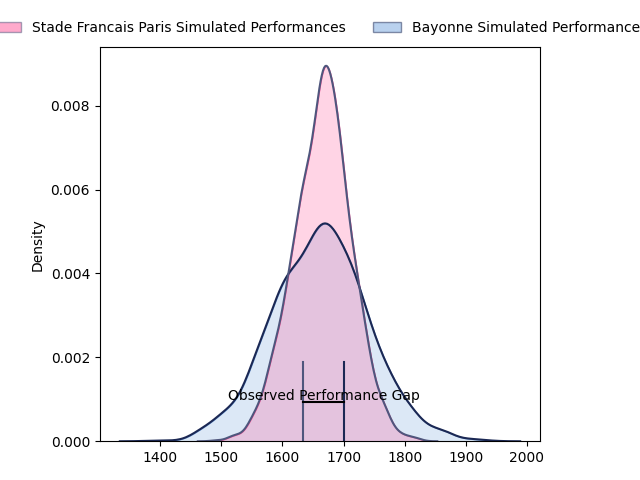
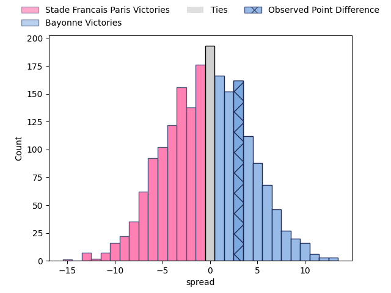
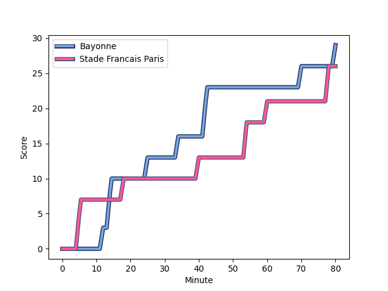
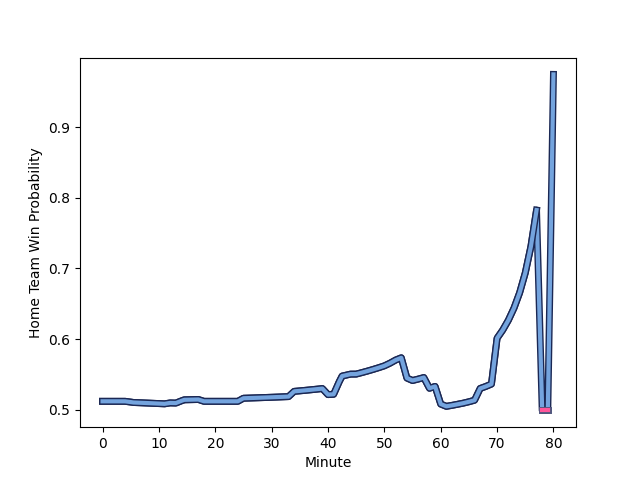

---  
layout: page  
title: Stade Francais Paris at Bayonne; 26-29  
date: 2023-02-18 15:00:00 18:00:00 -0500  
categories: match review  
---
# Stade Francais Paris at Bayonne; 26-29

# Club Level Predictions

The first set of predictions treats a club as the smallest object, as the club develops its members, organizes a gameplan, and deploys its players as needed for each match. This club model has a prediction of 0.496, which translates to predicting Stade Francais Paris to win by 0.2.

Each club has a rating and a rating deviation (simiar to a Glicko system), and expected performances can be generated. This allows for simulated matches and spreads like the ones below.
## Projected Performances

## Projected Spreads

## Projected Results

# Player Level Predictions

Treating teams instead as an entity made up of the currently active players, I have ratings for each player in an altogether different system. These can be combined to form team ratings once teamsheets are announced, weighting starters a bit higher than the reserves. After the match is played, players can be weighted by their minutes on the field, allowing for an accurate measure of the team's composition. With these compiled team ratings, we can make predictions, measure inaccuracy, and update the individual player ratings.
## Prediction with Player Minutes: Bayonne by 6.1

Bayonne by 2.1 on a neutral field
## Scores over Time

## Win Probability over Time

There were 7 large changes in win probability in this match
## Prediction without Player Minutes: Bayonne by 8.7

Bayonne by 4.7 on a neutral pitch

|   Away Minutes | Away Player                                                                  |   Away elo |   Away Percentile |   Number |   Home Percentile |   Home elo | Home Player                                                              |   Home Minutes |
|---------------:|:-----------------------------------------------------------------------------|-----------:|------------------:|---------:|------------------:|-----------:|:-------------------------------------------------------------------------|---------------:|
|             45 | [Moses Eneliko Alo-Emile](..//playerfiles//MosesEnelikoAlo-Emile_cleaned.md) |      89.46 |                30 |        1 |                84 |     106.34 | [Swan Cormenier](..//playerfiles//SwanCormenier_cleaned.md)              |             55 |
|             52 | [Mickaël Ivaldi](..//playerfiles//MickaëlIvaldi_cleaned.md)                  |      96.38 |                56 |        2 |                82 |     105.75 | [Facundo Bosch](..//playerfiles//FacundoBosch_cleaned.md)                |             61 |
|             45 | [Giorgi Melikidze](..//playerfiles//GiorgiMelikidze_cleaned.md)              |      97.18 |                62 |        3 |                 7 |      77.34 | [Pieter Ernst Scholtz](..//playerfiles//PieterErnstScholtz_cleaned.md)   |             61 |
|             80 | [Paul Gabrillagues](..//playerfiles//PaulGabrillagues_cleaned.md)            |      93.6  |                50 |        4 |                69 |     101.65 | [Denis Marchois](..//playerfiles//DenisMarchois_cleaned.md)              |             58 |
|             80 | [Marcos Kremer](..//playerfiles//MarcosKremer_cleaned.md)                    |      92.59 |                43 |        5 |                98 |     134.26 | [Thomas Ceyte](..//playerfiles//ThomasCeyte_cleaned.md)                  |             80 |
|             80 | [Romain Briatte](..//playerfiles//RomainBriatte_cleaned.md)                  |      99.31 |                63 |        6 |                49 |      95.05 | [Pierre Huguet](..//playerfiles//PierreHuguet_cleaned.md)                |             80 |
|             51 | [Mathieu Hirigoyen](..//playerfiles//MathieuHirigoyen_cleaned.md)            |      82.67 |                15 |        7 |                82 |     108.7  | [Baptiste Heguy](..//playerfiles//BaptisteHeguy_cleaned.md)              |             80 |
|             64 | [Giovanni Habel Kuffner](..//playerfiles//GiovanniHabelKuffner_cleaned.md)   |     100.36 |                64 |        8 |                67 |     101.19 | [Uzair Cassiem](..//playerfiles//UzairCassiem_cleaned.md)                |             64 |
|             80 | [Morgan Parra](..//playerfiles//MorganParra_cleaned.md)                      |     102.46 |                73 |        9 |                70 |     101.11 | [Guillaume Rouet](..//playerfiles//GuillaumeRouet_cleaned.md)            |             64 |
|             67 | [Joris Segonds](..//playerfiles//JorisSegonds_cleaned.md)                    |      94.21 |                46 |       10 |                87 |     112.51 | [Camille Lopez](..//playerfiles//CamilleLopez_cleaned.md)                |             80 |
|             67 | [Lester Etien](..//playerfiles//LesterEtien_cleaned.md)                      |     110.18 |                85 |       11 |                89 |     113.42 | [Rémy Baget](..//playerfiles//RémyBaget_cleaned.md)                      |             80 |
|             80 | [Julien Delbouis](..//playerfiles//JulienDelbouis_cleaned.md)                |     120.71 |                95 |       12 |                37 |      90.83 | [Eneriko Buliruarua](..//playerfiles//EnerikoBuliruarua_cleaned.md)      |             58 |
|             80 | [Jeremy Charles Ward](..//playerfiles//JeremyCharlesWard_cleaned.md)         |     100.09 |                65 |       13 |                37 |      90.65 | [Sireli Maqala](..//playerfiles//SireliMaqala_cleaned.md)                |             80 |
|             80 | [Sione Tui](..//playerfiles//SioneTui_cleaned.md)                            |     102.93 |                72 |       14 |                38 |      90.87 | [Victor Hannoun](..//playerfiles//VictorHannoun_cleaned.md)              |             80 |
|             80 | [Léo Barré](..//playerfiles//LéoBarré_cleaned.md)                            |      98.81 |                59 |       15 |                32 |      88.47 | [Yohan Orabé](..//playerfiles//YohanOrabé_cleaned.md)                    |             67 |
|             35 | [Clément Castets](..//playerfiles//ClémentCastets_cleaned.md)                |     103.94 |                82 |       16 |                36 |      89.75 | [Matis Perchaud](..//playerfiles//MatisPerchaud_cleaned.md)              |             25 |
|             35 | [Paul Alo-Emile](..//playerfiles//PaulAlo-Emile_cleaned.md)                  |      88.54 |                27 |       17 |                 3 |      64.42 | [Peyo Muscarditz](..//playerfiles//PeyoMuscarditz_cleaned.md)            |             22 |
|             29 | [Sitakeli Timani](..//playerfiles//SitakeliTimani_cleaned.md)                |      79.6  |                13 |       18 |                 7 |      73.82 | [Manuel Leindekar](..//playerfiles//ManuelLeindekar_cleaned.md)          |             22 |
|             28 | [Lucas Peyresblanques](..//playerfiles//LucasPeyresblanques_cleaned.md)      |      91.87 |                44 |       19 |                48 |      93.66 | [Torsten van Jaarsveld](..//playerfiles//TorstenvanJaarsveld_cleaned.md) |             19 |
|             16 | [Ryan Chapuis](..//playerfiles//RyanChapuis_cleaned.md)                      |      85.12 |                19 |       20 |                 6 |      75.63 | [Christopher Talakai](..//playerfiles//ChristopherTalakai_cleaned.md)    |             19 |
|             13 | [Arthur Coville](..//playerfiles//ArthurCoville_cleaned.md)                  |     100.04 |                67 |       21 |                27 |      88.95 | [Mateaki Kafatolu](..//playerfiles//MateakiKafatolu_cleaned.md)          |             16 |
|             13 | [Peniasi Dakuwaqa](..//playerfiles//PeniasiDakuwaqa_cleaned.md)              |      94.2  |               nan |       22 |                61 |      97.74 | [Maxime Machenaud](..//playerfiles//MaximeMachenaud_cleaned.md)          |             16 |
|            nan | nan                                                                          |     nan    |               nan |       23 |                92 |     121.95 | [Thomas Dolhagaray](..//playerfiles//ThomasDolhagaray_cleaned.md)        |             13 |

