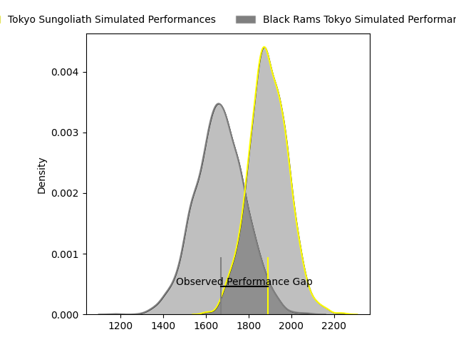
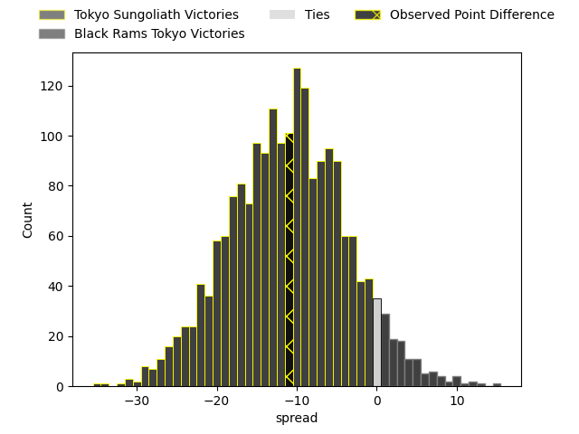
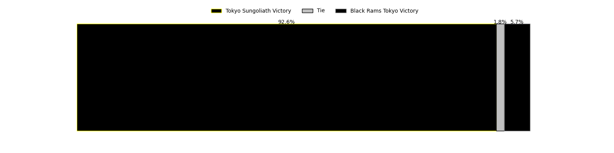
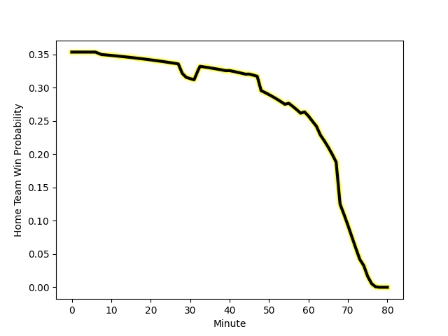

---  
layout: page  
title: Tokyo Sungoliath at Black Rams Tokyo; 18-7  
date: 2023-02-18 05:00:00 18:00:00 -0500  
categories: match review  
---
# Tokyo Sungoliath at Black Rams Tokyo; 18-7

# Club Level Predictions

The first set of predictions treats a club as the smallest object, as the club develops its members, organizes a gameplan, and deploys its players as needed for each match. This club model has a prediction of 0.225, which translates to predicting Tokyo Sungoliath to win by 11.2.

Each club has a rating and a rating deviation (simiar to a Glicko system), and expected performances can be generated. This allows for simulated matches and spreads like the ones below.
## Projected Performances

## Projected Spreads

## Projected Results

# Player Level Predictions

Treating teams instead as an entity made up of the currently active players, I have ratings for each player in an altogether different system. These can be combined to form team ratings once teamsheets are announced, weighting starters a bit higher than the reserves. After the match is played, players can be weighted by their minutes on the field, allowing for an accurate measure of the team's composition. With these compiled team ratings, we can make predictions, measure inaccuracy, and update the individual player ratings.
## Prediction with Player Minutes: Tokyo Sungoliath by 22.4

Tokyo Sungoliath by 26.4 on a neutral field
## Scores over Time

## Win Probability over Time

There were 1 large changes in win probability in this match
## Prediction without Player Minutes: Tokyo Sungoliath by 21.7

Tokyo Sungoliath by 25.7 on a neutral pitch

|   Away Minutes | Away Player                                                       |   Away elo |   Away Percentile |   Number |   Home Percentile |   Home elo | Home Player                                                         |   Home Minutes |
|---------------:|:------------------------------------------------------------------|-----------:|------------------:|---------:|------------------:|-----------:|:--------------------------------------------------------------------|---------------:|
|             48 | [Kenta Kobayashi](..//playerfiles//KentaKobayashi_cleaned.md)     |     107.17 |                85 |        1 |                18 |      85.64 | [Kazuma Nishi](..//playerfiles//KazumaNishi_cleaned.md)             |             59 |
|             74 | [Shunta Nakamura](..//playerfiles//ShuntaNakamura_cleaned.md)     |     138.11 |                99 |        2 |                42 |      92.33 | [Kazuhiro Koike](..//playerfiles//KazuhiroKoike_cleaned.md)         |             72 |
|             61 | [Ryosuke Iwaihara](..//playerfiles//RyosukeIwaihara_cleaned.md)   |     105.89 |                81 |        3 |                73 |     104.19 | [Taichi Chiba](..//playerfiles//TaichiChiba_cleaned.md)             |             29 |
|             55 | [Hendrik Tui](..//playerfiles//HendrikTui_cleaned.md)             |     113.15 |                89 |        4 |                 1 |      53.4  | [Daiki Yanagawa](..//playerfiles//DaikiYanagawa_cleaned.md)         |             74 |
|             80 | [Harrison Hockings](..//playerfiles//HarrisonHockings_cleaned.md) |     118.35 |                93 |        5 |                69 |     101.12 | [Michael Stolberg](..//playerfiles//MichaelStolberg_cleaned.md)     |             40 |
|             80 | [Kanji Shimokawa](..//playerfiles//KanjiShimokawa_cleaned.md)     |     112.73 |                87 |        6 |                61 |      99.54 | [Talau Fakatava](..//playerfiles//TalauFakatava_cleaned.md)         |             80 |
|             39 | [Kai Yamamoto](..//playerfiles//KaiYamamoto_cleaned.md)           |     108.61 |                81 |        7 |                83 |     108.73 | [Brodi McCurran](..//playerfiles//BrodiMcCurran_cleaned.md)         |             80 |
|             80 | [Tevita Tatafu](..//playerfiles//TevitaTatafu_cleaned.md)         |     116.6  |                90 |        8 |                37 |      93.79 | [Nathan Hughes](..//playerfiles//NathanHughes_cleaned.md)           |             80 |
|             48 | [Naoto Saito](..//playerfiles//NaotoSaito_cleaned.md)             |     108.92 |                86 |        9 |                73 |     102.28 | [Syota Yamamoto](..//playerfiles//SyotaYamamoto_cleaned.md)         |             63 |
|             45 | [Keisuke Moriya](..//playerfiles//KeisukeMoriya_cleaned.md)       |     110.91 |                84 |       10 |                42 |      92.34 | [Kohei Horigome](..//playerfiles//KoheiHorigome_cleaned.md)         |             40 |
|             73 | [Tevita Li](..//playerfiles//TevitaLi_cleaned.md)                 |     110.81 |                85 |       11 |                63 |      99.3  | [Netani Vakayalia](..//playerfiles//NetaniVakayalia_cleaned.md)     |             80 |
|             80 | [Ryoto Nakamura](..//playerfiles//RyotoNakamura_cleaned.md)       |     117.36 |                92 |       12 |                76 |     104.35 | [Hadleigh Parkes](..//playerfiles//HadleighParkes_cleaned.md)       |             80 |
|             80 | [Shogo Nakano](..//playerfiles//ShogoNakano_cleaned.md)           |     116.93 |                92 |       13 |                18 |      83.68 | [Yuki Ikeda](..//playerfiles//YukiIkeda_cleaned.md)                 |             80 |
|             80 | [Taiga Ozaki](..//playerfiles//TaigaOzaki_cleaned.md)             |      98.55 |                65 |       14 |                45 |      93.06 | [Main Taira](..//playerfiles//MainTaira_cleaned.md)                 |             74 |
|             80 | [Kotaro Matsushima](..//playerfiles//KotaroMatsushima_cleaned.md) |     111.92 |                85 |       15 |                82 |     108.98 | [Matt McGahan](..//playerfiles//MattMcGahan_cleaned.md)             |             80 |
|             41 | [Ryuga Hashimoto](..//playerfiles//RyugaHashimoto_cleaned.md)     |     108.77 |                79 |       16 |               nan |      95.06 | [Kazuhiro Shibata](..//playerfiles//KazuhiroShibata_cleaned.md)     |             51 |
|             35 | [Seiya Ozaki](..//playerfiles//SeiyaOzaki_cleaned.md)             |     107.65 |                82 |       17 |               nan |      95    | [Amanaki Lotoahea](..//playerfiles//AmanakiLotoahea_cleaned.md)     |             40 |
|             32 | [Shintaro Ishihara](..//playerfiles//ShintaroIshihara_cleaned.md) |     108.71 |                85 |       18 |                67 |     100.98 | [Isaac Lucas](..//playerfiles//IsaacLucas_cleaned.md)               |             40 |
|             25 | [Tom Savage](..//playerfiles//TomSavage_cleaned.md)               |     100.65 |                63 |       19 |                77 |     102.87 | [Yuichiro Taniguchi](..//playerfiles//YuichiroTaniguchi_cleaned.md) |             21 |
|             32 | [Yutaka Nagare](..//playerfiles//YutakaNagare_cleaned.md)         |     104.88 |               nan |       20 |                32 |      89.41 | [Toshiya Takahashi](..//playerfiles//ToshiyaTakahashi_cleaned.md)   |             17 |
|             19 | [Kan Nakano](..//playerfiles//KanNakano_cleaned.md)               |     107.98 |                83 |       21 |                10 |      78.12 | [Yuta Kurihara](..//playerfiles//YutaKurihara_cleaned.md)           |              6 |
|              7 | [Ryosuke Kawase](..//playerfiles//RyosukeKawase_cleaned.md)       |     102.94 |                70 |       22 |                59 |      98.64 | [Junpei Yukawa](..//playerfiles//JunpeiYukawa_cleaned.md)           |              6 |
|              6 | [Kienori Go](..//playerfiles//KienoriGo_cleaned.md)               |      91.86 |               nan |       23 |               nan |      95    | [Ko Sato](..//playerfiles//KoSato_cleaned.md)                       |              8 |

