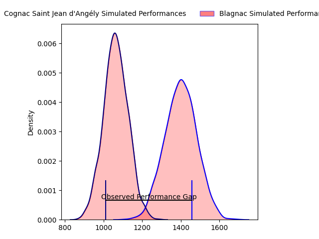
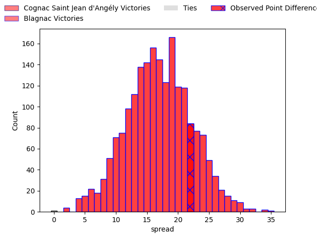
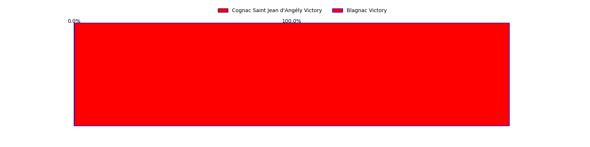
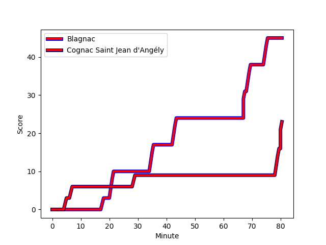
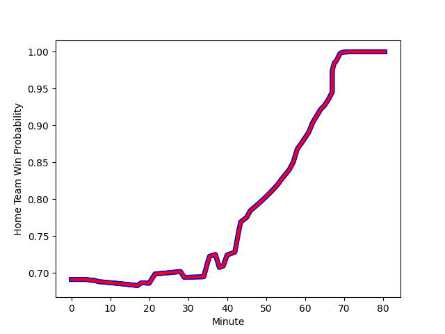

---  
layout: page  
title: Cognac Saint Jean d'Angély at Blagnac; 23-45  
date: 2023-02-18 18:00:00 18:00:00 -0500  
categories: match review  
---
# Cognac Saint Jean d'Angély at Blagnac; 23-45

# Club Level Predictions

The first set of predictions treats a club as the smallest object, as the club develops its members, organizes a gameplan, and deploys its players as needed for each match. This club model has a prediction of 0.872, which translates to predicting Blagnac to win by 17.0.

Each club has a rating and a rating deviation (simiar to a Glicko system), and expected performances can be generated. This allows for simulated matches and spreads like the ones below.
## Projected Performances

## Projected Spreads

## Projected Results

# Player Level Predictions

Treating teams instead as an entity made up of the currently active players, I have ratings for each player in an altogether different system. These can be combined to form team ratings once teamsheets are announced, weighting starters a bit higher than the reserves. After the match is played, players can be weighted by their minutes on the field, allowing for an accurate measure of the team's composition. With these compiled team ratings, we can make predictions, measure inaccuracy, and update the individual player ratings.
## Prediction with Player Minutes: Blagnac by 40.6

Blagnac by 36.6 on a neutral field
## Scores over Time

## Win Probability over Time

There were 2 large changes in win probability in this match
## Prediction without Player Minutes: Blagnac by 40.7

Blagnac by 36.7 on a neutral pitch

|   Away Minutes | Away Player                                                         |   Away elo |   Away Percentile |   Number |   Home Percentile |   Home elo | Home Player                                                              |   Home Minutes |
|---------------:|:--------------------------------------------------------------------|-----------:|------------------:|---------:|------------------:|-----------:|:-------------------------------------------------------------------------|---------------:|
|             79 | [Kevin Tougne](..//playerfiles//KevinTougne_cleaned.md)             |      73.03 |                 5 |        1 |                80 |     107.34 | [Alexis Decaux](..//playerfiles//AlexisDecaux_cleaned.md)                |             40 |
|             54 | [Paul Sauzaret](..//playerfiles//PaulSauzaret_cleaned.md)           |      76.04 |                 7 |        2 |                55 |      96.06 | [Florian Bertrand](..//playerfiles//FlorianBertrand_cleaned.md)          |             40 |
|             80 | [Martin Augeix](..//playerfiles//MartinAugeix_cleaned.md)           |      89.71 |                41 |        3 |                74 |     101.96 | [Fabien Lorenzon](..//playerfiles//FabienLorenzon_cleaned.md)            |             57 |
|             80 | [Thomas Toevalu](..//playerfiles//ThomasToevalu_cleaned.md)         |      48.73 |                 0 |        4 |                 7 |      73.74 | [Lucas Tolofua](..//playerfiles//LucasTolofua_cleaned.md)                |             62 |
|             77 | [Clément Praud](..//playerfiles//ClémentPraud_cleaned.md)           |      45.54 |                 0 |        5 |                86 |     111.21 | [Lilian Rousset](..//playerfiles//LilianRousset_cleaned.md)              |             80 |
|             38 | [Lucas Gulizzi](..//playerfiles//LucasGulizzi_cleaned.md)           |      55.22 |                 1 |        6 |                66 |     100.55 | [Nikita Bekov](..//playerfiles//NikitaBekov_cleaned.md)                  |             80 |
|             80 | [Damien Bonnet](..//playerfiles//DamienBonnet_cleaned.md)           |      93.83 |               nan |        7 |                84 |     110.57 | [Mathieu Vachon](..//playerfiles//MathieuVachon_cleaned.md)              |             70 |
|             65 | [Filipe Manu](..//playerfiles//FilipeManu_cleaned.md)               |      72.23 |                 5 |        8 |                63 |     100.06 | [Nekolo Tolofua](..//playerfiles//NekoloTolofua_cleaned.md)              |             80 |
|             70 | [William Beaudon](..//playerfiles//WilliamBeaudon_cleaned.md)       |      84.15 |                18 |        9 |                94 |     116.83 | [Paul Ravier](..//playerfiles//PaulRavier_cleaned.md)                    |             80 |
|             80 | [Serafin Bordoli](..//playerfiles//SerafinBordoli_cleaned.md)       |      84.69 |                16 |       10 |                81 |     108.91 | [Ugo Seunes](..//playerfiles//UgoSeunes_cleaned.md)                      |             66 |
|             74 | [Nils Guyon](..//playerfiles//NilsGuyon_cleaned.md)                 |      68.12 |                 8 |       11 |                11 |      77.58 | [Benjamin Daurau Bedin](..//playerfiles//BenjaminDaurauBedin_cleaned.md) |             46 |
|             80 | [Leo Sauvetre](..//playerfiles//LeoSauvetre_cleaned.md)             |      83.89 |                18 |       12 |                73 |     103.15 | [Clément Vareilles](..//playerfiles//ClémentVareilles_cleaned.md)        |             58 |
|             80 | [Isimeli Kuruibua](..//playerfiles//IsimeliKuruibua_cleaned.md)     |      82.41 |                15 |       13 |                49 |      95.06 | [Lukas Doyhenard](..//playerfiles//LukasDoyhenard_cleaned.md)            |             80 |
|             40 | [Paul Boitard](..//playerfiles//PaulBoitard_cleaned.md)             |      80.39 |                15 |       14 |                60 |      98.06 | [Lucas Martins](..//playerfiles//LucasMartins_cleaned.md)                |             80 |
|             80 | [Dany Antunes](..//playerfiles//DanyAntunes_cleaned.md)             |      80.23 |                16 |       15 |                12 |      77.64 | [Antoine Renaud](..//playerfiles//AntoineRenaud_cleaned.md)              |             80 |
|              1 | [Enrique Manukawera](..//playerfiles//EnriqueManukawera_cleaned.md) |      95    |               nan |       16 |                16 |      83.93 | [Jean-Baptiste Martin](..//playerfiles//Jean-BaptisteMartin_cleaned.md)  |             40 |
|             26 | [Maxime Gau](..//playerfiles//MaximeGau_cleaned.md)                 |      72.45 |                 5 |       17 |                91 |     114.78 | [Gabin Villerouge](..//playerfiles//GabinVillerouge_cleaned.md)          |             40 |
|             42 | [Khaled Hammouten](..//playerfiles//KhaledHammouten_cleaned.md)     |      93.27 |               nan |       18 |                75 |     105.13 | [Baptiste Collet](..//playerfiles//BaptisteCollet_cleaned.md)            |             23 |
|              3 | [Utu Maninoa](..//playerfiles//UtuManinoa_cleaned.md)               |      44.07 |                 0 |       19 |                62 |      99.14 | [Alexandre Perrin](..//playerfiles//AlexandrePerrin_cleaned.md)          |             18 |
|             10 | [Jone Tuva](..//playerfiles//JoneTuva_cleaned.md)                   |      69.35 |                 5 |       20 |                90 |     114.47 | [Vincent Mutel](..//playerfiles//VincentMutel_cleaned.md)                |             10 |
|             40 | [Vincent Pageneau](..//playerfiles//VincentPageneau_cleaned.md)     |      60.34 |                 2 |       21 |                49 |      95.44 | [Gérald Augustin](..//playerfiles//GéraldAugustin_cleaned.md)            |             14 |
|             15 | [Bryan Bruno](..//playerfiles//BryanBruno_cleaned.md)               |      90.58 |               nan |       22 |                55 |      96.5  | [Francois Tardieu](..//playerfiles//FrancoisTardieu_cleaned.md)          |             34 |
|              6 | [Jules Merceron](..//playerfiles//JulesMerceron_cleaned.md)         |      95    |               nan |       23 |                97 |     130.31 | [Jean-Andre Vernetti](..//playerfiles//Jean-AndreVernetti_cleaned.md)    |             22 |

