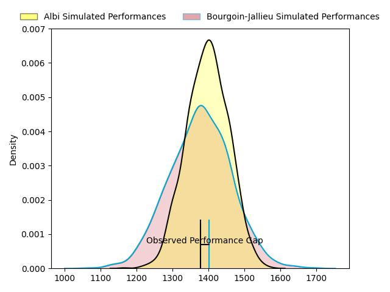
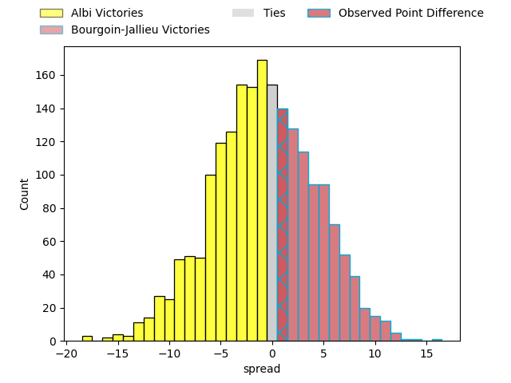
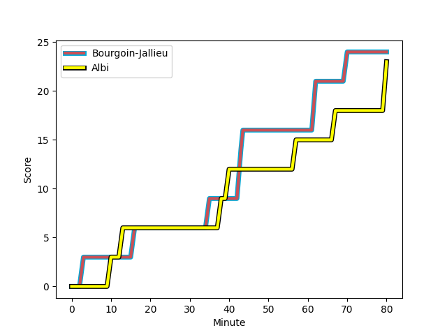
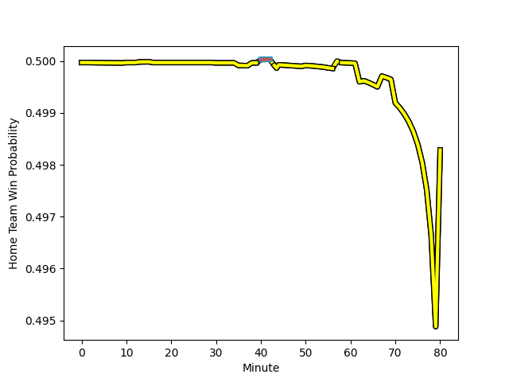

---  
layout: page  
title: Albi at Bourgoin-Jallieu; 23-24  
date: 2023-02-18 18:30:00 18:00:00 -0500  
categories: match review  
---
# Albi at Bourgoin-Jallieu; 23-24

# Club Level Predictions

The first set of predictions treats a club as the smallest object, as the club develops its members, organizes a gameplan, and deploys its players as needed for each match. This club model has a prediction of 0.47, which translates to predicting Albi to win by 1.1.

Each club has a rating and a rating deviation (simiar to a Glicko system), and expected performances can be generated. This allows for simulated matches and spreads like the ones below.
## Projected Performances

## Projected Spreads

## Projected Results

# Player Level Predictions

Treating teams instead as an entity made up of the currently active players, I have ratings for each player in an altogether different system. These can be combined to form team ratings once teamsheets are announced, weighting starters a bit higher than the reserves. After the match is played, players can be weighted by their minutes on the field, allowing for an accurate measure of the team's composition. With these compiled team ratings, we can make predictions, measure inaccuracy, and update the individual player ratings.
## Prediction with Player Minutes: Bourgoin-Jallieu by 4.0

Albi by 0.0 on a neutral field
## Scores over Time

## Win Probability over Time

## Prediction without Player Minutes: Bourgoin-Jallieu by 3.0

Albi by 1.0 on a neutral pitch

|   Away Minutes | Away Player                                                                          |   Away elo |   Away Percentile |   Number |   Home Percentile |   Home elo | Home Player                                                               |   Home Minutes |
|---------------:|:-------------------------------------------------------------------------------------|-----------:|------------------:|---------:|------------------:|-----------:|:--------------------------------------------------------------------------|---------------:|
|             63 | [Antoine Soave](..//playerfiles//AntoineSoave_cleaned.md)                            |     108.59 |                87 |        1 |                15 |      83.59 | [Adrien Devisme](..//playerfiles//AdrienDevisme_cleaned.md)               |             44 |
|             63 | [Reinach Venter](..//playerfiles//ReinachVenter_cleaned.md)                          |      81.8  |                13 |        2 |                46 |      93.27 | [Maxime Castant](..//playerfiles//MaximeCastant_cleaned.md)               |             51 |
|             55 | [Jean-Baptiste De Clercq](..//playerfiles//Jean-BaptisteDeClercq_cleaned.md)         |      99.18 |                64 |        3 |                29 |      89.01 | [Mickaël Simutoga](..//playerfiles//MickaëlSimutoga_cleaned.md)           |             58 |
|             80 | [John Henry Heath Backhouse](..//playerfiles//JohnHenryHeathBackhouse_cleaned.md)    |      89.39 |                32 |        4 |                97 |     130.7  | [Kemueli Lavetanakoroi](..//playerfiles//KemueliLavetanakoroi_cleaned.md) |             44 |
|             80 | [Jacques Jacobus Engelbrecht](..//playerfiles//JacquesJacobusEngelbrecht_cleaned.md) |     102.19 |                69 |        5 |                61 |      99.94 | [Léandre Cotte](..//playerfiles//LéandreCotte_cleaned.md)                 |             80 |
|             80 | [Luke Joseph Stringer](..//playerfiles//LukeJosephStringer_cleaned.md)               |      88.68 |                29 |        6 |                46 |      94.01 | [Kevin Rivoire](..//playerfiles//KevinRivoire_cleaned.md)                 |             58 |
|             63 | [Vincent Calas](..//playerfiles//VincentCalas_cleaned.md)                            |      80.13 |                11 |        7 |                30 |      88.99 | [Théophile Cotte](..//playerfiles//ThéophileCotte_cleaned.md)             |             80 |
|             67 | [Sandrick Maciotta](..//playerfiles//SandrickMaciotta_cleaned.md)                    |     109.73 |                82 |        8 |                57 |      97.94 | [Poutasi Luafutu](..//playerfiles//PoutasiLuafutu_cleaned.md)             |             80 |
|             50 | [Titouan Pouzoullic](..//playerfiles//TitouanPouzoullic_cleaned.md)                  |      78.34 |                11 |        9 |                87 |     109.57 | [Remi Bouet](..//playerfiles//RemiBouet_cleaned.md)                       |             80 |
|             67 | [François Fontaine](..//playerfiles//FrançoisFontaine_cleaned.md)                    |      94.02 |                46 |       10 |                58 |      98.11 | [Nicolas Vuillemin](..//playerfiles//NicolasVuillemin_cleaned.md)         |             55 |
|             80 | [Louis Decrop](..//playerfiles//LouisDecrop_cleaned.md)                              |      95    |               nan |       11 |                47 |      94.12 | [Naibuka Rokua](..//playerfiles//NaibukaRokua_cleaned.md)                 |             80 |
|             80 | [Simon Andreu](..//playerfiles//SimonAndreu_cleaned.md)                              |      85.13 |                21 |       12 |                69 |     101.8  | [Christopher Bosch](..//playerfiles//ChristopherBosch_cleaned.md)         |             55 |
|             80 | [Baptiste Couchinave](..//playerfiles//BaptisteCouchinave_cleaned.md)                |     120.09 |                94 |       13 |                36 |      90.37 | [Pablo Patilla](..//playerfiles//PabloPatilla_cleaned.md)                 |             80 |
|             80 | [Charly Vicenzo Trussardi](..//playerfiles//CharlyVicenzoTrussardi_cleaned.md)       |     103.18 |                72 |       14 |                72 |     102.85 | [Quentin Lefort](..//playerfiles//QuentinLefort_cleaned.md)               |             80 |
|             30 | [Enzo Marzocca](..//playerfiles//EnzoMarzocca_cleaned.md)                            |     105.88 |                79 |       15 |                15 |      80.19 | [Nicolas Cachet](..//playerfiles//NicolasCachet_cleaned.md)               |             80 |
|             17 | [Thibaud Sebire](..//playerfiles//ThibaudSebire_cleaned.md)                          |      96.05 |               nan |       16 |                48 |      97.59 | [Romain Favaretto](..//playerfiles//RomainFavaretto_cleaned.md)           |             36 |
|             17 | [Romain Maurice](..//playerfiles//RomainMaurice_cleaned.md)                          |      92.89 |                55 |       17 |                33 |      92.3  | [Killian Tripier](..//playerfiles//KillianTripier_cleaned.md)             |             29 |
|             25 | [Dimitri Tchapnga](..//playerfiles//DimitriTchapnga_cleaned.md)                      |      93.9  |                55 |       18 |                50 |      97.67 | [Oktay Yilmaz](..//playerfiles//OktayYilmaz_cleaned.md)                   |             22 |
|             13 | [Guillem Calmon](..//playerfiles//GuillemCalmon_cleaned.md)                          |      85.53 |                33 |       19 |                25 |      86.65 | [Robin Gascou](..//playerfiles//RobinGascou_cleaned.md)                   |             36 |
|             17 | [Charles Foures](..//playerfiles//CharlesFoures_cleaned.md)                          |     105.49 |                82 |       20 |                46 |      98    | [Théo Lepage](..//playerfiles//ThéoLepage_cleaned.md)                     |             22 |
|             30 | [Gilen Queheille](..//playerfiles//GilenQueheille_cleaned.md)                        |      89.48 |                33 |       21 |                41 |      91.67 | [Romain Sola](..//playerfiles//RomainSola_cleaned.md)                     |             25 |
|             13 | [Théo Vidal](..//playerfiles//ThéoVidal_cleaned.md)                                  |      93.07 |                44 |       22 |                77 |     105.4  | [Isaiah Leota](..//playerfiles//IsaiahLeota_cleaned.md)                   |             25 |
|             50 | [Téo Dospital](..//playerfiles//TéoDospital_cleaned.md)                              |     103.28 |                74 |       23 |               nan |     nan    | nan                                                                       |            nan |

