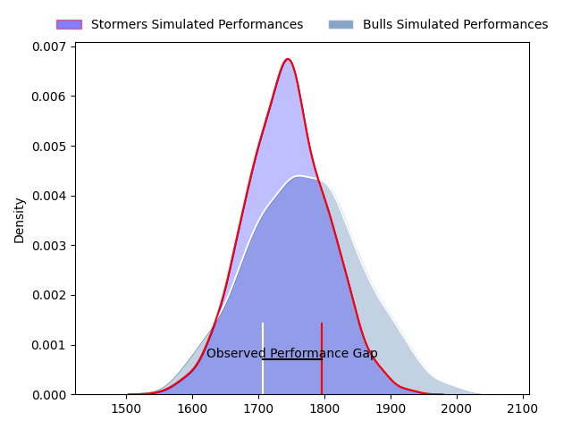
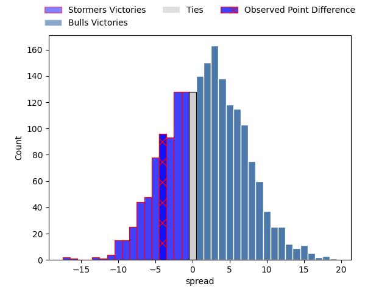
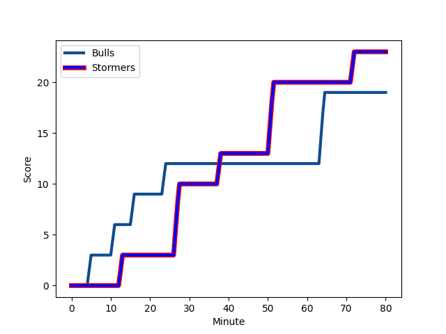
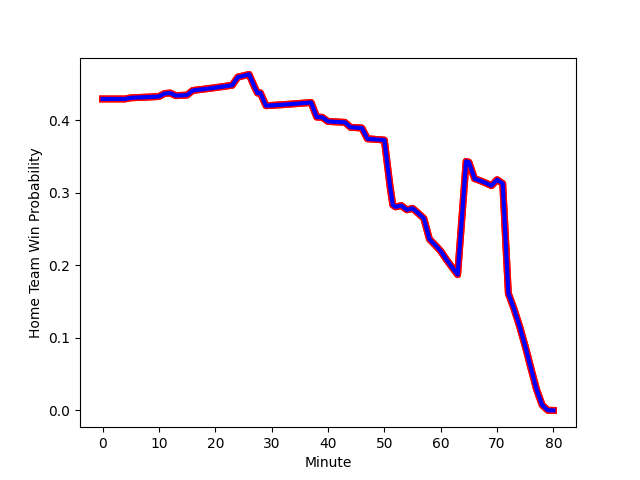

---  
layout: page  
title: Stormers at Bulls; 23-19  
date: 2023-02-18 16:00:00 18:00:00 -0500  
categories: match review  
---
# Stormers at Bulls; 23-19

# Club Level Predictions

The first set of predictions treats a club as the smallest object, as the club develops its members, organizes a gameplan, and deploys its players as needed for each match. This club model has a prediction of 0.546, which translates to predicting Bulls to win by 1.6.

Each club has a rating and a rating deviation (simiar to a Glicko system), and expected performances can be generated. This allows for simulated matches and spreads like the ones below.
## Projected Performances

## Projected Spreads

## Projected Results

# Player Level Predictions

Treating teams instead as an entity made up of the currently active players, I have ratings for each player in an altogether different system. These can be combined to form team ratings once teamsheets are announced, weighting starters a bit higher than the reserves. After the match is played, players can be weighted by their minutes on the field, allowing for an accurate measure of the team's composition. With these compiled team ratings, we can make predictions, measure inaccuracy, and update the individual player ratings.
## Prediction with Player Minutes: Stormers by 5.1

Stormers by 9.1 on a neutral field
## Scores over Time

## Win Probability over Time

There were 8 large changes in win probability in this match
## Prediction without Player Minutes: Stormers by 6.1

Stormers by 10.1 on a neutral pitch

|   Away Minutes | Away Player                                                                            |   Away elo |   Away Percentile |   Number |   Home Percentile |   Home elo | Home Player                                                                                    |   Home Minutes |
|---------------:|:---------------------------------------------------------------------------------------|-----------:|------------------:|---------:|------------------:|-----------:|:-----------------------------------------------------------------------------------------------|---------------:|
|             55 | [Juan Brok Harris](..//playerfiles//JuanBrokHarris_cleaned.md)                         |     104.54 |                64 |        1 |                73 |     101.72 | [Gerhardus Cornelis Steenkamp](..//playerfiles//GerhardusCornelisSteenkamp_cleaned.md)         |             66 |
|             55 | [Juan Brok Harris](..//playerfiles//JuanBrokHarris_cleaned.md)                         |     104.54 |                80 |        1 |                73 |     101.72 | [Gerhardus Cornelis Steenkamp](..//playerfiles//GerhardusCornelisSteenkamp_cleaned.md)         |             66 |
|             29 | [Siyabonga Ntubeni](..//playerfiles//SiyabongaNtubeni_cleaned.md)                      |      91.35 |               nan |        2 |                68 |     100.1  | [Cornelis Johannes Grobbelaar](..//playerfiles//CornelisJohannesGrobbelaar_cleaned.md)         |             66 |
|             66 | [Johan Neethling Fouche](..//playerfiles//JohanNeethlingFouche_cleaned.md)             |     102.48 |                57 |        3 |                53 |      95.91 | [Mornay Jan Jakobus Smith](..//playerfiles//MornayJanJakobusSmith_cleaned.md)                  |             44 |
|             66 | [Johan Neethling Fouche](..//playerfiles//JohanNeethlingFouche_cleaned.md)             |     102.48 |                75 |        3 |                53 |      95.91 | [Mornay Jan Jakobus Smith](..//playerfiles//MornayJanJakobusSmith_cleaned.md)                  |             44 |
|             80 | [Ruben van Heerden](..//playerfiles//RubenvanHeerden_cleaned.md)                       |     116.23 |                92 |        4 |                41 |      89.54 | [Willem Hendrik Jacques du Plessis](..//playerfiles//WillemHendrikJacquesduPlessis_cleaned.md) |             80 |
|             61 | [Gary Porter](..//playerfiles//GaryPorter_cleaned.md)                                  |     104.86 |                76 |        5 |                75 |     104.69 | [Ruan Nortje](..//playerfiles//RuanNortje_cleaned.md)                                          |             80 |
|             61 | [Gary Porter](..//playerfiles//GaryPorter_cleaned.md)                                  |     104.86 |                64 |        5 |                75 |     104.69 | [Ruan Nortje](..//playerfiles//RuanNortje_cleaned.md)                                          |             80 |
|             70 | [Deon Fourie](..//playerfiles//DeonFourie_cleaned.md)                                  |     113.5  |                87 |        6 |                61 |      99    | [Marco Gerhardt van Staden](..//playerfiles//MarcoGerhardtvanStaden_cleaned.md)                |             80 |
|             70 | [Deon Fourie](..//playerfiles//DeonFourie_cleaned.md)                                  |     113.5  |                77 |        6 |                61 |      99    | [Marco Gerhardt van Staden](..//playerfiles//MarcoGerhardtvanStaden_cleaned.md)                |             80 |
|             47 | [Willem Gerhardus Engelbrecht](..//playerfiles//WillemGerhardusEngelbrecht_cleaned.md) |      96.47 |                47 |        7 |                36 |      90.73 | [Cyle Justin Brink](..//playerfiles//CyleJustinBrink_cleaned.md)                               |             40 |
|             80 | [Marcel Theunissen](..//playerfiles//MarcelTheunissen_cleaned.md)                      |      89.06 |                29 |        8 |                80 |     107.42 | [Elrigh Louw](..//playerfiles//ElrighLouw_cleaned.md)                                          |             80 |
|             58 | [Herschel Jerome Jantjies](..//playerfiles//HerschelJeromeJantjies_cleaned.md)         |     100.27 |                68 |        9 |                88 |     110.12 | [Izak Jacobus Burger](..//playerfiles//IzakJacobusBurger_cleaned.md)                           |             58 |
|             58 | [Herschel Jerome Jantjies](..//playerfiles//HerschelJeromeJantjies_cleaned.md)         |     100.27 |                51 |        9 |                88 |     110.12 | [Izak Jacobus Burger](..//playerfiles//IzakJacobusBurger_cleaned.md)                           |             58 |
|             80 | [Immanuel Libbok](..//playerfiles//ImmanuelLibbok_cleaned.md)                          |     100.91 |                66 |       10 |                27 |      88.3  | [Chris Smith](..//playerfiles//ChrisSmith_cleaned.md)                                          |             55 |
|             80 | [Seabelo Senatla](..//playerfiles//SeabeloSenatla_cleaned.md)                          |     103.16 |                72 |       11 |               nan |      95    | [S'Busiso Romeo Nkosi](..//playerfiles//S'BusisoRomeoNkosi_cleaned.md)                         |             80 |
|             80 | [Daniel Michael du Plessis](..//playerfiles//DanielMichaelduPlessis_cleaned.md)        |     112.05 |                79 |       12 |                80 |     107.07 | [Harold William Vorster](..//playerfiles//HaroldWilliamVorster_cleaned.md)                     |             80 |
|             80 | [Daniel Michael du Plessis](..//playerfiles//DanielMichaelduPlessis_cleaned.md)        |     112.05 |                87 |       12 |                80 |     107.07 | [Harold William Vorster](..//playerfiles//HaroldWilliamVorster_cleaned.md)                     |             80 |
|             80 | [Adriaan Ruhan Nel](..//playerfiles//AdriaanRuhanNel_cleaned.md)                       |      92.83 |                44 |       13 |                57 |      97.1  | [Wandisile Simelane](..//playerfiles//WandisileSimelane_cleaned.md)                            |             80 |
|             80 | [Suleiman  Hartzenberg](..//playerfiles//SuleimanHartzenberg_cleaned.md)               |     113.26 |                88 |       14 |                28 |      87.26 | [Cornal Hendricks](..//playerfiles//CornalHendricks_cleaned.md)                                |             80 |
|             62 | [Clayton Blommetjies](..//playerfiles//ClaytonBlommetjies_cleaned.md)                  |      94.42 |                48 |       15 |                76 |     104.87 | [David Kriel](..//playerfiles//DavidKriel_cleaned.md)                                          |             80 |
|             51 | [Joseph Dweba](..//playerfiles//JosephDweba_cleaned.md)                                |     113.35 |                91 |       16 |                27 |      87.62 | [Nizaam Carr](..//playerfiles//NizaamCarr_cleaned.md)                                          |             13 |
|             51 | [Joseph Dweba](..//playerfiles//JosephDweba_cleaned.md)                                |     113.35 |                86 |       16 |                27 |      87.62 | [Nizaam Carr](..//playerfiles//NizaamCarr_cleaned.md)                                          |             13 |
|             19 | [Ben-Jason Dixon](..//playerfiles//Ben-JasonDixon_cleaned.md)                          |     111.28 |                84 |       17 |                47 |      93.66 | [Francois Klopper](..//playerfiles//FrancoisKlopper_cleaned.md)                                |             36 |
|             33 | [Junior Sipato Pokomela](..//playerfiles//JuniorSipatoPokomela_cleaned.md)             |     115.93 |                83 |       18 |                46 |      93.16 | [Ruan Stefan Vermaak](..//playerfiles//RuanStefanVermaak_cleaned.md)                           |             27 |
|             33 | [Junior Sipato Pokomela](..//playerfiles//JuniorSipatoPokomela_cleaned.md)             |     115.93 |                90 |       18 |                46 |      93.16 | [Ruan Stefan Vermaak](..//playerfiles//RuanStefanVermaak_cleaned.md)                           |             27 |
|             25 | [Alistair Fernando Vermaak](..//playerfiles//AlistairFernandoVermaak_cleaned.md)       |      94.9  |                38 |       19 |                25 |      87.65 | [Morne Steyn](..//playerfiles//MorneSteyn_cleaned.md)                                          |             25 |
|             22 | [Albertus Paul de Wet](..//playerfiles//AlbertusPauldeWet_cleaned.md)                  |     115.82 |                91 |       20 |                32 |      88.78 | [Embrose Cheldon Papier](..//playerfiles//EmbroseCheldonPapier_cleaned.md)                     |             22 |
|             18 | [Sacha Mngomezulu](..//playerfiles//SachaMngomezulu_cleaned.md)                        |     100.11 |                60 |       21 |                 8 |      80.23 | [Jan Hendrik Wessels](..//playerfiles//JanHendrikWessels_cleaned.md)                           |             14 |
|             14 | [Sazi Sandi](..//playerfiles//SaziSandi_cleaned.md)                                    |      97.8  |               nan |       22 |                40 |      91.67 | [Simphiwe Matanzima](..//playerfiles//SimphiweMatanzima_cleaned.md)                            |             14 |
|             10 | [Ernst van Rhyn](..//playerfiles//ErnstvanRhyn_cleaned.md)                             |      94.57 |                48 |       23 |               nan |     nan    | nan                                                                                            |            nan |

