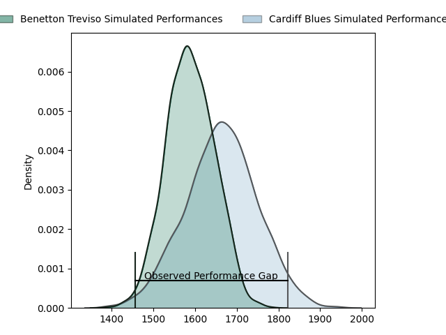
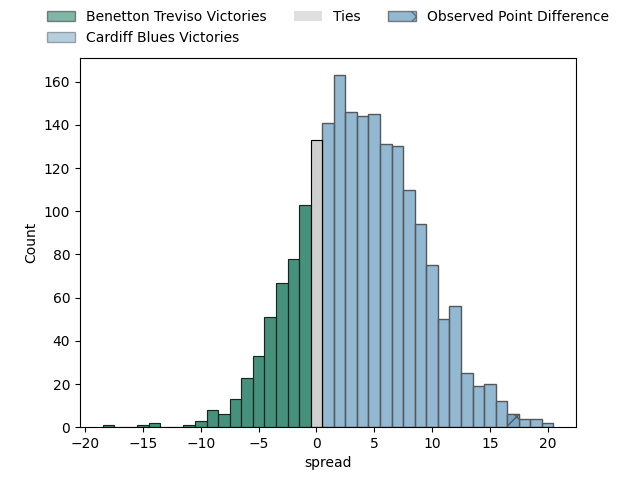
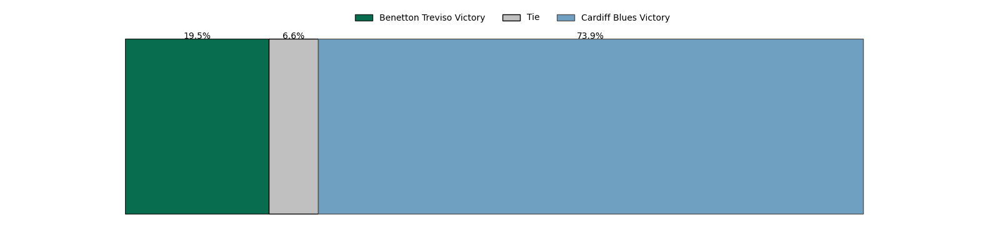
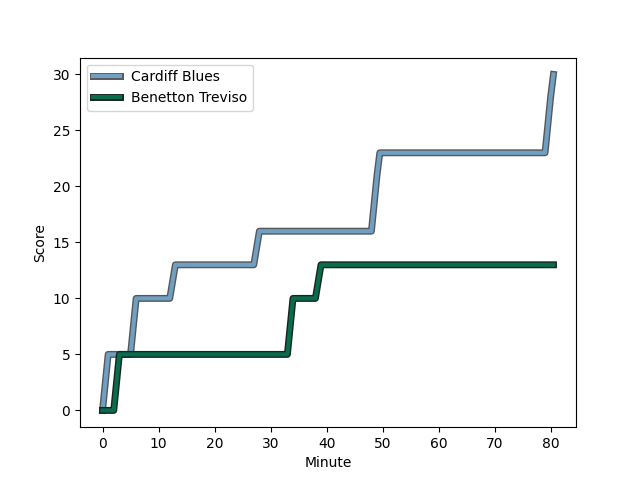
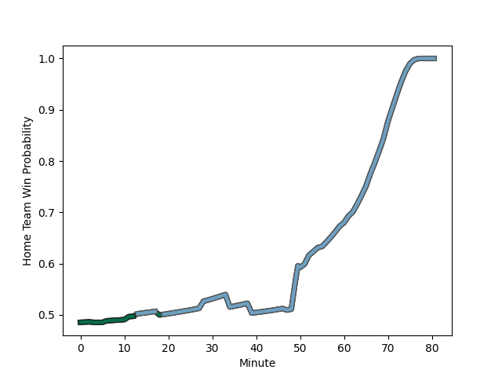

---  
layout: page  
title: Benetton Treviso at Cardiff Blues; 13-30  
date: 2023-02-18 18:15:00 18:00:00 -0500  
categories: match review  
---
# Benetton Treviso at Cardiff Blues; 13-30

# Club Level Predictions

The first set of predictions treats a club as the smallest object, as the club develops its members, organizes a gameplan, and deploys its players as needed for each match. This club model has a prediction of 0.606, which translates to predicting Cardiff Blues to win by 3.8.

Each club has a rating and a rating deviation (simiar to a Glicko system), and expected performances can be generated. This allows for simulated matches and spreads like the ones below.
## Projected Performances

## Projected Spreads

## Projected Results

# Player Level Predictions

Treating teams instead as an entity made up of the currently active players, I have ratings for each player in an altogether different system. These can be combined to form team ratings once teamsheets are announced, weighting starters a bit higher than the reserves. After the match is played, players can be weighted by their minutes on the field, allowing for an accurate measure of the team's composition. With these compiled team ratings, we can make predictions, measure inaccuracy, and update the individual player ratings.
## Prediction with Player Minutes: Cardiff Blues by 0.2

Benetton Treviso by 3.8 on a neutral field
## Scores over Time

## Win Probability over Time

There were 8 large changes in win probability in this match
## Prediction without Player Minutes: Benetton Treviso by 4.3

Benetton Treviso by 8.3 on a neutral pitch

|   Away Minutes | Away Player                                                                                 |   Away elo |   Away Percentile |   Number |   Home Percentile |   Home elo | Home Player                                                         |   Home Minutes |
|---------------:|:--------------------------------------------------------------------------------------------|-----------:|------------------:|---------:|------------------:|-----------:|:--------------------------------------------------------------------|---------------:|
|             60 | [Francisco Nahuel Tetaz Chaparro](..//playerfiles//FranciscoNahuelTetazChaparro_cleaned.md) |      92.51 |                41 |        1 |                42 |      91.28 | [Corey Domachowski](..//playerfiles//CoreyDomachowski_cleaned.md)   |             66 |
|             47 | [Siua Maile](..//playerfiles//SiuaMaile_cleaned.md)                                         |      94.99 |                52 |        2 |                56 |      94.21 | [Kristian Dacey](..//playerfiles//KristianDacey_cleaned.md)         |             60 |
|             52 | [Tiziano Pasquali](..//playerfiles//TizianoPasquali_cleaned.md)                             |      96.05 |                53 |        3 |                40 |      92.42 | [Dumitru Arhip](..//playerfiles//DumitruArhip_cleaned.md)           |             18 |
|             80 | [Marco Lazzaroni](..//playerfiles//MarcoLazzaroni_cleaned.md)                               |     101.92 |                69 |        4 |                 7 |      72.33 | [Lopeti Timani](..//playerfiles//LopetiTimani_cleaned.md)           |             70 |
|             80 | [Riccardo Favretto](..//playerfiles//RiccardoFavretto_cleaned.md)                           |      98.57 |                61 |        5 |                54 |      96.13 | [Seb Davies](..//playerfiles//SebDavies_cleaned.md)                 |             80 |
|             70 | [Giovanni Pettinelli](..//playerfiles//GiovanniPettinelli_cleaned.md)                       |      91.36 |                38 |        6 |                37 |      91.2  | [Joshua Turnbull](..//playerfiles//JoshuaTurnbull_cleaned.md)       |             80 |
|             60 | [Alessandrio Izekor](..//playerfiles//AlessandrioIzekor_cleaned.md)                         |      92.71 |                42 |        7 |                66 |     101.17 | [Ellis Jenkins](..//playerfiles//EllisJenkins_cleaned.md)           |             62 |
|             80 | [Henry Stowers](..//playerfiles//HenryStowers_cleaned.md)                                   |      94.73 |                47 |        8 |                32 |      90.23 | [James Ratti](..//playerfiles//JamesRatti_cleaned.md)               |             80 |
|             55 | [Dewald Otto Duvenage](..//playerfiles//DewaldOttoDuvenage_cleaned.md)                      |      87.03 |                24 |        9 |                58 |      97.55 | [Lloyd Williams](..//playerfiles//LloydWilliams_cleaned.md)         |             80 |
|             80 | [Tomas Albornoz](..//playerfiles//TomasAlbornoz_cleaned.md)                                 |     100.52 |                64 |       10 |                11 |      79.88 | [Jarrod Evans](..//playerfiles//JarrodEvans_cleaned.md)             |             11 |
|             52 | [Mattia Bellini](..//playerfiles//MattiaBellini_cleaned.md)                                 |      95.98 |                53 |       11 |                15 |      81.51 | [Jason Harries](..//playerfiles//JasonHarries_cleaned.md)           |             80 |
|             50 | [Filippo Drago](..//playerfiles//FilippoDrago_cleaned.md)                                   |      91.43 |                40 |       12 |                90 |     115.22 | [Max Llewellyn](..//playerfiles//MaxLlewellyn_cleaned.md)           |             80 |
|             80 | [Marco Zanon](..//playerfiles//MarcoZanon_cleaned.md)                                       |      86.1  |                24 |       13 |                83 |     108.84 | [Rey Lee-Lo](..//playerfiles//ReyLee-Lo_cleaned.md)                 |             80 |
|             80 | [Onisi Ratave](..//playerfiles//OnisiRatave_cleaned.md)                                     |     108.55 |                83 |       14 |                32 |      89.16 | [Owen Lane](..//playerfiles//OwenLane_cleaned.md)                   |             80 |
|             80 | [Rhyno Christo Smith](..//playerfiles//RhynoChristoSmith_cleaned.md)                        |      93.21 |                45 |       15 |                19 |      84.46 | [Ben Thomas](..//playerfiles//BenThomas_cleaned.md)                 |             80 |
|             33 | [Bautista Bernasconi](..//playerfiles//BautistaBernasconi_cleaned.md)                       |     100.42 |                71 |       16 |               nan |      91.42 | [Matthew Morgan](..//playerfiles//MatthewMorgan_cleaned.md)         |             69 |
|             30 | [Joaquin Riera](..//playerfiles//JoaquinRiera_cleaned.md)                                   |     101.29 |                68 |       17 |                27 |      88.55 | [Kieran Assirati](..//playerfiles//KieranAssirati_cleaned.md)       |             62 |
|             28 | [Jacob Umaga](..//playerfiles//JacobUmaga_cleaned.md)                                       |      87.93 |                25 |       18 |                37 |      90.81 | [Kirby Myhill](..//playerfiles//KirbyMyhill_cleaned.md)             |             20 |
|             28 | [Filipo Alongi](..//playerfiles//FilipoAlongi_cleaned.md)                                   |      92.37 |                41 |       19 |               nan |      91.21 | [Shane Lewis-Hughes](..//playerfiles//ShaneLewis-Hughes_cleaned.md) |             18 |
|             25 | [Alessandro Garbisi](..//playerfiles//AlessandroGarbisi_cleaned.md)                         |     100.49 |                68 |       20 |                72 |     101.34 | [Bradley Thyer](..//playerfiles//BradleyThyer_cleaned.md)           |             14 |
|             10 | [Carl Wegner](..//playerfiles//CarlWegner_cleaned.md)                                       |      93.21 |               nan |       21 |                49 |      92.1  | [Rory Thornton](..//playerfiles//RoryThornton_cleaned.md)           |             10 |
|             20 | [Toa Halafihi](..//playerfiles//ToaHalafihi_cleaned.md)                                     |      95    |               nan |       22 |               nan |     nan    | nan                                                                 |            nan |
|             20 | [Thomas Gallo](..//playerfiles//ThomasGallo_cleaned.md)                                     |      90.11 |               nan |       23 |               nan |     nan    | nan                                                                 |            nan |

