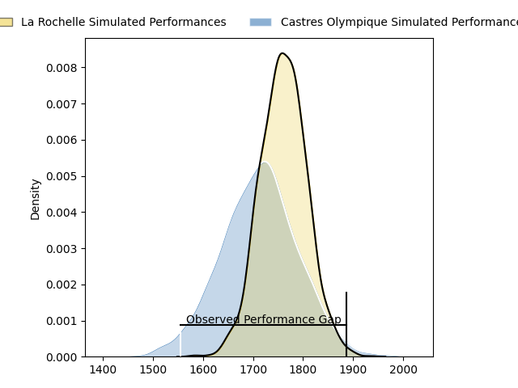
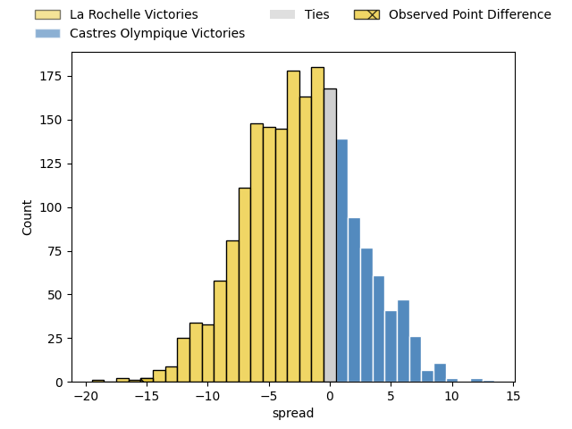
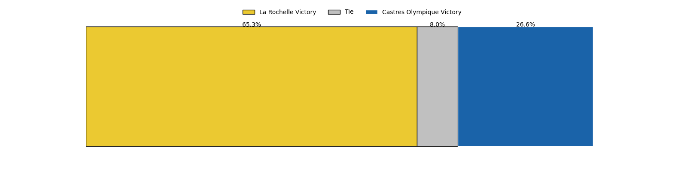
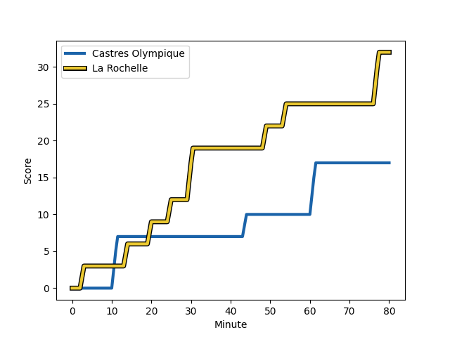
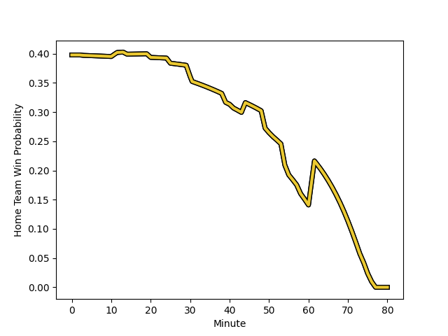

---  
layout: page  
title: La Rochelle at Castres Olympique; 32-17  
date: 2023-02-18 17:00:00 18:00:00 -0500  
categories: match review  
---
# La Rochelle at Castres Olympique; 32-17

# Club Level Predictions

The first set of predictions treats a club as the smallest object, as the club develops its members, organizes a gameplan, and deploys its players as needed for each match. This club model has a prediction of 0.429, which translates to predicting La Rochelle to win by 2.5.

Each club has a rating and a rating deviation (simiar to a Glicko system), and expected performances can be generated. This allows for simulated matches and spreads like the ones below.
## Projected Performances

## Projected Spreads

## Projected Results

# Player Level Predictions

Treating teams instead as an entity made up of the currently active players, I have ratings for each player in an altogether different system. These can be combined to form team ratings once teamsheets are announced, weighting starters a bit higher than the reserves. After the match is played, players can be weighted by their minutes on the field, allowing for an accurate measure of the team's composition. With these compiled team ratings, we can make predictions, measure inaccuracy, and update the individual player ratings.
## Prediction with Player Minutes: La Rochelle by 13.9

La Rochelle by 17.9 on a neutral field
## Scores over Time

## Win Probability over Time

There were 3 large changes in win probability in this match
## Prediction without Player Minutes: La Rochelle by 11.1

La Rochelle by 15.1 on a neutral pitch

|   Away Minutes | Away Player                                                                       |   Away elo |   Away Percentile |   Number |   Home Percentile |   Home elo | Home Player                                                                       |   Home Minutes |
|---------------:|:----------------------------------------------------------------------------------|-----------:|------------------:|---------:|------------------:|-----------:|:----------------------------------------------------------------------------------|---------------:|
|             58 | [Hayden Thompson-Stringer](..//playerfiles//HaydenThompson-Stringer_cleaned.md)   |      84.32 |                18 |        1 |                46 |      93.85 | [Quentin Walcker](..//playerfiles//QuentinWalcker_cleaned.md)                     |             55 |
|             51 | [Quentin Lespiaucq-Brettes](..//playerfiles//QuentinLespiaucq-Brettes_cleaned.md) |      99.28 |                66 |        2 |                62 |      98.15 | [Pierre Colonna](..//playerfiles//PierreColonna_cleaned.md)                       |             55 |
|             50 | [Joel Sclavi](..//playerfiles//JoelSclavi_cleaned.md)                             |      86.49 |                20 |        3 |                40 |      92.46 | [Wilfried Hounkpatin](..//playerfiles//WilfriedHounkpatin_cleaned.md)             |             55 |
|             51 | [Romain Sazy](..//playerfiles//RomainSazy_cleaned.md)                             |     104.63 |                75 |        4 |                30 |      88.69 | [Florent Vanverberghe](..//playerfiles//FlorentVanverberghe_cleaned.md)           |             55 |
|             74 | [William Skelton](..//playerfiles//WilliamSkelton_cleaned.md)                     |     111.44 |                90 |        5 |                24 |      86.45 | [Thomas Staniforth](..//playerfiles//ThomasStaniforth_cleaned.md)                 |             80 |
|             80 | [Ultan Dillane](..//playerfiles//UltanDillane_cleaned.md)                         |      88.99 |                37 |        6 |                55 |      97.43 | [Nick Champion de Crespigny](..//playerfiles//NickChampiondeCrespigny_cleaned.md) |             80 |
|             41 | [Levani Botia](..//playerfiles//LevaniBotia_cleaned.md)                           |      92.69 |                42 |        7 |                33 |      90.75 | [Tyler Ardron](..//playerfiles//TylerArdron_cleaned.md)                           |             50 |
|             80 | [Yoan Tanga Mangene](..//playerfiles//YoanTangaMangene_cleaned.md)                |     110.64 |                85 |        8 |                62 |      93.66 | [Kevin Kornath](..//playerfiles//KevinKornath_cleaned.md)                         |             55 |
|             80 | [Tawera Kerr-Barlow](..//playerfiles//TaweraKerr-Barlow_cleaned.md)               |     106.74 |                83 |        9 |                52 |      95.44 | [Santiago Arata Perrone](..//playerfiles//SantiagoArataPerrone_cleaned.md)        |             55 |
|             80 | [Antoine Hastoy](..//playerfiles//AntoineHastoy_cleaned.md)                       |     111.88 |                86 |       10 |                41 |      92.39 | [Louis Le Brun](..//playerfiles//LouisLeBrun_cleaned.md)                          |             70 |
|             80 | [Raymond Rhule](..//playerfiles//RaymondRhule_cleaned.md)                         |     113.79 |                90 |       11 |                47 |      93.62 | [Filipo Nakosi](..//playerfiles//FilipoNakosi_cleaned.md)                         |             80 |
|             55 | [Jules Favre](..//playerfiles//JulesFavre_cleaned.md)                             |      97.49 |                57 |       12 |                46 |      93.37 | [Vilimoni Botitu](..//playerfiles//VilimoniBotitu_cleaned.md)                     |             80 |
|             39 | [UJ Seuteni](..//playerfiles//UJSeuteni_cleaned.md)                               |      93.37 |                46 |       13 |                18 |      84    | [Adrien Seguret](..//playerfiles//AdrienSeguret_cleaned.md)                       |             80 |
|             80 | [Dillyn Leyds](..//playerfiles//DillynLeyds_cleaned.md)                           |     122.67 |                95 |       14 |                15 |      81.47 | [Geoffrey Palis](..//playerfiles//GeoffreyPalis_cleaned.md)                       |             80 |
|             80 | [Brice Dulin](..//playerfiles//BriceDulin_cleaned.md)                             |     108.81 |                80 |       15 |                53 |      96.52 | [Julien Dumora](..//playerfiles//JulienDumora_cleaned.md)                         |             80 |
|             41 | [Jonathan Danty](..//playerfiles//JonathanDanty_cleaned.md)                       |     114.08 |                89 |       16 |                43 |      92.98 | [Asier Latierro Usarraga](..//playerfiles//AsierLatierroUsarraga_cleaned.md)      |             30 |
|             39 | [Kyle Hatherell](..//playerfiles//KyleHatherell_cleaned.md)                       |      98.01 |                58 |       17 |                29 |      89    | [Levan Chilachava](..//playerfiles//LevanChilachava_cleaned.md)                   |             25 |
|             30 | [Georges-Henri Colombe](..//playerfiles//Georges-HenriColombe_cleaned.md)         |      93.27 |                43 |       18 |                36 |      90.8  | [Baptiste Cope](..//playerfiles//BaptisteCope_cleaned.md)                         |             25 |
|             29 | [Pierre Bourgarit](..//playerfiles//PierreBourgarit_cleaned.md)                   |     100.23 |                68 |       19 |                18 |      83.75 | [Gauthier Doubrère](..//playerfiles//GauthierDoubrère_cleaned.md)                 |             25 |
|             29 | [Thomas Lavault](..//playerfiles//ThomasLavault_cleaned.md)                       |     105.73 |                73 |       20 |                26 |      87.74 | [Leone Nakarawa](..//playerfiles//LeoneNakarawa_cleaned.md)                       |             25 |
|             25 | [Thomas Berjon](..//playerfiles//ThomasBerjon_cleaned.md)                         |      97.72 |                55 |       21 |               nan |     108.37 | [Brice Humbert](..//playerfiles//BriceHumbert_cleaned.md)                         |             25 |
|             22 | [Leo Aouf](..//playerfiles//LeoAouf_cleaned.md)                                   |      98.28 |               nan |       22 |                15 |      83.02 | [Antoine Tichit](..//playerfiles//AntoineTichit_cleaned.md)                       |             25 |
|              6 | [Rémi Picquette](..//playerfiles//RémiPicquette_cleaned.md)                       |      87.83 |                27 |       23 |                41 |      91.97 | [Benjamin Botica](..//playerfiles//BenjaminBotica_cleaned.md)                     |             10 |

