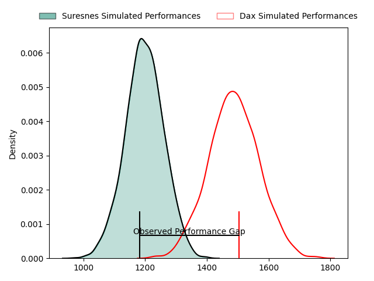
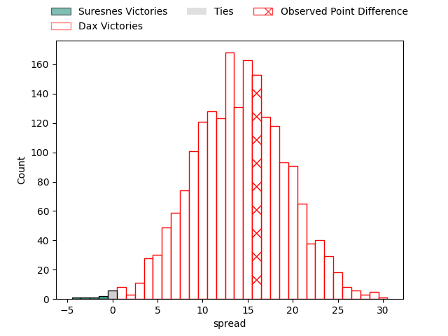
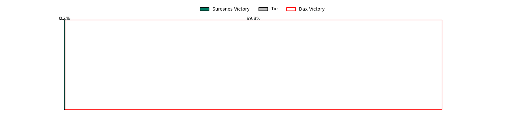
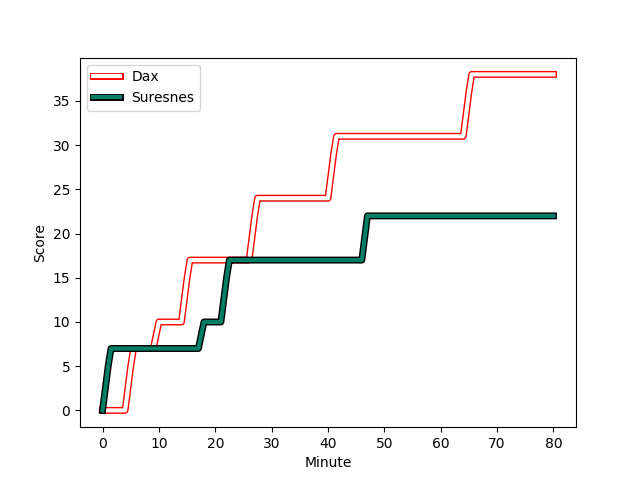
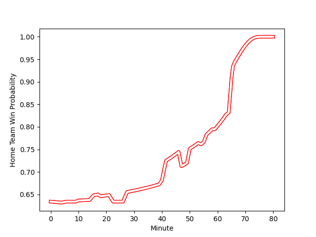

---  
layout: page  
title: Suresnes at Dax; 22-38  
date: 2023-02-18 19:00:00 18:00:00 -0500  
categories: match review  
---
# Suresnes at Dax; 22-38

# Club Level Predictions

The first set of predictions treats a club as the smallest object, as the club develops its members, organizes a gameplan, and deploys its players as needed for each match. This club model has a prediction of 0.834, which translates to predicting Dax to win by 14.2.

Each club has a rating and a rating deviation (simiar to a Glicko system), and expected performances can be generated. This allows for simulated matches and spreads like the ones below.
## Projected Performances

## Projected Spreads

## Projected Results

# Player Level Predictions

Treating teams instead as an entity made up of the currently active players, I have ratings for each player in an altogether different system. These can be combined to form team ratings once teamsheets are announced, weighting starters a bit higher than the reserves. After the match is played, players can be weighted by their minutes on the field, allowing for an accurate measure of the team's composition. With these compiled team ratings, we can make predictions, measure inaccuracy, and update the individual player ratings.
## Prediction with Player Minutes: Dax by 27.9

Dax by 23.9 on a neutral field
## Scores over Time

## Win Probability over Time

There were 5 large changes in win probability in this match
## Prediction without Player Minutes: Dax by 26.3

Dax by 22.3 on a neutral pitch

|   Away Minutes | Away Player                                                                  |   Away elo |   Away Percentile |   Number |   Home Percentile |   Home elo | Home Player                                                       |   Home Minutes |
|---------------:|:-----------------------------------------------------------------------------|-----------:|------------------:|---------:|------------------:|-----------:|:------------------------------------------------------------------|---------------:|
|             50 | [Lucas Dycke](..//playerfiles//LucasDycke_cleaned.md)                        |      79.07 |                 9 |        1 |               nan |      95.95 | [Joaquin Rodon](..//playerfiles//JoaquinRodon_cleaned.md)         |             50 |
|             50 | [Anthony Bajart](..//playerfiles//AnthonyBajart_cleaned.md)                  |      95.7  |                56 |        2 |                56 |      96.1  | [Maxime Delonca](..//playerfiles//MaximeDelonca_cleaned.md)       |             50 |
|             40 | [Victor Damian Arias](..//playerfiles//VictorDamianArias_cleaned.md)         |     100.56 |                81 |        3 |                 4 |      72.12 | [Thibaud Dréan](..//playerfiles//ThibaudDréan_cleaned.md)         |             50 |
|             66 | [Florian Desbordes](..//playerfiles//FlorianDesbordes_cleaned.md)            |      86.15 |                23 |        4 |                46 |      96.73 | [Étienne Loiret](..//playerfiles//ÉtienneLoiret_cleaned.md)       |             80 |
|             50 | [Wian Vosloo](..//playerfiles//WianVosloo_cleaned.md)                        |      96.75 |                56 |        5 |                91 |     116.08 | [Yoan Gaune](..//playerfiles//YoanGaune_cleaned.md)               |             50 |
|             80 | [Hayam El Bibouji](..//playerfiles//HayamElBibouji_cleaned.md)               |      84.39 |                17 |        6 |                70 |     103.02 | [Arnaud Aletti](..//playerfiles//ArnaudAletti_cleaned.md)         |             80 |
|             80 | [Bastien Berenguel](..//playerfiles//BastienBerenguel_cleaned.md)            |      95.7  |                50 |        7 |                66 |      96.38 | [Théo Tremeau](..//playerfiles//ThéoTremeau_cleaned.md)           |             59 |
|             80 | [Louis-Mathieu Jazeix](..//playerfiles//Louis-MathieuJazeix_cleaned.md)      |      88.87 |                29 |        8 |                12 |      80.72 | [Brice Ferrer](..//playerfiles//BriceFerrer_cleaned.md)           |             80 |
|             54 | [Quentin Dauvergne](..//playerfiles//QuentinDauvergne_cleaned.md)            |      75.01 |                 7 |        9 |                36 |      90.96 | [Simon Garrouteigt](..//playerfiles//SimonGarrouteigt_cleaned.md) |             54 |
|             66 | [Ignacio Mieres](..//playerfiles//IgnacioMieres_cleaned.md)                  |      99.21 |                61 |       10 |                50 |      96.05 | [Hugo Cerisier](..//playerfiles//HugoCerisier_cleaned.md)         |             80 |
|             80 | [Ervin Muric](..//playerfiles//ErvinMuric_cleaned.md)                        |      21.66 |                 0 |       11 |                93 |     118.48 | [Guillaume Bouche](..//playerfiles//GuillaumeBouche_cleaned.md)   |             50 |
|             80 | [Petero Tuwai](..//playerfiles//PeteroTuwai_cleaned.md)                      |      99.02 |                60 |       12 |                82 |     107.7  | [Ilikena Bolakoro](..//playerfiles//IlikenaBolakoro_cleaned.md)   |             64 |
|             80 | [Lilan Savioz Fouillet](..//playerfiles//LilanSaviozFouillet_cleaned.md)     |      95    |               nan |       13 |                76 |     104.33 | [Sylvère Reteau](..//playerfiles//SylvèreReteau_cleaned.md)       |             80 |
|             56 | [Alexis Clement](..//playerfiles//AlexisClement_cleaned.md)                  |      74.35 |                 8 |       14 |                51 |      97.18 | [Julien Dechavanne](..//playerfiles//JulienDechavanne_cleaned.md) |             80 |
|             80 | [Thomas Baudy](..//playerfiles//ThomasBaudy_cleaned.md)                      |      78.13 |                10 |       15 |                85 |     111.97 | [Théo Duprat](..//playerfiles//ThéoDuprat_cleaned.md)             |             80 |
|             30 | [Sébastien Lafrancesca](..//playerfiles//SébastienLafrancesca_cleaned.md)    |      89.11 |                34 |       16 |                93 |     116.23 | [Asa Faitotoa](..//playerfiles//AsaFaitotoa_cleaned.md)           |             30 |
|             30 | [Thomas Bordes](..//playerfiles//ThomasBordes_cleaned.md)                    |      94.18 |                51 |       17 |                97 |     131.92 | [Elvis Levi](..//playerfiles//ElvisLevi_cleaned.md)               |             30 |
|             40 | [Leandro Mario Assi](..//playerfiles//LeandroMarioAssi_cleaned.md)           |      88.43 |                26 |       18 |                68 |     100.27 | [Anthony Pelmard](..//playerfiles//AnthonyPelmard_cleaned.md)     |             30 |
|             14 | [Damien Bozic](..//playerfiles//DamienBozic_cleaned.md)                      |      94.21 |               nan |       19 |                56 |      95.54 | [Matt Luamanu](..//playerfiles//MattLuamanu_cleaned.md)           |             30 |
|             30 | [Antonie Delport Claasen](..//playerfiles//AntonieDelportClaasen_cleaned.md) |      86.23 |                24 |       20 |                15 |      82.95 | [Diaby Doucouré](..//playerfiles//DiabyDoucouré_cleaned.md)       |             21 |
|             26 | [Théo Bachiri](..//playerfiles//ThéoBachiri_cleaned.md)                      |      81.23 |                14 |       21 |                14 |      81.27 | [Adrien Ayestaran](..//playerfiles//AdrienAyestaran_cleaned.md)   |             26 |
|             14 | [Gaëtan Robert](..//playerfiles//GaëtanRobert_cleaned.md)                    |      75.93 |                 7 |       22 |                79 |     105.88 | [Théo Gatelier](..//playerfiles//ThéoGatelier_cleaned.md)         |             30 |
|             24 | [Jean-Baptiste Fuster](..//playerfiles//Jean-BaptisteFuster_cleaned.md)      |      51.11 |                 1 |       23 |               nan |      96.64 | [Jules Lartigau](..//playerfiles//JulesLartigau_cleaned.md)       |             16 |

