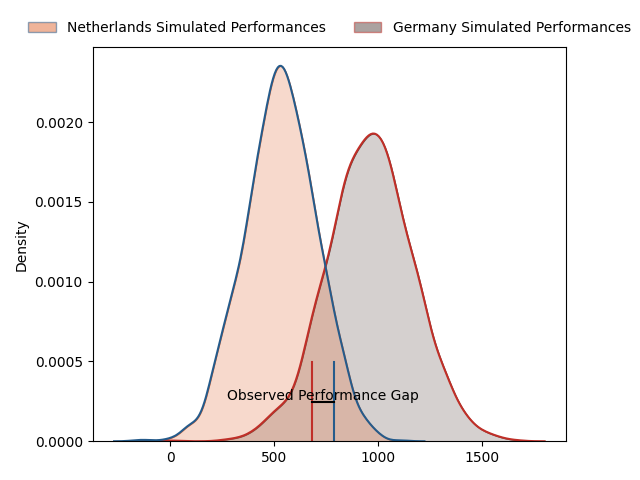
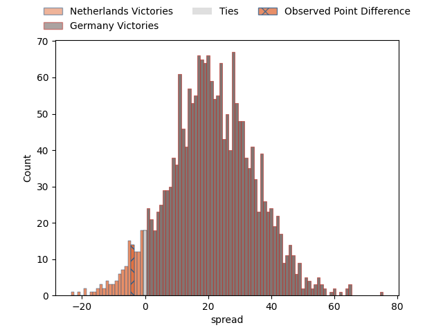
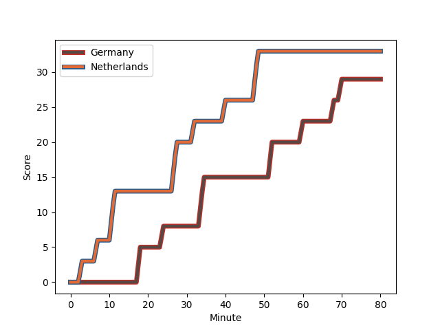
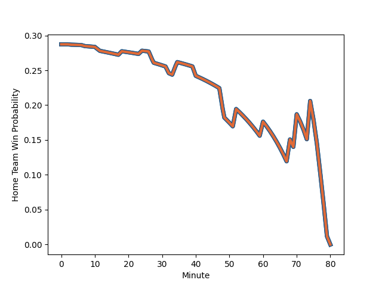

---  
layout: page  
title: Netherlands at Germany; 33-29  
date: 2023-02-18 13:15:00 18:00:00 -0500  
categories: match review  
---
# Netherlands at Germany; 33-29

# Club Level Predictions

The first set of predictions treats a club as the smallest object, as the club develops its members, organizes a gameplan, and deploys its players as needed for each match. This club model has a prediction of 0.897, which translates to predicting Germany to win by 21.4.

Each club has a rating and a rating deviation (simiar to a Glicko system), and expected performances can be generated. This allows for simulated matches and spreads like the ones below.
## Projected Performances

## Projected Spreads

## Projected Results

# Player Level Predictions

Treating teams instead as an entity made up of the currently active players, I have ratings for each player in an altogether different system. These can be combined to form team ratings once teamsheets are announced, weighting starters a bit higher than the reserves. After the match is played, players can be weighted by their minutes on the field, allowing for an accurate measure of the team's composition. With these compiled team ratings, we can make predictions, measure inaccuracy, and update the individual player ratings.
## Prediction with Player Minutes: Netherlands by 31.5

Netherlands by 35.5 on a neutral field
## Scores over Time

## Win Probability over Time

There were 10 large changes in win probability in this match
## Prediction without Player Minutes: Netherlands by 34.9

Netherlands by 38.9 on a neutral pitch

|   Away Minutes | Away Player                                                                  |   Away elo |   Away Percentile |   Number |   Home Percentile |   Home elo | Home Player                                                            |   Home Minutes |
|---------------:|:-----------------------------------------------------------------------------|-----------:|------------------:|---------:|------------------:|-----------:|:-----------------------------------------------------------------------|---------------:|
|             80 | [Hugo Langelaan](..//playerfiles//HugoLangelaan_cleaned.md)                  |      79.25 |                10 |        1 |                 2 |      66.18 | [Jörn Schroder](..//playerfiles//JörnSchroder_cleaned.md)              |             80 |
|             80 | [Hugo Langelaan](..//playerfiles//HugoLangelaan_cleaned.md)                  |      79.25 |                 7 |        1 |                 2 |      66.18 | [Jörn Schroder](..//playerfiles//JörnSchroder_cleaned.md)              |             80 |
|             80 | [Andrew Darlington](..//playerfiles//AndrewDarlington_cleaned.md)            |      68.66 |                 3 |        2 |                11 |      80.23 | [Andrew Reintges](..//playerfiles//AndrewReintges_cleaned.md)          |             80 |
|             66 | [Andrew Darlington](..//playerfiles//AndrewDarlington_cleaned.md)            |      68.66 |                 3 |        2 |                11 |      80.23 | [Andrew Reintges](..//playerfiles//AndrewReintges_cleaned.md)          |             80 |
|             80 | [Andrew Darlington](..//playerfiles//AndrewDarlington_cleaned.md)            |      68.66 |                 3 |        2 |                11 |      80.23 | [Andrew Reintges](..//playerfiles//AndrewReintges_cleaned.md)          |             45 |
|             66 | [Andrew Darlington](..//playerfiles//AndrewDarlington_cleaned.md)            |      68.66 |                 3 |        2 |                11 |      80.23 | [Andrew Reintges](..//playerfiles//AndrewReintges_cleaned.md)          |             45 |
|             80 | [Thymo Peters](..//playerfiles//ThymoPeters_cleaned.md)                      |     121.74 |                94 |        3 |                 1 |      54.39 | [Paul Weiss](..//playerfiles//PaulWeiss_cleaned.md)                    |             80 |
|             80 | [Thymo Peters](..//playerfiles//ThymoPeters_cleaned.md)                      |     121.74 |                96 |        3 |                 1 |      54.39 | [Paul Weiss](..//playerfiles//PaulWeiss_cleaned.md)                    |             45 |
|             40 | [Thymo Peters](..//playerfiles//ThymoPeters_cleaned.md)                      |     121.74 |                94 |        3 |                 1 |      54.39 | [Paul Weiss](..//playerfiles//PaulWeiss_cleaned.md)                    |             80 |
|             40 | [Thymo Peters](..//playerfiles//ThymoPeters_cleaned.md)                      |     121.74 |                96 |        3 |                 1 |      54.39 | [Paul Weiss](..//playerfiles//PaulWeiss_cleaned.md)                    |             80 |
|             80 | [Thymo Peters](..//playerfiles//ThymoPeters_cleaned.md)                      |     121.74 |                94 |        3 |                 1 |      54.39 | [Paul Weiss](..//playerfiles//PaulWeiss_cleaned.md)                    |             45 |
|             80 | [Thymo Peters](..//playerfiles//ThymoPeters_cleaned.md)                      |     121.74 |                96 |        3 |                 1 |      54.39 | [Paul Weiss](..//playerfiles//PaulWeiss_cleaned.md)                    |             80 |
|             40 | [Thymo Peters](..//playerfiles//ThymoPeters_cleaned.md)                      |     121.74 |                94 |        3 |                 1 |      54.39 | [Paul Weiss](..//playerfiles//PaulWeiss_cleaned.md)                    |             45 |
|             40 | [Thymo Peters](..//playerfiles//ThymoPeters_cleaned.md)                      |     121.74 |                96 |        3 |                 1 |      54.39 | [Paul Weiss](..//playerfiles//PaulWeiss_cleaned.md)                    |             45 |
|             80 | [Christopher van Leeuwen](..//playerfiles//ChristophervanLeeuwen_cleaned.md) |      88.18 |                28 |        4 |                 8 |      75.3  | [Michel Himmer](..//playerfiles//MichelHimmer_cleaned.md)              |             78 |
|             80 | [Christopher van Leeuwen](..//playerfiles//ChristophervanLeeuwen_cleaned.md) |      88.18 |                28 |        4 |                 8 |      75.3  | [Michel Himmer](..//playerfiles//MichelHimmer_cleaned.md)              |             80 |
|             80 | [Dennis van Dijken](..//playerfiles//DennisvanDijken_cleaned.md)             |      78.25 |                10 |        5 |                13 |      80.92 | [Sebastian Ferreira](..//playerfiles//SebastianFerreira_cleaned.md)    |             80 |
|             66 | [Dennis van Dijken](..//playerfiles//DennisvanDijken_cleaned.md)             |      78.25 |                10 |        5 |                13 |      80.92 | [Sebastian Ferreira](..//playerfiles//SebastianFerreira_cleaned.md)    |             40 |
|             80 | [Dennis van Dijken](..//playerfiles//DennisvanDijken_cleaned.md)             |      78.25 |                10 |        5 |                13 |      80.92 | [Sebastian Ferreira](..//playerfiles//SebastianFerreira_cleaned.md)    |             40 |
|             66 | [Dennis van Dijken](..//playerfiles//DennisvanDijken_cleaned.md)             |      78.25 |                10 |        5 |                13 |      80.92 | [Sebastian Ferreira](..//playerfiles//SebastianFerreira_cleaned.md)    |             80 |
|             80 | [Spike Salman](..//playerfiles//SpikeSalman_cleaned.md)                      |      91.29 |                38 |        6 |               nan |      83.9  | [Kilian Bendjaballah](..//playerfiles//KilianBendjaballah_cleaned.md)  |             80 |
|             66 | [Wolf Van Dijk](..//playerfiles//WolfVanDijk_cleaned.md)                     |      89.06 |                30 |        7 |                17 |      83.69 | [Justin Renc](..//playerfiles//JustinRenc_cleaned.md)                  |             80 |
|             80 | [Wolf Van Dijk](..//playerfiles//WolfVanDijk_cleaned.md)                     |      89.06 |                30 |        7 |                17 |      83.69 | [Justin Renc](..//playerfiles//JustinRenc_cleaned.md)                  |             80 |
|             80 | [Christopher Raymond](..//playerfiles//ChristopherRaymond_cleaned.md)        |      94.26 |                44 |        8 |                13 |      80.92 | [Oliver Stein](..//playerfiles//OliverStein_cleaned.md)                |             80 |
|             80 | [Mark Alexander Coebergh](..//playerfiles//MarkAlexanderCoebergh_cleaned.md) |     114.19 |                89 |        9 |                 0 |      50.79 | [Oliver Paine](..//playerfiles//OliverPaine_cleaned.md)                |             80 |
|             44 | [Mark Alexander Coebergh](..//playerfiles//MarkAlexanderCoebergh_cleaned.md) |     114.19 |                93 |        9 |                 0 |      50.79 | [Oliver Paine](..//playerfiles//OliverPaine_cleaned.md)                |             80 |
|             44 | [Mark Alexander Coebergh](..//playerfiles//MarkAlexanderCoebergh_cleaned.md) |     114.19 |                89 |        9 |                 0 |      50.79 | [Oliver Paine](..//playerfiles//OliverPaine_cleaned.md)                |             80 |
|             80 | [Mark Alexander Coebergh](..//playerfiles//MarkAlexanderCoebergh_cleaned.md) |     114.19 |                93 |        9 |                 0 |      50.79 | [Oliver Paine](..//playerfiles//OliverPaine_cleaned.md)                |             80 |
|             80 | [Reinhardt Fortuin](..//playerfiles//ReinhardtFortuin_cleaned.md)            |     103.43 |                73 |       10 |               nan |      95    | [Raynor Parkinson](..//playerfiles//RaynorParkinson_cleaned.md)        |             80 |
|             80 | [Reinhardt Fortuin](..//playerfiles//ReinhardtFortuin_cleaned.md)            |     103.43 |                73 |       10 |               nan |      95    | [Raynor Parkinson](..//playerfiles//RaynorParkinson_cleaned.md)        |             74 |
|             80 | [Siem Noorman](..//playerfiles//SiemNoorman_cleaned.md)                      |     117.85 |                90 |       11 |                 3 |      62.63 | [Felix Lammers](..//playerfiles//FelixLammers_cleaned.md)              |             80 |
|             80 | [Siem Noorman](..//playerfiles//SiemNoorman_cleaned.md)                      |     117.85 |                92 |       11 |                 3 |      62.63 | [Felix Lammers](..//playerfiles//FelixLammers_cleaned.md)              |             80 |
|             80 | [David Weersma](..//playerfiles//DavidWeersma_cleaned.md)                    |      81.09 |                20 |       12 |                29 |      87.01 | [Leo Wolf](..//playerfiles//LeoWolf_cleaned.md)                        |             80 |
|             80 | [David Weersma](..//playerfiles//DavidWeersma_cleaned.md)                    |      81.09 |                13 |       12 |                29 |      87.01 | [Leo Wolf](..//playerfiles//LeoWolf_cleaned.md)                        |             80 |
|             72 | [David Weersma](..//playerfiles//DavidWeersma_cleaned.md)                    |      81.09 |                20 |       12 |                29 |      87.01 | [Leo Wolf](..//playerfiles//LeoWolf_cleaned.md)                        |             80 |
|             72 | [David Weersma](..//playerfiles//DavidWeersma_cleaned.md)                    |      81.09 |                13 |       12 |                29 |      87.01 | [Leo Wolf](..//playerfiles//LeoWolf_cleaned.md)                        |             80 |
|             80 | [Oliva Sialau](..//playerfiles//OlivaSialau_cleaned.md)                      |      73.3  |                 6 |       13 |                 6 |      73.56 | [Sebastian Rodwell](..//playerfiles//SebastianRodwell_cleaned.md)      |             80 |
|             80 | [Leroy van Dam](..//playerfiles//LeroyvanDam_cleaned.md)                     |     110.78 |                85 |       14 |                18 |      80.92 | [Zinzan Henrick Hees](..//playerfiles//ZinzanHenrickHees_cleaned.md)   |             80 |
|             80 | [Te Hauora Campbell](..//playerfiles//TeHauoraCampbell_cleaned.md)           |      46.01 |                 0 |       15 |                 7 |      76.11 | [Eduardo Stella](..//playerfiles//EduardoStella_cleaned.md)            |             80 |
|             26 | [David Anderson](..//playerfiles//DavidAnderson_cleaned.md)                  |      95    |               nan |       16 |               nan |      90.02 | [Mathis Blume](..//playerfiles//MathisBlume_cleaned.md)                |             35 |
|             36 | [Rik van Balkom](..//playerfiles//RikvanBalkom_cleaned.md)                   |      96.37 |                45 |       17 |               nan |      79.13 | [Elias Ezequiel Haase](..//playerfiles//EliasEzequielHaase_cleaned.md) |             35 |
|             14 | [Lars Linnenbank](..//playerfiles//LarsLinnenbank_cleaned.md)                |      96.54 |               nan |       18 |               nan |      93.66 | [Michael McDonald](..//playerfiles//MichaelMcDonald_cleaned.md)        |              6 |
|             14 | [Jim Boelrijk](..//playerfiles//JimBoelrijk_cleaned.md)                      |      78.77 |                14 |       19 |               nan |      93.7  | [Tyrell Williams](..//playerfiles//TyrellWilliams_cleaned.md)          |              2 |
|             14 | [Odin Ruijgrok](..//playerfiles//OdinRuijgrok_cleaned.md)                    |      95.15 |               nan |       20 |               nan |      95    | [Nicolas Rinklin](..//playerfiles//NicolasRinklin_cleaned.md)          |             40 |
|             14 | [Dave Koelman](..//playerfiles//DaveKoelman_cleaned.md)                      |      86.7  |                18 |       21 |               nan |     nan    | nan                                                                    |            nan |
|              8 | [Daily Owen Limmen](..//playerfiles//DailyOwenLimmen_cleaned.md)             |      98    |                59 |       22 |               nan |     nan    | nan                                                                    |            nan |

