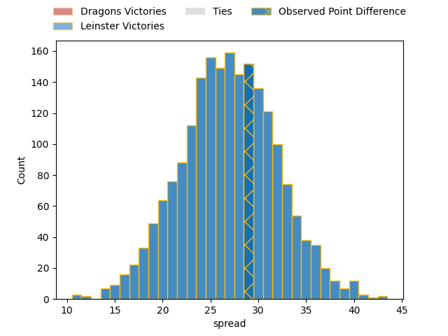
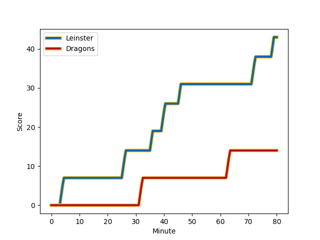

---  
layout: page  
title: Dragons at Leinster; 14-43  
date: 2023-02-18 20:35:00 18:00:00 -0500  
categories: match review  
---
# Dragons at Leinster; 14-43

# Club Level Predictions

The first set of predictions treats a club as the smallest object, as the club develops its members, organizes a gameplan, and deploys its players as needed for each match. This club model has a prediction of 0.954, which translates to predicting Leinster to win by 26.8.

Each club has a rating and a rating deviation (simiar to a Glicko system), and expected performances can be generated. This allows for simulated matches and spreads like the ones below.
## Projected Performances

## Projected Spreads

## Projected Results

# Player Level Predictions

Treating teams instead as an entity made up of the currently active players, I have ratings for each player in an altogether different system. These can be combined to form team ratings once teamsheets are announced, weighting starters a bit higher than the reserves. After the match is played, players can be weighted by their minutes on the field, allowing for an accurate measure of the team's composition. With these compiled team ratings, we can make predictions, measure inaccuracy, and update the individual player ratings.
## Prediction with Player Minutes: Leinster by 30.5

Leinster by 26.5 on a neutral field
## Scores over Time

## Win Probability over Time

There were 3 large changes in win probability in this match
## Prediction without Player Minutes: Leinster by 31.6

Leinster by 27.6 on a neutral pitch

|   Away Minutes | Away Player                                                                          |   Away elo |   Away Percentile |   Number |   Home Percentile |   Home elo | Home Player                                                            |   Home Minutes |
|---------------:|:-------------------------------------------------------------------------------------|-----------:|------------------:|---------:|------------------:|-----------:|:-----------------------------------------------------------------------|---------------:|
|             53 | [Rhodri Jones](..//playerfiles//RhodriJones_cleaned.md)                              |      93.37 |                44 |        1 |                79 |     103.84 | [Michael Milne](..//playerfiles//MichaelMilne_cleaned.md)              |             54 |
|             64 | [Brodie Coghlan](..//playerfiles//BrodieCoghlan_cleaned.md)                          |      88.66 |                30 |        2 |                68 |      99.9  | [John McKee](..//playerfiles//JohnMcKee_cleaned.md)                    |             54 |
|             57 | [Lloyd Fairbrother](..//playerfiles//LloydFairbrother_cleaned.md)                    |      85.89 |                19 |        3 |                87 |     108.73 | [Michael Ala'alatoa](..//playerfiles//MichaelAla'alatoa_cleaned.md)    |             54 |
|             80 | [Matthew Screech](..//playerfiles//MatthewScreech_cleaned.md)                        |      87.36 |                26 |        4 |                95 |     123.28 | [Ross Molony](..//playerfiles//RossMolony_cleaned.md)                  |             55 |
|             80 | [Ben Carter](..//playerfiles//BenCarter_cleaned.md)                                  |      92.96 |                44 |        5 |                76 |     105.06 | [Brian Deeny](..//playerfiles//BrianDeeny_cleaned.md)                  |             80 |
|             55 | [Ben Fry](..//playerfiles//BenFry_cleaned.md)                                        |      86.02 |                37 |        6 |                85 |     110.68 | [Rhys Ruddock](..//playerfiles//RhysRuddock_cleaned.md)                |             80 |
|             80 | [Taine Basham](..//playerfiles//TaineBasham_cleaned.md)                              |      85.09 |                20 |        7 |                87 |     112.95 | [Scott Penny](..//playerfiles//ScottPenny_cleaned.md)                  |             61 |
|             70 | [Ross Moriarty](..//playerfiles//RossMoriarty_cleaned.md)                            |      91.5  |                36 |        8 |                87 |     113.25 | [Max Deegan](..//playerfiles//MaxDeegan_cleaned.md)                    |             80 |
|             66 | [Rhodri Williams](..//playerfiles//RhodriWilliams_cleaned.md)                        |      94.17 |                48 |        9 |                90 |     111.23 | [Luke McGrath](..//playerfiles//LukeMcGrath_cleaned.md)                |             54 |
|             80 | [Will Reed](..//playerfiles//WillReed_cleaned.md)                                    |      98.76 |                59 |       10 |                83 |     108.62 | [Harry Byrne](..//playerfiles//HarryByrne_cleaned.md)                  |             70 |
|             80 | [Ashton Hewitt](..//playerfiles//AshtonHewitt_cleaned.md)                            |      89.83 |                34 |       11 |                81 |     106.86 | [Dave Kearney](..//playerfiles//DaveKearney_cleaned.md)                |             80 |
|             40 | [Jack Dixon](..//playerfiles//JackDixon_cleaned.md)                                  |      88.97 |                31 |       12 |                80 |     107.01 | [Jamie Osborne](..//playerfiles//JamieOsborne_cleaned.md)              |             80 |
|             80 | [Steffan Hughes](..//playerfiles//SteffanHughes_cleaned.md)                          |      91.65 |                47 |       13 |                83 |     109.1  | [Liam Turner](..//playerfiles//LiamTurner_cleaned.md)                  |             80 |
|             45 | [Patelesio Fatuloa Tomkinson](..//playerfiles//PatelesioFatuloaTomkinson_cleaned.md) |      76.93 |                 9 |       14 |                89 |     113.84 | [Jordan Larmour](..//playerfiles//JordanLarmour_cleaned.md)            |             55 |
|             80 | [Angus O'Brien](..//playerfiles//AngusO'Brien_cleaned.md)                            |      99    |                60 |       15 |                88 |     112.76 | [Jimmy O'Brien](..//playerfiles//JimmyO'Brien_cleaned.md)              |             80 |
|             40 | [Jordan Williams](..//playerfiles//JordanWilliams_cleaned.md)                        |      86.29 |                27 |       16 |                56 |      99.94 | [Nick McCarthy](..//playerfiles//NickMcCarthy_cleaned.md)              |             26 |
|             35 | [JJ Hanrahan](..//playerfiles//JJHanrahan_cleaned.md)                                |      90.97 |                37 |       17 |               nan |      95    | [Lee Barron](..//playerfiles//LeeBarron_cleaned.md)                    |             26 |
|             27 | [Aki Seiuli](..//playerfiles//AkiSeiuli_cleaned.md)                                  |      85.19 |                29 |       18 |               nan |      95    | [Jack Boyle](..//playerfiles//JackBoyle_cleaned.md)                    |             26 |
|             25 | [Sean Lonsdale](..//playerfiles//SeanLonsdale_cleaned.md)                            |      90.15 |                34 |       19 |                66 |     101.07 | [Tom Clarkson](..//playerfiles//TomClarkson_cleaned.md)                |             26 |
|             23 | [Christian Coleman](..//playerfiles//ChristianColeman_cleaned.md)                    |      94.75 |                56 |       20 |                76 |     107.07 | [Rob Russell](..//playerfiles//RobRussell_cleaned.md)                  |             25 |
|             16 | [James Benjamin](..//playerfiles//JamesBenjamin_cleaned.md)                          |      91.47 |                38 |       21 |                57 |      97.17 | [Jason Howell Jenkins](..//playerfiles//JasonHowellJenkins_cleaned.md) |             25 |
|             14 | [Lewis Jones](..//playerfiles//LewisJones_cleaned.md)                                |      86.59 |                26 |       22 |               nan |      96.24 | [Will Connors](..//playerfiles//WillConnors_cleaned.md)                |             19 |
|             10 | [Ryan Woodman](..//playerfiles//RyanWoodman_cleaned.md)                              |      94.23 |               nan |       23 |               nan |      95.46 | [Charlie Tector](..//playerfiles//CharlieTector_cleaned.md)            |             10 |

