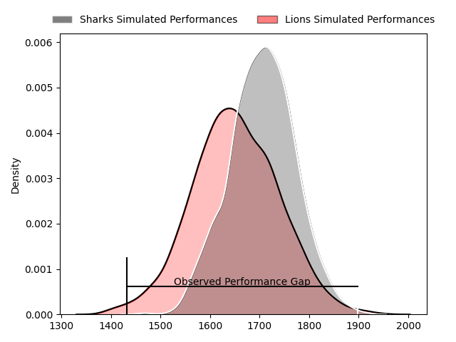
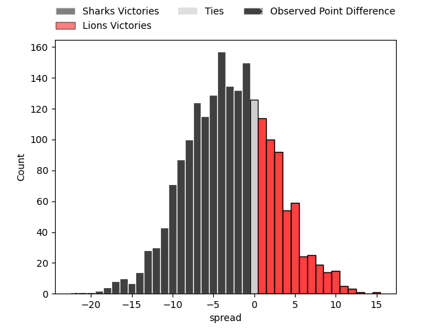
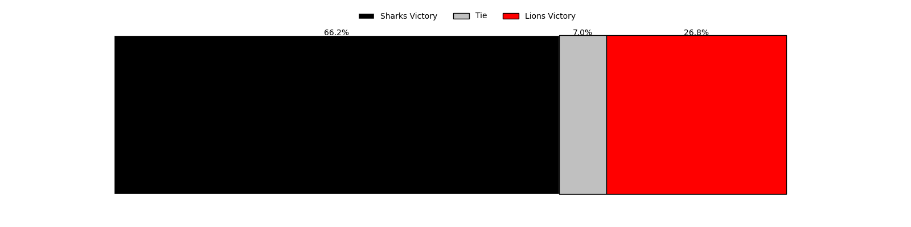
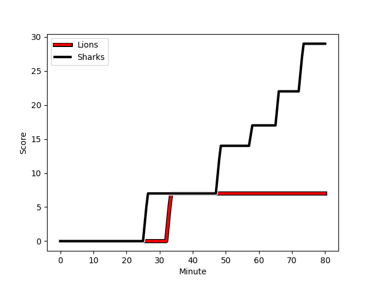
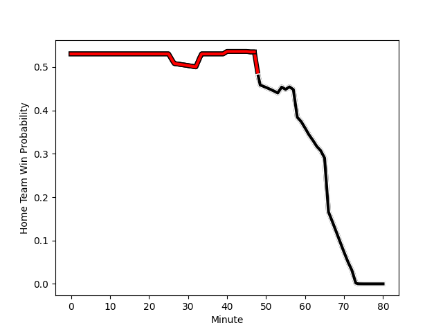

---  
layout: page  
title: Sharks at Lions; 29-7  
date: 2023-02-18 14:00:00 18:00:00 -0500  
categories: match review  
---
# Sharks at Lions; 29-7

# Club Level Predictions

The first set of predictions treats a club as the smallest object, as the club develops its members, organizes a gameplan, and deploys its players as needed for each match. This club model has a prediction of 0.425, which translates to predicting Sharks to win by 2.7.

Each club has a rating and a rating deviation (simiar to a Glicko system), and expected performances can be generated. This allows for simulated matches and spreads like the ones below.
## Projected Performances

## Projected Spreads

## Projected Results

# Player Level Predictions

Treating teams instead as an entity made up of the currently active players, I have ratings for each player in an altogether different system. These can be combined to form team ratings once teamsheets are announced, weighting starters a bit higher than the reserves. After the match is played, players can be weighted by their minutes on the field, allowing for an accurate measure of the team's composition. With these compiled team ratings, we can make predictions, measure inaccuracy, and update the individual player ratings.
## Prediction with Player Minutes: Lions by 7.8

Lions by 3.8 on a neutral field
## Scores over Time

## Win Probability over Time

There were 4 large changes in win probability in this match
## Prediction without Player Minutes: Lions by 7.5

Lions by 3.5 on a neutral pitch

|   Away Minutes | Away Player                                                                             |   Away elo |   Away Percentile |   Number |   Home Percentile |   Home elo | Home Player                                                                         |   Home Minutes |
|---------------:|:----------------------------------------------------------------------------------------|-----------:|------------------:|---------:|------------------:|-----------:|:------------------------------------------------------------------------------------|---------------:|
|             61 | [Ntuthuko Mchunu](..//playerfiles//NtuthukoMchunu_cleaned.md)                           |      82.33 |                13 |        1 |                47 |      94.28 | [Jean-Pierre Smith](..//playerfiles//Jean-PierreSmith_cleaned.md)                   |             64 |
|             61 | [Ntuthuko Mchunu](..//playerfiles//NtuthukoMchunu_cleaned.md)                           |      82.33 |                33 |        1 |                47 |      94.28 | [Jean-Pierre Smith](..//playerfiles//Jean-PierreSmith_cleaned.md)                   |             64 |
|             60 | [Daniel Viljoen Jooste](..//playerfiles//DanielViljoenJooste_cleaned.md)                |      92.38 |                56 |        2 |                32 |      89.54 | [PJ Botha](..//playerfiles//PJBotha_cleaned.md)                                     |             40 |
|             60 | [Carlu Johann Sadie](..//playerfiles//CarluJohannSadie_cleaned.md)                      |      92.16 |                39 |        3 |                 4 |      70.34 | [Asenathi Ntlabakanye](..//playerfiles//AsenathiNtlabakanye_cleaned.md)             |             56 |
|             60 | [Carlu Johann Sadie](..//playerfiles//CarluJohannSadie_cleaned.md)                      |      92.16 |                68 |        3 |                 4 |      70.34 | [Asenathi Ntlabakanye](..//playerfiles//AsenathiNtlabakanye_cleaned.md)             |             56 |
|             80 | [Daniel Pieter (Reniel) Hugo](..//playerfiles//DanielPieter(Reniel)Hugo_cleaned.md)     |      86.45 |                34 |        4 |                48 |      94.12 | [Willem Alberts](..//playerfiles//WillemAlberts_cleaned.md)                         |             58 |
|             48 | [Douw Gerbrandt Grobler](..//playerfiles//DouwGerbrandtGrobler_cleaned.md)              |     104.43 |                74 |        5 |                56 |      96.68 | [Ruben (Hobo) Schoeman](..//playerfiles//Ruben(Hobo)Schoeman_cleaned.md)            |             72 |
|             74 | [James Venter](..//playerfiles//JamesVenter_cleaned.md)                                 |      76.72 |                 8 |        6 |                86 |     110.22 | [Jacobus Albertus Kriel](..//playerfiles//JacobusAlbertusKriel_cleaned.md)          |             58 |
|             56 | [Hendrik Petrus (Henco) Venter](..//playerfiles//HendrikPetrus(Henco)Venter_cleaned.md) |      78.24 |                10 |        7 |                40 |      91.92 | [Ruan Venter](..//playerfiles//RuanVenter_cleaned.md)                               |             80 |
|             80 | [Phendulani Buthelezi](..//playerfiles//PhendulaniButhelezi_cleaned.md)                 |      95.69 |                49 |        8 |                57 |      98.08 | [Emmanuel Tshituka](..//playerfiles//EmmanuelTshituka_cleaned.md)                   |             80 |
|             80 | [Phendulani Buthelezi](..//playerfiles//PhendulaniButhelezi_cleaned.md)                 |      95.69 |                71 |        8 |                57 |      98.08 | [Emmanuel Tshituka](..//playerfiles//EmmanuelTshituka_cleaned.md)                   |             80 |
|             80 | [Grant Williams](..//playerfiles//GrantWilliams_cleaned.md)                             |      98.83 |                62 |        9 |                13 |      79.92 | [Morne Van den Berg](..//playerfiles//MorneVandenBerg_cleaned.md)                   |             54 |
|             80 | [Curwin Dominique Bosch](..//playerfiles//CurwinDominiqueBosch_cleaned.md)              |     104.9  |                76 |       10 |                57 |      97.97 | [Gianni Dean Lombard](..//playerfiles//GianniDeanLombard_cleaned.md)                |             80 |
|             80 | [Thaakir Abrahams](..//playerfiles//ThaakirAbrahams_cleaned.md)                         |      69.82 |                11 |       11 |                55 |      96.77 | [Edwill Charl van der Merwe](..//playerfiles//EdwillCharlvanderMerwe_cleaned.md)    |             80 |
|             80 | [Thaakir Abrahams](..//playerfiles//ThaakirAbrahams_cleaned.md)                         |      69.82 |                 6 |       11 |                55 |      96.77 | [Edwill Charl van der Merwe](..//playerfiles//EdwillCharlvanderMerwe_cleaned.md)    |             80 |
|             80 | [Rohan Janse van Rensburg](..//playerfiles//RohanJansevanRensburg_cleaned.md)           |      91.86 |                41 |       12 |                57 |      97.43 | [Marius Louw](..//playerfiles//MariusLouw_cleaned.md)                               |             71 |
|             46 | [François Venter](..//playerfiles//FrançoisVenter_cleaned.md)                           |     105.69 |                79 |       13 |               nan |      89.38 | [Manuel Johern (Mannie) Rass](..//playerfiles//ManuelJohern(Mannie)Rass_cleaned.md) |             80 |
|             80 | [Werner Kok](..//playerfiles//WernerKok_cleaned.md)                                     |     112.21 |                87 |       14 |                51 |      95.26 | [Sibahle Ndiphiwe Maxwane](..//playerfiles//SibahleNdiphiweMaxwane_cleaned.md)      |             80 |
|             54 | [Aphelele Onke Okuhle Fassi](..//playerfiles//ApheleleOnkeOkuhleFassi_cleaned.md)       |      76.3  |                12 |       15 |                57 |      98.71 | [Quan Horn](..//playerfiles//QuanHorn_cleaned.md)                                   |             80 |
|             34 | [Sikhumbuzo Notshe](..//playerfiles//SikhumbuzoNotshe_cleaned.md)                       |     104.76 |                88 |       16 |                73 |     100.61 | [Michael Thomas van Vuuren](..//playerfiles//MichaelThomasvanVuuren_cleaned.md)     |             40 |
|             32 | [Vincent Tshikaya Tshituka](..//playerfiles//VincentTshikayaTshituka_cleaned.md)        |     113.2  |                87 |       17 |                57 |      97.36 | [Sanele Nohamba](..//playerfiles//SaneleNohamba_cleaned.md)                         |             26 |
|             26 | [Cameron Robin Wright](..//playerfiles//CameronRobinWright_cleaned.md)                  |      74.23 |                 7 |       18 |                64 |      99    | [Ruan Martin Dreyer](..//playerfiles//RuanMartinDreyer_cleaned.md)                  |             24 |
|             26 | [Cameron Robin Wright](..//playerfiles//CameronRobinWright_cleaned.md)                  |      74.23 |                16 |       18 |                64 |      99    | [Ruan Martin Dreyer](..//playerfiles//RuanMartinDreyer_cleaned.md)                  |             24 |
|             20 | [Fezokuhle Mbatha](..//playerfiles//FezokuhleMbatha_cleaned.md)                         |      91.03 |                38 |       19 |                33 |      90.07 | [Ruhan Straeuli](..//playerfiles//RuhanStraeuli_cleaned.md)                         |             22 |
|             20 | [Hanro Jacobs](..//playerfiles//HanroJacobs_cleaned.md)                                 |      94.12 |               nan |       20 |                35 |      90.76 | [Sibusiso Sangweni](..//playerfiles//SibusisoSangweni_cleaned.md)                   |             22 |
|             24 | [Dylan Richardson](..//playerfiles//DylanRichardson_cleaned.md)                         |      95    |               nan |       21 |               nan |     103.1  | [Morgan Naude](..//playerfiles//MorganNaude_cleaned.md)                             |             16 |
|              6 | [Ben Tapuai](..//playerfiles//BenTapuai_cleaned.md)                                     |      90.15 |                35 |       22 |                58 |      97.84 | [Rynardt Jonker](..//playerfiles//RynardtJonker_cleaned.md)                         |              9 |
|              6 | [Ben Tapuai](..//playerfiles//BenTapuai_cleaned.md)                                     |      90.15 |                60 |       22 |                58 |      97.84 | [Rynardt Jonker](..//playerfiles//RynardtJonker_cleaned.md)                         |              9 |
|             19 | [Dian Bleuler](..//playerfiles//DianBleuler_cleaned.md)                                 |      88.82 |                29 |       23 |                62 |      99.14 | [Ruan Delport](..//playerfiles//RuanDelport_cleaned.md)                             |              8 |

