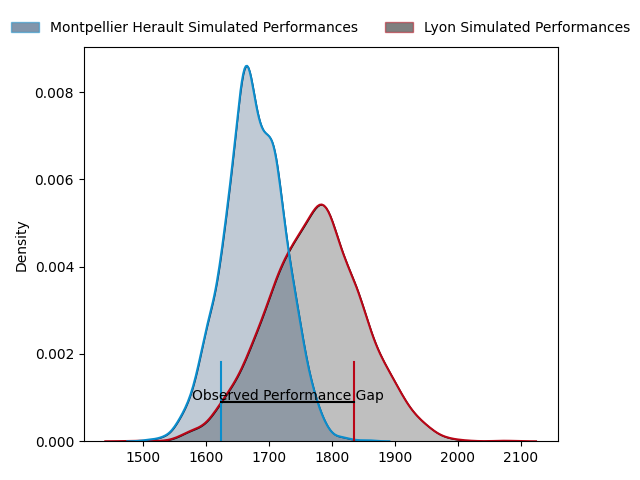
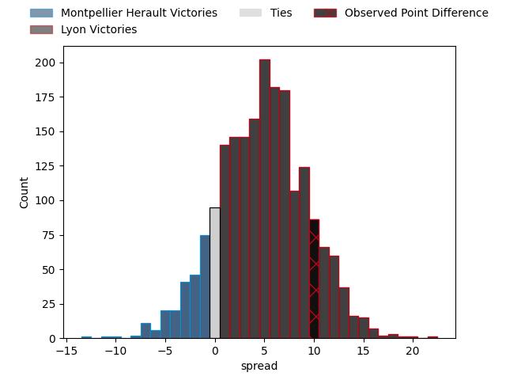
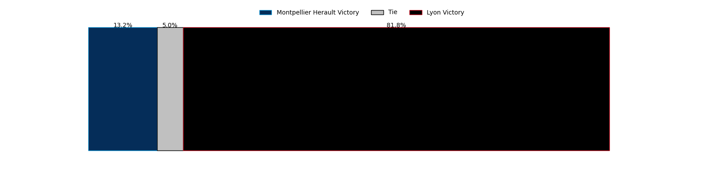
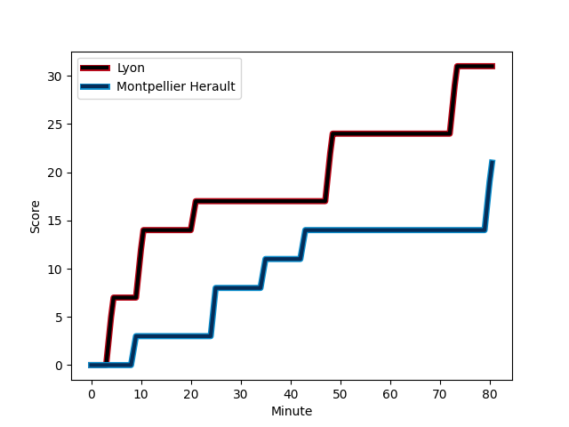
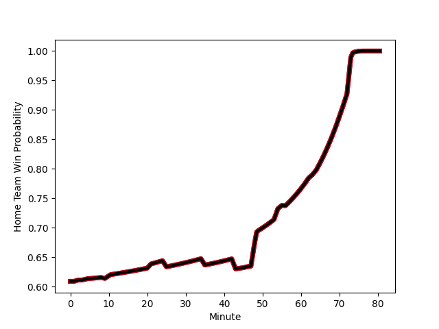

---  
layout: page  
title: Montpellier Herault at Lyon; 21-31  
date: 2023-02-18 17:00:00 18:00:00 -0500  
categories: match review  
---
# Montpellier Herault at Lyon; 21-31

# Club Level Predictions

The first set of predictions treats a club as the smallest object, as the club develops its members, organizes a gameplan, and deploys its players as needed for each match. This club model has a prediction of 0.628, which translates to predicting Lyon to win by 4.6.

Each club has a rating and a rating deviation (simiar to a Glicko system), and expected performances can be generated. This allows for simulated matches and spreads like the ones below.
## Projected Performances

## Projected Spreads

## Projected Results

# Player Level Predictions

Treating teams instead as an entity made up of the currently active players, I have ratings for each player in an altogether different system. These can be combined to form team ratings once teamsheets are announced, weighting starters a bit higher than the reserves. After the match is played, players can be weighted by their minutes on the field, allowing for an accurate measure of the team's composition. With these compiled team ratings, we can make predictions, measure inaccuracy, and update the individual player ratings.
## Prediction with Player Minutes: Lyon by 24.6

Lyon by 20.6 on a neutral field
## Scores over Time

## Win Probability over Time

There were 2 large changes in win probability in this match
## Prediction without Player Minutes: Lyon by 22.8

Lyon by 18.8 on a neutral pitch

|   Away Minutes | Away Player                                                                                        |   Away elo |   Away Percentile |   Number |   Home Percentile |   Home elo | Home Player                                                                      |   Home Minutes |
|---------------:|:---------------------------------------------------------------------------------------------------|-----------:|------------------:|---------:|------------------:|-----------:|:---------------------------------------------------------------------------------|---------------:|
|             49 | [Enzo Forletta](..//playerfiles//EnzoForletta_cleaned.md)                                          |      96.76 |                57 |        1 |                71 |     101.21 | [Sébastien Taofifenua](..//playerfiles//SébastienTaofifenua_cleaned.md)          |             63 |
|             80 | [Brandon Paenga-Amosa](..//playerfiles//BrandonPaenga-Amosa_cleaned.md)                            |      88.06 |                28 |        2 |                86 |     108.33 | [Guillaume Marchand](..//playerfiles//GuillaumeMarchand_cleaned.md)              |             56 |
|             49 | [Mohamed Haouas](..//playerfiles//MohamedHaouas_cleaned.md)                                        |      96.2  |                54 |        3 |                75 |     102.56 | [Demba Bamba](..//playerfiles//DembaBamba_cleaned.md)                            |             56 |
|             80 | [Elliott Stooke](..//playerfiles//ElliottStooke_cleaned.md)                                        |      88.95 |                31 |        4 |                61 |      98.2  | [Théo William](..//playerfiles//ThéoWilliam_cleaned.md)                          |             54 |
|             46 | [Tyler Evan Duguid](..//playerfiles//TylerEvanDuguid_cleaned.md)                                   |      93.19 |               nan |        5 |                91 |     115.21 | [Temo Sukayawa Mayanavanua](..//playerfiles//TemoSukayawaMayanavanua_cleaned.md) |             80 |
|             80 | [Nicolaas Jacobus Janse van Rensburg](..//playerfiles//NicolaasJacobusJansevanRensburg_cleaned.md) |      89.12 |                31 |        6 |                91 |     117    | [Dylan Cretin](..//playerfiles//DylanCretin_cleaned.md)                          |             80 |
|             64 | [Alexandre Bécognée](..//playerfiles//AlexandreBécognée_cleaned.md)                                |      97.48 |                56 |        7 |                74 |     109.01 | [Mickael Guillard](..//playerfiles//MickaelGuillard_cleaned.md)                  |             75 |
|              2 | [Zach Mercer](..//playerfiles//ZachMercer_cleaned.md)                                              |      91.51 |                36 |        8 |                59 |      99.18 | [Arno Botha](..//playerfiles//ArnoBotha_cleaned.md)                              |             49 |
|             73 | [Jacobus Meyer Reinach](..//playerfiles//JacobusMeyerReinach_cleaned.md)                           |      91.89 |                41 |        9 |                37 |      91.24 | [Baptiste Couilloud](..//playerfiles//BaptisteCouilloud_cleaned.md)              |             54 |
|             49 | [Louis Carbonel](..//playerfiles//LouisCarbonel_cleaned.md)                                        |      95.1  |                47 |       10 |                58 |      98.76 | [Léo Berdeu](..//playerfiles//LéoBerdeu_cleaned.md)                              |             80 |
|             80 | [George Bridge](..//playerfiles//GeorgeBridge_cleaned.md)                                          |      87.13 |                25 |       11 |                65 |     100.08 | [Noa Nakaitaci](..//playerfiles//NoaNakaitaci_cleaned.md)                        |             63 |
|             71 | [Jan Lodewyk Serfontein](..//playerfiles//JanLodewykSerfontein_cleaned.md)                         |      92.21 |                42 |       12 |                91 |     116.07 | [Josua Tuisova](..//playerfiles//JosuaTuisova_cleaned.md)                        |             80 |
|             80 | [Thomas Darmon](..//playerfiles//ThomasDarmon_cleaned.md)                                          |      92.02 |                42 |       13 |                88 |     113.34 | [Josiah Maraku](..//playerfiles//JosiahMaraku_cleaned.md)                        |             80 |
|             80 | [Julien Tisseron](..//playerfiles//JulienTisseron_cleaned.md)                                      |     106.75 |                80 |       14 |                79 |     106.35 | [Tavite Veredamu](..//playerfiles//TaviteVeredamu_cleaned.md)                    |             80 |
|             80 | [Anthony Bouthier](..//playerfiles//AnthonyBouthier_cleaned.md)                                    |      75.27 |                11 |       15 |                71 |     104.39 | [Toby Arnold](..//playerfiles//TobyArnold_cleaned.md)                            |             80 |
|             78 | [Masivesi Dakuwaqa](..//playerfiles//MasivesiDakuwaqa_cleaned.md)                                  |      89.42 |                32 |       16 |               nan |     101.85 | [Loann Goujon](..//playerfiles//LoannGoujon_cleaned.md)                          |             31 |
|             34 | [Bastien Chalureau](..//playerfiles//BastienChalureau_cleaned.md)                                  |      98.14 |                60 |       17 |                92 |     113.68 | [Jean-Marc Doussain](..//playerfiles//Jean-MarcDoussain_cleaned.md)              |             26 |
|             31 | [Titi Lamositele](..//playerfiles//TitiLamositele_cleaned.md)                                      |      93.02 |                42 |       18 |                55 |      97.29 | [Joel Kpoku](..//playerfiles//JoelKpoku_cleaned.md)                              |             26 |
|             31 | [Grégory Fichten](..//playerfiles//GrégoryFichten_cleaned.md)                                      |      93.46 |               nan |       19 |                40 |      99.31 | [Paulo Tafili](..//playerfiles//PauloTafili_cleaned.md)                          |             24 |
|             31 | [Paolo Garbisi](..//playerfiles//PaoloGarbisi_cleaned.md)                                          |      92.88 |                43 |       20 |                58 |     102.08 | [Liam Coltman](..//playerfiles//LiamColtman_cleaned.md)                          |             24 |
|             16 | [Curtis Langdon](..//playerfiles//CurtisLangdon_cleaned.md)                                        |      94.35 |                54 |       21 |               nan |      95.7  | [Lima Sopoaga](..//playerfiles//LimaSopoaga_cleaned.md)                          |             17 |
|              9 | [Pierre Lucas](..//playerfiles//PierreLucas_cleaned.md)                                            |      86.53 |                35 |       22 |               nan |      95    | [Vivien Devisme](..//playerfiles//VivienDevisme_cleaned.md)                      |             17 |
|              7 | [Aubin Eymeri](..//playerfiles//AubinEymeri_cleaned.md)                                            |      95.61 |                53 |       23 |               nan |      95    | [Marvin Okuya](..//playerfiles//MarvinOkuya_cleaned.md)                          |              5 |

