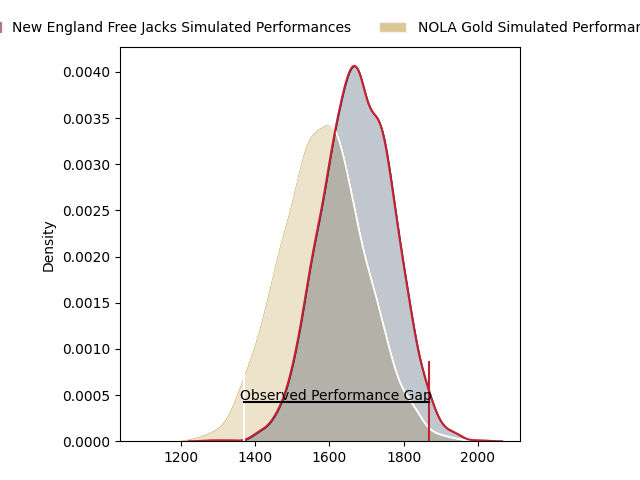
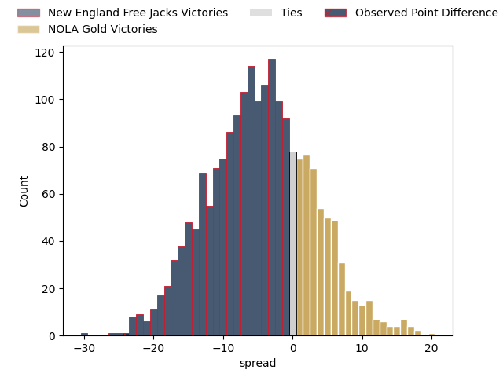
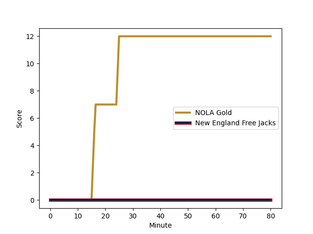
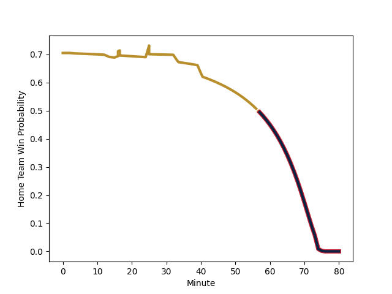

---  
layout: page  
title: New England Free Jacks at NOLA Gold; 36-12  
date: 2023-02-18 02:00:00 18:00:00 -0500  
categories: match review  
---
# New England Free Jacks at NOLA Gold; 36-12

# Club Level Predictions

The first set of predictions treats a club as the smallest object, as the club develops its members, organizes a gameplan, and deploys its players as needed for each match. This club model has a prediction of 0.377, which translates to predicting New England Free Jacks to win by 4.6.

Each club has a rating and a rating deviation (simiar to a Glicko system), and expected performances can be generated. This allows for simulated matches and spreads like the ones below.
## Projected Performances

## Projected Spreads

## Projected Results

# Player Level Predictions

Treating teams instead as an entity made up of the currently active players, I have ratings for each player in an altogether different system. These can be combined to form team ratings once teamsheets are announced, weighting starters a bit higher than the reserves. After the match is played, players can be weighted by their minutes on the field, allowing for an accurate measure of the team's composition. With these compiled team ratings, we can make predictions, measure inaccuracy, and update the individual player ratings.
## Prediction with Player Minutes: NOLA Gold by 41.8

NOLA Gold by 37.8 on a neutral field
## Scores over Time

## Win Probability over Time

There were 13 large changes in win probability in this match
## Prediction without Player Minutes: NOLA Gold by 38.3

NOLA Gold by 34.3 on a neutral pitch

|   Away Minutes | Away Player                                                         |   Away elo |   Away Percentile |   Number |   Home Percentile |   Home elo | Home Player                                                                                                 |   Home Minutes |
|---------------:|:--------------------------------------------------------------------|-----------:|------------------:|---------:|------------------:|-----------:|:------------------------------------------------------------------------------------------------------------|---------------:|
|             80 | [Kyle Ciquera](..//playerfiles//KyleCiquera_cleaned.md)             |      55.19 |                 1 |        1 |                96 |     120.73 | [Kevin Sullivan](..//playerfiles//KevinSullivan_cleaned.md)                                                 |             55 |
|             59 | [Kyle Ciquera](..//playerfiles//KyleCiquera_cleaned.md)             |      55.19 |                 4 |        1 |                96 |     120.73 | [Kevin Sullivan](..//playerfiles//KevinSullivan_cleaned.md)                                                 |             55 |
|             59 | [Kyle Ciquera](..//playerfiles//KyleCiquera_cleaned.md)             |      55.19 |                 1 |        1 |                96 |     120.73 | [Kevin Sullivan](..//playerfiles//KevinSullivan_cleaned.md)                                                 |             55 |
|             80 | [Kyle Ciquera](..//playerfiles//KyleCiquera_cleaned.md)             |      55.19 |                 4 |        1 |                96 |     120.73 | [Kevin Sullivan](..//playerfiles//KevinSullivan_cleaned.md)                                                 |             55 |
|             80 | [Kyle Ciquera](..//playerfiles//KyleCiquera_cleaned.md)             |      55.19 |                 1 |        1 |                96 |     120.73 | [Kevin Sullivan](..//playerfiles//KevinSullivan_cleaned.md)                                                 |             80 |
|             59 | [Kyle Ciquera](..//playerfiles//KyleCiquera_cleaned.md)             |      55.19 |                 4 |        1 |                96 |     120.73 | [Kevin Sullivan](..//playerfiles//KevinSullivan_cleaned.md)                                                 |             80 |
|             59 | [Kyle Ciquera](..//playerfiles//KyleCiquera_cleaned.md)             |      55.19 |                 1 |        1 |                96 |     120.73 | [Kevin Sullivan](..//playerfiles//KevinSullivan_cleaned.md)                                                 |             80 |
|             80 | [Kyle Ciquera](..//playerfiles//KyleCiquera_cleaned.md)             |      55.19 |                 4 |        1 |                96 |     120.73 | [Kevin Sullivan](..//playerfiles//KevinSullivan_cleaned.md)                                                 |             80 |
|             80 | [Millenium Sanerivi](..//playerfiles//MilleniumSanerivi_cleaned.md) |      95    |               nan |        2 |                 9 |      78.77 | [Pat O'Toole](..//playerfiles//PatO'Toole_cleaned.md)                                                       |             80 |
|             59 | [Millenium Sanerivi](..//playerfiles//MilleniumSanerivi_cleaned.md) |      95    |               nan |        2 |                 9 |      78.77 | [Pat O'Toole](..//playerfiles//PatO'Toole_cleaned.md)                                                       |             80 |
|             80 | [Millenium Sanerivi](..//playerfiles//MilleniumSanerivi_cleaned.md) |      95    |               nan |        2 |                 9 |      78.77 | [Pat O'Toole](..//playerfiles//PatO'Toole_cleaned.md)                                                       |             60 |
|             59 | [Millenium Sanerivi](..//playerfiles//MilleniumSanerivi_cleaned.md) |      95    |               nan |        2 |                 9 |      78.77 | [Pat O'Toole](..//playerfiles//PatO'Toole_cleaned.md)                                                       |             60 |
|             80 | [Cole Keith](..//playerfiles//ColeKeith_cleaned.md)                 |      95    |               nan |        3 |               nan |      95    | [Jarred Adams](..//playerfiles//JarredAdams_cleaned.md)                                                     |             80 |
|             59 | [Cole Keith](..//playerfiles//ColeKeith_cleaned.md)                 |      95    |               nan |        3 |               nan |      95    | [Jarred Adams](..//playerfiles//JarredAdams_cleaned.md)                                                     |             80 |
|             80 | [Cole Keith](..//playerfiles//ColeKeith_cleaned.md)                 |      95    |               nan |        3 |               nan |      95    | [Jarred Adams](..//playerfiles//JarredAdams_cleaned.md)                                                     |             48 |
|             59 | [Cole Keith](..//playerfiles//ColeKeith_cleaned.md)                 |      95    |               nan |        3 |               nan |      95    | [Jarred Adams](..//playerfiles//JarredAdams_cleaned.md)                                                     |             48 |
|             80 | [Josh Larsen](..//playerfiles//JoshLarsen_cleaned.md)               |      95    |               nan |        4 |                99 |     142.64 | [Billy Stewart](..//playerfiles//BillyStewart_cleaned.md)                                                   |             55 |
|             80 | [Josh Larsen](..//playerfiles//JoshLarsen_cleaned.md)               |      95    |               nan |        4 |                99 |     142.64 | [Billy Stewart](..//playerfiles//BillyStewart_cleaned.md)                                                   |             80 |
|             80 | [Semisi Paea](..//playerfiles//SemisiPaea_cleaned.md)               |      95    |               nan |        5 |               nan |      95    | [Liam Hallam-Eames](..//playerfiles//LiamHallam-Eames_cleaned.md)                                           |             80 |
|             67 | [Semisi Paea](..//playerfiles//SemisiPaea_cleaned.md)               |      95    |               nan |        5 |               nan |      95    | [Liam Hallam-Eames](..//playerfiles//LiamHallam-Eames_cleaned.md)                                           |             80 |
|             32 | [Sam Fischli](..//playerfiles//SamFischli_cleaned.md)               |      95    |               nan |        6 |                 0 |      45.22 | [Moni Tonga'uiha](..//playerfiles//MoniTonga'uiha_cleaned.md)                                               |             68 |
|             80 | [Sam Fischli](..//playerfiles//SamFischli_cleaned.md)               |      95    |               nan |        6 |                 0 |      45.22 | [Moni Tonga'uiha](..//playerfiles//MoniTonga'uiha_cleaned.md)                                               |             68 |
|             32 | [Sam Fischli](..//playerfiles//SamFischli_cleaned.md)               |      95    |               nan |        6 |                 0 |      45.22 | [Moni Tonga'uiha](..//playerfiles//MoniTonga'uiha_cleaned.md)                                               |             80 |
|             80 | [Sam Fischli](..//playerfiles//SamFischli_cleaned.md)               |      95    |               nan |        6 |                 0 |      45.22 | [Moni Tonga'uiha](..//playerfiles//MoniTonga'uiha_cleaned.md)                                               |             80 |
|             80 | [Mitchell Jacobson](..//playerfiles//MitchellJacobson_cleaned.md)   |      95    |               nan |        7 |               nan |      95    | [Tom Florence](..//playerfiles//TomFlorence_cleaned.md)                                                     |             80 |
|             80 | [Wian Conradie](..//playerfiles//WianConradie_cleaned.md)           |      95    |               nan |        8 |               nan |      95    | [Cameron Dolan](..//playerfiles//CameronDolan_cleaned.md)                                                   |             80 |
|             80 | [John Poland](..//playerfiles//JohnPoland_cleaned.md)               |      40.08 |                 0 |        9 |               nan |      95    | [Damian Leothon Stevens](..//playerfiles//DamianLeothonStevens_cleaned.md)                                  |             80 |
|             80 | [John Poland](..//playerfiles//JohnPoland_cleaned.md)               |      40.08 |                 1 |        9 |               nan |      95    | [Damian Leothon Stevens](..//playerfiles//DamianLeothonStevens_cleaned.md)                                  |             80 |
|             77 | [John Poland](..//playerfiles//JohnPoland_cleaned.md)               |      40.08 |                 1 |        9 |               nan |      95    | [Damian Leothon Stevens](..//playerfiles//DamianLeothonStevens_cleaned.md)                                  |             49 |
|             77 | [John Poland](..//playerfiles//JohnPoland_cleaned.md)               |      40.08 |                 0 |        9 |               nan |      95    | [Damian Leothon Stevens](..//playerfiles//DamianLeothonStevens_cleaned.md)                                  |             49 |
|             80 | [John Poland](..//playerfiles//JohnPoland_cleaned.md)               |      40.08 |                 1 |        9 |               nan |      95    | [Damian Leothon Stevens](..//playerfiles//DamianLeothonStevens_cleaned.md)                                  |             49 |
|             80 | [John Poland](..//playerfiles//JohnPoland_cleaned.md)               |      40.08 |                 0 |        9 |               nan |      95    | [Damian Leothon Stevens](..//playerfiles//DamianLeothonStevens_cleaned.md)                                  |             49 |
|             77 | [John Poland](..//playerfiles//JohnPoland_cleaned.md)               |      40.08 |                 1 |        9 |               nan |      95    | [Damian Leothon Stevens](..//playerfiles//DamianLeothonStevens_cleaned.md)                                  |             80 |
|             77 | [John Poland](..//playerfiles//JohnPoland_cleaned.md)               |      40.08 |                 0 |        9 |               nan |      95    | [Damian Leothon Stevens](..//playerfiles//DamianLeothonStevens_cleaned.md)                                  |             80 |
|             72 | [Jayson Potroz](..//playerfiles//JaysonPotroz_cleaned.md)           |      95    |               nan |       10 |               nan |      95    | [Rodney Iona](..//playerfiles//RodneyIona_cleaned.md)                                                       |             80 |
|             80 | [Jayson Potroz](..//playerfiles//JaysonPotroz_cleaned.md)           |      95    |               nan |       10 |               nan |      95    | [Rodney Iona](..//playerfiles//RodneyIona_cleaned.md)                                                       |             80 |
|             80 | [Paul Balekana](..//playerfiles//PaulBalekana_cleaned.md)           |      95    |               nan |       11 |                27 |      87.77 | [Jack Webster](..//playerfiles//JackWebster_cleaned.md)                                                     |             40 |
|             80 | [Paul Balekana](..//playerfiles//PaulBalekana_cleaned.md)           |      95    |               nan |       11 |                27 |      87.77 | [Jack Webster](..//playerfiles//JackWebster_cleaned.md)                                                     |             80 |
|             80 | [Spencer Jones](..//playerfiles//SpencerJones_cleaned.md)           |      69.3  |                 4 |       12 |               nan |      95    | [Jordan Jackson-Hope](..//playerfiles//JordanJackson-Hope_cleaned.md)                                       |             80 |
|             80 | [Wayne van der Bank](..//playerfiles//WaynevanderBank_cleaned.md)   |      47.85 |                 0 |       13 |               nan |      95    | [Philippus Jacobus Snyman (JP) du Plessis](..//playerfiles//PhilippusJacobusSnyman(JP)duPlessis_cleaned.md) |             80 |
|             80 | [Wayne van der Bank](..//playerfiles//WaynevanderBank_cleaned.md)   |      47.85 |                 2 |       13 |               nan |      95    | [Philippus Jacobus Snyman (JP) du Plessis](..//playerfiles//PhilippusJacobusSnyman(JP)duPlessis_cleaned.md) |             80 |
|             80 | [Wayne van der Bank](..//playerfiles//WaynevanderBank_cleaned.md)   |      47.85 |                 0 |       13 |               nan |      95    | [Philippus Jacobus Snyman (JP) du Plessis](..//playerfiles//PhilippusJacobusSnyman(JP)duPlessis_cleaned.md) |             63 |
|             80 | [Wayne van der Bank](..//playerfiles//WaynevanderBank_cleaned.md)   |      47.85 |                 2 |       13 |               nan |      95    | [Philippus Jacobus Snyman (JP) du Plessis](..//playerfiles//PhilippusJacobusSnyman(JP)duPlessis_cleaned.md) |             63 |
|             77 | [Taniela Filimone](..//playerfiles//TanielaFilimone_cleaned.md)     |      95    |               nan |       14 |                81 |     107.58 | [Harley Wheeler](..//playerfiles//HarleyWheeler_cleaned.md)                                                 |             80 |
|             80 | [Taniela Filimone](..//playerfiles//TanielaFilimone_cleaned.md)     |      95    |               nan |       14 |                81 |     107.58 | [Harley Wheeler](..//playerfiles//HarleyWheeler_cleaned.md)                                                 |             80 |
|             80 | [Mitchell Wilson](..//playerfiles//MitchellWilson_cleaned.md)       |      -0.49 |                 0 |       15 |               nan |      95    | [Jordan Trainor](..//playerfiles//JordanTrainor_cleaned.md)                                                 |             80 |
|             80 | [Mitchell Wilson](..//playerfiles//MitchellWilson_cleaned.md)       |      -0.49 |                 0 |       15 |               nan |      95    | [Jordan Trainor](..//playerfiles//JordanTrainor_cleaned.md)                                                 |             80 |
|             21 | [Foster Dewitt](..//playerfiles//FosterDewitt_cleaned.md)           |      98.59 |                63 |       16 |               nan |      95    | [Matt Harmon](..//playerfiles//MattHarmon_cleaned.md)                                                       |             25 |
|             21 | [Andrew Quattrin](..//playerfiles//AndrewQuattrin_cleaned.md)       |      95    |               nan |       17 |               nan |      95    | [Eric Howard](..//playerfiles//EricHoward_cleaned.md)                                                       |             20 |
|             21 | [Tevita Sole](..//playerfiles//TevitaSole_cleaned.md)               |     104.51 |                80 |       18 |               nan |      95    | [Dino Waldren](..//playerfiles//DinoWaldren_cleaned.md)                                                     |             32 |
|             13 | [Conor Keys](..//playerfiles//ConorKeys_cleaned.md)                 |      95    |               nan |       19 |                69 |     102.23 | [Maciu Koroi](..//playerfiles//MaciuKoroi_cleaned.md)                                                       |             25 |
|             48 | [Joe Johnston](..//playerfiles//JoeJohnston_cleaned.md)             |       2.09 |                 0 |       20 |                 5 |      67.57 | [Malcolm May](..//playerfiles//MalcolmMay_cleaned.md)                                                       |             12 |
|             48 | [Joe Johnston](..//playerfiles//JoeJohnston_cleaned.md)             |       2.09 |                 0 |       20 |                 5 |      67.57 | [Malcolm May](..//playerfiles//MalcolmMay_cleaned.md)                                                       |             12 |
|              3 | [Holden Yungert](..//playerfiles//HoldenYungert_cleaned.md)         |      12.76 |                 0 |       21 |               nan |      95    | [Luke Campbell](..//playerfiles//LukeCampbell_cleaned.md)                                                   |             31 |
|              3 | [Holden Yungert](..//playerfiles//HoldenYungert_cleaned.md)         |      12.76 |                 0 |       21 |               nan |      95    | [Luke Campbell](..//playerfiles//LukeCampbell_cleaned.md)                                                   |             31 |
|              8 | [Reece MacDonald](..//playerfiles//ReeceMacDonald_cleaned.md)       |      95    |               nan |       22 |                 4 |      64.42 | [Cael Hodgson](..//playerfiles//CaelHodgson_cleaned.md)                                                     |             40 |
|              3 | [Zach Bastres](..//playerfiles//ZachBastres_cleaned.md)             |      76.17 |                 9 |       23 |                 0 |      43.6  | [Ross Depperschmidt](..//playerfiles//RossDepperschmidt_cleaned.md)                                         |             17 |

