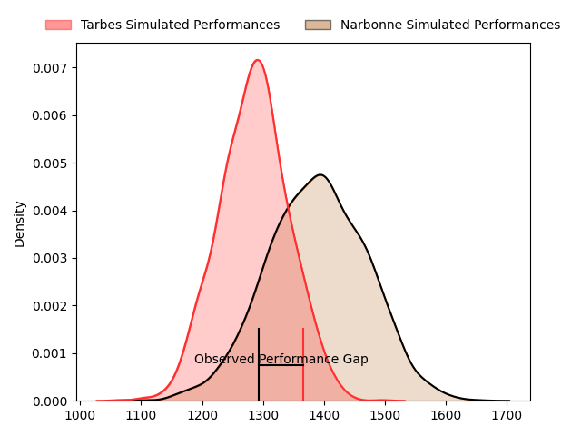
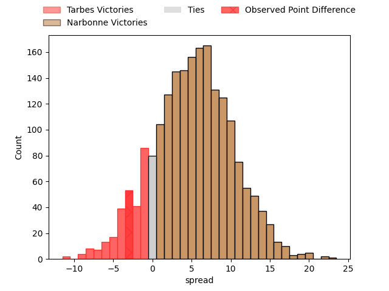
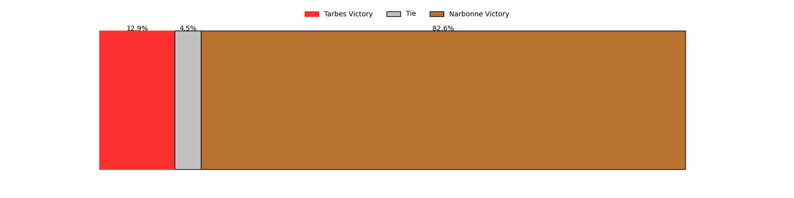
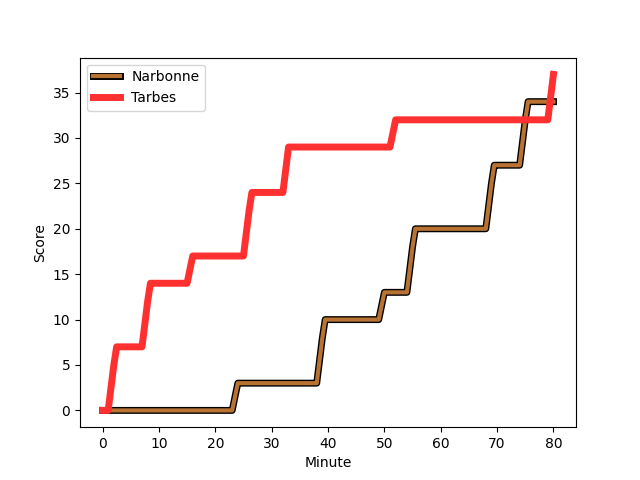

---  
layout: page  
title: Tarbes at Narbonne; 37-34  
date: 2023-02-18 18:30:00 18:00:00 -0500  
categories: match review  
---
# Tarbes at Narbonne; 37-34

# Club Level Predictions

The first set of predictions treats a club as the smallest object, as the club develops its members, organizes a gameplan, and deploys its players as needed for each match. This club model has a prediction of 0.644, which translates to predicting Narbonne to win by 5.2.

Each club has a rating and a rating deviation (simiar to a Glicko system), and expected performances can be generated. This allows for simulated matches and spreads like the ones below.
## Projected Performances

## Projected Spreads

## Projected Results

# Player Level Predictions

Treating teams instead as an entity made up of the currently active players, I have ratings for each player in an altogether different system. These can be combined to form team ratings once teamsheets are announced, weighting starters a bit higher than the reserves. After the match is played, players can be weighted by their minutes on the field, allowing for an accurate measure of the team's composition. With these compiled team ratings, we can make predictions, measure inaccuracy, and update the individual player ratings.
## Prediction with Player Minutes: Narbonne by 15.6

Narbonne by 11.6 on a neutral field
## Scores over Time

## Win Probability over Time

There were 22 large changes in win probability in this match
## Prediction without Player Minutes: Narbonne by 9.6

Narbonne by 5.6 on a neutral pitch

|   Away Minutes | Away Player                                                                      |   Away elo |   Away Percentile |   Number |   Home Percentile |   Home elo | Home Player                                                         |   Home Minutes |
|---------------:|:---------------------------------------------------------------------------------|-----------:|------------------:|---------:|------------------:|-----------:|:--------------------------------------------------------------------|---------------:|
|             50 | [Alexandre Combier](..//playerfiles//AlexandreCombier_cleaned.md)                |      87.36 |                28 |        1 |                56 |      96.68 | [Geoffrey Moise](..//playerfiles//GeoffreyMoise_cleaned.md)         |             48 |
|             80 | [Enzo Mondon](..//playerfiles//EnzoMondon_cleaned.md)                            |     110.51 |                88 |        2 |                78 |     103.62 | [Christophe David](..//playerfiles//ChristopheDavid_cleaned.md)     |             80 |
|             43 | [Mariano Ezequiel Filomeno](..//playerfiles//MarianoEzequielFilomeno_cleaned.md) |      85.44 |                22 |        3 |                65 |      99.61 | [Matthieu Loudet](..//playerfiles//MatthieuLoudet_cleaned.md)       |             70 |
|             55 | [Paul Sajous](..//playerfiles//PaulSajous_cleaned.md)                            |      65.83 |                 6 |        4 |                40 |      91.9  | [Morgan Maga](..//playerfiles//MorganMaga_cleaned.md)               |             34 |
|             70 | [Antoine Bousquet](..//playerfiles//AntoineBousquet_cleaned.md)                  |      93.26 |                46 |        5 |                68 |     101.05 | [Mohamed Kbaier](..//playerfiles//MohamedKbaier_cleaned.md)         |             80 |
|             80 | [Mattéo Coustalat](..//playerfiles//MattéoCoustalat_cleaned.md)                  |     101.27 |                66 |        6 |                15 |      82.76 | [Guillem Montagne](..//playerfiles//GuillemMontagne_cleaned.md)     |             28 |
|             80 | [Loan Real](..//playerfiles//LoanReal_cleaned.md)                                |      90.93 |                37 |        7 |                84 |     110.5  | [Valentin Sese](..//playerfiles//ValentinSese_cleaned.md)           |             80 |
|             36 | [Willem Leon Massyn](..//playerfiles//WillemLeonMassyn_cleaned.md)               |      96.23 |                50 |        8 |                81 |     107.94 | [Thibault Clauzade](..//playerfiles//ThibaultClauzade_cleaned.md)   |             80 |
|             80 | [Thibaut Dulucq](..//playerfiles//ThibautDulucq_cleaned.md)                      |      88.46 |                28 |        9 |                41 |      92.05 | [Pierrick Nova](..//playerfiles//PierrickNova_cleaned.md)           |             77 |
|             80 | [Anthony  Fuertes](..//playerfiles//AnthonyFuertes_cleaned.md)                   |     104.74 |                76 |       10 |                64 |     100.39 | [Tom Chauvet](..//playerfiles//TomChauvet_cleaned.md)               |             80 |
|             80 | [Jonathan Duffau](..//playerfiles//JonathanDuffau_cleaned.md)                    |     116.17 |                91 |       11 |                 0 |      34.03 | [Save Totovosau](..//playerfiles//SaveTotovosau_cleaned.md)         |             34 |
|             80 | [Alofa Alofa](..//playerfiles//AlofaAlofa_cleaned.md)                            |      94.07 |                48 |       12 |                82 |     107.84 | [Sébastien Giorgis](..//playerfiles//SébastienGiorgis_cleaned.md)   |             80 |
|             72 | [Johan Paulet](..//playerfiles//JohanPaulet_cleaned.md)                          |      81.84 |                18 |       13 |                78 |     105.51 | [Pierre Nueno](..//playerfiles//PierreNueno_cleaned.md)             |             28 |
|             80 | [Maxime Oltmann](..//playerfiles//MaximeOltmann_cleaned.md)                      |      57.7  |                 1 |       14 |                83 |     108.67 | [Pierre-Hugo Ducom](..//playerfiles//Pierre-HugoDucom_cleaned.md)   |             80 |
|             62 | [Thibaut Trotta](..//playerfiles//ThibautTrotta_cleaned.md)                      |      91.7  |                43 |       15 |                51 |      94.97 | [Paul Auradou](..//playerfiles//PaulAuradou_cleaned.md)             |             80 |
|             30 | [Antoine Palisse](..//playerfiles//AntoinePalisse_cleaned.md)                    |      94.27 |                47 |       16 |                64 |      99.27 | [Sylvain Abadie](..//playerfiles//SylvainAbadie_cleaned.md)         |             32 |
|             37 | [Alexandre Duny](..//playerfiles//AlexandreDuny_cleaned.md)                      |      83.23 |                15 |       17 |                95 |     119.95 | [Théo Castinel](..//playerfiles//ThéoCastinel_cleaned.md)           |             10 |
|             25 | [Léo Saint-Guilhem](..//playerfiles//LéoSaint-Guilhem_cleaned.md)                |     112.04 |                86 |       18 |                95 |     123.83 | [Mauro Rebussone](..//playerfiles//MauroRebussone_cleaned.md)       |             46 |
|             44 | [Aurelien Ricart](..//playerfiles//AurelienRicart_cleaned.md)                    |      98.28 |                61 |       19 |                52 |      96.16 | [Arthur Christienne](..//playerfiles//ArthurChristienne_cleaned.md) |             52 |
|             10 | [Hadrien Monfort](..//playerfiles//HadrienMonfort_cleaned.md)                    |      95    |               nan |       20 |                55 |      94.65 | [Pablo Barbaste](..//playerfiles//PabloBarbaste_cleaned.md)         |              3 |
|              8 | [Vaea Tutuila Vaea](..//playerfiles//VaeaTutuilaVaea_cleaned.md)                 |      99.23 |                62 |       21 |                57 |     101.83 | [Théo Mias](..//playerfiles//ThéoMias_cleaned.md)                   |             46 |
|              8 | [Romain Dumestre](..//playerfiles//RomainDumestre_cleaned.md)                    |      82.24 |                16 |       22 |                42 |      95.29 | [Étienne Ducom](..//playerfiles//ÉtienneDucom_cleaned.md)           |             52 |
|             10 | [Pierre Descoubet](..//playerfiles//PierreDescoubet_cleaned.md)                  |      97.98 |                57 |       23 |               nan |     nan    | nan                                                                 |            nan |

