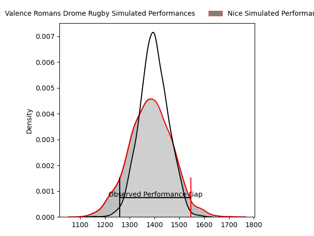
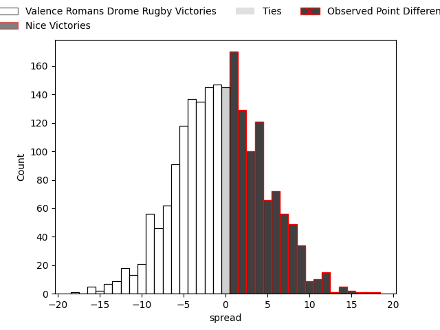
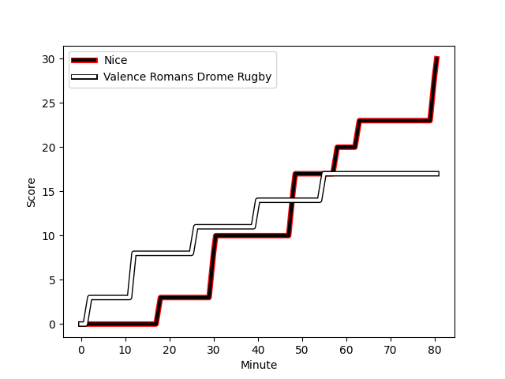
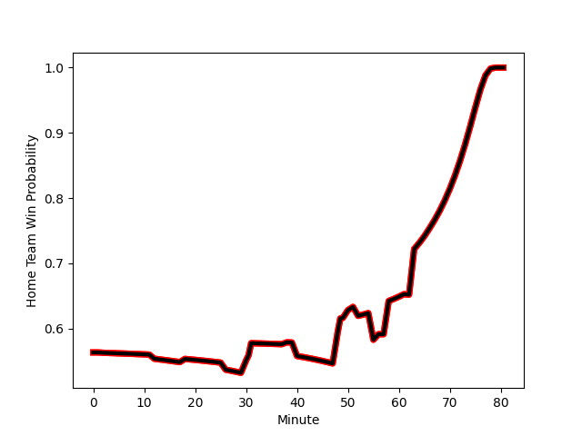

---  
layout: page  
title: Valence Romans Drome Rugby at Nice; 17-30  
date: 2023-02-18 18:00:00 18:00:00 -0500  
categories: match review  
---
# Valence Romans Drome Rugby at Nice; 17-30

# Club Level Predictions

The first set of predictions treats a club as the smallest object, as the club develops its members, organizes a gameplan, and deploys its players as needed for each match. This club model has a prediction of 0.486, which translates to predicting Valence Romans Drome Rugby to win by 0.5.

Each club has a rating and a rating deviation (simiar to a Glicko system), and expected performances can be generated. This allows for simulated matches and spreads like the ones below.
## Projected Performances

## Projected Spreads

## Projected Results

# Player Level Predictions

Treating teams instead as an entity made up of the currently active players, I have ratings for each player in an altogether different system. These can be combined to form team ratings once teamsheets are announced, weighting starters a bit higher than the reserves. After the match is played, players can be weighted by their minutes on the field, allowing for an accurate measure of the team's composition. With these compiled team ratings, we can make predictions, measure inaccuracy, and update the individual player ratings.
## Prediction with Player Minutes: Nice by 14.9

Nice by 10.9 on a neutral field
## Scores over Time

## Win Probability over Time

There were 6 large changes in win probability in this match
## Prediction without Player Minutes: Nice by 8.3

Nice by 4.3 on a neutral pitch

|   Away Minutes | Away Player                                                            |   Away elo |   Away Percentile |   Number |   Home Percentile |   Home elo | Home Player                                                               |   Home Minutes |
|---------------:|:-----------------------------------------------------------------------|-----------:|------------------:|---------:|------------------:|-----------:|:--------------------------------------------------------------------------|---------------:|
|             56 | [Sami Zouhair](..//playerfiles//SamiZouhair_cleaned.md)                |     124.93 |                97 |        1 |                86 |     107.76 | [Sunia Vola](..//playerfiles//SuniaVola_cleaned.md)                       |             52 |
|             56 | [Dorian Marco Pena](..//playerfiles//DorianMarcoPena_cleaned.md)       |     104.23 |                80 |        2 |                39 |      91.41 | [Kurt Stanley Haupt](..//playerfiles//KurtStanleyHaupt_cleaned.md)        |             62 |
|             66 | [John Henry Fincham](..//playerfiles//JohnHenryFincham_cleaned.md)     |      96.54 |                55 |        3 |                28 |      88.88 | [Jeronimo Negrotto](..//playerfiles//JeronimoNegrotto_cleaned.md)         |             52 |
|             50 | [Darrell Dyer](..//playerfiles//DarrellDyer_cleaned.md)                |     117.7  |                93 |        4 |                48 |      96.63 | [Thibaud Rey](..//playerfiles//ThibaudRey_cleaned.md)                     |             62 |
|             80 | [Florian Goumat](..//playerfiles//FlorianGoumat_cleaned.md)            |      90.92 |                36 |        5 |                64 |     102.05 | [Marvin Woki](..//playerfiles//MarvinWoki_cleaned.md)                     |             80 |
|             50 | [Axel Bruchet](..//playerfiles//AxelBruchet_cleaned.md)                |      55.48 |                 1 |        6 |                81 |     108.21 | [Louis Suaud](..//playerfiles//LouisSuaud_cleaned.md)                     |             80 |
|             80 | [Matthew Gicquel](..//playerfiles//MatthewGicquel_cleaned.md)          |      84.29 |                17 |        7 |                38 |      93.28 | [Arthur Vignolles](..//playerfiles//ArthurVignolles_cleaned.md)           |             80 |
|             51 | [Philippe Laville](..//playerfiles//PhilippeLaville_cleaned.md)        |      94.78 |                46 |        8 |                98 |     130.41 | [Laijiasa Bolenaivalu](..//playerfiles//LaijiasaBolenaivalu_cleaned.md)   |             56 |
|             50 | [Léopold Dupas](..//playerfiles//LéopoldDupas_cleaned.md)              |      86.78 |                22 |        9 |                55 |      96.45 | [Mathieu Lorée](..//playerfiles//MathieuLorée_cleaned.md)                 |             80 |
|             80 | [Lucas Méret](..//playerfiles//LucasMéret_cleaned.md)                  |      87    |                22 |       10 |                85 |     111.73 | [Mathis Viard](..//playerfiles//MathisViard_cleaned.md)                   |             80 |
|             80 | [Tim Giresse](..//playerfiles//TimGiresse_cleaned.md)                  |      91.67 |                41 |       11 |                74 |     104.27 | [Clement Egiziano](..//playerfiles//ClementEgiziano_cleaned.md)           |             80 |
|             80 | [Ben Neiceru](..//playerfiles//BenNeiceru_cleaned.md)                  |     109.91 |                85 |       12 |                79 |     108.05 | [Luca Cutayar](..//playerfiles//LucaCutayar_cleaned.md)                   |             80 |
|             31 | [Jonathan Quinnez](..//playerfiles//JonathanQuinnez_cleaned.md)        |     114.08 |                89 |       13 |                70 |     101.91 | [Alban Conduche](..//playerfiles//AlbanConduche_cleaned.md)               |             38 |
|             80 | [Mason Emerson](..//playerfiles//MasonEmerson_cleaned.md)              |      88.72 |                31 |       14 |                27 |      87.83 | [Sakiusa Bureitakiyaca](..//playerfiles//SakiusaBureitakiyaca_cleaned.md) |             80 |
|             80 | [Joris Moura](..//playerfiles//JorisMoura_cleaned.md)                  |     104.29 |                68 |       15 |                80 |     106.83 | [David Odiete](..//playerfiles//DavidOdiete_cleaned.md)                   |             80 |
|             49 | [Charles Bouldoire](..//playerfiles//CharlesBouldoire_cleaned.md)      |      89.02 |                28 |       16 |                87 |     111.71 | [Julien Fritz](..//playerfiles//JulienFritz_cleaned.md)                   |             42 |
|             30 | [Sven Bernat Girlando](..//playerfiles//SvenBernatGirlando_cleaned.md) |      99.41 |                58 |       17 |                78 |     103.73 | [Louis Martin](..//playerfiles//LouisMartin_cleaned.md)                   |             18 |
|             30 | [Charles Brayer](..//playerfiles//CharlesBrayer_cleaned.md)            |      67.12 |                 6 |       18 |                26 |      88.31 | [Nika Neparidze](..//playerfiles//NikaNeparidze_cleaned.md)               |             28 |
|             29 | [Ioane Iashagashvili](..//playerfiles//IoaneIashagashvili_cleaned.md)  |      90.31 |                41 |       19 |                23 |      87.33 | [Jemal Shatirishvili](..//playerfiles//JemalShatirishvili_cleaned.md)     |             28 |
|             24 | [Anthony Aléo](..//playerfiles//AnthonyAléo_cleaned.md)                |      94.73 |                49 |       20 |                81 |     108.49 | [Steffon Armitage](..//playerfiles//SteffonArmitage_cleaned.md)           |             24 |
|             24 | [Yanis Gimenez](..//playerfiles//YanisGimenez_cleaned.md)              |     102    |                82 |       21 |                19 |      83.66 | [Martin Freytes](..//playerfiles//MartinFreytes_cleaned.md)               |             18 |
|             14 | [Cyril Balust](..//playerfiles//CyrilBalust_cleaned.md)                |      95.75 |                55 |       22 |               nan |     nan    | nan                                                                       |            nan |
|             30 | [Tim Menzel](..//playerfiles//TimMenzel_cleaned.md)                    |      75.73 |                 8 |       23 |               nan |     nan    | nan                                                                       |            nan |

