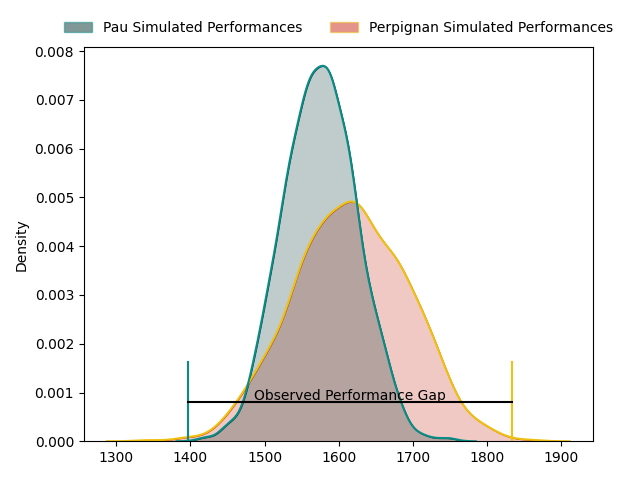
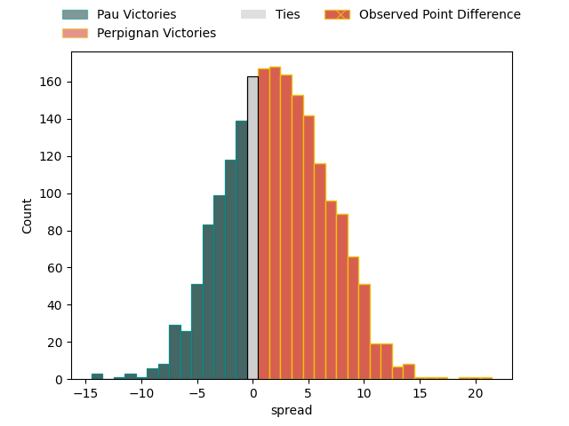
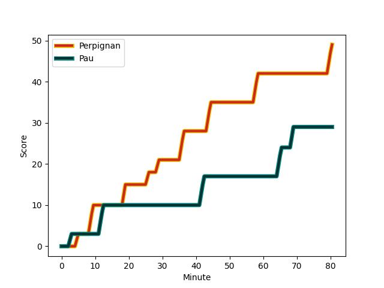
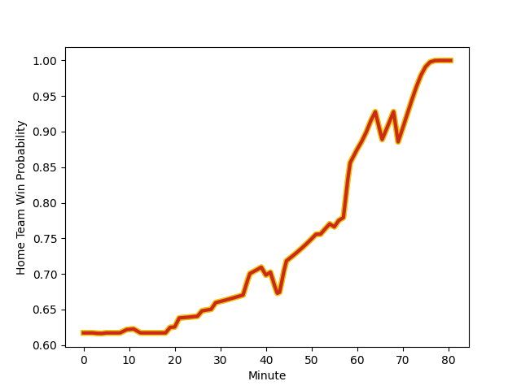

---  
layout: page  
title: Pau at Perpignan; 29-49  
date: 2023-02-18 17:00:00 18:00:00 -0500  
categories: match review  
---
# Pau at Perpignan; 29-49

# Club Level Predictions

The first set of predictions treats a club as the smallest object, as the club develops its members, organizes a gameplan, and deploys its players as needed for each match. This club model has a prediction of 0.564, which translates to predicting Perpignan to win by 2.2.

Each club has a rating and a rating deviation (simiar to a Glicko system), and expected performances can be generated. This allows for simulated matches and spreads like the ones below.
## Projected Performances

## Projected Spreads

## Projected Results

# Player Level Predictions

Treating teams instead as an entity made up of the currently active players, I have ratings for each player in an altogether different system. These can be combined to form team ratings once teamsheets are announced, weighting starters a bit higher than the reserves. After the match is played, players can be weighted by their minutes on the field, allowing for an accurate measure of the team's composition. With these compiled team ratings, we can make predictions, measure inaccuracy, and update the individual player ratings.
## Prediction with Player Minutes: Perpignan by 21.0

Perpignan by 17.0 on a neutral field
## Scores over Time

## Win Probability over Time

There were 3 large changes in win probability in this match
## Prediction without Player Minutes: Perpignan by 19.4

Perpignan by 15.4 on a neutral pitch

|   Away Minutes | Away Player                                                                    |   Away elo |   Away Percentile |   Number |   Home Percentile |   Home elo | Home Player                                                             |   Home Minutes |
|---------------:|:-------------------------------------------------------------------------------|-----------:|------------------:|---------:|------------------:|-----------:|:------------------------------------------------------------------------|---------------:|
|             54 | [Ignacio David Calles](..//playerfiles//IgnacioDavidCalles_cleaned.md)         |      95.23 |                51 |        1 |                77 |     102.97 | [Giorgi Tetrashvili](..//playerfiles//GiorgiTetrashvili_cleaned.md)     |             52 |
|             61 | [Lucas Rey](..//playerfiles//LucasRey_cleaned.md)                              |      85.88 |                20 |        2 |                69 |     100.23 | [Seilala Lam](..//playerfiles//SeilalaLam_cleaned.md)                   |             55 |
|             54 | [Siate Tokolahi](..//playerfiles//SiateTokolahi_cleaned.md)                    |      95.8  |                53 |        3 |                86 |     107.78 | [Arthur Joly](..//playerfiles//ArthurJoly_cleaned.md)                   |             55 |
|             80 | [Hugo Auradou](..//playerfiles//HugoAuradou_cleaned.md)                        |      71.79 |                 6 |        4 |                90 |     114.13 | [Tristan Labouteley](..//playerfiles//TristanLabouteley_cleaned.md)     |             80 |
|             52 | [Fabrice Metz](..//playerfiles//FabriceMetz_cleaned.md)                        |      95.53 |                52 |        5 |               nan |      99.56 | [Posolo Tuilagi](..//playerfiles//PosoloTuilagi_cleaned.md)             |             57 |
|             80 | [Martin Puech](..//playerfiles//MartinPuech_cleaned.md)                        |      99.83 |                66 |        6 |                64 |      99.79 | [Brad Shields](..//playerfiles//BradShields_cleaned.md)                 |             80 |
|             80 | [Reece Hewat](..//playerfiles//ReeceHewat_cleaned.md)                          |      87.35 |                25 |        7 |                75 |     105.01 | [Lucas Bachelier](..//playerfiles//LucasBachelier_cleaned.md)           |             40 |
|             21 | [Jordan Joseph](..//playerfiles//JordanJoseph_cleaned.md)                      |      97.92 |                42 |        8 |                74 |     105.04 | [Genesis Mamea Lemalu](..//playerfiles//GenesisMameaLemalu_cleaned.md)  |             55 |
|             52 | [Thibault Daubagna](..//playerfiles//ThibaultDaubagna_cleaned.md)              |      98.37 |                60 |        9 |                52 |      95.3  | [Sadek Deghmache](..//playerfiles//SadekDeghmache_cleaned.md)           |             57 |
|             80 | [Zack Henry](..//playerfiles//ZackHenry_cleaned.md)                            |      81.12 |                12 |       10 |                71 |     102.41 | [Jake McIntyre](..//playerfiles//JakeMcIntyre_cleaned.md)               |             80 |
|             40 | [Daniel Ikpefan](..//playerfiles//DanielIkpefan_cleaned.md)                    |      98.86 |                61 |       11 |                84 |     109.29 | [Alistair Crossdale](..//playerfiles//AlistairCrossdale_cleaned.md)     |             80 |
|             80 | [Jale Vatubua](..//playerfiles//JaleVatubua_cleaned.md)                        |      79.62 |                11 |       12 |                25 |      86.54 | [Jeronimo de la Fuente](..//playerfiles//JeronimodelaFuente_cleaned.md) |             80 |
|             80 | [Tumua Manu](..//playerfiles//TumuaManu_cleaned.md)                            |      81.44 |                11 |       13 |                57 |      97.67 | [Afusipa Taumoepeau](..//playerfiles//AfusipaTaumoepeau_cleaned.md)     |             80 |
|             63 | [Clément Laporte](..//playerfiles//ClémentLaporte_cleaned.md)                  |     111.3  |                86 |       14 |                67 |     100.78 | [Lucas Dubois](..//playerfiles//LucasDubois_cleaned.md)                 |             80 |
|             80 | [Jack Maddocks](..//playerfiles//JackMaddocks_cleaned.md)                      |      84.92 |                25 |       15 |                79 |     107.34 | [Tristan Tedder](..//playerfiles//TristanTedder_cleaned.md)             |             57 |
|             40 | [Émilien Gailleton](..//playerfiles//ÉmilienGailleton_cleaned.md)              |     113.32 |                88 |       16 |                26 |      91.43 | [Kélian Galletier](..//playerfiles//KélianGalletier_cleaned.md)         |             40 |
|             59 | [Sacha Zegueur](..//playerfiles//SachaZegueur_cleaned.md)                      |      69.15 |                 4 |       17 |                51 |      95.09 | [Sacha Lotrian](..//playerfiles//SachaLotrian_cleaned.md)               |             28 |
|             28 | [Dan Robson](..//playerfiles//DanRobson_cleaned.md)                            |      84.76 |                16 |       18 |                18 |      86.99 | [Joaquin Oviedo](..//playerfiles//JoaquinOviedo_cleaned.md)             |             25 |
|             28 | [Lekima Vuda Tagitagivalu](..//playerfiles//LekimaVudaTagitagivalu_cleaned.md) |      96.85 |                29 |       19 |                79 |     112.54 | [Mike Tadjer](..//playerfiles//MikeTadjer_cleaned.md)                   |             25 |
|             28 | [Lekima Vuda Tagitagivalu](..//playerfiles//LekimaVudaTagitagivalu_cleaned.md) |      96.85 |                29 |       19 |                90 |     112.54 | [Mike Tadjer](..//playerfiles//MikeTadjer_cleaned.md)                   |             25 |
|             26 | [Rémi Seneca](..//playerfiles//RémiSeneca_cleaned.md)                          |      99.03 |                60 |       20 |                52 |      92.67 | [Ma'afu Fia](..//playerfiles//Ma'afuFia_cleaned.md)                     |             25 |
|             26 | [Nicolas Corato](..//playerfiles//NicolasCorato_cleaned.md)                    |      91.67 |                26 |       21 |                81 |     107.3  | [Edward Sawailau](..//playerfiles//EdwardSawailau_cleaned.md)           |             23 |
|             19 | [Romain Ruffenach](..//playerfiles//RomainRuffenach_cleaned.md)                |      98.66 |                64 |       22 |                18 |      86.22 | [Victor Moreaux](..//playerfiles//VictorMoreaux_cleaned.md)             |             23 |
|             17 | [Mathias Colombet](..//playerfiles//MathiasColombet_cleaned.md)                |      96.49 |                55 |       23 |                62 |     103.09 | [Matteo Rodor](..//playerfiles//MatteoRodor_cleaned.md)                 |             23 |

