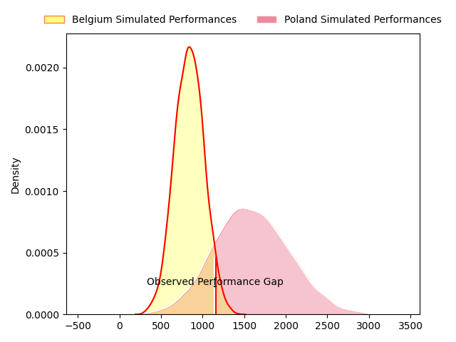
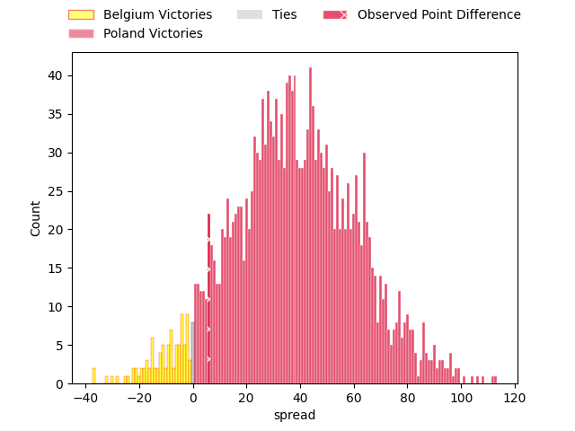
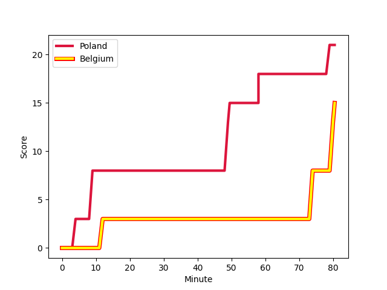
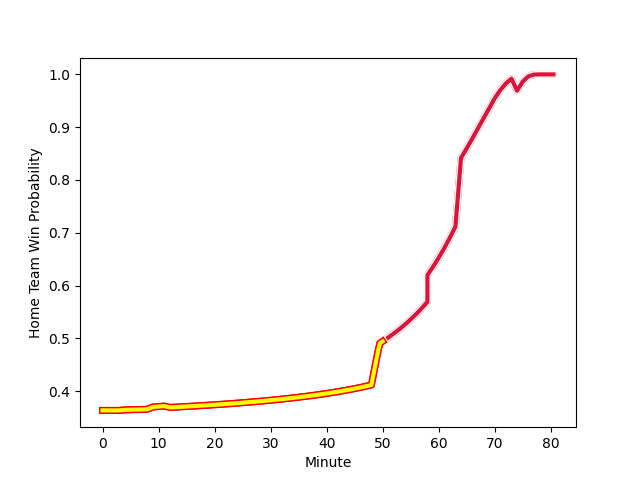

---  
layout: page  
title: Belgium at Poland; 15-21  
date: 2023-02-18 21:15:00 18:00:00 -0500  
categories: match review  
---
# Belgium at Poland; 15-21

# Club Level Predictions

The first set of predictions treats a club as the smallest object, as the club develops its members, organizes a gameplan, and deploys its players as needed for each match. This club model has a prediction of 0.978, which translates to predicting Poland to win by 37.4.

Each club has a rating and a rating deviation (simiar to a Glicko system), and expected performances can be generated. This allows for simulated matches and spreads like the ones below.
## Projected Performances

## Projected Spreads

## Projected Results

# Player Level Predictions

Treating teams instead as an entity made up of the currently active players, I have ratings for each player in an altogether different system. These can be combined to form team ratings once teamsheets are announced, weighting starters a bit higher than the reserves. After the match is played, players can be weighted by their minutes on the field, allowing for an accurate measure of the team's composition. With these compiled team ratings, we can make predictions, measure inaccuracy, and update the individual player ratings.
## Prediction with Player Minutes: Belgium by 20.3

Belgium by 24.3 on a neutral field
## Scores over Time

## Win Probability over Time

There were 3 large changes in win probability in this match
## Prediction without Player Minutes: Belgium by 22.0

Belgium by 26.0 on a neutral pitch

|   Away Minutes | Away Player                                                                     |   Away elo |   Away Percentile |   Number |   Home Percentile |   Home elo | Home Player                                                             |   Home Minutes |
|---------------:|:--------------------------------------------------------------------------------|-----------:|------------------:|---------:|------------------:|-----------:|:------------------------------------------------------------------------|---------------:|
|             80 | [Romain Pinte](..//playerfiles//RomainPinte_cleaned.md)                         |      82.73 |                14 |        1 |               nan |      89.1  | [Tom Fidler](..//playerfiles//TomFidler_cleaned.md)                     |             80 |
|             80 | [Romain Pinte](..//playerfiles//RomainPinte_cleaned.md)                         |      82.73 |                25 |        1 |               nan |      89.1  | [Tom Fidler](..//playerfiles//TomFidler_cleaned.md)                     |             80 |
|             58 | [Alexis Cuffolo](..//playerfiles//AlexisCuffolo_cleaned.md)                     |      82.63 |                14 |        2 |                35 |      90.11 | [Grzegorz Buczek](..//playerfiles//GrzegorzBuczek_cleaned.md)           |             56 |
|             58 | [Alexis Cuffolo](..//playerfiles//AlexisCuffolo_cleaned.md)                     |      82.63 |                26 |        2 |                35 |      90.11 | [Grzegorz Buczek](..//playerfiles//GrzegorzBuczek_cleaned.md)           |             56 |
|             80 | [Alexis Cuffolo](..//playerfiles//AlexisCuffolo_cleaned.md)                     |      82.63 |                14 |        2 |                35 |      90.11 | [Grzegorz Buczek](..//playerfiles//GrzegorzBuczek_cleaned.md)           |             56 |
|             80 | [Alexis Cuffolo](..//playerfiles//AlexisCuffolo_cleaned.md)                     |      82.63 |                26 |        2 |                35 |      90.11 | [Grzegorz Buczek](..//playerfiles//GrzegorzBuczek_cleaned.md)           |             56 |
|             58 | [Alexis Cuffolo](..//playerfiles//AlexisCuffolo_cleaned.md)                     |      82.63 |                14 |        2 |                35 |      90.11 | [Grzegorz Buczek](..//playerfiles//GrzegorzBuczek_cleaned.md)           |             80 |
|             58 | [Alexis Cuffolo](..//playerfiles//AlexisCuffolo_cleaned.md)                     |      82.63 |                26 |        2 |                35 |      90.11 | [Grzegorz Buczek](..//playerfiles//GrzegorzBuczek_cleaned.md)           |             80 |
|             80 | [Alexis Cuffolo](..//playerfiles//AlexisCuffolo_cleaned.md)                     |      82.63 |                14 |        2 |                35 |      90.11 | [Grzegorz Buczek](..//playerfiles//GrzegorzBuczek_cleaned.md)           |             80 |
|             80 | [Alexis Cuffolo](..//playerfiles//AlexisCuffolo_cleaned.md)                     |      82.63 |                26 |        2 |                35 |      90.11 | [Grzegorz Buczek](..//playerfiles//GrzegorzBuczek_cleaned.md)           |             80 |
|             80 | [Jean Sebastien De Halleux](..//playerfiles//JeanSebastienDeHalleux_cleaned.md) |      95    |               nan |        3 |               nan |      95    | [Zenon Szwagrzak](..//playerfiles//ZenonSzwagrzak_cleaned.md)           |             53 |
|             53 | [Jean Sebastien De Halleux](..//playerfiles//JeanSebastienDeHalleux_cleaned.md) |      95    |               nan |        3 |               nan |      95    | [Zenon Szwagrzak](..//playerfiles//ZenonSzwagrzak_cleaned.md)           |             53 |
|             53 | [Jean Sebastien De Halleux](..//playerfiles//JeanSebastienDeHalleux_cleaned.md) |      95    |               nan |        3 |               nan |      95    | [Zenon Szwagrzak](..//playerfiles//ZenonSzwagrzak_cleaned.md)           |             80 |
|             80 | [Jean Sebastien De Halleux](..//playerfiles//JeanSebastienDeHalleux_cleaned.md) |      95    |               nan |        3 |               nan |      95    | [Zenon Szwagrzak](..//playerfiles//ZenonSzwagrzak_cleaned.md)           |             80 |
|             80 | [Chris Salay Baudry](..//playerfiles//ChrisSalayBaudry_cleaned.md)              |      80.75 |                14 |        4 |                16 |      81.72 | [Michal Kruzycki](..//playerfiles//MichalKruzycki_cleaned.md)           |             80 |
|             80 | [Chris Salay Baudry](..//playerfiles//ChrisSalayBaudry_cleaned.md)              |      80.75 |                23 |        4 |                16 |      81.72 | [Michal Kruzycki](..//playerfiles//MichalKruzycki_cleaned.md)           |             80 |
|             80 | [Robin Vermeersch](..//playerfiles//RobinVermeersch_cleaned.md)                 |      55.59 |                 1 |        5 |               nan |      95    | [Mateusz Bartoszek](..//playerfiles//MateuszBartoszek_cleaned.md)       |             45 |
|             80 | [Robin Vermeersch](..//playerfiles//RobinVermeersch_cleaned.md)                 |      55.59 |                 3 |        5 |               nan |      95    | [Mateusz Bartoszek](..//playerfiles//MateuszBartoszek_cleaned.md)       |             45 |
|             80 | [Robin Vermeersch](..//playerfiles//RobinVermeersch_cleaned.md)                 |      55.59 |                 1 |        5 |               nan |      95    | [Mateusz Bartoszek](..//playerfiles//MateuszBartoszek_cleaned.md)       |             80 |
|             80 | [Robin Vermeersch](..//playerfiles//RobinVermeersch_cleaned.md)                 |      55.59 |                 3 |        5 |               nan |      95    | [Mateusz Bartoszek](..//playerfiles//MateuszBartoszek_cleaned.md)       |             80 |
|             80 | [Hughes Bastin](..//playerfiles//HughesBastin_cleaned.md)                       |      56.45 |                 2 |        6 |                34 |      90.11 | [Jan Cal](..//playerfiles//JanCal_cleaned.md)                           |             80 |
|             16 | [Hughes Bastin](..//playerfiles//HughesBastin_cleaned.md)                       |      56.45 |                 3 |        6 |                34 |      90.11 | [Jan Cal](..//playerfiles//JanCal_cleaned.md)                           |             80 |
|             16 | [Hughes Bastin](..//playerfiles//HughesBastin_cleaned.md)                       |      56.45 |                 2 |        6 |                34 |      90.11 | [Jan Cal](..//playerfiles//JanCal_cleaned.md)                           |             80 |
|             80 | [Hughes Bastin](..//playerfiles//HughesBastin_cleaned.md)                       |      56.45 |                 3 |        6 |                34 |      90.11 | [Jan Cal](..//playerfiles//JanCal_cleaned.md)                           |             80 |
|             80 | [Toon Deceuninck](..//playerfiles//ToonDeceuninck_cleaned.md)                   |      83.42 |                18 |        7 |                12 |      80.8  | [Alexander Nowicki](..//playerfiles//AlexanderNowicki_cleaned.md)       |             80 |
|             80 | [Thomas De Molder](..//playerfiles//ThomasDeMolder_cleaned.md)                  |      86.76 |                24 |        8 |                10 |      78.35 | [Piotr Zeszutek](..//playerfiles//PiotrZeszutek_cleaned.md)             |             80 |
|             61 | [Thomas De Molder](..//playerfiles//ThomasDeMolder_cleaned.md)                  |      86.76 |                24 |        8 |                10 |      78.35 | [Piotr Zeszutek](..//playerfiles//PiotrZeszutek_cleaned.md)             |             80 |
|             80 | [Thomas De Molder](..//playerfiles//ThomasDeMolder_cleaned.md)                  |      86.76 |                24 |        8 |                10 |      78.35 | [Piotr Zeszutek](..//playerfiles//PiotrZeszutek_cleaned.md)             |             72 |
|             61 | [Thomas De Molder](..//playerfiles//ThomasDeMolder_cleaned.md)                  |      86.76 |                24 |        8 |                10 |      78.35 | [Piotr Zeszutek](..//playerfiles//PiotrZeszutek_cleaned.md)             |             72 |
|             53 | [Ryan Godsmark](..//playerfiles//RyanGodsmark_cleaned.md)                       |      79.08 |                12 |        9 |                21 |      82.87 | [Dawid Plichta](..//playerfiles//DawidPlichta_cleaned.md)               |             80 |
|             53 | [Ryan Godsmark](..//playerfiles//RyanGodsmark_cleaned.md)                       |      79.08 |                19 |        9 |                21 |      82.87 | [Dawid Plichta](..//playerfiles//DawidPlichta_cleaned.md)               |             80 |
|             80 | [Ryan Godsmark](..//playerfiles//RyanGodsmark_cleaned.md)                       |      79.08 |                19 |        9 |                36 |      82.87 | [Dawid Plichta](..//playerfiles//DawidPlichta_cleaned.md)               |             80 |
|             80 | [Ryan Godsmark](..//playerfiles//RyanGodsmark_cleaned.md)                       |      79.08 |                12 |        9 |                36 |      82.87 | [Dawid Plichta](..//playerfiles//DawidPlichta_cleaned.md)               |             80 |
|             80 | [Ryan Godsmark](..//playerfiles//RyanGodsmark_cleaned.md)                       |      79.08 |                12 |        9 |                21 |      82.87 | [Dawid Plichta](..//playerfiles//DawidPlichta_cleaned.md)               |             80 |
|             53 | [Ryan Godsmark](..//playerfiles//RyanGodsmark_cleaned.md)                       |      79.08 |                12 |        9 |                36 |      82.87 | [Dawid Plichta](..//playerfiles//DawidPlichta_cleaned.md)               |             80 |
|             80 | [Ryan Godsmark](..//playerfiles//RyanGodsmark_cleaned.md)                       |      79.08 |                19 |        9 |                21 |      82.87 | [Dawid Plichta](..//playerfiles//DawidPlichta_cleaned.md)               |             80 |
|             53 | [Ryan Godsmark](..//playerfiles//RyanGodsmark_cleaned.md)                       |      79.08 |                19 |        9 |                36 |      82.87 | [Dawid Plichta](..//playerfiles//DawidPlichta_cleaned.md)               |             80 |
|             70 | [Alan Williams](..//playerfiles//AlanWilliams_cleaned.md)                       |      87.67 |               nan |       10 |                36 |      86.13 | [Jedrzej Nowicki](..//playerfiles//JedrzejNowicki_cleaned.md)           |             80 |
|             80 | [Alan Williams](..//playerfiles//AlanWilliams_cleaned.md)                       |      87.67 |               nan |       10 |                20 |      86.13 | [Jedrzej Nowicki](..//playerfiles//JedrzejNowicki_cleaned.md)           |             80 |
|             80 | [Alan Williams](..//playerfiles//AlanWilliams_cleaned.md)                       |      87.67 |               nan |       10 |                36 |      86.13 | [Jedrzej Nowicki](..//playerfiles//JedrzejNowicki_cleaned.md)           |             80 |
|             70 | [Alan Williams](..//playerfiles//AlanWilliams_cleaned.md)                       |      87.67 |               nan |       10 |                20 |      86.13 | [Jedrzej Nowicki](..//playerfiles//JedrzejNowicki_cleaned.md)           |             80 |
|             64 | [Dazzy Cornez](..//playerfiles//DazzyCornez_cleaned.md)                         |      86.76 |                24 |       11 |                36 |      90.11 | [Robert Wojtowicz](..//playerfiles//RobertWojtowicz_cleaned.md)         |             80 |
|             80 | [Dazzy Cornez](..//playerfiles//DazzyCornez_cleaned.md)                         |      86.76 |                24 |       11 |                36 |      90.11 | [Robert Wojtowicz](..//playerfiles//RobertWojtowicz_cleaned.md)         |             80 |
|             80 | [Jens Torfs](..//playerfiles//JensTorfs_cleaned.md)                             |      92.52 |                43 |       12 |                14 |      81.72 | [Peter Hudson](..//playerfiles//PeterHudson_cleaned.md)                 |             80 |
|             57 | [Viktor Pazgrat](..//playerfiles//ViktorPazgrat_cleaned.md)                     |      84.2  |                19 |       13 |                24 |      86.61 | [Grzegorz Szczepanski](..//playerfiles//GrzegorzSzczepanski_cleaned.md) |             80 |
|             80 | [Viktor Pazgrat](..//playerfiles//ViktorPazgrat_cleaned.md)                     |      84.2  |                19 |       13 |                24 |      86.61 | [Grzegorz Szczepanski](..//playerfiles//GrzegorzSzczepanski_cleaned.md) |             80 |
|             80 | [Viktor Pazgrat](..//playerfiles//ViktorPazgrat_cleaned.md)                     |      84.2  |                33 |       13 |                24 |      86.61 | [Grzegorz Szczepanski](..//playerfiles//GrzegorzSzczepanski_cleaned.md) |             80 |
|             57 | [Viktor Pazgrat](..//playerfiles//ViktorPazgrat_cleaned.md)                     |      84.2  |                33 |       13 |                24 |      86.61 | [Grzegorz Szczepanski](..//playerfiles//GrzegorzSzczepanski_cleaned.md) |             80 |
|             80 | [Florian Remue](..//playerfiles//FlorianRemue_cleaned.md)                       |      61.58 |                 3 |       14 |                20 |      81.72 | [Ross Cooke](..//playerfiles//RossCooke_cleaned.md)                     |             80 |
|             80 | [Jordan Gott](..//playerfiles//JordanGott_cleaned.md)                           |      81.57 |                14 |       15 |                19 |      85.69 | [Wojciak Piotrowicz](..//playerfiles//WojciakPiotrowicz_cleaned.md)     |             80 |
|             64 | [Dries De Keyser](..//playerfiles//DriesDeKeyser_cleaned.md)                    |      99.41 |                63 |       16 |                34 |      90.11 | [Siokivaha Taufui](..//playerfiles//SiokivahaTaufui_cleaned.md)         |             35 |
|             27 | [Basile Van Parys](..//playerfiles//BasileVanParys_cleaned.md)                  |      81.08 |                15 |       17 |               nan |      95    | [Craig Bachurzewski](..//playerfiles//CraigBachurzewski_cleaned.md)     |             27 |
|             27 | [Julien Berger](..//playerfiles//JulienBerger_cleaned.md)                       |      89.23 |                32 |       18 |               nan |      95    | [Kamil Bobryck](..//playerfiles//KamilBobryck_cleaned.md)               |             24 |
|             23 | [Guillaume Piron](..//playerfiles//GuillaumePiron_cleaned.md)                   |      95.42 |                51 |       19 |                19 |      85.08 | [Kacper Palamarczuk](..//playerfiles//KacperPalamarczuk_cleaned.md)     |              8 |
|             22 | [Alexandre Raynier](..//playerfiles//AlexandreRaynier_cleaned.md)               |      95    |               nan |       20 |               nan |     nan    | nan                                                                     |            nan |
|             19 | [Jérémie Brasseur](..//playerfiles//JérémieBrasseur_cleaned.md)                 |      95    |               nan |       21 |               nan |     nan    | nan                                                                     |            nan |
|             10 | [Victor André](..//playerfiles//VictorAndré_cleaned.md)                         |      71.85 |                 7 |       22 |               nan |     nan    | nan                                                                     |            nan |
|             16 | [Seppe Verelst](..//playerfiles//SeppeVerelst_cleaned.md)                       |      95    |               nan |       23 |               nan |     nan    | nan                                                                     |            nan |

