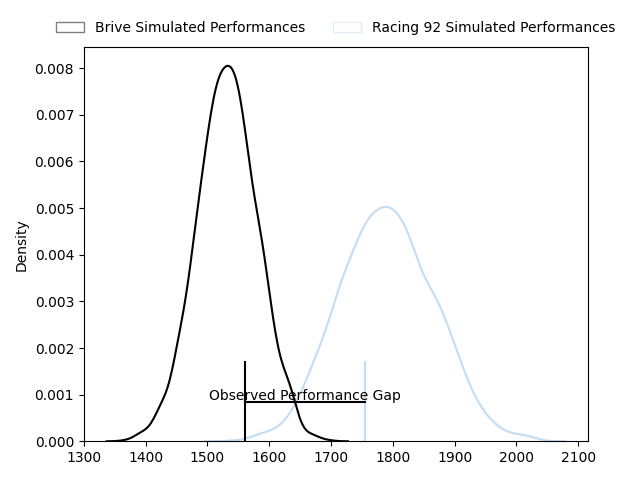
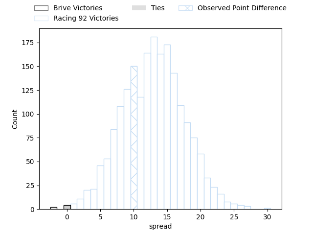
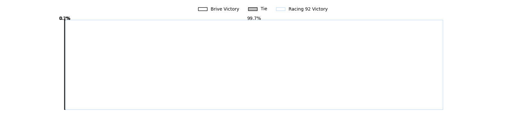
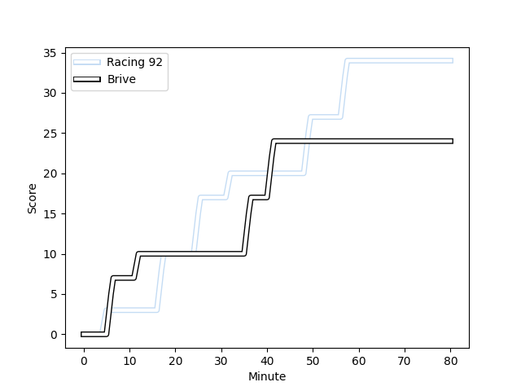
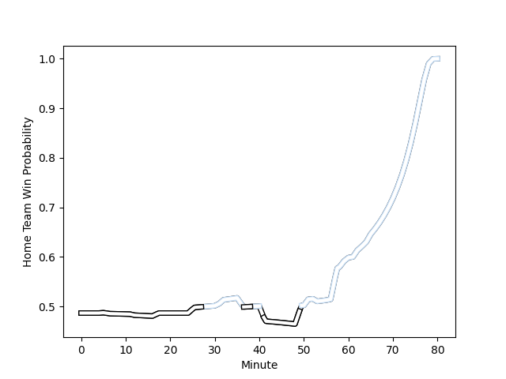

---  
layout: page  
title: Brive at Racing 92; 24-34  
date: 2023-02-18 17:00:00 18:00:00 -0500  
categories: match review  
---
# Brive at Racing 92; 24-34

# Club Level Predictions

The first set of predictions treats a club as the smallest object, as the club develops its members, organizes a gameplan, and deploys its players as needed for each match. This club model has a prediction of 0.813, which translates to predicting Racing 92 to win by 12.9.

Each club has a rating and a rating deviation (simiar to a Glicko system), and expected performances can be generated. This allows for simulated matches and spreads like the ones below.
## Projected Performances

## Projected Spreads

## Projected Results

# Player Level Predictions

Treating teams instead as an entity made up of the currently active players, I have ratings for each player in an altogether different system. These can be combined to form team ratings once teamsheets are announced, weighting starters a bit higher than the reserves. After the match is played, players can be weighted by their minutes on the field, allowing for an accurate measure of the team's composition. With these compiled team ratings, we can make predictions, measure inaccuracy, and update the individual player ratings.
## Prediction with Player Minutes: Racing 92 by 1.7

Brive by 2.3 on a neutral field
## Scores over Time

## Win Probability over Time

There were 9 large changes in win probability in this match
## Prediction without Player Minutes: Brive by 0.7

Brive by 4.7 on a neutral pitch

|   Away Minutes | Away Player                                                                      |   Away elo |   Away Percentile |   Number |   Home Percentile |   Home elo | Home Player                                                                |   Home Minutes |
|---------------:|:---------------------------------------------------------------------------------|-----------:|------------------:|---------:|------------------:|-----------:|:---------------------------------------------------------------------------|---------------:|
|             59 | [Wesley Tapueluelu](..//playerfiles//WesleyTapueluelu_cleaned.md)                |      86.42 |                19 |        1 |                78 |     104.75 | [Guram Gogichashvili](..//playerfiles//GuramGogichashvili_cleaned.md)      |             56 |
|             31 | [Motu Farao Matu'u](..//playerfiles//MotuFaraoMatu'u_cleaned.md)                 |      99.8  |                67 |        2 |                17 |      81.48 | [Janick Tarrit](..//playerfiles//JanickTarrit_cleaned.md)                  |             56 |
|             59 | [Marcel van der Merwe](..//playerfiles//MarcelvanderMerwe_cleaned.md)            |      93.32 |                43 |        3 |                81 |     105.03 | [Gia Kharaishvili](..//playerfiles//GiaKharaishvili_cleaned.md)            |             41 |
|             80 | [Tevita Ratuva](..//playerfiles//TevitaRatuva_cleaned.md)                        |      84.84 |                21 |        4 |                55 |      96.45 | [Boris Palu](..//playerfiles//BorisPalu_cleaned.md)                        |             61 |
|             59 | [Lucas Martin Paulos Adler](..//playerfiles//LucasMartinPaulosAdler_cleaned.md)  |     108.01 |                82 |        5 |                35 |      90.71 | [Fabien Sanconnie](..//playerfiles//FabienSanconnie_cleaned.md)            |             60 |
|             62 | [Retief Marais](..//playerfiles//RetiefMarais_cleaned.md)                        |     106.66 |                78 |        6 |                68 |     101.73 | [Wenceslas Lauret](..//playerfiles//WenceslasLauret_cleaned.md)            |             80 |
|             80 | [Esteban Abadie](..//playerfiles//EstebanAbadie_cleaned.md)                      |      96.29 |                51 |        7 |                14 |      82.31 | [Ibrahim Diallo](..//playerfiles//IbrahimDiallo_cleaned.md)                |             80 |
|             59 | [Mesulame Kunavula](..//playerfiles//MesulameKunavula_cleaned.md)                |      95    |               nan |        8 |                69 |     103.21 | [Kitione Kamikamica](..//playerfiles//KitioneKamikamica_cleaned.md)        |             80 |
|             65 | [Leo Carbonneau](..//playerfiles//LeoCarbonneau_cleaned.md)                      |      82.45 |                22 |        9 |                24 |      86.79 | [Nolann Le Garrec](..//playerfiles//NolannLeGarrec_cleaned.md)             |             80 |
|             51 | [Nicolas Sanchez](..//playerfiles//NicolasSanchez_cleaned.md)                    |     100.75 |                65 |       10 |                39 |      91.68 | [Antoine Gibert](..//playerfiles//AntoineGibert_cleaned.md)                |             80 |
|             80 | [Setareki Bituniyata](..//playerfiles//SetarekiBituniyata_cleaned.md)            |      91.55 |                40 |       11 |                58 |      97.62 | [Louis Dupichot](..//playerfiles//LouisDupichot_cleaned.md)                |             53 |
|             80 | [Nicolaas Jacobus Lee](..//playerfiles//NicolaasJacobusLee_cleaned.md)           |      94.05 |                48 |       12 |                18 |      83.81 | [Henry Chavancy](..//playerfiles//HenryChavancy_cleaned.md)                |             65 |
|             80 | [Setariki Tuicuvu](..//playerfiles//SetarikiTuicuvu_cleaned.md)                  |     107.04 |                81 |       13 |                32 |      89.01 | [Olivier Klemenczak](..//playerfiles//OlivierKlemenczak_cleaned.md)        |             80 |
|             80 | [Arthur Bonneval](..//playerfiles//ArthurBonneval_cleaned.md)                    |      95.51 |                51 |       14 |                61 |      98.65 | [Donovan Taofifenua](..//playerfiles//DonovanTaofifenua_cleaned.md)        |             80 |
|             80 | [Mathis Ferté](..//playerfiles//MathisFerté_cleaned.md)                          |      86.47 |                28 |       15 |                12 |      78.04 | [Max Spring](..//playerfiles//MaxSpring_cleaned.md)                        |             80 |
|             49 | [Lucas Da Silva](..//playerfiles//LucasDaSilva_cleaned.md)                       |      89.74 |                33 |       16 |                34 |      90.58 | [Trevor Ntando Nyakane](..//playerfiles//TrevorNtandoNyakane_cleaned.md)   |             39 |
|             29 | [Enzo Hervé](..//playerfiles//EnzoHervé_cleaned.md)                              |      69.24 |                 4 |       17 |                13 |      80.37 | [Juan Imhoff](..//playerfiles//JuanImhoff_cleaned.md)                      |             27 |
|             21 | [Saïd Hireche](..//playerfiles//SaïdHireche_cleaned.md)                          |     104.58 |                74 |       18 |               nan |      91.1  | [Thomas Moukoro](..//playerfiles//ThomasMoukoro_cleaned.md)                |             24 |
|             21 | [Andres Zafra Tarazona](..//playerfiles//AndresZafraTarazona_cleaned.md)         |      75.11 |                 9 |       19 |                58 |      96.54 | [Peniami Nasali Narisia](..//playerfiles//PeniamiNasaliNarisia_cleaned.md) |             24 |
|             21 | [Francisco Coria Marchetti](..//playerfiles//FranciscoCoriaMarchetti_cleaned.md) |      81.17 |                14 |       20 |                56 |      93.69 | [Anton Bresler](..//playerfiles//AntonBresler_cleaned.md)                  |             20 |
|             21 | [Nathan Fraissenon](..//playerfiles//NathanFraissenon_cleaned.md)                |     104.32 |                59 |       21 |                14 |      81.48 | [Baptiste Chouzenoux](..//playerfiles//BaptisteChouzenoux_cleaned.md)      |             19 |
|             18 | [Sasha Gue](..//playerfiles//SashaGue_cleaned.md)                                |      89.2  |                26 |       22 |                84 |     107.87 | [Inia Tabuavou](..//playerfiles//IniaTabuavou_cleaned.md)                  |             15 |
|             15 | [Paul Abadie](..//playerfiles//PaulAbadie_cleaned.md)                            |      89.15 |                31 |       23 |               nan |     nan    | nan                                                                        |            nan |

