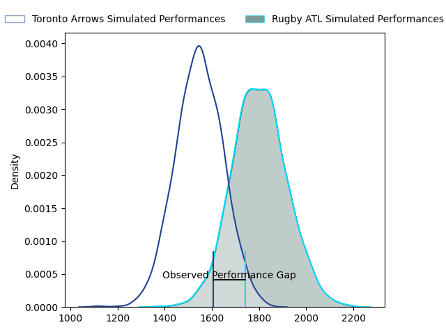
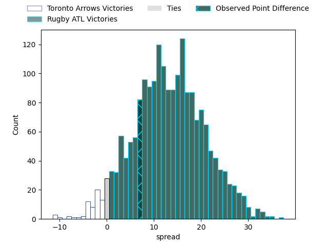
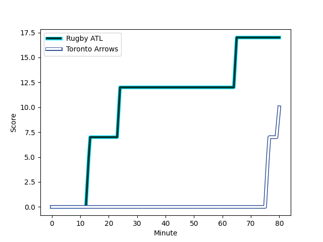
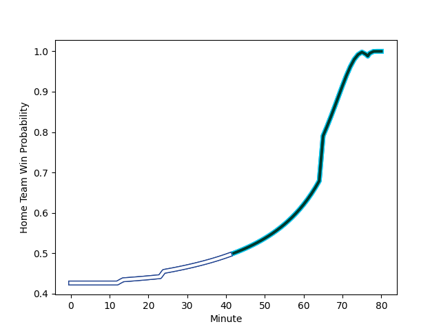

---  
layout: page  
title: Toronto Arrows at Rugby ATL; 10-17  
date: 2023-02-18 01:00:00 18:00:00 -0500  
categories: match review  
---
# Toronto Arrows at Rugby ATL; 10-17

# Club Level Predictions

The first set of predictions treats a club as the smallest object, as the club develops its members, organizes a gameplan, and deploys its players as needed for each match. This club model has a prediction of 0.802, which translates to predicting Rugby ATL to win by 12.7.

Each club has a rating and a rating deviation (simiar to a Glicko system), and expected performances can be generated. This allows for simulated matches and spreads like the ones below.
## Projected Performances

## Projected Spreads

## Projected Results

# Player Level Predictions

Treating teams instead as an entity made up of the currently active players, I have ratings for each player in an altogether different system. These can be combined to form team ratings once teamsheets are announced, weighting starters a bit higher than the reserves. After the match is played, players can be weighted by their minutes on the field, allowing for an accurate measure of the team's composition. With these compiled team ratings, we can make predictions, measure inaccuracy, and update the individual player ratings.
## Prediction with Player Minutes: Toronto Arrows by 8.9

Toronto Arrows by 12.9 on a neutral field
## Scores over Time

## Win Probability over Time

There were 4 large changes in win probability in this match
## Prediction without Player Minutes: Toronto Arrows by 8.9

Toronto Arrows by 12.9 on a neutral pitch

|   Away Minutes | Away Player                                                               |   Away elo |   Away Percentile |   Number |   Home Percentile |   Home elo | Home Player                                                            |   Home Minutes |
|---------------:|:--------------------------------------------------------------------------|-----------:|------------------:|---------:|------------------:|-----------:|:-----------------------------------------------------------------------|---------------:|
|             80 | [Conan O'Donnell](..//playerfiles//ConanO'Donnell_cleaned.md)             |      95    |               nan |        1 |                 0 |     -18.63 | [Alex Maughan](..//playerfiles//AlexMaughan_cleaned.md)                |             80 |
|             80 | [Conan O'Donnell](..//playerfiles//ConanO'Donnell_cleaned.md)             |      95    |               nan |        1 |                 0 |     -18.63 | [Alex Maughan](..//playerfiles//AlexMaughan_cleaned.md)                |             80 |
|             80 | [Gene Syminton](..//playerfiles//GeneSyminton_cleaned.md)                 |      95    |               nan |        2 |                 0 |      15.89 | [Tiaan Erasmus](..//playerfiles//TiaanErasmus_cleaned.md)              |             80 |
|             80 | [Isaac Salmon](..//playerfiles//IsaacSalmon_cleaned.md)                   |      95    |               nan |        3 |               nan |      95    | [John Roy Jenkinson](..//playerfiles//JohnRoyJenkinson_cleaned.md)     |             80 |
|             80 | [Mason Flesch](..//playerfiles//MasonFlesch_cleaned.md)                   |      11.68 |               nan |        4 |                32 |      89.41 | [Justin Johan Basson](..//playerfiles//JustinJohanBasson_cleaned.md)   |             80 |
|             80 | [Micaiah Torrance-Reid](..//playerfiles//MicaiahTorrance-Reid_cleaned.md) |      95    |               nan |        5 |                 1 |      52.47 | [Johannes Momsen](..//playerfiles//JohannesMomsen_cleaned.md)          |             80 |
|             80 | [Micaiah Torrance-Reid](..//playerfiles//MicaiahTorrance-Reid_cleaned.md) |      95    |               nan |        5 |                 4 |      52.47 | [Johannes Momsen](..//playerfiles//JohannesMomsen_cleaned.md)          |             80 |
|             80 | [Travis Larsen](..//playerfiles//TravisLarsen_cleaned.md)                 |      98.12 |                58 |        6 |               100 |     165.04 | [Vili Helu](..//playerfiles//ViliHelu_cleaned.md)                      |             80 |
|             80 | [Travis Larsen](..//playerfiles//TravisLarsen_cleaned.md)                 |      98.12 |                49 |        6 |               100 |     165.04 | [Vili Helu](..//playerfiles//ViliHelu_cleaned.md)                      |             80 |
|             80 | [Lucas Rumball](..//playerfiles//LucasRumball_cleaned.md)                 |      95    |               nan |        7 |                36 |      91.26 | [Daemon Torres](..//playerfiles//DaemonTorres_cleaned.md)              |             80 |
|             80 | [Corey Thomas](..//playerfiles//CoreyThomas_cleaned.md)                   |      95    |               nan |        8 |                 0 |      23.74 | [Jason Damm](..//playerfiles//JasonDamm_cleaned.md)                    |             80 |
|             80 | [Corey Thomas](..//playerfiles//CoreyThomas_cleaned.md)                   |      95    |               nan |        8 |                 0 |      23.74 | [Jason Damm](..//playerfiles//JasonDamm_cleaned.md)                    |             80 |
|             80 | [Ross Braude](..//playerfiles//RossBraude_cleaned.md)                     |      95    |               nan |        9 |                 4 |      68.8  | [Rowan Gouws](..//playerfiles//RowanGouws_cleaned.md)                  |             80 |
|             80 | [Sam Malcolm](..//playerfiles//SamMalcolm_cleaned.md)                     |      95    |               nan |       10 |               nan |      95    | [Kurt Kendall Coleman](..//playerfiles//KurtKendallColeman_cleaned.md) |             80 |
|             80 | [Nic Benn](..//playerfiles//NicBenn_cleaned.md)                           |      95    |               nan |       11 |               nan |      95    | [Jack Shaw](..//playerfiles//JackShaw_cleaned.md)                      |             80 |
|             80 | [Tautalatasi Tasi](..//playerfiles//TautalatasiTasi_cleaned.md)           |      95    |               nan |       12 |               nan |      95    | [Rewita Biddle](..//playerfiles//RewitaBiddle_cleaned.md)              |             80 |
|             80 | [Mitch Richardson](..//playerfiles//MitchRichardson_cleaned.md)           |      11.32 |                 0 |       13 |                99 |     196.94 | [Will Leonard](..//playerfiles//WillLeonard_cleaned.md)                |             80 |
|             80 | [Mitch Richardson](..//playerfiles//MitchRichardson_cleaned.md)           |      11.32 |                 0 |       13 |               100 |     196.94 | [Will Leonard](..//playerfiles//WillLeonard_cleaned.md)                |             80 |
|             80 | [Mitch Richardson](..//playerfiles//MitchRichardson_cleaned.md)           |      11.32 |                 0 |       13 |               100 |     196.94 | [Will Leonard](..//playerfiles//WillLeonard_cleaned.md)                |             80 |
|             80 | [Mitch Richardson](..//playerfiles//MitchRichardson_cleaned.md)           |      11.32 |                 0 |       13 |                99 |     196.94 | [Will Leonard](..//playerfiles//WillLeonard_cleaned.md)                |             80 |
|             80 | [Cole Davis](..//playerfiles//ColeDavis_cleaned.md)                       |      95    |               nan |       14 |                 0 |      -7.43 | [Austin White](..//playerfiles//AustinWhite_cleaned.md)                |             80 |
|             80 | [Cole Davis](..//playerfiles//ColeDavis_cleaned.md)                       |      95    |               nan |       14 |                 0 |      -7.43 | [Austin White](..//playerfiles//AustinWhite_cleaned.md)                |             80 |
|             80 | [Ciaran Breen](..//playerfiles//CiaranBreen_cleaned.md)                   |      95    |               nan |       15 |                 9 |      74.42 | [Martini Talapusi](..//playerfiles//MartiniTalapusi_cleaned.md)        |             80 |

