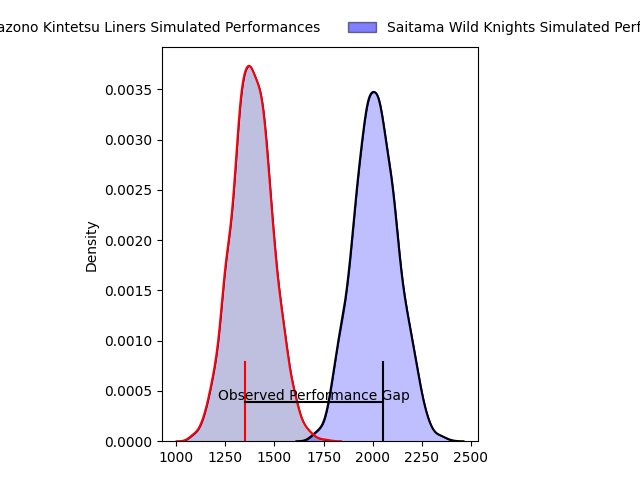
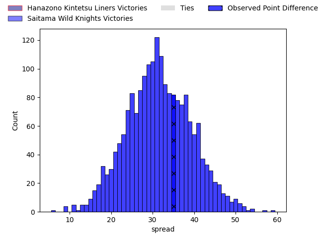
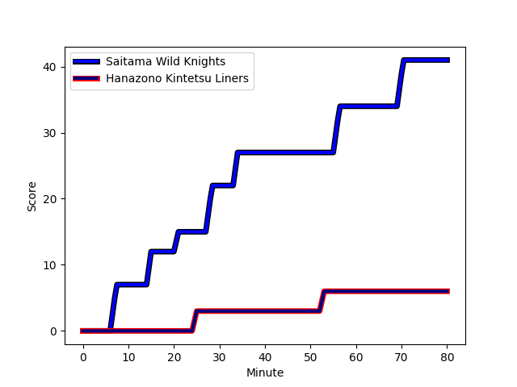
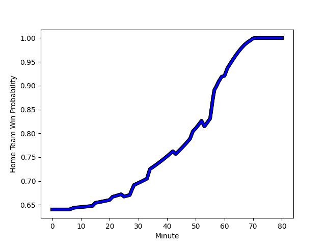

---  
layout: page  
title: Hanazono Kintetsu Liners at Saitama Wild Knights; 6-41  
date: 2023-02-18 06:30:00 18:00:00 -0500  
categories: match review  
---
# Hanazono Kintetsu Liners at Saitama Wild Knights; 6-41

# Club Level Predictions

The first set of predictions treats a club as the smallest object, as the club develops its members, organizes a gameplan, and deploys its players as needed for each match. This club model has a prediction of 0.968, which translates to predicting Saitama Wild Knights to win by 31.3.

Each club has a rating and a rating deviation (simiar to a Glicko system), and expected performances can be generated. This allows for simulated matches and spreads like the ones below.
## Projected Performances

## Projected Spreads

## Projected Results

# Player Level Predictions

Treating teams instead as an entity made up of the currently active players, I have ratings for each player in an altogether different system. These can be combined to form team ratings once teamsheets are announced, weighting starters a bit higher than the reserves. After the match is played, players can be weighted by their minutes on the field, allowing for an accurate measure of the team's composition. With these compiled team ratings, we can make predictions, measure inaccuracy, and update the individual player ratings.
## Prediction with Player Minutes: Saitama Wild Knights by 29.2

Saitama Wild Knights by 25.2 on a neutral field
## Scores over Time

## Win Probability over Time

There were 1 large changes in win probability in this match
## Prediction without Player Minutes: Saitama Wild Knights by 30.1

Saitama Wild Knights by 26.1 on a neutral pitch

|   Away Minutes | Away Player                                                               |   Away elo |   Away Percentile |   Number |   Home Percentile |   Home elo | Home Player                                                      |   Home Minutes |
|---------------:|:--------------------------------------------------------------------------|-----------:|------------------:|---------:|------------------:|-----------:|:-----------------------------------------------------------------|---------------:|
|             71 | [Kenta Tanaka](..//playerfiles//KentaTanaka_cleaned.md)                   |      89.31 |                29 |        1 |                72 |     101.29 | [Keita Inagaki](..//playerfiles//KeitaInagaki_cleaned.md)        |             49 |
|             61 | [Atsushi Kashimoto](..//playerfiles//AtsushiKashimoto_cleaned.md)         |     112.64 |                90 |        2 |               nan |      98.59 | [Shota Horie](..//playerfiles//ShotaHorie_cleaned.md)            |             49 |
|             61 | [Kota Mitake](..//playerfiles//KotaMitake_cleaned.md)                     |      88.94 |                28 |        3 |                75 |     102.2  | [Asaleli Valu](..//playerfiles//AsaleliValu_cleaned.md)          |             49 |
|             72 | [Tsuyoshi Murata](..//playerfiles//TsuyoshiMurata_cleaned.md)             |     101.94 |                69 |        4 |                94 |     121.77 | [Esei Ha'angana](..//playerfiles//EseiHa'angana_cleaned.md)      |             80 |
|             80 | [Takahito Sugahara](..//playerfiles//TakahitoSugahara_cleaned.md)         |      88.7  |                29 |        5 |                85 |     110.48 | [Lodewyk de Jager](..//playerfiles//LodewykdeJager_cleaned.md)   |             50 |
|             80 | [Shohei Nonaka](..//playerfiles//ShoheiNonaka_cleaned.md)                 |     115.54 |                89 |        6 |                59 |      98.6  | [Ben Gunter](..//playerfiles//BenGunter_cleaned.md)              |             80 |
|             61 | [Jed Brown](..//playerfiles//JedBrown_cleaned.md)                         |      82.85 |                16 |        7 |                57 |      99.21 | [Lachlan Boshier](..//playerfiles//LachlanBoshier_cleaned.md)    |             80 |
|             80 | [Waimana Kapa](..//playerfiles//WaimanaKapa_cleaned.md)                   |      95    |               nan |        8 |                93 |     121.64 | [Shota Fukui](..//playerfiles//ShotaFukui_cleaned.md)            |             71 |
|             71 | [William Genia](..//playerfiles//WilliamGenia_cleaned.md)                 |      57.01 |                 1 |        9 |                99 |     144.31 | [Taiki Koyama](..//playerfiles//TaikiKoyama_cleaned.md)          |             60 |
|             58 | [Jackson Garden-Bachop](..//playerfiles//JacksonGarden-Bachop_cleaned.md) |      67.03 |                 3 |       10 |                84 |     112.8  | [Takuya Yamasawa](..//playerfiles//TakuyaYamasawa_cleaned.md)    |             80 |
|             80 | [Koji Okamura](..//playerfiles//KojiOkamura_cleaned.md)                   |      83.1  |                17 |       11 |               nan |      95    | [Tatsuhiro Tanji](..//playerfiles//TatsuhiroTanji_cleaned.md)    |             80 |
|             80 | [Patrick Stehlin](..//playerfiles//PatrickStehlin_cleaned.md)             |     141.39 |                99 |       12 |                62 |     100.94 | [Vince Aso](..//playerfiles//VinceAso_cleaned.md)                |             60 |
|             80 | [Sioasia Fifita](..//playerfiles//SioasiaFifita_cleaned.md)               |      61.53 |                 2 |       13 |                76 |     104.78 | [Tomoki Osada](..//playerfiles//TomokiOsada_cleaned.md)          |             80 |
|             80 | [Tomoya Kimura](..//playerfiles//TomoyaKimura_cleaned.md)                 |      99.49 |                62 |       14 |                98 |     134.18 | [Koki Takeyama](..//playerfiles//KokiTakeyama_cleaned.md)        |             43 |
|             58 | [Tatsuma Nanto](..//playerfiles//TatsumaNanto_cleaned.md)                 |     117.96 |               nan |       15 |                92 |     119.58 | [Ryuji Noguchi](..//playerfiles//RyujiNoguchi_cleaned.md)        |             80 |
|             22 | [Takumi Yoshimoto](..//playerfiles//TakumiYoshimoto_cleaned.md)           |      87.16 |                22 |       16 |                81 |     107.03 | [Rikiya Matsuda](..//playerfiles//RikiyaMatsuda_cleaned.md)      |             37 |
|             22 | [Joshua Nohra](..//playerfiles//JoshuaNohra_cleaned.md)                   |      85.68 |                21 |       17 |                85 |     107.38 | [Craig Millar](..//playerfiles//CraigMillar_cleaned.md)          |             31 |
|             19 | [Lata Tangimana](..//playerfiles//LataTangimana_cleaned.md)               |      73.05 |                 6 |       18 |                90 |     111.64 | [Atsushi Sakate](..//playerfiles//AtsushiSakate_cleaned.md)      |             31 |
|             19 | [Shota Hirono](..//playerfiles//ShotaHirono_cleaned.md)                   |      93.84 |                46 |       19 |                82 |     105.24 | [Taiki Fujii](..//playerfiles//TaikiFujii_cleaned.md)            |             31 |
|             19 | [Patrick Tafa](..//playerfiles//PatrickTafa_cleaned.md)                   |      86.92 |                49 |       20 |                75 |     106.59 | [Ryota Hasegawa](..//playerfiles//RyotaHasegawa_cleaned.md)      |             30 |
|              9 | [Kotaro Takahashi](..//playerfiles//KotaroTakahashi_cleaned.md)           |      99.55 |                66 |       21 |                82 |     108    | [Damian de Allende](..//playerfiles//DamiandeAllende_cleaned.md) |             20 |
|              9 | [Keitaro Hitora](..//playerfiles//KeitaroHitora_cleaned.md)               |     100.11 |                82 |       22 |                72 |     102.61 | [Keisuke Uchida](..//playerfiles//KeisukeUchida_cleaned.md)      |             20 |
|              8 | [Hayato Yokoi](..//playerfiles//HayatoYokoi_cleaned.md)                   |      96.48 |                57 |       23 |                78 |     106.26 | [Jack Cornelsen](..//playerfiles//JackCornelsen_cleaned.md)      |              9 |

