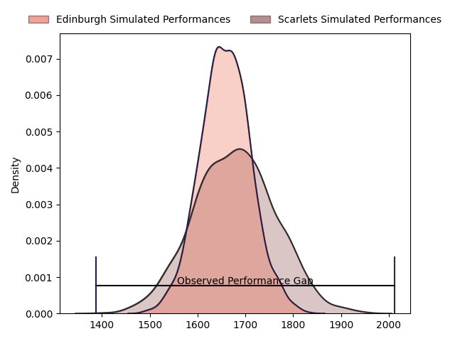
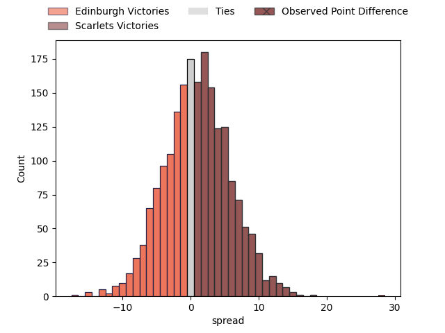
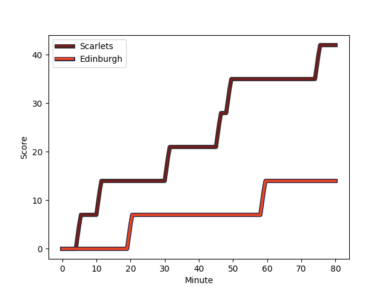
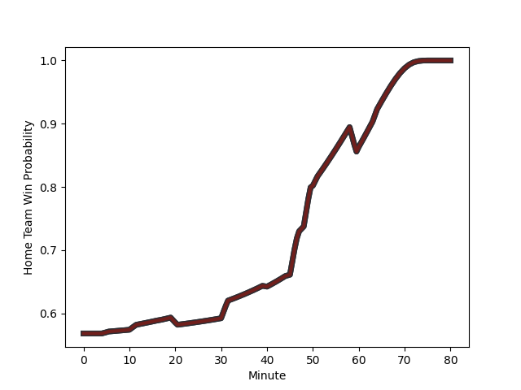

---  
layout: page  
title: Edinburgh at Scarlets; 14-42  
date: 2023-02-18 18:15:00 18:00:00 -0500  
categories: match review  
---
# Edinburgh at Scarlets; 14-42

# Club Level Predictions

The first set of predictions treats a club as the smallest object, as the club develops its members, organizes a gameplan, and deploys its players as needed for each match. This club model has a prediction of 0.529, which translates to predicting Scarlets to win by 1.0.

Each club has a rating and a rating deviation (simiar to a Glicko system), and expected performances can be generated. This allows for simulated matches and spreads like the ones below.
## Projected Performances

## Projected Spreads

## Projected Results

# Player Level Predictions

Treating teams instead as an entity made up of the currently active players, I have ratings for each player in an altogether different system. These can be combined to form team ratings once teamsheets are announced, weighting starters a bit higher than the reserves. After the match is played, players can be weighted by their minutes on the field, allowing for an accurate measure of the team's composition. With these compiled team ratings, we can make predictions, measure inaccuracy, and update the individual player ratings.
## Prediction with Player Minutes: Scarlets by 15.9

Scarlets by 11.9 on a neutral field
## Scores over Time

## Win Probability over Time

There were 3 large changes in win probability in this match
## Prediction without Player Minutes: Scarlets by 15.5

Scarlets by 11.5 on a neutral pitch

|   Away Minutes | Away Player                                                                   |   Away elo |   Away Percentile |   Number |   Home Percentile |   Home elo | Home Player                                                          |   Home Minutes |
|---------------:|:------------------------------------------------------------------------------|-----------:|------------------:|---------:|------------------:|-----------:|:---------------------------------------------------------------------|---------------:|
|             70 | [Abram Adrian Boan Venter](..//playerfiles//AbramAdrianBoanVenter_cleaned.md) |      86.04 |                19 |        1 |                83 |     106.21 | [Kemsley Mathias](..//playerfiles//KemsleyMathias_cleaned.md)        |             60 |
|             51 | [Adam McBurney](..//playerfiles//AdamMcBurney_cleaned.md)                     |      97.95 |                61 |        2 |               nan |      93.62 | [Shaun Evans](..//playerfiles//ShaunEvans_cleaned.md)                |             60 |
|             50 | [Murray McCallum](..//playerfiles//MurrayMcCallum_cleaned.md)                 |      97.63 |                59 |        3 |                30 |      89.61 | [Sam Wainwright](..//playerfiles//SamWainwright_cleaned.md)          |             60 |
|             45 | [Glen Young](..//playerfiles//GlenYoung_cleaned.md)                           |      88.66 |                30 |        4 |                91 |     114.98 | [Sam Lousi](..//playerfiles//SamLousi_cleaned.md)                    |             73 |
|             80 | [Jamie Hodgson](..//playerfiles//JamieHodgson_cleaned.md)                     |      94.69 |                41 |        5 |                30 |      89.43 | [Morgan Jones](..//playerfiles//MorganJones_cleaned.md)              |             80 |
|             80 | [Nick Haining](..//playerfiles//NickHaining_cleaned.md)                       |      97.08 |                54 |        6 |                69 |     101.57 | [Vaea Fifita](..//playerfiles//VaeaFifita_cleaned.md)                |             80 |
|             64 | [Hamish Watson](..//playerfiles//HamishWatson_cleaned.md)                     |      99.29 |                63 |        7 |                73 |     104.33 | [Daniel Fabian Davis](..//playerfiles//DanielFabianDavis_cleaned.md) |             70 |
|             80 | [Viliame Mata](..//playerfiles//ViliameMata_cleaned.md)                       |      93.08 |                41 |        8 |                87 |     112.45 | [Sione Kalamafoni](..//playerfiles//SioneKalamafoni_cleaned.md)      |             80 |
|             47 | [Charlie Shiel](..//playerfiles//CharlieShiel_cleaned.md)                     |     103.53 |                72 |        9 |                54 |      96.04 | [Gareth Davies](..//playerfiles//GarethDavies_cleaned.md)            |             60 |
|             80 | [Charlie Savala](..//playerfiles//CharlieSavala_cleaned.md)                   |      94.07 |                45 |       10 |                76 |     104.49 | [Sam Costelow](..//playerfiles//SamCostelow_cleaned.md)              |             40 |
|             80 | [Jack Blain](..//playerfiles//JackBlain_cleaned.md)                           |     110.82 |                85 |       11 |                72 |     102.8  | [Ryan Conbeer](..//playerfiles//RyanConbeer_cleaned.md)              |             50 |
|             80 | [James Lang](..//playerfiles//JamesLang_cleaned.md)                           |      86.23 |                24 |       12 |                83 |     108.88 | [Ioan Nicholas](..//playerfiles//IoanNicholas_cleaned.md)            |             80 |
|             64 | [Mark Bennett](..//playerfiles//MarkBennett_cleaned.md)                       |     100.72 |                67 |       13 |                77 |     105.1  | [Joe Roberts](..//playerfiles//JoeRoberts_cleaned.md)                |             80 |
|             80 | [Damien Hoyland](..//playerfiles//DamienHoyland_cleaned.md)                   |      95.17 |                33 |       14 |                85 |     110.48 | [Steffan Evans](..//playerfiles//SteffanEvans_cleaned.md)            |             80 |
|             17 | [Wes Goosen](..//playerfiles//WesGoosen_cleaned.md)                           |      88.07 |                28 |       15 |                76 |     106.76 | [Johnny McNicholl](..//playerfiles//JohnnyMcNicholl_cleaned.md)      |             80 |
|             63 | [Jaco van der Walt](..//playerfiles//JacovanderWalt_cleaned.md)               |      88.57 |               nan |       16 |               nan |      95.73 | [Dan Jones](..//playerfiles//DanJones_cleaned.md)                    |             40 |
|             35 | [Marshall Sykes](..//playerfiles//MarshallSykes_cleaned.md)                   |      93.47 |                47 |       17 |               nan |      95    | [Eddie James](..//playerfiles//EddieJames_cleaned.md)                |             30 |
|             33 | [Ben Vellacott](..//playerfiles//BenVellacott_cleaned.md)                     |      88.77 |                29 |       18 |                38 |      91.44 | [Taylor Davies](..//playerfiles//TaylorDavies_cleaned.md)            |             20 |
|             30 | [Lee-Roy Atalifo](..//playerfiles//Lee-RoyAtalifo_cleaned.md)                 |      95.03 |               nan |       19 |                53 |      95.89 | [Javan Sebastian](..//playerfiles//JavanSebastian_cleaned.md)        |             20 |
|             29 | [Patrick Harrison](..//playerfiles//PatrickHarrison_cleaned.md)               |      86.65 |                29 |       20 |                73 |     101.66 | [Steff Thomas](..//playerfiles//SteffThomas_cleaned.md)              |             20 |
|             16 | [Conor Boyle](..//playerfiles//ConorBoyle_cleaned.md)                         |      90.22 |                34 |       21 |                63 |      99.88 | [Dan Blacker](..//playerfiles//DanBlacker_cleaned.md)                |             20 |
|             16 | [Chris Dean](..//playerfiles//ChrisDean_cleaned.md)                           |      82.46 |                15 |       22 |                45 |      94.47 | [Carwyn Tuipulotu](..//playerfiles//CarwynTuipulotu_cleaned.md)      |              7 |
|             10 | [Jamie Jack](..//playerfiles//JamieJack_cleaned.md)                           |      77.81 |                 8 |       23 |               nan |      95    | [Ben Williams](..//playerfiles//BenWilliams_cleaned.md)              |             10 |

