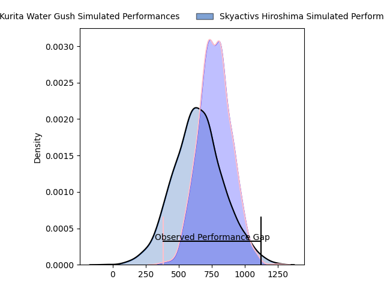
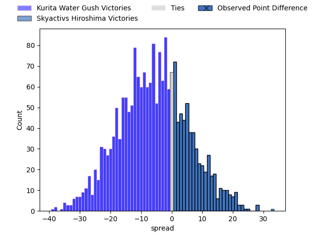
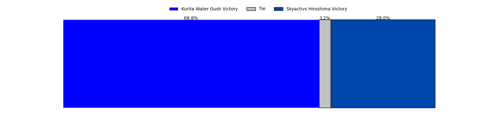
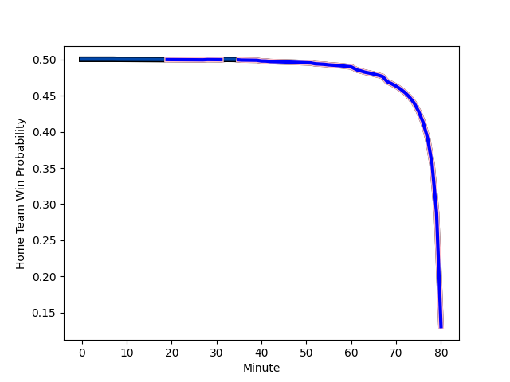

---  
layout: page  
title: Kurita Water Gush at Skyactivs Hiroshima; 5-38  
date: 2023-02-18 00:00:00 18:00:00 -0500  
categories: match review  
---
# Kurita Water Gush at Skyactivs Hiroshima; 5-38

# Club Level Predictions

The first set of predictions treats a club as the smallest object, as the club develops its members, organizes a gameplan, and deploys its players as needed for each match. This club model has a prediction of 0.345, which translates to predicting Kurita Water Gush to win by 6.0.

Each club has a rating and a rating deviation (simiar to a Glicko system), and expected performances can be generated. This allows for simulated matches and spreads like the ones below.
## Projected Performances

## Projected Spreads

## Projected Results

# Player Level Predictions

Treating teams instead as an entity made up of the currently active players, I have ratings for each player in an altogether different system. These can be combined to form team ratings once teamsheets are announced, weighting starters a bit higher than the reserves. After the match is played, players can be weighted by their minutes on the field, allowing for an accurate measure of the team's composition. With these compiled team ratings, we can make predictions, measure inaccuracy, and update the individual player ratings.
## Prediction with Player Minutes: Skyactivs Hiroshima by 4.1

Skyactivs Hiroshima by 0.1 on a neutral field
## Scores over Time

## Win Probability over Time

There were 3 large changes in win probability in this match
## Prediction without Player Minutes: Skyactivs Hiroshima by 4.6

Skyactivs Hiroshima by 0.6 on a neutral pitch

|   Away Minutes | Away Player                                                               |   Away elo |   Away Percentile |   Number |   Home Percentile |   Home elo | Home Player                                                       |   Home Minutes |
|---------------:|:--------------------------------------------------------------------------|-----------:|------------------:|---------:|------------------:|-----------:|:------------------------------------------------------------------|---------------:|
|             59 | [Shoya Koyama](..//playerfiles//ShoyaKoyama_cleaned.md)                   |      79.86 |                11 |        1 |                16 |      84.06 | [Koshiro Shigenobu](..//playerfiles//KoshiroShigenobu_cleaned.md) |             75 |
|             40 | [Kota Hojo](..//playerfiles//KotaHojo_cleaned.md)                         |      95.15 |                53 |        2 |                10 |      79.35 | [Tomohiro Takeda](..//playerfiles//TomohiroTakeda_cleaned.md)     |             75 |
|             53 | [Masachi Debuchi](..//playerfiles//MasachiDebuchi_cleaned.md)             |      78.24 |               nan |        3 |                13 |      81.83 | [Tomoya Otake](..//playerfiles//TomoyaOtake_cleaned.md)           |             68 |
|             28 | [Kota Nakamura](..//playerfiles//KotaNakamura_cleaned.md)                 |      69.92 |                 5 |        4 |                51 |      95.16 | [Kaiha Noda](..//playerfiles//KaihaNoda_cleaned.md)               |             75 |
|             80 | [Daymon Leasuasu](..//playerfiles//DaymonLeasuasu_cleaned.md)             |      81.64 |                15 |        5 |                12 |      79.14 | [Lachlan Osborne](..//playerfiles//LachlanOsborne_cleaned.md)     |             68 |
|             55 | [Yosuke Ishii](..//playerfiles//YosukeIshii_cleaned.md)                   |      82    |                14 |        6 |                68 |     101.87 | [Koki Nakano](..//playerfiles//KokiNakano_cleaned.md)             |             80 |
|             80 | [Hiroki Kawase](..//playerfiles//HirokiKawase_cleaned.md)                 |      61.88 |                 3 |        7 |                11 |      81.38 | [Rame Sato](..//playerfiles//RameSato_cleaned.md)                 |             80 |
|             80 | [Feinga Kihe Lotu Fakai](..//playerfiles//FeingaKiheLotuFakai_cleaned.md) |      84.55 |                19 |        8 |                 9 |      77.04 | [Iori Suzuki](..//playerfiles//IoriSuzuki_cleaned.md)             |             80 |
|             55 | [Sho Nakamura](..//playerfiles//ShoNakamura_cleaned.md)                   |      89.92 |                34 |        9 |               nan |      93.38 | [Jacob Abel](..//playerfiles//JacobAbel_cleaned.md)               |             80 |
|             80 | [Takuro Hayashida](..//playerfiles//TakuroHayashida_cleaned.md)           |      82.92 |                16 |       10 |                12 |      79.3  | [Kotaro Tatsuno](..//playerfiles//KotaroTatsuno_cleaned.md)       |             80 |
|             80 | [Keigo Hamazoe](..//playerfiles//KeigoHamazoe_cleaned.md)                 |      77.68 |                11 |       11 |                 2 |      57.4  | [Shuhei Lee](..//playerfiles//ShuheiLee_cleaned.md)               |             75 |
|             80 | [Andrew Deegan](..//playerfiles//AndrewDeegan_cleaned.md)                 |      91    |                35 |       12 |                30 |      88.34 | [Ren Ouchi](..//playerfiles//RenOuchi_cleaned.md)                 |             68 |
|             59 | [Antonio Mikaele-Tu'u](..//playerfiles//AntonioMikaele-Tu'u_cleaned.md)   |      93.43 |                46 |       13 |                56 |      98.35 | [Tevita Tai](..//playerfiles//TevitaTai_cleaned.md)               |             80 |
|             80 | [Tom English](..//playerfiles//TomEnglish_cleaned.md)                     |      99.17 |                63 |       14 |                60 |      98.57 | [Sora Ohchi](..//playerfiles//SoraOhchi_cleaned.md)               |             80 |
|             63 | [Koshi Emoto](..//playerfiles//KoshiEmoto_cleaned.md)                     |     108.75 |                81 |       15 |                 2 |      56.69 | [Ginjiro Sakiguchi](..//playerfiles//GinjiroSakiguchi_cleaned.md) |             76 |
|             52 | [Kai Yamasaki](..//playerfiles//KaiYamasaki_cleaned.md)                   |      95.09 |               nan |       16 |                57 |      97.32 | [Yutaro Tanaka](..//playerfiles//YutaroTanaka_cleaned.md)         |             12 |
|             40 | [Ryota Kuribara](..//playerfiles//RyotaKuribara_cleaned.md)               |      69.99 |                 3 |       17 |                43 |      92.71 | [Rikuto Nakashima](..//playerfiles//RikutoNakashima_cleaned.md)   |             12 |
|             27 | [Aki Kajiwara](..//playerfiles//AkiKajiwara_cleaned.md)                   |      79.2  |                 8 |       18 |               nan |      95    | [James Combrinck](..//playerfiles//JamesCombrinck_cleaned.md)     |             12 |
|             25 | [Ryo Omasa](..//playerfiles//RyoOmasa_cleaned.md)                         |      83.68 |                15 |       19 |                 7 |      76.06 | [Ryoutarou Saito](..//playerfiles//RyoutarouSaito_cleaned.md)     |              5 |
|             25 | [Kengo Nakamura](..//playerfiles//KengoNakamura_cleaned.md)               |      68.9  |                 4 |       20 |                71 |     101.99 | [Tomonori Koyanagi](..//playerfiles//TomonoriKoyanagi_cleaned.md) |              5 |
|             21 | [Megumi Tagusagawa](..//playerfiles//MegumiTagusagawa_cleaned.md)         |      98.11 |               nan |       21 |                17 |      86.07 | [Ryo Nagata](..//playerfiles//RyoNagata_cleaned.md)               |              5 |
|             21 | [Ayato Sakamoto](..//playerfiles//AyatoSakamoto_cleaned.md)               |      65.95 |                 5 |       22 |                82 |     109.09 | [Tevin Ferris](..//playerfiles//TevinFerris_cleaned.md)           |              5 |
|             17 | [Shinpei Suganuma](..//playerfiles//ShinpeiSuganuma_cleaned.md)           |      59.23 |                 3 |       23 |               nan |      79.09 | [Yuki Mori](..//playerfiles//YukiMori_cleaned.md)                 |              4 |

