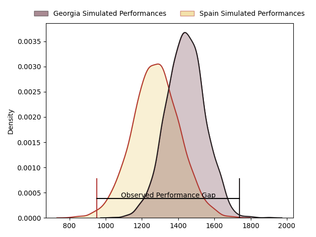
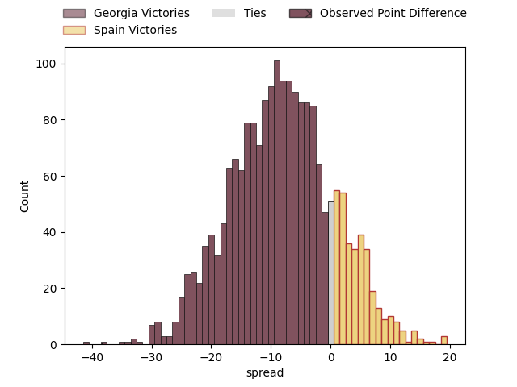
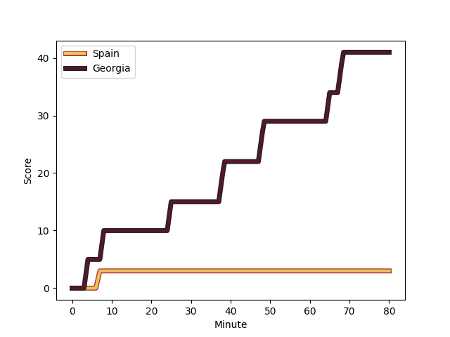
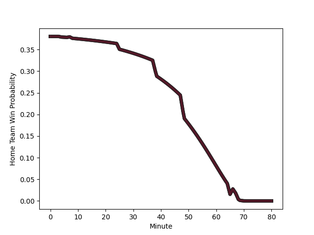

---  
layout: page  
title: Georgia at Spain; 41-3  
date: 2023-02-18 19:00:00 18:00:00 -0500  
categories: match review  
---
# Georgia at Spain; 41-3

# Club Level Predictions

The first set of predictions treats a club as the smallest object, as the club develops its members, organizes a gameplan, and deploys its players as needed for each match. This club model has a prediction of 0.286, which translates to predicting Georgia to win by 8.4.

Each club has a rating and a rating deviation (simiar to a Glicko system), and expected performances can be generated. This allows for simulated matches and spreads like the ones below.
## Projected Performances

## Projected Spreads

## Projected Results

# Player Level Predictions

Treating teams instead as an entity made up of the currently active players, I have ratings for each player in an altogether different system. These can be combined to form team ratings once teamsheets are announced, weighting starters a bit higher than the reserves. After the match is played, players can be weighted by their minutes on the field, allowing for an accurate measure of the team's composition. With these compiled team ratings, we can make predictions, measure inaccuracy, and update the individual player ratings.
## Prediction with Player Minutes: Georgia by 17.2

Georgia by 21.2 on a neutral field
## Scores over Time

## Win Probability over Time

There were 2 large changes in win probability in this match
## Prediction without Player Minutes: Georgia by 15.9

Georgia by 19.9 on a neutral pitch

|   Away Minutes | Away Player                                                               |   Away elo |   Away Percentile |   Number |   Home Percentile |   Home elo | Home Player                                                                          |   Home Minutes |
|---------------:|:--------------------------------------------------------------------------|-----------:|------------------:|---------:|------------------:|-----------:|:-------------------------------------------------------------------------------------|---------------:|
|             80 | [Nika Abuladze](..//playerfiles//NikaAbuladze_cleaned.md)                 |     105.09 |                87 |        1 |                 8 |      78.23 | [Thierry Futeu Youtcheu](..//playerfiles//ThierryFuteuYoutcheu_cleaned.md)           |             80 |
|             80 | [Nika Abuladze](..//playerfiles//NikaAbuladze_cleaned.md)                 |     105.09 |                81 |        1 |                 8 |      78.23 | [Thierry Futeu Youtcheu](..//playerfiles//ThierryFuteuYoutcheu_cleaned.md)           |             80 |
|             56 | [Nika Abuladze](..//playerfiles//NikaAbuladze_cleaned.md)                 |     105.09 |                87 |        1 |                 8 |      78.23 | [Thierry Futeu Youtcheu](..//playerfiles//ThierryFuteuYoutcheu_cleaned.md)           |             80 |
|             56 | [Nika Abuladze](..//playerfiles//NikaAbuladze_cleaned.md)                 |     105.09 |                81 |        1 |                 8 |      78.23 | [Thierry Futeu Youtcheu](..//playerfiles//ThierryFuteuYoutcheu_cleaned.md)           |             80 |
|             80 | [Nika Abuladze](..//playerfiles//NikaAbuladze_cleaned.md)                 |     105.09 |                87 |        1 |                 8 |      78.23 | [Thierry Futeu Youtcheu](..//playerfiles//ThierryFuteuYoutcheu_cleaned.md)           |             51 |
|             80 | [Nika Abuladze](..//playerfiles//NikaAbuladze_cleaned.md)                 |     105.09 |                81 |        1 |                 8 |      78.23 | [Thierry Futeu Youtcheu](..//playerfiles//ThierryFuteuYoutcheu_cleaned.md)           |             51 |
|             56 | [Nika Abuladze](..//playerfiles//NikaAbuladze_cleaned.md)                 |     105.09 |                87 |        1 |                 8 |      78.23 | [Thierry Futeu Youtcheu](..//playerfiles//ThierryFuteuYoutcheu_cleaned.md)           |             51 |
|             56 | [Nika Abuladze](..//playerfiles//NikaAbuladze_cleaned.md)                 |     105.09 |                81 |        1 |                 8 |      78.23 | [Thierry Futeu Youtcheu](..//playerfiles//ThierryFuteuYoutcheu_cleaned.md)           |             51 |
|             80 | [Shalva Mamukashvili](..//playerfiles//ShalvaMamukashvili_cleaned.md)     |     114.17 |                92 |        2 |                78 |     101.71 | [Pablo Miejimolle](..//playerfiles//PabloMiejimolle_cleaned.md)                      |             45 |
|             61 | [Shalva Mamukashvili](..//playerfiles//ShalvaMamukashvili_cleaned.md)     |     114.17 |                88 |        2 |                78 |     101.71 | [Pablo Miejimolle](..//playerfiles//PabloMiejimolle_cleaned.md)                      |             80 |
|             61 | [Shalva Mamukashvili](..//playerfiles//ShalvaMamukashvili_cleaned.md)     |     114.17 |                92 |        2 |                78 |     101.71 | [Pablo Miejimolle](..//playerfiles//PabloMiejimolle_cleaned.md)                      |             80 |
|             80 | [Shalva Mamukashvili](..//playerfiles//ShalvaMamukashvili_cleaned.md)     |     114.17 |                88 |        2 |                78 |     101.71 | [Pablo Miejimolle](..//playerfiles//PabloMiejimolle_cleaned.md)                      |             80 |
|             80 | [Shalva Mamukashvili](..//playerfiles//ShalvaMamukashvili_cleaned.md)     |     114.17 |                92 |        2 |                78 |     101.71 | [Pablo Miejimolle](..//playerfiles//PabloMiejimolle_cleaned.md)                      |             80 |
|             61 | [Shalva Mamukashvili](..//playerfiles//ShalvaMamukashvili_cleaned.md)     |     114.17 |                88 |        2 |                78 |     101.71 | [Pablo Miejimolle](..//playerfiles//PabloMiejimolle_cleaned.md)                      |             45 |
|             61 | [Shalva Mamukashvili](..//playerfiles//ShalvaMamukashvili_cleaned.md)     |     114.17 |                92 |        2 |                78 |     101.71 | [Pablo Miejimolle](..//playerfiles//PabloMiejimolle_cleaned.md)                      |             45 |
|             80 | [Shalva Mamukashvili](..//playerfiles//ShalvaMamukashvili_cleaned.md)     |     114.17 |                88 |        2 |                78 |     101.71 | [Pablo Miejimolle](..//playerfiles//PabloMiejimolle_cleaned.md)                      |             45 |
|             56 | [Beka Gigashvili](..//playerfiles//BekaGigashvili_cleaned.md)             |      82.72 |                24 |        3 |                66 |     100.07 | [Joaquin Dominguez](..//playerfiles//JoaquinDominguez_cleaned.md)                    |             45 |
|             80 | [Beka Gigashvili](..//playerfiles//BekaGigashvili_cleaned.md)             |      82.72 |                14 |        3 |                66 |     100.07 | [Joaquin Dominguez](..//playerfiles//JoaquinDominguez_cleaned.md)                    |             80 |
|             80 | [Beka Gigashvili](..//playerfiles//BekaGigashvili_cleaned.md)             |      82.72 |                24 |        3 |                66 |     100.07 | [Joaquin Dominguez](..//playerfiles//JoaquinDominguez_cleaned.md)                    |             80 |
|             56 | [Beka Gigashvili](..//playerfiles//BekaGigashvili_cleaned.md)             |      82.72 |                14 |        3 |                66 |     100.07 | [Joaquin Dominguez](..//playerfiles//JoaquinDominguez_cleaned.md)                    |             80 |
|             56 | [Beka Gigashvili](..//playerfiles//BekaGigashvili_cleaned.md)             |      82.72 |                24 |        3 |                66 |     100.07 | [Joaquin Dominguez](..//playerfiles//JoaquinDominguez_cleaned.md)                    |             80 |
|             80 | [Beka Gigashvili](..//playerfiles//BekaGigashvili_cleaned.md)             |      82.72 |                14 |        3 |                66 |     100.07 | [Joaquin Dominguez](..//playerfiles//JoaquinDominguez_cleaned.md)                    |             45 |
|             80 | [Beka Gigashvili](..//playerfiles//BekaGigashvili_cleaned.md)             |      82.72 |                24 |        3 |                66 |     100.07 | [Joaquin Dominguez](..//playerfiles//JoaquinDominguez_cleaned.md)                    |             45 |
|             56 | [Beka Gigashvili](..//playerfiles//BekaGigashvili_cleaned.md)             |      82.72 |                14 |        3 |                66 |     100.07 | [Joaquin Dominguez](..//playerfiles//JoaquinDominguez_cleaned.md)                    |             45 |
|             80 | [Nodar Cheishvili](..//playerfiles//NodarCheishvili_cleaned.md)           |     113.85 |                90 |        4 |                50 |      97.49 | [Alejandro Suarez](..//playerfiles//AlejandroSuarez_cleaned.md)                      |             80 |
|             57 | [Konstantin Mikautadze](..//playerfiles//KonstantinMikautadze_cleaned.md) |      95.24 |                52 |        5 |               nan |      95    | [Manuel Mora-Ruiz](..//playerfiles//ManuelMora-Ruiz_cleaned.md)                      |             80 |
|             80 | [Konstantin Mikautadze](..//playerfiles//KonstantinMikautadze_cleaned.md) |      95.24 |                52 |        5 |               nan |      95    | [Manuel Mora-Ruiz](..//playerfiles//ManuelMora-Ruiz_cleaned.md)                      |             58 |
|             80 | [Konstantin Mikautadze](..//playerfiles//KonstantinMikautadze_cleaned.md) |      95.24 |                67 |        5 |               nan |      95    | [Manuel Mora-Ruiz](..//playerfiles//ManuelMora-Ruiz_cleaned.md)                      |             58 |
|             57 | [Konstantin Mikautadze](..//playerfiles//KonstantinMikautadze_cleaned.md) |      95.24 |                52 |        5 |               nan |      95    | [Manuel Mora-Ruiz](..//playerfiles//ManuelMora-Ruiz_cleaned.md)                      |             58 |
|             80 | [Konstantin Mikautadze](..//playerfiles//KonstantinMikautadze_cleaned.md) |      95.24 |                52 |        5 |               nan |      95    | [Manuel Mora-Ruiz](..//playerfiles//ManuelMora-Ruiz_cleaned.md)                      |             80 |
|             80 | [Konstantin Mikautadze](..//playerfiles//KonstantinMikautadze_cleaned.md) |      95.24 |                67 |        5 |               nan |      95    | [Manuel Mora-Ruiz](..//playerfiles//ManuelMora-Ruiz_cleaned.md)                      |             80 |
|             57 | [Konstantin Mikautadze](..//playerfiles//KonstantinMikautadze_cleaned.md) |      95.24 |                67 |        5 |               nan |      95    | [Manuel Mora-Ruiz](..//playerfiles//ManuelMora-Ruiz_cleaned.md)                      |             80 |
|             57 | [Konstantin Mikautadze](..//playerfiles//KonstantinMikautadze_cleaned.md) |      95.24 |                67 |        5 |               nan |      95    | [Manuel Mora-Ruiz](..//playerfiles//ManuelMora-Ruiz_cleaned.md)                      |             58 |
|             62 | [Giorgi Tsutskiridze](..//playerfiles//GiorgiTsutskiridze_cleaned.md)     |      99.16 |                71 |        6 |                29 |      88.27 | [Mario Pichardie](..//playerfiles//MarioPichardie_cleaned.md)                        |             80 |
|             80 | [Giorgi Tsutskiridze](..//playerfiles//GiorgiTsutskiridze_cleaned.md)     |      99.16 |                71 |        6 |                29 |      88.27 | [Mario Pichardie](..//playerfiles//MarioPichardie_cleaned.md)                        |             80 |
|             80 | [Giorgi Tsutskiridze](..//playerfiles//GiorgiTsutskiridze_cleaned.md)     |      99.16 |                63 |        6 |                29 |      88.27 | [Mario Pichardie](..//playerfiles//MarioPichardie_cleaned.md)                        |             80 |
|             62 | [Giorgi Tsutskiridze](..//playerfiles//GiorgiTsutskiridze_cleaned.md)     |      99.16 |                63 |        6 |                29 |      88.27 | [Mario Pichardie](..//playerfiles//MarioPichardie_cleaned.md)                        |             80 |
|             80 | [Beka Saghinadze](..//playerfiles//BekaSaghinadze_cleaned.md)             |      93.83 |                45 |        7 |                10 |      79.48 | [Matthew Foulds](..//playerfiles//MatthewFoulds_cleaned.md)                          |             63 |
|             80 | [Beka Saghinadze](..//playerfiles//BekaSaghinadze_cleaned.md)             |      93.83 |                45 |        7 |                10 |      79.48 | [Matthew Foulds](..//playerfiles//MatthewFoulds_cleaned.md)                          |             80 |
|             80 | [Tornike Jalagonia](..//playerfiles//TornikeJalagonia_cleaned.md)         |     110.97 |                84 |        8 |                35 |      91.06 | [Facundo Nahuel Dominguez](..//playerfiles//FacundoNahuelDominguez_cleaned.md)       |             44 |
|             80 | [Tornike Jalagonia](..//playerfiles//TornikeJalagonia_cleaned.md)         |     110.97 |                73 |        8 |                35 |      91.06 | [Facundo Nahuel Dominguez](..//playerfiles//FacundoNahuelDominguez_cleaned.md)       |             44 |
|             80 | [Tornike Jalagonia](..//playerfiles//TornikeJalagonia_cleaned.md)         |     110.97 |                73 |        8 |                35 |      91.06 | [Facundo Nahuel Dominguez](..//playerfiles//FacundoNahuelDominguez_cleaned.md)       |             80 |
|             80 | [Tornike Jalagonia](..//playerfiles//TornikeJalagonia_cleaned.md)         |     110.97 |                84 |        8 |                35 |      91.06 | [Facundo Nahuel Dominguez](..//playerfiles//FacundoNahuelDominguez_cleaned.md)       |             80 |
|             62 | [Vasil Lobzhanidze](..//playerfiles//VasilLobzhanidze_cleaned.md)         |     101.09 |                73 |        9 |                23 |      87.75 | [Facundo Munilla](..//playerfiles//FacundoMunilla_cleaned.md)                        |             70 |
|             80 | [Vasil Lobzhanidze](..//playerfiles//VasilLobzhanidze_cleaned.md)         |     101.09 |                52 |        9 |                23 |      87.75 | [Facundo Munilla](..//playerfiles//FacundoMunilla_cleaned.md)                        |             80 |
|             62 | [Vasil Lobzhanidze](..//playerfiles//VasilLobzhanidze_cleaned.md)         |     101.09 |                52 |        9 |                23 |      87.75 | [Facundo Munilla](..//playerfiles//FacundoMunilla_cleaned.md)                        |             80 |
|             62 | [Vasil Lobzhanidze](..//playerfiles//VasilLobzhanidze_cleaned.md)         |     101.09 |                73 |        9 |                23 |      87.75 | [Facundo Munilla](..//playerfiles//FacundoMunilla_cleaned.md)                        |             80 |
|             80 | [Vasil Lobzhanidze](..//playerfiles//VasilLobzhanidze_cleaned.md)         |     101.09 |                52 |        9 |                23 |      87.75 | [Facundo Munilla](..//playerfiles//FacundoMunilla_cleaned.md)                        |             70 |
|             80 | [Vasil Lobzhanidze](..//playerfiles//VasilLobzhanidze_cleaned.md)         |     101.09 |                73 |        9 |                23 |      87.75 | [Facundo Munilla](..//playerfiles//FacundoMunilla_cleaned.md)                        |             70 |
|             62 | [Vasil Lobzhanidze](..//playerfiles//VasilLobzhanidze_cleaned.md)         |     101.09 |                52 |        9 |                23 |      87.75 | [Facundo Munilla](..//playerfiles//FacundoMunilla_cleaned.md)                        |             70 |
|             80 | [Vasil Lobzhanidze](..//playerfiles//VasilLobzhanidze_cleaned.md)         |     101.09 |                73 |        9 |                23 |      87.75 | [Facundo Munilla](..//playerfiles//FacundoMunilla_cleaned.md)                        |             80 |
|             80 | [Tedo Abzhandadze](..//playerfiles//TedoAbzhandadze_cleaned.md)           |      95.17 |                48 |       10 |                28 |      87.51 | [Gonzalo Vinuesa](..//playerfiles//GonzaloVinuesa_cleaned.md)                        |             80 |
|             80 | [Tedo Abzhandadze](..//playerfiles//TedoAbzhandadze_cleaned.md)           |      95.17 |                62 |       10 |                28 |      87.51 | [Gonzalo Vinuesa](..//playerfiles//GonzaloVinuesa_cleaned.md)                        |             80 |
|             57 | [Tedo Abzhandadze](..//playerfiles//TedoAbzhandadze_cleaned.md)           |      95.17 |                48 |       10 |                28 |      87.51 | [Gonzalo Vinuesa](..//playerfiles//GonzaloVinuesa_cleaned.md)                        |             80 |
|             57 | [Tedo Abzhandadze](..//playerfiles//TedoAbzhandadze_cleaned.md)           |      95.17 |                62 |       10 |                28 |      87.51 | [Gonzalo Vinuesa](..//playerfiles//GonzaloVinuesa_cleaned.md)                        |             80 |
|             80 | [Sandro Todua](..//playerfiles//SandroTodua_cleaned.md)                   |      90.59 |                37 |       11 |               nan |      94.01 | [Alberto Carmona](..//playerfiles//AlbertoCarmona_cleaned.md)                        |             80 |
|             80 | [Merab Sharikadze](..//playerfiles//MerabSharikadze_cleaned.md)           |     106.04 |                80 |       12 |                30 |      88.66 | [Inaki Martin Mateu](..//playerfiles//InakiMartinMateu_cleaned.md)                   |             80 |
|             66 | [Giorgi Kveseladze](..//playerfiles//GiorgiKveseladze_cleaned.md)         |     103.59 |                75 |       13 |               nan |      95    | [Alejandro Alonso](..//playerfiles//AlejandroAlonso_cleaned.md)                      |             80 |
|             80 | [Giorgi Kveseladze](..//playerfiles//GiorgiKveseladze_cleaned.md)         |     103.59 |                75 |       13 |               nan |      95    | [Alejandro Alonso](..//playerfiles//AlejandroAlonso_cleaned.md)                      |             80 |
|             80 | [Akaki Tabutsadze](..//playerfiles//AkakiTabutsadze_cleaned.md)           |     100.77 |                74 |       14 |                62 |      99.12 | [Silvio Federico Castiglioni](..//playerfiles//SilvioFedericoCastiglioni_cleaned.md) |             80 |
|             80 | [Akaki Tabutsadze](..//playerfiles//AkakiTabutsadze_cleaned.md)           |     100.77 |                67 |       14 |                62 |      99.12 | [Silvio Federico Castiglioni](..//playerfiles//SilvioFedericoCastiglioni_cleaned.md) |             80 |
|             80 | [Davit Niniashvili](..//playerfiles//DavitNiniashvili_cleaned.md)         |      94.31 |                49 |       15 |                37 |      89.83 | [John Wessel Bell](..//playerfiles//JohnWesselBell_cleaned.md)                       |             80 |
|             80 | [Davit Niniashvili](..//playerfiles//DavitNiniashvili_cleaned.md)         |      94.31 |                49 |       15 |                37 |      89.83 | [John Wessel Bell](..//playerfiles//JohnWesselBell_cleaned.md)                       |             40 |
|             24 | [Sergo Abramishvili](..//playerfiles//SergoAbramishvili_cleaned.md)       |     105.42 |                78 |       16 |                28 |      87.94 | [Jordi Jorba](..//playerfiles//JordiJorba_cleaned.md)                                |             40 |
|             24 | [Guram Papidze](..//playerfiles//GuramPapidze_cleaned.md)                 |     100.61 |                58 |       17 |                73 |     104.14 | [Matheo Triki](..//playerfiles//MatheoTriki_cleaned.md)                              |             36 |
|             24 | [Guram Papidze](..//playerfiles//GuramPapidze_cleaned.md)                 |     100.61 |                69 |       17 |                73 |     104.14 | [Matheo Triki](..//playerfiles//MatheoTriki_cleaned.md)                              |             36 |
|             23 | [Lado Chachanidze](..//playerfiles//LadoChachanidze_cleaned.md)           |      91.6  |                38 |       18 |                10 |      79.42 | [Vicente del Hoyo](..//playerfiles//VicentedelHoyo_cleaned.md)                       |             35 |
|             23 | [Luka Matkava](..//playerfiles//LukaMatkava_cleaned.md)                   |     124.57 |                94 |       19 |                27 |      88.61 | [Alberto Blanco](..//playerfiles//AlbertoBlanco_cleaned.md)                          |             35 |
|             19 | [Giorgi Chkoidze](..//playerfiles//GiorgiChkoidze_cleaned.md)             |      86.1  |                20 |       20 |               nan |      93.56 | [Lucas Santamaria](..//playerfiles//LucasSantamaria_cleaned.md)                      |             29 |
|             19 | [Giorgi Chkoidze](..//playerfiles//GiorgiChkoidze_cleaned.md)             |      86.1  |                38 |       20 |               nan |      93.56 | [Lucas Santamaria](..//playerfiles//LucasSantamaria_cleaned.md)                      |             29 |
|             18 | [Gela Aprasidze](..//playerfiles//GelaAprasidze_cleaned.md)               |      86.22 |                22 |       21 |               nan |      95.45 | [Guillermo Moreton](..//playerfiles//GuillermoMoreton_cleaned.md)                    |             22 |
|             18 | [Gela Aprasidze](..//playerfiles//GelaAprasidze_cleaned.md)               |      86.22 |                34 |       21 |               nan |      95.45 | [Guillermo Moreton](..//playerfiles//GuillermoMoreton_cleaned.md)                    |             22 |
|             18 | [Mikheil Gachechiladze](..//playerfiles//MikheilGachechiladze_cleaned.md) |     107.06 |                80 |       22 |                71 |     102.19 | [Bautista Guemes](..//playerfiles//BautistaGuemes_cleaned.md)                        |             17 |
|             14 | [Demur Tapladze](..//playerfiles//DemurTapladze_cleaned.md)               |     102.6  |                72 |       23 |                 7 |      74.75 | [Estanislao Bay](..//playerfiles//EstanislaoBay_cleaned.md)                          |             10 |

