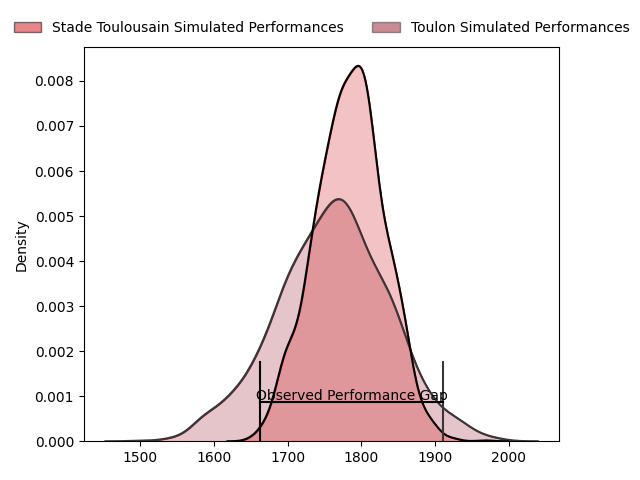
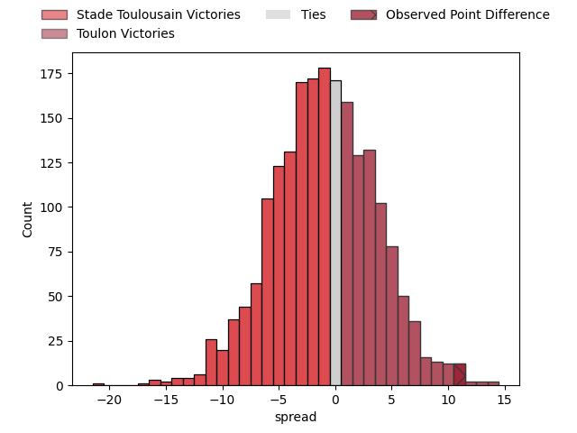
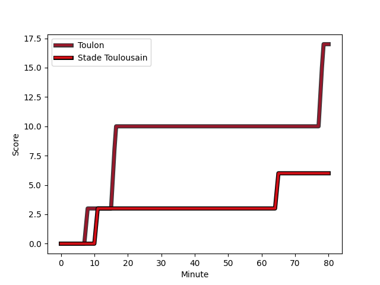
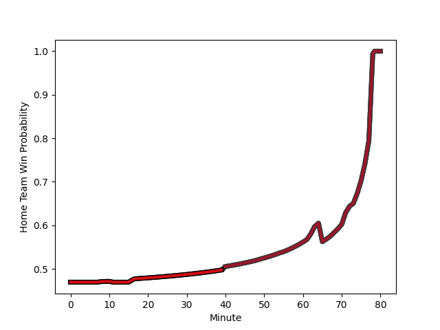

---  
layout: page  
title: Stade Toulousain at Toulon; 6-17  
date: 2023-02-18 21:05:00 18:00:00 -0500  
categories: match review  
---
# Stade Toulousain at Toulon; 6-17

# Club Level Predictions

The first set of predictions treats a club as the smallest object, as the club develops its members, organizes a gameplan, and deploys its players as needed for each match. This club model has a prediction of 0.471, which translates to predicting Stade Toulousain to win by 1.0.

Each club has a rating and a rating deviation (simiar to a Glicko system), and expected performances can be generated. This allows for simulated matches and spreads like the ones below.
## Projected Performances

## Projected Spreads

## Projected Results

# Player Level Predictions

Treating teams instead as an entity made up of the currently active players, I have ratings for each player in an altogether different system. These can be combined to form team ratings once teamsheets are announced, weighting starters a bit higher than the reserves. After the match is played, players can be weighted by their minutes on the field, allowing for an accurate measure of the team's composition. With these compiled team ratings, we can make predictions, measure inaccuracy, and update the individual player ratings.
## Prediction with Player Minutes: Stade Toulousain by 1.3

Stade Toulousain by 5.3 on a neutral field
## Scores over Time

## Win Probability over Time

There were 6 large changes in win probability in this match
## Prediction without Player Minutes: Stade Toulousain by 4.1

Stade Toulousain by 8.1 on a neutral pitch

|   Away Minutes | Away Player                                                             |   Away elo |   Away Percentile |   Number |   Home Percentile |   Home elo | Home Player                                                       |   Home Minutes |
|---------------:|:------------------------------------------------------------------------|-----------:|------------------:|---------:|------------------:|-----------:|:------------------------------------------------------------------|---------------:|
|             71 | [David Ainu'u](..//playerfiles//DavidAinu'u_cleaned.md)                 |      94.49 |               nan |        1 |                73 |     101.53 | [Dany Priso](..//playerfiles//DanyPriso_cleaned.md)               |             62 |
|             71 | [Guillaume Cramont](..//playerfiles//GuillaumeCramont_cleaned.md)       |     101    |                70 |        2 |                30 |      88.42 | [Teddy Baubigny](..//playerfiles//TeddyBaubigny_cleaned.md)       |             62 |
|             63 | [Dorian Aldegheri](..//playerfiles//DorianAldegheri_cleaned.md)         |     108.06 |                86 |        3 |                60 |      97.98 | [Emerick Setiano](..//playerfiles//EmerickSetiano_cleaned.md)     |             49 |
|             63 | [Richie Arnold](..//playerfiles//RichieArnold_cleaned.md)               |     113.36 |                89 |        4 |                70 |     102.79 | [Swan Rebbadj](..//playerfiles//SwanRebbadj_cleaned.md)           |             73 |
|             80 | [Emmanuel Meafou](..//playerfiles//EmmanuelMeafou_cleaned.md)           |     117.42 |                92 |        5 |                74 |     104.53 | [Brian Alainu'uese](..//playerfiles//BrianAlainu'uese_cleaned.md) |             73 |
|             40 | [Alban Placines](..//playerfiles//AlbanPlacines_cleaned.md)             |     105.17 |                75 |        6 |                73 |     104.39 | [Cornell du Preez](..//playerfiles//CornellduPreez_cleaned.md)    |             73 |
|             68 | [Francois Cros](..//playerfiles//FrancoisCros_cleaned.md)               |      94.46 |               nan |        7 |                53 |      96.29 | [Facundo Isa](..//playerfiles//FacundoIsa_cleaned.md)             |             80 |
|             80 | [Alexandre Roumat](..//playerfiles//AlexandreRoumat_cleaned.md)         |     104.26 |                67 |        8 |                49 |      95.32 | [Sergio Parisse](..//playerfiles//SergioParisse_cleaned.md)       |             80 |
|             71 | [Paul Graou](..//playerfiles//PaulGraou_cleaned.md)                     |     127.5  |                98 |        9 |                30 |      90.49 | [Baptiste Serin](..//playerfiles//BaptisteSerin_cleaned.md)       |             80 |
|             80 | [Juan Cruz Mallia](..//playerfiles//JuanCruzMallia_cleaned.md)          |     101.98 |                70 |       10 |                58 |      98.47 | [Ihaia West](..//playerfiles//IhaiaWest_cleaned.md)               |             80 |
|             80 | [Matthis Lebel](..//playerfiles//MatthisLebel_cleaned.md)               |     107.39 |                81 |       11 |                70 |     101.82 | [Jiuta Wainiqolo](..//playerfiles//JiutaWainiqolo_cleaned.md)     |             80 |
|             55 | [Santiago Chocobares](..//playerfiles//SantiagoChocobares_cleaned.md)   |      96.73 |               nan |       12 |                56 |      97.15 | [Duncan Paia'aua](..//playerfiles//DuncanPaia'aua_cleaned.md)     |             80 |
|             80 | [Pierre-Louis Barassi](..//playerfiles//Pierre-LouisBarassi_cleaned.md) |      97.05 |                55 |       13 |                58 |      97.82 | [Waisea Nayacavelu](..//playerfiles//WaiseaNayacavelu_cleaned.md) |             63 |
|             80 | [Arthur Retière](..//playerfiles//ArthurRetière_cleaned.md)             |      92.24 |                43 |       14 |                55 |      96.59 | [Cheslin Kolbe](..//playerfiles//CheslinKolbe_cleaned.md)         |             80 |
|             80 | [Melvyn Jaminet](..//playerfiles//MelvynJaminet_cleaned.md)             |      88.42 |                32 |       15 |                71 |     104.8  | [Aymeric Luc](..//playerfiles//AymericLuc_cleaned.md)             |             80 |
|             40 | [Rynhard Elstadt](..//playerfiles//RynhardElstadt_cleaned.md)           |      90.03 |                33 |       16 |                50 |      99.01 | [Kieran Brookes](..//playerfiles//KieranBrookes_cleaned.md)       |             31 |
|             17 | [Yannick Youyoutte](..//playerfiles//YannickYouyoutte_cleaned.md)       |      91.64 |                35 |       17 |                86 |     109.23 | [Anthony Étrillard](..//playerfiles//AnthonyÉtrillard_cleaned.md) |             18 |
|             25 | [Sofiane Guitoune](..//playerfiles//SofianeGuitoune_cleaned.md)         |      98.61 |                60 |       18 |                51 |      95.85 | [Bruce Devaux](..//playerfiles//BruceDevaux_cleaned.md)           |             18 |
|              9 | [Hugo Reilhes](..//playerfiles//HugoReilhes_cleaned.md)                 |      93.85 |               nan |       19 |                38 |      90.96 | [Jérémy Sinzelle](..//playerfiles//JérémySinzelle_cleaned.md)     |             17 |
|             12 | [Theo Ntamack](..//playerfiles//TheoNtamack_cleaned.md)                 |      91.93 |                38 |       20 |                53 |      95.89 | [Adrien Warion](..//playerfiles//AdrienWarion_cleaned.md)         |              7 |
|              9 | [Martin Page-Relo](..//playerfiles//MartinPage-Relo_cleaned.md)         |     100.51 |                68 |       21 |                38 |      91.46 | [Mattéo Le Corvec](..//playerfiles//MattéoLeCorvec_cleaned.md)    |              7 |
|             17 | [Joel Merkler](..//playerfiles//JoelMerkler_cleaned.md)                 |      98.75 |                64 |       22 |                51 |      96.53 | [Matthias Halagahu](..//playerfiles//MatthiasHalagahu_cleaned.md) |              7 |
|              9 | [Ian Boubila](..//playerfiles//IanBoubila_cleaned.md)                   |      93.28 |               nan |       23 |               nan |     nan    | nan                                                               |            nan |

