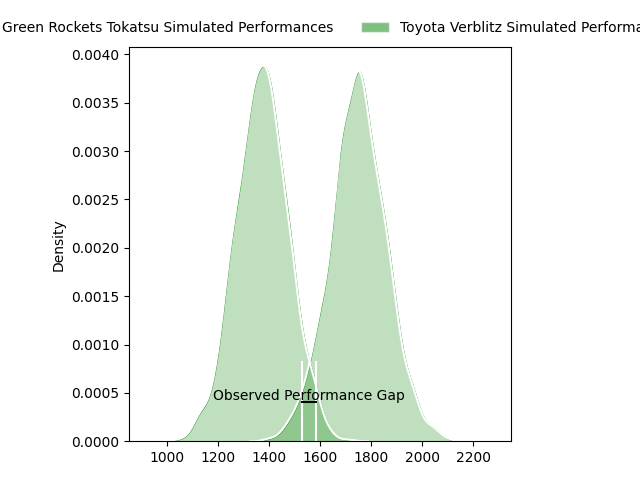
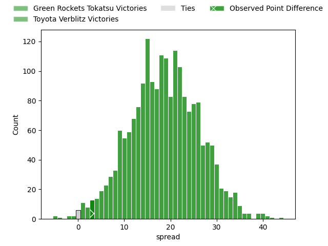
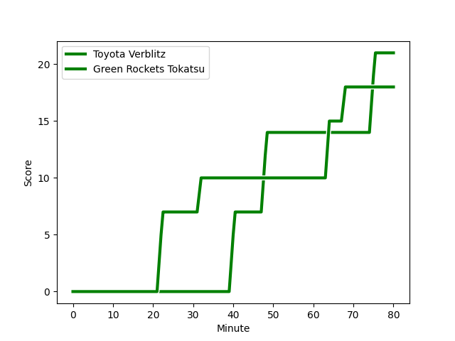
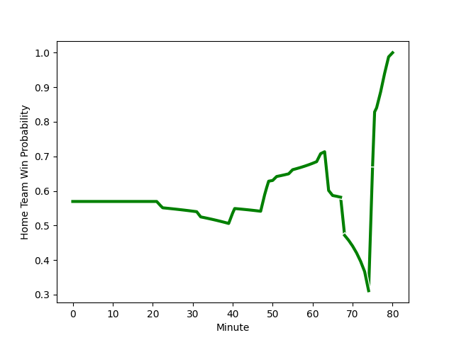

---  
layout: page  
title: Green Rockets Tokatsu at Toyota Verblitz; 18-21  
date: 2023-02-18 06:30:00 18:00:00 -0500  
categories: match review  
---
# Green Rockets Tokatsu at Toyota Verblitz; 18-21

# Club Level Predictions

The first set of predictions treats a club as the smallest object, as the club develops its members, organizes a gameplan, and deploys its players as needed for each match. This club model has a prediction of 0.888, which translates to predicting Toyota Verblitz to win by 18.9.

Each club has a rating and a rating deviation (simiar to a Glicko system), and expected performances can be generated. This allows for simulated matches and spreads like the ones below.
## Projected Performances

## Projected Spreads

## Projected Results

# Player Level Predictions

Treating teams instead as an entity made up of the currently active players, I have ratings for each player in an altogether different system. These can be combined to form team ratings once teamsheets are announced, weighting starters a bit higher than the reserves. After the match is played, players can be weighted by their minutes on the field, allowing for an accurate measure of the team's composition. With these compiled team ratings, we can make predictions, measure inaccuracy, and update the individual player ratings.
## Prediction with Player Minutes: Toyota Verblitz by 18.3

Toyota Verblitz by 14.3 on a neutral field
## Scores over Time

## Win Probability over Time

There were 11 large changes in win probability in this match
## Prediction without Player Minutes: Toyota Verblitz by 11.4

Toyota Verblitz by 7.4 on a neutral pitch

|   Away Minutes | Away Player                                                         |   Away elo |   Away Percentile |   Number |   Home Percentile |   Home elo | Home Player                                                                   |   Home Minutes |
|---------------:|:--------------------------------------------------------------------|-----------:|------------------:|---------:|------------------:|-----------:|:------------------------------------------------------------------------------|---------------:|
|             62 | [Suguru Kubo](..//playerfiles//SuguruKubo_cleaned.md)               |      88.78 |                27 |        1 |                57 |      96.97 | [Shogo Miura](..//playerfiles//ShogoMiura_cleaned.md)                         |             80 |
|             55 | [Myuu Arai](..//playerfiles//MyuuArai_cleaned.md)                   |      85.48 |                24 |        2 |               nan |      95    | [Toshizaku Nobeyama](..//playerfiles//ToshizakuNobeyama_cleaned.md)           |             80 |
|             49 | [Satoshi Ueda](..//playerfiles//SatoshiUeda_cleaned.md)             |     117.54 |                94 |        3 |                23 |      87.76 | [Yusuke Kizu](..//playerfiles//YusukeKizu_cleaned.md)                         |             62 |
|             74 | [Daiki Yamagiwa](..//playerfiles//DaikiYamagiwa_cleaned.md)         |      68.84 |                 5 |        4 |                48 |      93.72 | [Daichi Akiyama](..//playerfiles//DaichiAkiyama_cleaned.md)                   |             80 |
|             80 | [Jake Ball](..//playerfiles//JakeBall_cleaned.md)                   |      85.27 |                21 |        5 |                86 |     111.99 | [Ryoma Nishimura](..//playerfiles//RyomaNishimura_cleaned.md)                 |             65 |
|             76 | [Wheetu Douglas](..//playerfiles//WheetuDouglas_cleaned.md)         |      77.87 |                 9 |        6 |                55 |      97.73 | [Pieter Stephanus du Toit](..//playerfiles//PieterStephanusduToit_cleaned.md) |             80 |
|             80 | [Ryoi Kamei](..//playerfiles//RyoiKamei_cleaned.md)                 |      49.36 |                 1 |        7 |                55 |      97.35 | [Masato Furukawa](..//playerfiles//MasatoFurukawa_cleaned.md)                 |             80 |
|             80 | [Aseri Masivou](..//playerfiles//AseriMasivou_cleaned.md)           |     102.23 |                70 |        8 |                28 |      88.56 | [Kazuki Himeno](..//playerfiles//KazukiHimeno_cleaned.md)                     |             62 |
|             74 | [Nicholas Phipps](..//playerfiles//NicholasPhipps_cleaned.md)       |      84.36 |                19 |        9 |                40 |      91.73 | [Kaito Shigeno](..//playerfiles//KaitoShigeno_cleaned.md)                     |             51 |
|             80 | [Taisetsu Kanai](..//playerfiles//TaisetsuKanai_cleaned.md)         |      90.02 |                34 |       10 |                63 |      99.63 | [Willem Jacobus Le Roux](..//playerfiles//WillemJacobusLeRoux_cleaned.md)     |             80 |
|             62 | [Kenta Omata](..//playerfiles//KentaOmata_cleaned.md)               |     103.82 |                74 |       11 |                67 |     100.58 | [Vatiliai Tuidraki](..//playerfiles//VatiliaiTuidraki_cleaned.md)             |             74 |
|             80 | [Christian Laui](..//playerfiles//ChristianLaui_cleaned.md)         |      85.09 |                21 |       12 |                85 |     110    | [Charlie Lawrence](..//playerfiles//CharlieLawrence_cleaned.md)               |             80 |
|             62 | [Maritino Nemani](..//playerfiles//MaritinoNemani_cleaned.md)       |      96.97 |                58 |       13 |                14 |      81.96 | [Rob Thompson](..//playerfiles//RobThompson_cleaned.md)                       |             62 |
|             80 | [Yuma Sugimoto](..//playerfiles//YumaSugimoto_cleaned.md)           |      95.12 |                50 |       14 |                18 |      83.97 | [Taichi Takahashi](..//playerfiles//TaichiTakahashi_cleaned.md)               |             80 |
|             80 | [Lomano Lemeki](..//playerfiles//LomanoLemeki_cleaned.md)           |      80.79 |                14 |       15 |                55 |      97.25 | [Tiaan Falcon](..//playerfiles//TiaanFalcon_cleaned.md)                       |             80 |
|             31 | [Taku Toma](..//playerfiles//TakuToma_cleaned.md)                   |      90.71 |                21 |       16 |                80 |     105.41 | [Kenta Fukuda](..//playerfiles//KentaFukuda_cleaned.md)                       |             29 |
|             25 | [Yo Sato](..//playerfiles//YoSato_cleaned.md)                       |      71.07 |                 4 |       17 |                71 |     100.05 | [Shunsuke Asaoka](..//playerfiles//ShunsukeAsaoka_cleaned.md)                 |             18 |
|             18 | [Tim Bennetts](..//playerfiles//TimBennetts_cleaned.md)             |      86.58 |                30 |       18 |                 8 |      75.22 | [Lautaimi Fetuani](..//playerfiles//LautaimiFetuani_cleaned.md)               |             18 |
|             18 | [Taqele Naiyaravoro](..//playerfiles//TaqeleNaiyaravoro_cleaned.md) |      93.48 |               nan |       19 |                35 |      89.25 | [Viliame Tuidraki](..//playerfiles//ViliameTuidraki_cleaned.md)               |             18 |
|             18 | [Sunao Takizawa](..//playerfiles//SunaoTakizawa_cleaned.md)         |      85.99 |                19 |       20 |                41 |      93.52 | [Kyo Yoshida](..//playerfiles//KyoYoshida_cleaned.md)                         |             15 |
|              6 | [Fumiaki Tanaka](..//playerfiles//FumiakiTanaka_cleaned.md)         |      93.34 |               nan |       21 |               nan |      94.33 | [Jamie Henry](..//playerfiles//JamieHenry_cleaned.md)                         |              6 |
|              6 | [Luke Porter](..//playerfiles//LukePorter_cleaned.md)               |      82.75 |                17 |       22 |               nan |     nan    | nan                                                                           |            nan |
|              4 | [Yoshida Hosoda](..//playerfiles//YoshidaHosoda_cleaned.md)         |      94.06 |                52 |       23 |               nan |     nan    | nan                                                                           |            nan |

