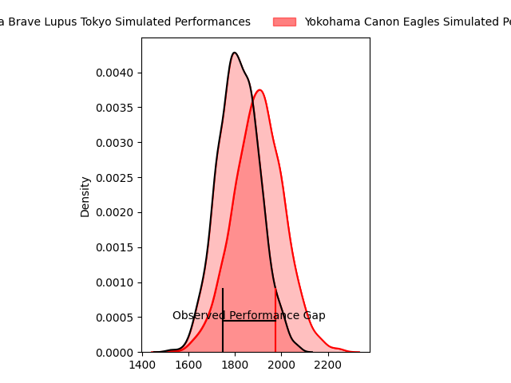
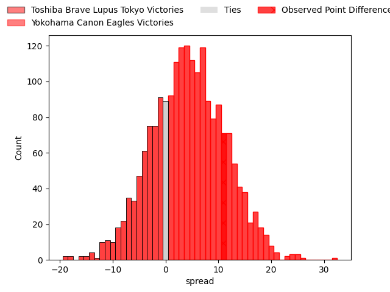
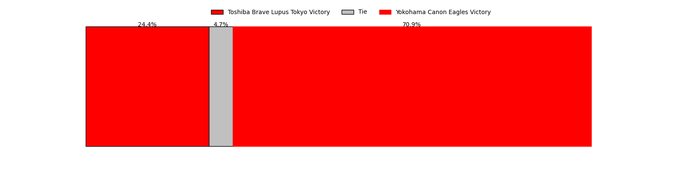
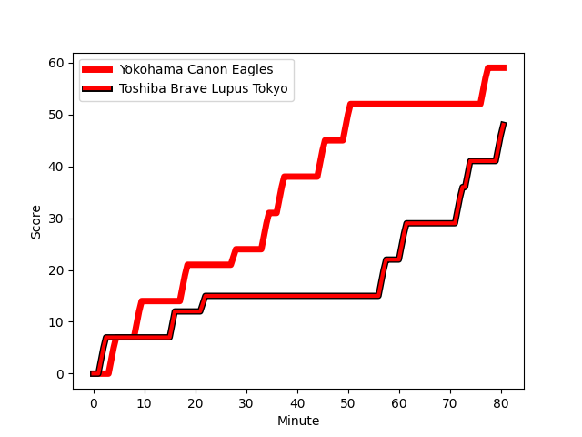
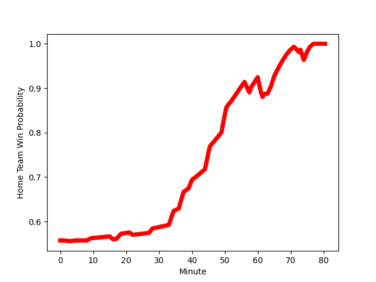

---  
layout: page  
title: Toshiba Brave Lupus Tokyo at Yokohama Canon Eagles; 48-59  
date: 2023-02-18 06:00:00 18:00:00 -0500  
categories: match review  
---
# Toshiba Brave Lupus Tokyo at Yokohama Canon Eagles; 48-59

# Club Level Predictions

The first set of predictions treats a club as the smallest object, as the club develops its members, organizes a gameplan, and deploys its players as needed for each match. This club model has a prediction of 0.617, which translates to predicting Yokohama Canon Eagles to win by 4.3.

Each club has a rating and a rating deviation (simiar to a Glicko system), and expected performances can be generated. This allows for simulated matches and spreads like the ones below.
## Projected Performances

## Projected Spreads

## Projected Results

# Player Level Predictions

Treating teams instead as an entity made up of the currently active players, I have ratings for each player in an altogether different system. These can be combined to form team ratings once teamsheets are announced, weighting starters a bit higher than the reserves. After the match is played, players can be weighted by their minutes on the field, allowing for an accurate measure of the team's composition. With these compiled team ratings, we can make predictions, measure inaccuracy, and update the individual player ratings.
## Prediction with Player Minutes: Yokohama Canon Eagles by 14.0

Yokohama Canon Eagles by 10.0 on a neutral field
## Scores over Time

## Win Probability over Time

There were 4 large changes in win probability in this match
## Prediction without Player Minutes: Yokohama Canon Eagles by 14.6

Yokohama Canon Eagles by 10.6 on a neutral pitch

|   Away Minutes | Away Player                                                         |   Away elo |   Away Percentile |   Number |   Home Percentile |   Home elo | Home Player                                                                 |   Home Minutes |
|---------------:|:--------------------------------------------------------------------|-----------:|------------------:|---------:|------------------:|-----------:|:----------------------------------------------------------------------------|---------------:|
|             52 | [Sena Kimura](..//playerfiles//SenaKimura_cleaned.md)               |      99.53 |                51 |        1 |                99 |     133.36 | [Takato Okabe](..//playerfiles//TakatoOkabe_cleaned.md)                     |             61 |
|             40 | [Mamoru Harada](..//playerfiles//MamoruHarada_cleaned.md)           |      96.25 |                50 |        2 |               nan |      95.4  | [Yusuke Niwai](..//playerfiles//YusukeNiwai_cleaned.md)                     |             52 |
|             52 | [Yuta Kokaji](..//playerfiles//YutaKokaji_cleaned.md)               |     116.72 |                94 |        3 |                92 |     114.95 | [Rento Tsukayama](..//playerfiles//RentoTsukayama_cleaned.md)               |             61 |
|             80 | [Warner Dearns](..//playerfiles//WarnerDearns_cleaned.md)           |     101.04 |                66 |        4 |                74 |     104.92 | [Max Douglas](..//playerfiles//MaxDouglas_cleaned.md)                       |             80 |
|             58 | [Shin Ito](..//playerfiles//ShinIto_cleaned.md)                     |     104.1  |                74 |        5 |                88 |     112.74 | [Liaki Moli](..//playerfiles//LiakiMoli_cleaned.md)                         |             65 |
|             73 | [Yoshitaka Tokunaga](..//playerfiles//YoshitakaTokunaga_cleaned.md) |     102.08 |                68 |        6 |                53 |      97.73 | [Mitchell Brown](..//playerfiles//MitchellBrown_cleaned.md)                 |             80 |
|             80 | [Matt Todd](..//playerfiles//MattTodd_cleaned.md)                   |     100.91 |                66 |        7 |                59 |      98.63 | [Naoto Shimada](..//playerfiles//NaotoShimada_cleaned.md)                   |             80 |
|             80 | [Michael Leitch](..//playerfiles//MichaelLeitch_cleaned.md)         |      98.79 |                59 |        8 |                66 |     100.83 | [Sione Halasili](..//playerfiles//SioneHalasili_cleaned.md)                 |             58 |
|             56 | [Takahiro Ogawa](..//playerfiles//TakahiroOgawa_cleaned.md)         |      93.22 |                45 |        9 |                70 |     101.75 | [Francois (Faf) de Klerk](..//playerfiles//Francois(Faf)deKlerk_cleaned.md) |             66 |
|             80 | [Tom Taylor](..//playerfiles//TomTaylor_cleaned.md)                 |     103.62 |                74 |       10 |                80 |     107.49 | [Yu Tamura](..//playerfiles//YuTamura_cleaned.md)                           |             66 |
|             80 | [Atsuki Kuwayama](..//playerfiles//AtsukiKuwayama_cleaned.md)       |      92.61 |                43 |       11 |                 6 |      70.87 | [Masayoshi Takezawa](..//playerfiles//MasayoshiTakezawa_cleaned.md)         |             80 |
|             80 | [Burger Odendaal](..//playerfiles//BurgerOdendaal_cleaned.md)       |      98.26 |                51 |       12 |                87 |     112.77 | [Yusuke Kajimura](..//playerfiles//YusukeKajimura_cleaned.md)               |             80 |
|             65 | [Nicholas McCurran](..//playerfiles//NicholasMcCurran_cleaned.md)   |     111.56 |                86 |       13 |                90 |     114.85 | [Jesse Andre Kriel](..//playerfiles//JesseAndreKriel_cleaned.md)            |             80 |
|             63 | [Hisayoshi Matsuoka](..//playerfiles//HisayoshiMatsuoka_cleaned.md) |      52.51 |               nan |       14 |                85 |     110.24 | [Inoke Burua](..//playerfiles//InokeBurua_cleaned.md)                       |             74 |
|             80 | [Takuro Matsunaga](..//playerfiles//TakuroMatsunaga_cleaned.md)     |     104.57 |                71 |       15 |                60 |      99.29 | [Junpei Ogura](..//playerfiles//JunpeiOgura_cleaned.md)                     |             80 |
|             40 | [Daigo Hashimoto](..//playerfiles//DaigoHashimoto_cleaned.md)       |      70.42 |                 4 |       16 |                 4 |      70.75 | [Shin Kawamura](..//playerfiles//ShinKawamura_cleaned.md)                   |             28 |
|             28 | [Latu Taufa](..//playerfiles//LatuTaufa_cleaned.md)                 |     100.19 |               nan |       17 |                87 |     113.12 | [Sioeli Vakalahi](..//playerfiles//SioeliVakalahi_cleaned.md)               |             22 |
|             28 | [Masataka Mikami](..//playerfiles//MasatakaMikami_cleaned.md)       |      97.41 |                59 |       18 |               nan |     100.12 | [Shouta Matsuoka](..//playerfiles//ShoutaMatsuoka_cleaned.md)               |             19 |
|             24 | [Jack Stratton](..//playerfiles//JackStratton_cleaned.md)           |      96.11 |               nan |       19 |               nan |      99.48 | [Chang Ho Ahn](..//playerfiles//ChangHoAhn_cleaned.md)                      |             19 |
|             22 | [Kyosuke Kajikawa](..//playerfiles//KyosukeKajikawa_cleaned.md)     |      95.59 |                52 |       20 |                96 |     131.6  | [Ryota Suginaga](..//playerfiles//RyotaSuginaga_cleaned.md)                 |             15 |
|             17 | [Shohei Toyoshima](..//playerfiles//ShoheiToyoshima_cleaned.md)     |     106.29 |                77 |       21 |                93 |     117.51 | [Kouki Arai](..//playerfiles//KoukiArai_cleaned.md)                         |             14 |
|             15 | [Taichi Mano](..//playerfiles//TaichiMano_cleaned.md)               |      95    |               nan |       22 |               nan |      95    | [Luteru Laulala](..//playerfiles//LuteruLaulala_cleaned.md)                 |             14 |
|              7 | [Takeshi Sasaki](..//playerfiles//TakeshiSasaki_cleaned.md)         |     104.11 |               nan |       23 |                91 |     116.62 | [Naoya Minamihashi](..//playerfiles//NaoyaMinamihashi_cleaned.md)           |              6 |

