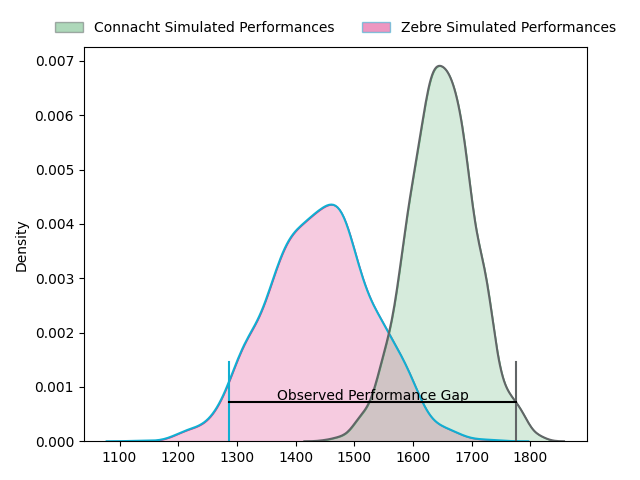
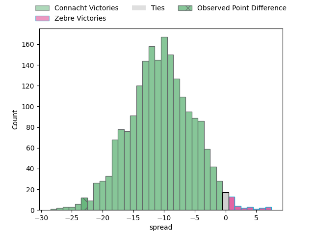
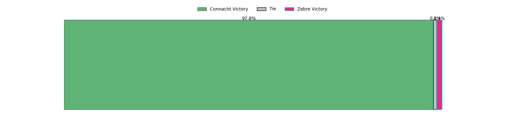
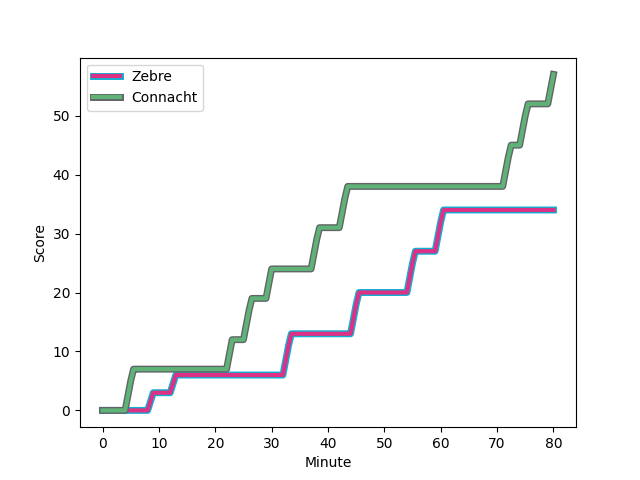
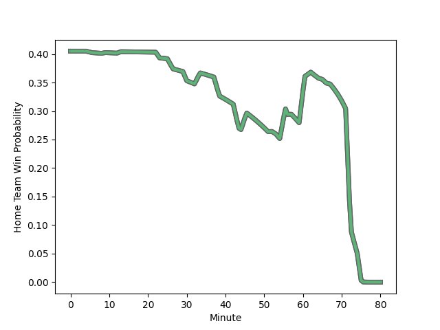

---  
layout: page  
title: Connacht at Zebre; 57-34  
date: 2023-02-18 16:00:00 18:00:00 -0500  
categories: match review  
---
# Connacht at Zebre; 57-34

# Club Level Predictions

The first set of predictions treats a club as the smallest object, as the club develops its members, organizes a gameplan, and deploys its players as needed for each match. This club model has a prediction of 0.239, which translates to predicting Connacht to win by 10.2.

Each club has a rating and a rating deviation (simiar to a Glicko system), and expected performances can be generated. This allows for simulated matches and spreads like the ones below.
## Projected Performances

## Projected Spreads

## Projected Results

# Player Level Predictions

Treating teams instead as an entity made up of the currently active players, I have ratings for each player in an altogether different system. These can be combined to form team ratings once teamsheets are announced, weighting starters a bit higher than the reserves. After the match is played, players can be weighted by their minutes on the field, allowing for an accurate measure of the team's composition. With these compiled team ratings, we can make predictions, measure inaccuracy, and update the individual player ratings.
## Prediction with Player Minutes: Connacht by 12.7

Connacht by 16.7 on a neutral field
## Scores over Time

## Win Probability over Time

There were 7 large changes in win probability in this match
## Prediction without Player Minutes: Connacht by 12.4

Connacht by 16.4 on a neutral pitch

|   Away Minutes | Away Player                                                               |   Away elo |   Away Percentile |   Number |   Home Percentile |   Home elo | Home Player                                                         |   Home Minutes |
|---------------:|:--------------------------------------------------------------------------|-----------:|------------------:|---------:|------------------:|-----------:|:--------------------------------------------------------------------|---------------:|
|             63 | [Dennis Buckley](..//playerfiles//DennisBuckley_cleaned.md)               |      94.22 |                47 |        1 |                 9 |      78.38 | [Luca Rizzoli](..//playerfiles//LucaRizzoli_cleaned.md)             |             52 |
|             61 | [Dylan Tierney-Martin](..//playerfiles//DylanTierney-Martin_cleaned.md)   |     104.31 |                70 |        2 |                25 |      87.3  | [Marco Manfredi](..//playerfiles//MarcoManfredi_cleaned.md)         |             44 |
|             62 | [Jack Aungier](..//playerfiles//JackAungier_cleaned.md)                   |     106.32 |                84 |        3 |                24 |      87.76 | [Matteo Nocera](..//playerfiles//MatteoNocera_cleaned.md)           |             53 |
|             61 | [Joshua Daniel Murphy](..//playerfiles//JoshuaDanielMurphy_cleaned.md)    |     104.06 |                73 |        4 |                67 |     101.45 | [Leonard Krumov](..//playerfiles//LeonardKrumov_cleaned.md)         |             80 |
|             80 | [Niall Murray](..//playerfiles//NiallMurray_cleaned.md)                   |     102.89 |                71 |        5 |                62 |      99.24 | [Joshua Furno](..//playerfiles//JoshuaFurno_cleaned.md)             |             61 |
|             77 | [Cian Prendergast](..//playerfiles//CianPrendergast_cleaned.md)           |     104.18 |                73 |        6 |                44 |      93.11 | [Luca Andreani](..//playerfiles//LucaAndreani_cleaned.md)           |             80 |
|             80 | [Conor Oliver](..//playerfiles//ConorOliver_cleaned.md)                   |     106.96 |                78 |        7 |                43 |      92.99 | [Matt Kvesic](..//playerfiles//MattKvesic_cleaned.md)               |             80 |
|             80 | [Jarrad Butler](..//playerfiles//JarradButler_cleaned.md)                 |     100.09 |                63 |        8 |               nan |      97.93 | [Giovanni Licata](..//playerfiles//GiovanniLicata_cleaned.md)       |             56 |
|             56 | [Caolin Blade](..//playerfiles//CaolinBlade_cleaned.md)                   |      95.8  |                53 |        9 |                47 |      93.94 | [Chris Cook](..//playerfiles//ChrisCook_cleaned.md)                 |             65 |
|             80 | [Jack Carty](..//playerfiles//JackCarty_cleaned.md)                       |     111.53 |                85 |       10 |                67 |     101.23 | [Tiff Eden](..//playerfiles//TiffEden_cleaned.md)                   |             80 |
|             80 | [John Porch](..//playerfiles//JohnPorch_cleaned.md)                       |     109.67 |                84 |       11 |                19 |      84.42 | [Simone Gesi](..//playerfiles//SimoneGesi_cleaned.md)               |             80 |
|             65 | [Cathal Forde](..//playerfiles//CathalForde_cleaned.md)                   |     107.89 |                82 |       12 |                22 |      85.4  | [Enrico Lucchin](..//playerfiles//EnricoLucchin_cleaned.md)         |             80 |
|             80 | [Thomas Farrell](..//playerfiles//ThomasFarrell_cleaned.md)               |      98.22 |                59 |       13 |                14 |      81.56 | [Erich Cronje](..//playerfiles//ErichCronje_cleaned.md)             |             80 |
|             57 | [Diarmuid Kilgallen](..//playerfiles//DiarmuidKilgallen_cleaned.md)       |     101.28 |                67 |       14 |                58 |      97.86 | [Jacobus van Wyk](..//playerfiles//JacobusvanWyk_cleaned.md)        |             52 |
|             80 | [Tiernan O'Halloran](..//playerfiles//TiernanO'Halloran_cleaned.md)       |     105.01 |                72 |       15 |                23 |      83.18 | [Lorenzo Pani](..//playerfiles//LorenzoPani_cleaned.md)             |             67 |
|              3 | [Shamus Hurley-Langton](..//playerfiles//ShamusHurley-Langton_cleaned.md) |      88.59 |                23 |       16 |                33 |      89.63 | [Giampietro Ribaldi](..//playerfiles//GiampietroRibaldi_cleaned.md) |             36 |
|             24 | [Kieran Marmion](..//playerfiles//KieranMarmion_cleaned.md)               |     103.9  |                70 |       17 |                46 |      93.32 | [Richard Kriel](..//playerfiles//RichardKriel_cleaned.md)           |             28 |
|             23 | [Adam Byrne](..//playerfiles//AdamByrne_cleaned.md)                       |      86.12 |                22 |       18 |                68 |     100.3  | [Paolo Buonfiglio](..//playerfiles//PaoloBuonfiglio_cleaned.md)     |             28 |
|             19 | [Darragh Murray](..//playerfiles//DarraghMurray_cleaned.md)               |      93.82 |                47 |       19 |                51 |      95.44 | [Muhamed Hasa](..//playerfiles//MuhamedHasa_cleaned.md)             |             27 |
|             19 | [Eoin  de Buitlear](..//playerfiles//EoindeBuitlear_cleaned.md)           |      95    |               nan |       20 |                36 |      91.49 | [Davide Ruggeri](..//playerfiles//DavideRuggeri_cleaned.md)         |             24 |
|             18 | [Sam Illo](..//playerfiles//SamIllo_cleaned.md)                           |      87.63 |                26 |       21 |                26 |      88.75 | [Jan-Frederik Uys](..//playerfiles//Jan-FrederikUys_cleaned.md)     |             19 |
|             17 | [Jordan Duggan](..//playerfiles//JordanDuggan_cleaned.md)                 |      96.02 |               nan |       22 |                40 |      87.36 | [Ratko Jelic](..//playerfiles//RatkoJelic_cleaned.md)               |             15 |
|             15 | [Tom Daly](..//playerfiles//TomDaly_cleaned.md)                           |      93.74 |                46 |       23 |               nan |      95    | [Antonio Rizzi](..//playerfiles//AntonioRizzi_cleaned.md)           |             13 |

