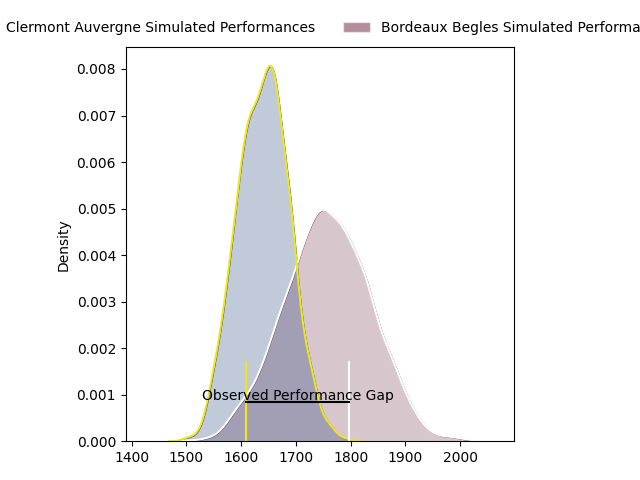
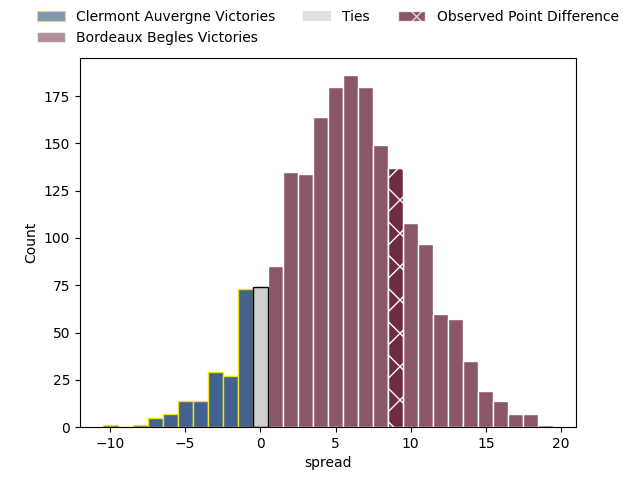
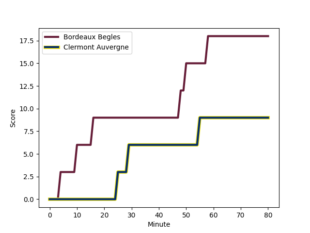
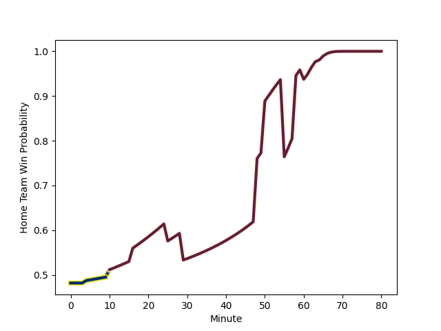

---  
layout: page  
title: Clermont Auvergne at Bordeaux Begles; 9-18  
date: 2023-02-19 21:05:00 18:00:00 -0500  
categories: match review  
---
# Clermont Auvergne at Bordeaux Begles; 9-18

# Club Level Predictions

The first set of predictions treats a club as the smallest object, as the club develops its members, organizes a gameplan, and deploys its players as needed for each match. This club model has a prediction of 0.661, which translates to predicting Bordeaux Begles to win by 5.9.

Each club has a rating and a rating deviation (simiar to a Glicko system), and expected performances can be generated. This allows for simulated matches and spreads like the ones below.
## Projected Performances

## Projected Spreads

## Projected Results

# Player Level Predictions

Treating teams instead as an entity made up of the currently active players, I have ratings for each player in an altogether different system. These can be combined to form team ratings once teamsheets are announced, weighting starters a bit higher than the reserves. After the match is played, players can be weighted by their minutes on the field, allowing for an accurate measure of the team's composition. With these compiled team ratings, we can make predictions, measure inaccuracy, and update the individual player ratings.
## Prediction with Player Minutes: Bordeaux Begles by 0.9

Clermont Auvergne by 3.1 on a neutral field
## Scores over Time

## Win Probability over Time

There were 7 large changes in win probability in this match
## Prediction without Player Minutes: Bordeaux Begles by 4.3

Bordeaux Begles by 0.3 on a neutral pitch

|   Away Minutes | Away Player                                                         |   Away elo |   Away Percentile |   Number |   Home Percentile |   Home elo | Home Player                                                                      |   Home Minutes |
|---------------:|:--------------------------------------------------------------------|-----------:|------------------:|---------:|------------------:|-----------:|:---------------------------------------------------------------------------------|---------------:|
|             55 | [Giorgi Beria](..//playerfiles//GiorgiBeria_cleaned.md)             |      90.07 |                22 |        1 |                75 |     102.14 | [Lesko Kaulashvili](..//playerfiles//LeskoKaulashvili_cleaned.md)                |             55 |
|             69 | [Étienne Fourcade](..//playerfiles//ÉtienneFourcade_cleaned.md)     |      96.88 |                58 |        2 |                78 |     103.43 | [Maxime Lamothe](..//playerfiles//MaximeLamothe_cleaned.md)                      |             64 |
|             55 | [Cristian Ojovan](..//playerfiles//CristianOjovan_cleaned.md)       |     102.02 |                74 |        3 |                20 |      87.91 | [Vadim Cobilas](..//playerfiles//VadimCobilas_cleaned.md)                        |             55 |
|             80 | [Thibault Lanen](..//playerfiles//ThibaultLanen_cleaned.md)         |     105.76 |                77 |        4 |                17 |      83.7  | [Thomas Jolmes](..//playerfiles//ThomasJolmes_cleaned.md)                        |             72 |
|             80 | [Paul Jedrasiak](..//playerfiles//PaulJedrasiak_cleaned.md)         |     108.33 |                82 |        5 |                69 |     101.56 | [Jan Andre Marais](..//playerfiles//JanAndreMarais_cleaned.md)                   |             80 |
|             80 | [Arthur Iturria](..//playerfiles//ArthurIturria_cleaned.md)         |     110.2  |                84 |        6 |                59 |      98.43 | [Mahamadou Diaby](..//playerfiles//MahamadouDiaby_cleaned.md)                    |             60 |
|             55 | [Judicael Cancoriet](..//playerfiles//JudicaelCancoriet_cleaned.md) |      92.86 |                41 |        7 |                51 |      98.1  | [Antoine Miquel](..//playerfiles//AntoineMiquel_cleaned.md)                      |             80 |
|             55 | [Fritz Lee](..//playerfiles//FritzLee_cleaned.md)                   |      85.26 |                21 |        8 |                89 |     114.34 | [Tom Willis](..//playerfiles//TomWillis_cleaned.md)                              |             60 |
|             55 | [Baptiste Jauneau](..//playerfiles//BaptisteJauneau_cleaned.md)     |     101.94 |                72 |        9 |                26 |      87.07 | [Jules Gimbert](..//playerfiles//JulesGimbert_cleaned.md)                        |             80 |
|             80 | [Anthony Belleau](..//playerfiles//AnthonyBelleau_cleaned.md)       |      97.43 |                47 |       10 |                46 |      94.04 | [Zack Holmes](..//playerfiles//ZackHolmes_cleaned.md)                            |             79 |
|             80 | [Alivereti Raka](..//playerfiles//AliveretiRaka_cleaned.md)         |      84.65 |                20 |       11 |                10 |      76.69 | [Madosh Tambwe](..//playerfiles//MadoshTambwe_cleaned.md)                        |             80 |
|             61 | [Irae Simone](..//playerfiles//IraeSimone_cleaned.md)               |      89.59 |                33 |       12 |                57 |      97.76 | [Rémi Lamerat](..//playerfiles//RémiLamerat_cleaned.md)                          |             29 |
|             80 | [George Moala](..//playerfiles//GeorgeMoala_cleaned.md)             |      99.71 |                63 |       13 |                67 |     101.51 | [Tani Vili](..//playerfiles//TaniVili_cleaned.md)                                |             80 |
|             80 | [Bautista Delguy](..//playerfiles//BautistaDelguy_cleaned.md)       |      92.43 |                43 |       14 |                74 |     104.12 | [Santiago Cordero](..//playerfiles//SantiagoCordero_cleaned.md)                  |             80 |
|             80 | [Alex Newsome](..//playerfiles//AlexNewsome_cleaned.md)             |     117.11 |                90 |       15 |                92 |     118.31 | [Romain Buros](..//playerfiles//RomainBuros_cleaned.md)                          |             80 |
|             25 | [Davit Kubriashvili](..//playerfiles//DavitKubriashvili_cleaned.md) |      96.61 |                38 |       16 |               nan |      95.6  | [Nicolas Depoortere](..//playerfiles//NicolasDepoortere_cleaned.md)              |             51 |
|             25 | [Sebastien Bézy](..//playerfiles//SebastienBézy_cleaned.md)         |     104.03 |                77 |       17 |                65 |      96.56 | [Jefferson Poirot](..//playerfiles//JeffersonPoirot_cleaned.md)                  |             25 |
|             25 | [Peceli Yato](..//playerfiles//PeceliYato_cleaned.md)               |     101.61 |                67 |       18 |                61 |      98.28 | [Ben Tameifuna](..//playerfiles//BenTameifuna_cleaned.md)                        |             25 |
|             25 | [Etienne Falgoux](..//playerfiles//EtienneFalgoux_cleaned.md)       |     108.61 |                87 |       19 |                24 |      87.06 | [Hugo Zabalza](..//playerfiles//HugoZabalza_cleaned.md)                          |             20 |
|             25 | [Lucas Dessaigne](..//playerfiles//LucasDessaigne_cleaned.md)       |     104.33 |               nan |       20 |                25 |      87.48 | [Bastien Vergnes Taillefer](..//playerfiles//BastienVergnesTaillefer_cleaned.md) |             20 |
|             19 | [Cheikh Tiberghien](..//playerfiles//CheikhTiberghien_cleaned.md)   |      95.65 |                52 |       21 |                33 |      88    | [Clément Maynadier](..//playerfiles//ClémentMaynadier_cleaned.md)                |             16 |
|             11 | [Benjamin Boudou](..//playerfiles//BenjaminBoudou_cleaned.md)       |      97.8  |                41 |       22 |                54 |      96.28 | [Alban Roussel](..//playerfiles//AlbanRoussel_cleaned.md)                        |              8 |
|            nan | nan                                                                 |     nan    |               nan |       23 |                35 |      89.26 | [Mateo Garcia](..//playerfiles//MateoGarcia_cleaned.md)                          |              1 |

