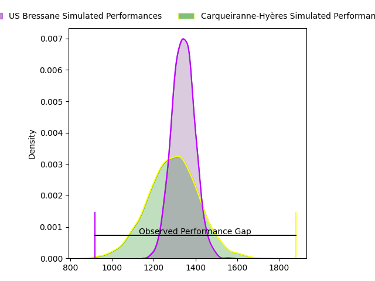
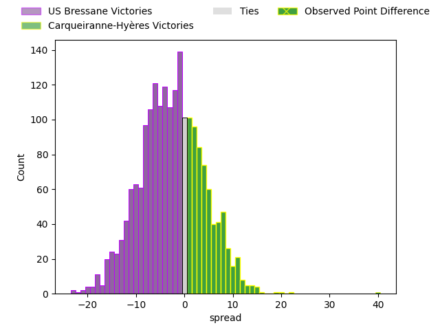
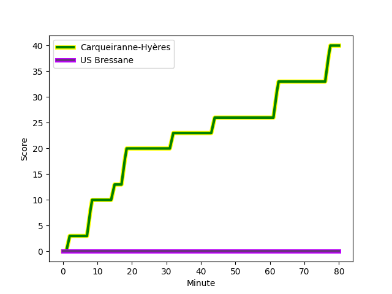
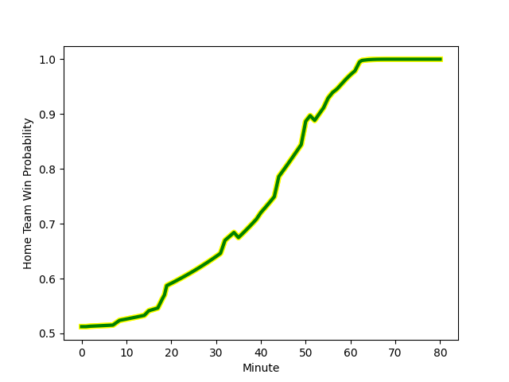

---  
layout: page  
title: US Bressane at Carqueiranne-Hyères; 0-40  
date: 2023-02-19 16:00:00 18:00:00 -0500  
categories: match review  
---
# US Bressane at Carqueiranne-Hyères; 0-40

# Club Level Predictions

The first set of predictions treats a club as the smallest object, as the club develops its members, organizes a gameplan, and deploys its players as needed for each match. This club model has a prediction of 0.433, which translates to predicting US Bressane to win by 2.4.

Each club has a rating and a rating deviation (simiar to a Glicko system), and expected performances can be generated. This allows for simulated matches and spreads like the ones below.
## Projected Performances

## Projected Spreads

## Projected Results

# Player Level Predictions

Treating teams instead as an entity made up of the currently active players, I have ratings for each player in an altogether different system. These can be combined to form team ratings once teamsheets are announced, weighting starters a bit higher than the reserves. After the match is played, players can be weighted by their minutes on the field, allowing for an accurate measure of the team's composition. With these compiled team ratings, we can make predictions, measure inaccuracy, and update the individual player ratings.
## Prediction with Player Minutes: Carqueiranne-Hyères by 7.8

Carqueiranne-Hyères by 3.8 on a neutral field
## Scores over Time

## Win Probability over Time

There were 2 large changes in win probability in this match
## Prediction without Player Minutes: Carqueiranne-Hyères by 7.0

Carqueiranne-Hyères by 3.0 on a neutral pitch

|   Away Minutes | Away Player                                                                       |   Away elo |   Away Percentile |   Number |   Home Percentile |   Home elo | Home Player                                                                 |   Home Minutes |
|---------------:|:----------------------------------------------------------------------------------|-----------:|------------------:|---------:|------------------:|-----------:|:----------------------------------------------------------------------------|---------------:|
|             35 | [Teo Bordenave](..//playerfiles//TeoBordenave_cleaned.md)                         |      83.05 |                14 |        1 |                55 |      96.44 | [Eli Serra-Miglietti](..//playerfiles//EliSerra-Miglietti_cleaned.md)       |             50 |
|             35 | [Sione Anga'aelangi](..//playerfiles//SioneAnga'aelangi_cleaned.md)               |      97.69 |                60 |        2 |                10 |      79.51 | [Yan Tabarot](..//playerfiles//YanTabarot_cleaned.md)                       |             55 |
|             35 | [Erich de Jager](..//playerfiles//ErichdeJager_cleaned.md)                        |      40.21 |                 0 |        3 |                40 |      92.33 | [Lasha Mchelidze](..//playerfiles//LashaMchelidze_cleaned.md)               |             58 |
|             80 | [Koen Bloemen](..//playerfiles//KoenBloemen_cleaned.md)                           |     110.87 |                86 |        4 |                27 |      87.85 | [Geoffrey Nouhaillaguet](..//playerfiles//GeoffreyNouhaillaguet_cleaned.md) |             52 |
|             52 | [Monty Leverstein](..//playerfiles//MontyLeverstein_cleaned.md)                   |      91.42 |                37 |        5 |                76 |     105.01 | [Nathan Gendre](..//playerfiles//NathanGendre_cleaned.md)                   |             80 |
|             50 | [Lucas Lyons](..//playerfiles//LucasLyons_cleaned.md)                             |     128.05 |                96 |        6 |                39 |      91.72 | [Florian Munoz Rivero](..//playerfiles//FlorianMunozRivero_cleaned.md)      |             80 |
|             80 | [Loïc Baradel](..//playerfiles//LoïcBaradel_cleaned.md)                           |      86.7  |                23 |        7 |                81 |     108.34 | [Joachim Beaumont](..//playerfiles//JoachimBeaumont_cleaned.md)             |             80 |
|             19 | [TJ Ioane](..//playerfiles//TJIoane_cleaned.md)                                   |     103.35 |                72 |        8 |               nan |      97.11 | [André Gorin](..//playerfiles//AndréGorin_cleaned.md)                       |             58 |
|             80 | [Nicolas Faure](..//playerfiles//NicolasFaure_cleaned.md)                         |     124.19 |                98 |        9 |                88 |     110.39 | [Thomas Sonetti](..//playerfiles//ThomasSonetti_cleaned.md)                 |             40 |
|             40 | [Sebastian Poet](..//playerfiles//SebastianPoet_cleaned.md)                       |     111.08 |                85 |       10 |                82 |     107.64 | [Lachie Munro](..//playerfiles//LachieMunro_cleaned.md)                     |             80 |
|             55 | [Clement Latorre](..//playerfiles//ClementLatorre_cleaned.md)                     |     100.59 |                66 |       11 |               nan |      95    | [Kalani Robert](..//playerfiles//KalaniRobert_cleaned.md)                   |             65 |
|             80 | [Parataiso Silafai-Lea'ana](..//playerfiles//ParataisoSilafai-Lea'ana_cleaned.md) |     119.66 |                94 |       12 |                95 |     121.75 | [Romain Leveque](..//playerfiles//RomainLeveque_cleaned.md)                 |             80 |
|             80 | [Maile Mamao](..//playerfiles//MaileMamao_cleaned.md)                             |      85    |                21 |       13 |                86 |     111.28 | [Charles Brousse](..//playerfiles//CharlesBrousse_cleaned.md)               |             57 |
|             80 | [Kavekini Tabu](..//playerfiles//KavekiniTabu_cleaned.md)                         |      88.5  |                30 |       14 |                51 |      95.29 | [Quentin Bourdieu](..//playerfiles//QuentinBourdieu_cleaned.md)             |             80 |
|             80 | [Audric Sanlaville](..//playerfiles//AudricSanlaville_cleaned.md)                 |      86.39 |                23 |       15 |                22 |      83.01 | [Adrien Amans](..//playerfiles//AdrienAmans_cleaned.md)                     |             80 |
|             45 | [Vazha Kapanadze](..//playerfiles//VazhaKapanadze_cleaned.md)                     |      79.08 |                 9 |       16 |                81 |     106.6  | [Liam Chad Hendricks](..//playerfiles//LiamChadHendricks_cleaned.md)        |             30 |
|             45 | [Louis Dasalmartini](..//playerfiles//LouisDasalmartini_cleaned.md)               |      93.8  |               nan |       17 |                12 |      80.8  | [Michael Tyumenev](..//playerfiles//MichaelTyumenev_cleaned.md)             |             25 |
|             45 | [Zauri Tevdorashvili](..//playerfiles//ZauriTevdorashvili_cleaned.md)             |      65.9  |                 2 |       18 |                27 |      91.34 | [Miguel Mathieu](..//playerfiles//MiguelMathieu_cleaned.md)                 |             22 |
|             28 | [Thomas Déliance](..//playerfiles//ThomasDéliance_cleaned.md)                     |     102.39 |                64 |       19 |                 2 |      57.93 | [Lucas Cazac](..//playerfiles//LucasCazac_cleaned.md)                       |             28 |
|             30 | [Robin Graulle](..//playerfiles//RobinGraulle_cleaned.md)                         |      84.47 |                19 |       20 |               nan |      95    | [Jordan Lavocat](..//playerfiles//JordanLavocat_cleaned.md)                 |             22 |
|             25 | [Benjamin Doy](..//playerfiles//BenjaminDoy_cleaned.md)                           |      73.93 |                 5 |       21 |                25 |      85.24 | [Rémi Dubié](..//playerfiles//RémiDubié_cleaned.md)                         |             40 |
|             40 | [Christian Lacombe](..//playerfiles//ChristianLacombe_cleaned.md)                 |      78.76 |                 6 |       22 |                13 |      82.85 | [Théo Defrance](..//playerfiles//ThéoDefrance_cleaned.md)                   |             15 |
|             61 | [Nicolas Tachat](..//playerfiles//NicolasTachat_cleaned.md)                       |      89.22 |                30 |       23 |                62 |      97.7  | [Dylan Michael Sage](..//playerfiles//DylanMichaelSage_cleaned.md)          |             23 |

