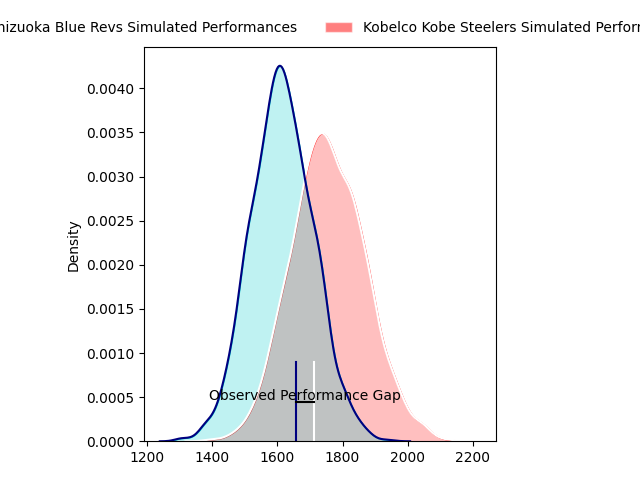
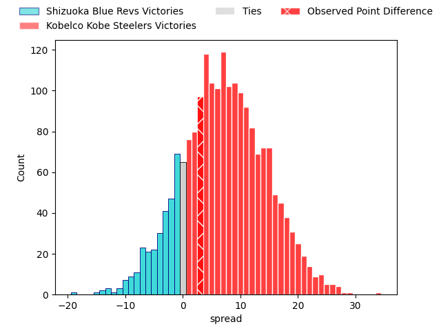
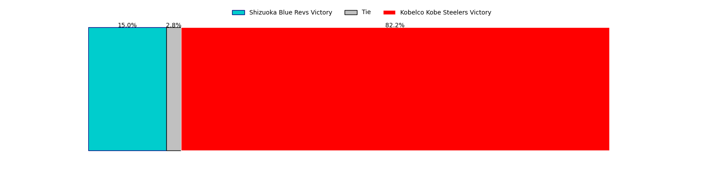
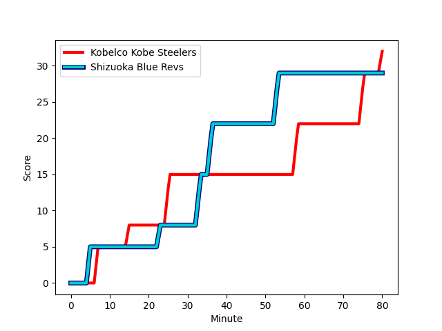
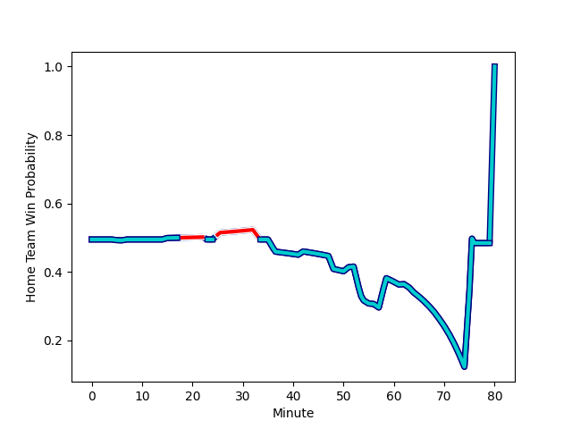

---  
layout: page  
title: Shizuoka Blue Revs at Kobelco Kobe Steelers; 29-32  
date: 2023-02-19 06:30:00 18:00:00 -0500  
categories: match review  
---
# Shizuoka Blue Revs at Kobelco Kobe Steelers; 29-32

# Club Level Predictions

The first set of predictions treats a club as the smallest object, as the club develops its members, organizes a gameplan, and deploys its players as needed for each match. This club model has a prediction of 0.689, which translates to predicting Kobelco Kobe Steelers to win by 7.2.

Each club has a rating and a rating deviation (simiar to a Glicko system), and expected performances can be generated. This allows for simulated matches and spreads like the ones below.
## Projected Performances

## Projected Spreads

## Projected Results

# Player Level Predictions

Treating teams instead as an entity made up of the currently active players, I have ratings for each player in an altogether different system. These can be combined to form team ratings once teamsheets are announced, weighting starters a bit higher than the reserves. After the match is played, players can be weighted by their minutes on the field, allowing for an accurate measure of the team's composition. With these compiled team ratings, we can make predictions, measure inaccuracy, and update the individual player ratings.
## Prediction with Player Minutes: Kobelco Kobe Steelers by 3.6

Shizuoka Blue Revs by 0.4 on a neutral field
## Scores over Time

## Win Probability over Time

There were 13 large changes in win probability in this match
## Prediction without Player Minutes: Kobelco Kobe Steelers by 4.0

Shizuoka Blue Revs by 0.0 on a neutral pitch

|   Away Minutes | Away Player                                                                                     |   Away elo |   Away Percentile |   Number |   Home Percentile |   Home elo | Home Player                                                                    |   Home Minutes |
|---------------:|:------------------------------------------------------------------------------------------------|-----------:|------------------:|---------:|------------------:|-----------:|:-------------------------------------------------------------------------------|---------------:|
|             76 | [Kazuhiro Kawata](..//playerfiles//KazuhiroKawata_cleaned.md)                                   |     103.66 |                78 |        1 |                90 |     112.14 | [Isileli Nakajima Vakauta](..//playerfiles//IsileliNakajimaVakauta_cleaned.md) |             54 |
|             76 | [Takeshi Hino](..//playerfiles//TakeshiHino_cleaned.md)                                         |      96.8  |                58 |        2 |                61 |      97.92 | [Kenta Matsuoka](..//playerfiles//KentaMatsuoka_cleaned.md)                    |             69 |
|             56 | [Heiichiro Ito](..//playerfiles//HeiichiroIto_cleaned.md)                                       |     102.76 |                76 |        3 |                89 |     111.13 | [Sho Maeda](..//playerfiles//ShoMaeda_cleaned.md)                              |             54 |
|             42 | [Yuya Odo](..//playerfiles//YuyaOdo_cleaned.md)                                                 |     114.71 |                91 |        4 |                99 |     148    | [Seokhwan Jang](..//playerfiles//SeokhwanJang_cleaned.md)                      |             48 |
|             80 | [Eishin Kuwano](..//playerfiles//EishinKuwano_cleaned.md)                                       |     127.14 |                97 |        5 |                23 |      86.28 | [John Dave Schickerling](..//playerfiles//JohnDaveSchickerling_cleaned.md)     |             80 |
|             80 | [Malgene Ilaua](..//playerfiles//MalgeneIlaua_cleaned.md)                                       |      95    |               nan |        6 |                73 |     104.11 | [Amanaki Saumaki](..//playerfiles//AmanakiSaumaki_cleaned.md)                  |             64 |
|             80 | [Richard Goh Jones](..//playerfiles//RichardGohJones_cleaned.md)                                |      99.61 |                64 |        7 |                97 |     132.04 | [Hikaru Hashimoto](..//playerfiles//HikaruHashimoto_cleaned.md)                |             80 |
|             80 | [Albertus Stephanus (Kwagga) Smith](..//playerfiles//AlbertusStephanus(Kwagga)Smith_cleaned.md) |     100.56 |                65 |        8 |                22 |      86.39 | [Marcell Coetzee](..//playerfiles//MarcellCoetzee_cleaned.md)                  |             80 |
|             52 | [Bryn Hall](..//playerfiles//BrynHall_cleaned.md)                                               |     101.15 |                70 |        9 |                34 |      88.03 | [Atsushi Hiwasa](..//playerfiles//AtsushiHiwasa_cleaned.md)                    |             51 |
|             52 | [Sho Kiyohara](..//playerfiles//ShoKiyohara_cleaned.md)                                         |      91.72 |                40 |       10 |                20 |      86.39 | [Lee Seung Sin](..//playerfiles//LeeSeungSin_cleaned.md)                       |             80 |
|             76 | [Malo Tuitama](..//playerfiles//MaloTuitama_cleaned.md)                                         |      97.32 |                58 |       11 |                99 |     150.67 | [Rakuhei Yamashita](..//playerfiles//RakuheiYamashita_cleaned.md)              |             80 |
|             80 | [Viliami Tahitu'a](..//playerfiles//ViliamiTahitu'a_cleaned.md)                                 |     102.87 |                73 |       12 |                37 |      86.94 | [Michael Little](..//playerfiles//MichaelLittle_cleaned.md)                    |             80 |
|             80 | [Hiroto Kobayashi](..//playerfiles//HirotoKobayashi_cleaned.md)                                 |     123.26 |                95 |       13 |                64 |      99.98 | [Junta Hamano](..//playerfiles//JuntaHamano_cleaned.md)                        |             76 |
|             80 | [Kakeru Okumura](..//playerfiles//KakeruOkumura_cleaned.md)                                     |     101.83 |                70 |       14 |                37 |      90.51 | [Ataata Moeakiola](..//playerfiles//AtaataMoeakiola_cleaned.md)                |             54 |
|             62 | [Futo Yamaguchi](..//playerfiles//FutoYamaguchi_cleaned.md)                                     |     111.79 |                84 |       15 |                28 |      86.39 | [Ryohei Yamanaka](..//playerfiles//RyoheiYamanaka_cleaned.md)                  |             80 |
|             38 | [Samuela Anise](..//playerfiles//SamuelaAnise_cleaned.md)                                       |      95.56 |               nan |       16 |                30 |      91.04 | [Gerard Cowley-Tuioti](..//playerfiles//GerardCowley-Tuioti_cleaned.md)        |             32 |
|             28 | [Yuki Yatomi](..//playerfiles//YukiYatomi_cleaned.md)                                           |      96.69 |               nan |       17 |                92 |     113.53 | [Daiki Nakajima](..//playerfiles//DaikiNakajima_cleaned.md)                    |             29 |
|             28 | [Sam Greene](..//playerfiles//SamGreene_cleaned.md)                                             |      87.22 |                22 |       18 |                94 |     120.69 | [Shinsuke Iseki](..//playerfiles//ShinsukeIseki_cleaned.md)                    |             26 |
|             24 | [Takayoshi Mohara](..//playerfiles//TakayoshiMohara_cleaned.md)                                 |      88.43 |                31 |       19 |                17 |      85.81 | [Hiroshi Yamashita](..//playerfiles//HiroshiYamashita_cleaned.md)              |             26 |
|             18 | [Eito Maki](..//playerfiles//EitoMaki_cleaned.md)                                               |      95    |               nan |       20 |                33 |      92.6  | [Suguru Igarashi](..//playerfiles//SuguruIgarashi_cleaned.md)                  |             26 |
|              4 | [Toshiya Hirakawa](..//playerfiles//ToshiyaHirakawa_cleaned.md)                                 |      86.42 |                19 |       21 |               nan |      95.94 | [Rinpei Sasaki](..//playerfiles//RinpeiSasaki_cleaned.md)                      |             11 |
|              4 | [Shintaro Okamoto](..//playerfiles//ShintaroOkamoto_cleaned.md)                                 |      96.05 |               nan |       22 |                49 |      95.85 | [Takara Imamura](..//playerfiles//TakaraImamura_cleaned.md)                    |             16 |
|              4 | [Ryosuke Funahashi](..//playerfiles//RyosukeFunahashi_cleaned.md)                               |     125.54 |                95 |       23 |                27 |      87.08 | [Timothy Lafaele](..//playerfiles//TimothyLafaele_cleaned.md)                  |              4 |

