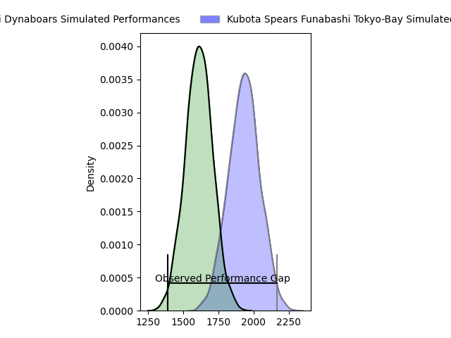
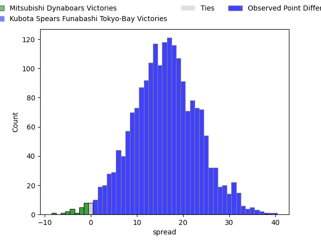
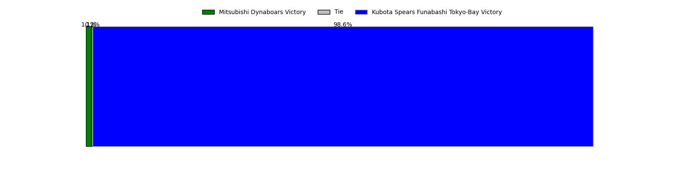
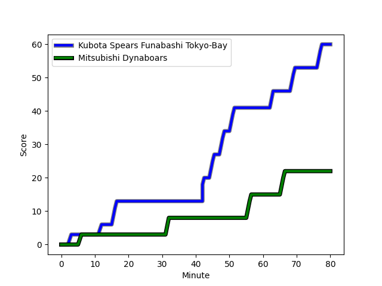
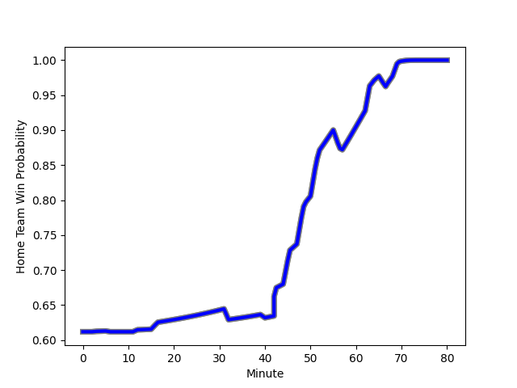

---  
layout: page  
title: Mitsubishi Dynaboars at Kubota Spears Funabashi Tokyo-Bay; 22-60  
date: 2023-02-19 06:30:00 18:00:00 -0500  
categories: match review  
---
# Mitsubishi Dynaboars at Kubota Spears Funabashi Tokyo-Bay; 22-60

# Club Level Predictions

The first set of predictions treats a club as the smallest object, as the club develops its members, organizes a gameplan, and deploys its players as needed for each match. This club model has a prediction of 0.855, which translates to predicting Kubota Spears Funabashi Tokyo-Bay to win by 16.1.

Each club has a rating and a rating deviation (simiar to a Glicko system), and expected performances can be generated. This allows for simulated matches and spreads like the ones below.
## Projected Performances

## Projected Spreads

## Projected Results

# Player Level Predictions

Treating teams instead as an entity made up of the currently active players, I have ratings for each player in an altogether different system. These can be combined to form team ratings once teamsheets are announced, weighting starters a bit higher than the reserves. After the match is played, players can be weighted by their minutes on the field, allowing for an accurate measure of the team's composition. With these compiled team ratings, we can make predictions, measure inaccuracy, and update the individual player ratings.
## Prediction with Player Minutes: Kubota Spears Funabashi Tokyo-Bay by 23.8

Kubota Spears Funabashi Tokyo-Bay by 19.8 on a neutral field
## Scores over Time

## Win Probability over Time

There were 5 large changes in win probability in this match
## Prediction without Player Minutes: Kubota Spears Funabashi Tokyo-Bay by 24.0

Kubota Spears Funabashi Tokyo-Bay by 20.0 on a neutral pitch

|   Away Minutes | Away Player                                                                 |   Away elo |   Away Percentile |   Number |   Home Percentile |   Home elo | Home Player                                                                                                              |   Home Minutes |
|---------------:|:----------------------------------------------------------------------------|-----------:|------------------:|---------:|------------------:|-----------:|:-------------------------------------------------------------------------------------------------------------------------|---------------:|
|             52 | [Hayato Hosoda](..//playerfiles//HayatoHosoda_cleaned.md)                   |      79.05 |                 9 |        1 |                94 |     116.47 | [Kota Kaishi](..//playerfiles//KotaKaishi_cleaned.md)                                                                    |             57 |
|             52 | [Yuki Miyazato](..//playerfiles//YukiMiyazato_cleaned.md)                   |      77.87 |                 8 |        2 |                70 |     100.65 | [Malcolm Justin Marx](..//playerfiles//MalcolmJustinMarx_cleaned.md)                                                     |             52 |
|             52 | [Tomoaki Ishii](..//playerfiles//TomoakiIshii_cleaned.md)                   |     139.83 |                99 |        3 |                93 |     116.9  | [Kengo Kitagawa](..//playerfiles//KengoKitagawa_cleaned.md)                                                              |             40 |
|             80 | [Maoya Nakagawa](..//playerfiles//MaoyaNakagawa_cleaned.md)                 |      57.68 |                 2 |        4 |                57 |      97.15 | [Yuki Aoki](..//playerfiles//YukiAoki_cleaned.md)                                                                        |             80 |
|             80 | [Epineri Uluviti](..//playerfiles//EpineriUluviti_cleaned.md)               |      86.78 |                26 |        5 |                76 |     105.33 | [David James Bulbring](..//playerfiles//DavidJamesBulbring_cleaned.md)                                                   |             40 |
|             80 | [Sam Chongkit](..//playerfiles//SamChongkit_cleaned.md)                     |     103.16 |                70 |        6 |                77 |     106.24 | [Pieter Hermias Cornelius (Lappies) Labuschagne](..//playerfiles//PieterHermiasCornelius(Lappies)Labuschagne_cleaned.md) |             80 |
|             80 | [Masataka Tsuruya](..//playerfiles//MasatakaTsuruya_cleaned.md)             |     111.36 |                86 |        7 |                91 |     117.93 | [Takeo Suenaga](..//playerfiles//TakeoSuenaga_cleaned.md)                                                                |             80 |
|             49 | [Dylan Nel](..//playerfiles//DylanNel_cleaned.md)                           |      95    |               nan |        8 |                74 |     106.75 | [Faulua Makisi](..//playerfiles//FauluaMakisi_cleaned.md)                                                                |             80 |
|             65 | [Kota Iwamura](..//playerfiles//KotaIwamura_cleaned.md)                     |      97.19 |                56 |        9 |                97 |     119.42 | [Kazuhiro Taniguchi](..//playerfiles//KazuhiroTaniguchi_cleaned.md)                                                      |             52 |
|             80 | [Matt To'omua](..//playerfiles//MattTo'omua_cleaned.md)                     |      93.92 |               nan |       10 |                64 |     100.59 | [Bernard Foley](..//playerfiles//BernardFoley_cleaned.md)                                                                |             62 |
|             80 | [Honeti Taumoha'apai](..//playerfiles//HonetiTaumoha'apai_cleaned.md)       |     103.6  |                74 |       11 |                92 |     116.83 | [Haruto Kida](..//playerfiles//HarutoKida_cleaned.md)                                                                    |             80 |
|             80 | [Nozomi Nara](..//playerfiles//NozomiNara_cleaned.md)                       |     104.35 |                78 |       12 |                56 |      97.22 | [Rikus Pretorius](..//playerfiles//RikusPretorius_cleaned.md)                                                            |             80 |
|             65 | [Roland Alaiasa](..//playerfiles//RolandAlaiasa_cleaned.md)                 |      79.01 |                14 |       13 |                51 |      96.66 | [Halatoa Vailea](..//playerfiles//HalatoaVailea_cleaned.md)                                                              |             52 |
|             80 | [Jonmoon Han](..//playerfiles//JonmoonHan_cleaned.md)                       |      92.16 |                43 |       14 |                35 |      90.07 | [Koga Nezuka](..//playerfiles//KogaNezuka_cleaned.md)                                                                    |             80 |
|             65 | [Jamie Shillcock](..//playerfiles//JamieShillcock_cleaned.md)               |      68.98 |                 3 |       15 |                74 |     105.6  | [Gerhard Jacobus van den Heever](..//playerfiles//GerhardJacobusvandenHeever_cleaned.md)                                 |             80 |
|             31 | [Heiden Bedwell-Curtis](..//playerfiles//HeidenBedwell-Curtis_cleaned.md)   |      88.58 |               nan |       16 |                54 |      96.13 | [Uwe Helu](..//playerfiles//UweHelu_cleaned.md)                                                                          |             40 |
|             28 | [Shunsuke Sakamoto](..//playerfiles//ShunsukeSakamoto_cleaned.md)           |      87.5  |                30 |       17 |                93 |     114.98 | [Opeti Helu](..//playerfiles//OpetiHelu_cleaned.md)                                                                      |             40 |
|             28 | [Yoshimitsu Yasue](..//playerfiles//YoshimitsuYasue_cleaned.md)             |      92.43 |                48 |       18 |                80 |     104.32 | [Schalk Erasmus](..//playerfiles//SchalkErasmus_cleaned.md)                                                              |             28 |
|             28 | [Mototsugu Hachiya](..//playerfiles//MototsuguHachiya_cleaned.md)           |      91.82 |                41 |       19 |                81 |     107.44 | [Sione Teaupa](..//playerfiles//SioneTeaupa_cleaned.md)                                                                  |             28 |
|             15 | [Ryoto Shibata](..//playerfiles//RyotoShibata_cleaned.md)                   |      94.73 |               nan |       20 |                73 |     102.39 | [Shinobu Fujiwara](..//playerfiles//ShinobuFujiwara_cleaned.md)                                                          |             28 |
|             15 | [Brackin Karauria-Henry](..//playerfiles//BrackinKarauria-Henry_cleaned.md) |      79.23 |                11 |       21 |               nan |      92.51 | [Kenshi Yamamoto](..//playerfiles//KenshiYamamoto_cleaned.md)                                                            |             23 |
|             15 | [Kazuki Ishida](..//playerfiles//KazukiIshida_cleaned.md)                   |      93.92 |                47 |       22 |                65 |     101.15 | [Atsushi Oshikawa](..//playerfiles//AtsushiOshikawa_cleaned.md)                                                          |             18 |

