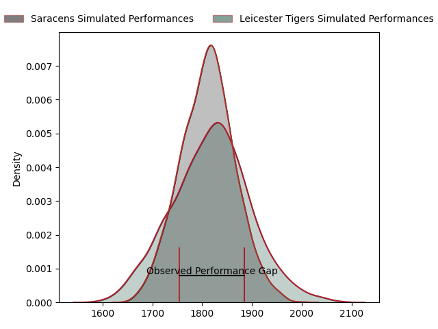
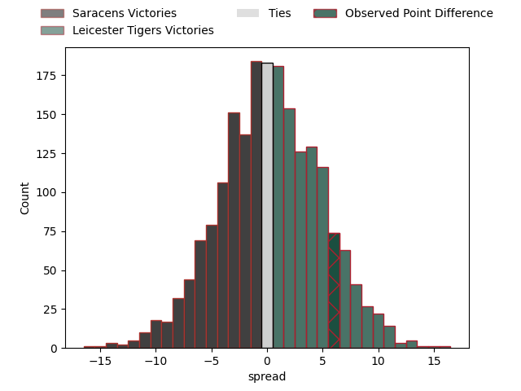
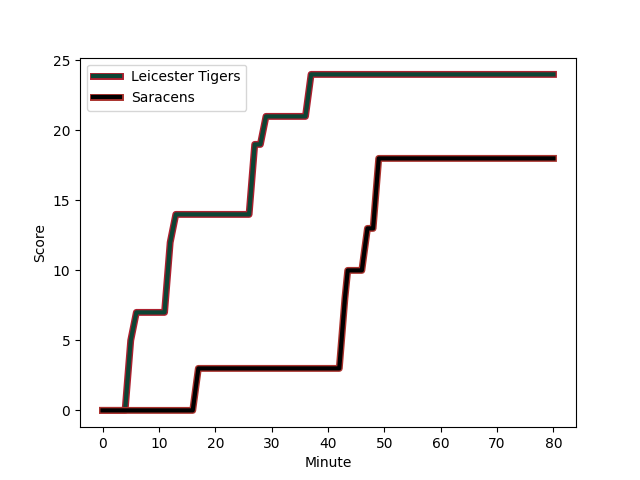
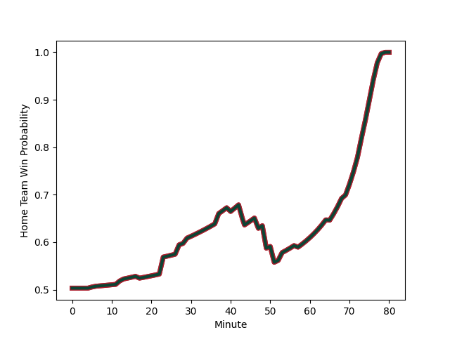

---  
layout: page  
title: Saracens at Leicester Tigers; 18.0-24.0  
date: 2023-02-19 10:00:00 18:00:00 -0500  
categories: match review  
---
# Saracens at Leicester Tigers; 18.0-24.0

# Club Level Predictions

The first set of predictions treats a club as the smallest object, as the club develops its members, organizes a gameplan, and deploys its players as needed for each match. This club model has a prediction of 0.504, which translates to predicting Leicester Tigers to win by 0.1.

Each club has a rating and a rating deviation (simiar to a Glicko system), and expected performances can be generated. This allows for simulated matches and spreads like the ones below.
## Projected Performances

## Projected Spreads

## Projected Results

# Player Level Predictions

Treating teams instead as an entity made up of the currently active players, I have ratings for each player in an altogether different system. These can be combined to form team ratings once teamsheets are announced, weighting starters a bit higher than the reserves. After the match is played, players can be weighted by their minutes on the field, allowing for an accurate measure of the team's composition. With these compiled team ratings, we can make predictions, measure inaccuracy, and update the individual player ratings.
## Prediction with Player Minutes: Leicester Tigers by 6.8

Leicester Tigers by 2.8 on a neutral field
## Scores over Time

## Win Probability over Time

There were 11 large changes in win probability in this match
## Prediction without Player Minutes: Leicester Tigers by 5.6

Leicester Tigers by 1.6 on a neutral pitch

|   Away Minutes | Away Player                                                   |   Away elo |   Away Percentile |   Number |   Home Percentile |   Home elo | Home Player                                                       |   Home Minutes |
|---------------:|:--------------------------------------------------------------|-----------:|------------------:|---------:|------------------:|-----------:|:------------------------------------------------------------------|---------------:|
|             40 | [Eroni Mawi](..//playerfiles//EroniMawi_cleaned.md)           |      84.18 |                19 |        1 |                56 |      94.75 | [Tom West](..//playerfiles//TomWest_cleaned.md)                   |             65 |
|             51 | [Kapeli Pifeleti](..//playerfiles//KapeliPifeleti_cleaned.md) |      45.89 |                 1 |        2 |                18 |      84.94 | [Julian Montoya](..//playerfiles//JulianMontoya_cleaned.md)       |             69 |
|             73 | [Marco Riccioni](..//playerfiles//MarcoRiccioni_cleaned.md)   |     105.7  |                83 |        3 |                72 |     101.35 | [Joe Heyes](..//playerfiles//JoeHeyes_cleaned.md)                 |             65 |
|             80 | [Tom Ellis](..//playerfiles//TomEllis_cleaned.md)             |      74.06 |                 7 |        4 |                56 |      97.18 | [George Martin](..//playerfiles//GeorgeMartin_cleaned.md)         |             80 |
|             80 | [Hugh Tizard](..//playerfiles//HughTizard_cleaned.md)         |      86.01 |                23 |        5 |                90 |     114.92 | [Cameron Henderson](..//playerfiles//CameronHenderson_cleaned.md) |             65 |
|             80 | [Andy Christie](..//playerfiles//AndyChristie_cleaned.md)     |      88.05 |                26 |        6 |                89 |     115.28 | [Hanro Liebenberg](..//playerfiles//HanroLiebenberg_cleaned.md)   |             80 |
|             23 | [Jackson Wray](..//playerfiles//JacksonWray_cleaned.md)       |     145.94 |                99 |        7 |                59 |      95.27 | [Olly Cracknell](..//playerfiles//OllyCracknell_cleaned.md)       |             53 |
|             80 | [Billy Vunipola](..//playerfiles//BillyVunipola_cleaned.md)   |     105.35 |                76 |        8 |                72 |     103.3  | [Jasper Wiese](..//playerfiles//JasperWiese_cleaned.md)           |             80 |
|             57 | [Aled Davies](..//playerfiles//AledDavies_cleaned.md)         |     100.99 |                70 |        9 |                22 |      87.32 | [Ben Youngs](..//playerfiles//BenYoungs_cleaned.md)               |             80 |
|             80 | [Alex Goode](..//playerfiles//AlexGoode_cleaned.md)           |     101.97 |                67 |       10 |                95 |     127.64 | [Handre Pollard](..//playerfiles//HandrePollard_cleaned.md)       |             80 |
|             80 | [Alex Lewington](..//playerfiles//AlexLewington_cleaned.md)   |      87.25 |                25 |       11 |                26 |      87.61 | [Harry Potter](..//playerfiles//HarryPotter_cleaned.md)           |             80 |
|             80 | [Nick Tompkins](..//playerfiles//NickTompkins_cleaned.md)     |     146.9  |                99 |       12 |                64 |      99.73 | [Jimmy Gopperth](..//playerfiles//JimmyGopperth_cleaned.md)       |             65 |
|             80 | [Alex Lozowski](..//playerfiles//AlexLozowski_cleaned.md)     |      95.32 |                51 |       13 |                26 |      86.66 | [Matt Scott](..//playerfiles//MattScott_cleaned.md)               |             80 |
|             80 | [Rotimi Segun](..//playerfiles//RotimiSegun_cleaned.md)       |     100.21 |                65 |       14 |                82 |     106.83 | [Chris Ashton](..//playerfiles//ChrisAshton_cleaned.md)           |             80 |
|             80 | [Sean Maitland](..//playerfiles//SeanMaitland_cleaned.md)     |     115.38 |                91 |       15 |                74 |     105.37 | [Mike Brown](..//playerfiles//MikeBrown_cleaned.md)               |             80 |
|             29 | [Theo Dan](..//playerfiles//TheoDan_cleaned.md)               |      98    |               nan |       16 |                 3 |      68.63 | [Charlie Clare](..//playerfiles//CharlieClare_cleaned.md)         |             11 |
|             40 | [Robin Hislop](..//playerfiles//RobinHislop_cleaned.md)       |     105.82 |               nan |       17 |                98 |     122.04 | [Francois van Wyk](..//playerfiles//FrancoisvanWyk_cleaned.md)    |             15 |
|              7 | [Christian Judge](..//playerfiles//ChristianJudge_cleaned.md) |      93.85 |               nan |       18 |                29 |      89.05 | [Will Hurd](..//playerfiles//WillHurd_cleaned.md)                 |             15 |
|              0 | [Cameron Boon](..//playerfiles//CameronBoon_cleaned.md)       |      92.1  |               nan |       19 |                32 |      89.54 | [Eli Snyman](..//playerfiles//EliSnyman_cleaned.md)               |             15 |
|             57 | [Toby Knight](..//playerfiles//TobyKnight_cleaned.md)         |      95    |               nan |       20 |                83 |     109.87 | [Tommy Reffell](..//playerfiles//TommyReffell_cleaned.md)         |             27 |
|             23 | [Ivan van Zyl](..//playerfiles//IvanvanZyl_cleaned.md)        |     113.72 |                93 |       21 |                28 |      87.83 | [Sam Edwards](..//playerfiles//SamEdwards_cleaned.md)             |              0 |
|              0 | [Olly Hartley](..//playerfiles//OllyHartley_cleaned.md)       |      95    |               nan |       22 |                35 |      89.33 | [Charlie Atkinson](..//playerfiles//CharlieAtkinson_cleaned.md)   |             15 |
|              0 | [Ben Harris](..//playerfiles//BenHarris_cleaned.md)           |      95    |               nan |       23 |                83 |     105.53 | [Harry Simmons](..//playerfiles//HarrySimmons_cleaned.md)         |              0 |

