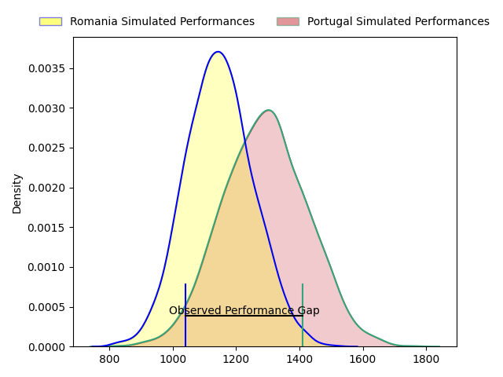
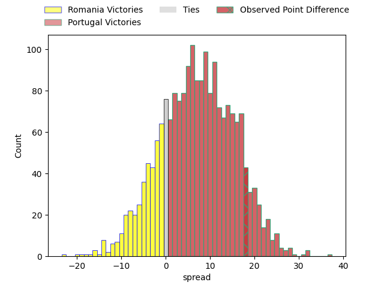
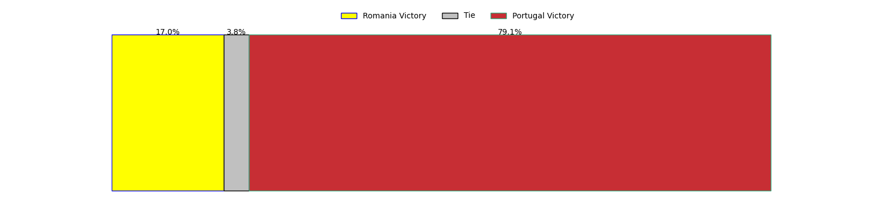
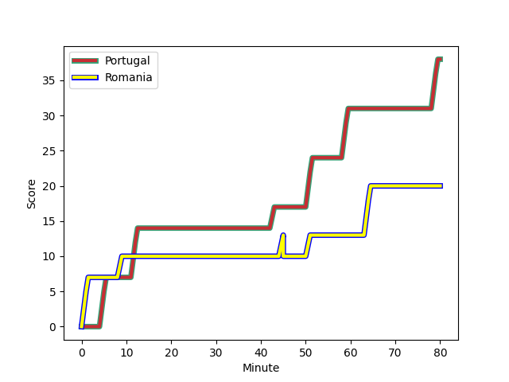
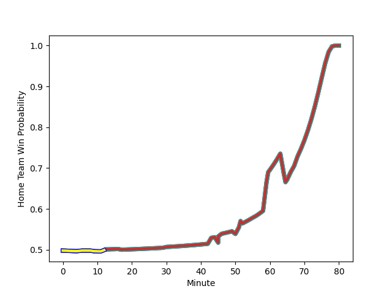

---  
layout: page  
title: Romania at Portugal; 20-38  
date: 2023-02-19 16:00:00 18:00:00 -0500  
categories: match review  
---
# Romania at Portugal; 20-38

# Club Level Predictions

The first set of predictions treats a club as the smallest object, as the club develops its members, organizes a gameplan, and deploys its players as needed for each match. This club model has a prediction of 0.688, which translates to predicting Portugal to win by 7.2.

Each club has a rating and a rating deviation (simiar to a Glicko system), and expected performances can be generated. This allows for simulated matches and spreads like the ones below.
## Projected Performances

## Projected Spreads

## Projected Results

# Player Level Predictions

Treating teams instead as an entity made up of the currently active players, I have ratings for each player in an altogether different system. These can be combined to form team ratings once teamsheets are announced, weighting starters a bit higher than the reserves. After the match is played, players can be weighted by their minutes on the field, allowing for an accurate measure of the team's composition. With these compiled team ratings, we can make predictions, measure inaccuracy, and update the individual player ratings.
## Prediction with Player Minutes: Portugal by 3.1

Romania by 0.9 on a neutral field
## Scores over Time

## Win Probability over Time

There were 9 large changes in win probability in this match
## Prediction without Player Minutes: Portugal by 2.9

Romania by 1.1 on a neutral pitch

|   Away Minutes | Away Player                                                                          |   Away elo |   Away Percentile |   Number |   Home Percentile |   Home elo | Home Player                                                                               |   Home Minutes |
|---------------:|:-------------------------------------------------------------------------------------|-----------:|------------------:|---------:|------------------:|-----------:|:------------------------------------------------------------------------------------------|---------------:|
|             50 | [Alexandru Savin](..//playerfiles//AlexandruSavin_cleaned.md)                        |     104.43 |                64 |        1 |                93 |     123.52 | [David Da Costa](..//playerfiles//DavidDaCosta_cleaned.md)                                |             79 |
|             50 | [Alexandru Savin](..//playerfiles//AlexandruSavin_cleaned.md)                        |     104.43 |                80 |        1 |                93 |     123.52 | [David Da Costa](..//playerfiles//DavidDaCosta_cleaned.md)                                |             79 |
|             50 | [Alexandru Savin](..//playerfiles//AlexandruSavin_cleaned.md)                        |     104.43 |                64 |        1 |                97 |     123.52 | [David Da Costa](..//playerfiles//DavidDaCosta_cleaned.md)                                |             79 |
|             50 | [Alexandru Savin](..//playerfiles//AlexandruSavin_cleaned.md)                        |     104.43 |                80 |        1 |                97 |     123.52 | [David Da Costa](..//playerfiles//DavidDaCosta_cleaned.md)                                |             79 |
|             52 | [Ovidiu Cojocaru](..//playerfiles//OvidiuCojocaru_cleaned.md)                        |      97.12 |               nan |        2 |               nan |      92.32 | [Lionel Campergue](..//playerfiles//LionelCampergue_cleaned.md)                           |             52 |
|             46 | [Thomas Cretu](..//playerfiles//ThomasCretu_cleaned.md)                              |      97.1  |               nan |        3 |                19 |      76.81 | [Anthony Alves](..//playerfiles//AnthonyAlves_cleaned.md)                                 |             46 |
|             46 | [Thomas Cretu](..//playerfiles//ThomasCretu_cleaned.md)                              |      97.1  |               nan |        3 |                10 |      76.81 | [Anthony Alves](..//playerfiles//AnthonyAlves_cleaned.md)                                 |             46 |
|             80 | [Adrian Motoc](..//playerfiles//AdrianMotoc_cleaned.md)                              |      99.62 |                64 |        4 |                86 |     111    | [José Duarte Madeira](..//playerfiles//JoséDuarteMadeira_cleaned.md)                      |             80 |
|             56 | [Marius Constantin Antonescu](..//playerfiles//MariusConstantinAntonescu_cleaned.md) |      97.56 |                40 |        5 |                40 |      91.87 | [Steevy Cerqueira](..//playerfiles//SteevyCerqueira_cleaned.md)                           |             80 |
|             56 | [Marius Constantin Antonescu](..//playerfiles//MariusConstantinAntonescu_cleaned.md) |      97.56 |                58 |        5 |                40 |      91.87 | [Steevy Cerqueira](..//playerfiles//SteevyCerqueira_cleaned.md)                           |             80 |
|             80 | [Florian Ghiorghita  Rosu](..//playerfiles//FlorianGhiorghitaRosu_cleaned.md)        |     102.39 |                69 |        6 |                48 |      94.6  | [Joao Granate](..//playerfiles//JoaoGranate_cleaned.md)                                   |             64 |
|             66 | [Vlad Neculau](..//playerfiles//VladNeculau_cleaned.md)                              |     105.37 |                76 |        7 |                54 |      97.16 | [Nicolas Martins](..//playerfiles//NicolasMartins_cleaned.md)                             |             80 |
|             80 | [Christian Marian Chirica](..//playerfiles//ChristianMarianChirica_cleaned.md)       |     107.53 |                81 |        8 |                91 |     117.65 | [Thibault De Freitas](..//playerfiles//ThibaultDeFreitas_cleaned.md)                      |             50 |
|             80 | [Christian Marian Chirica](..//playerfiles//ChristianMarianChirica_cleaned.md)       |     107.53 |                70 |        8 |                91 |     117.65 | [Thibault De Freitas](..//playerfiles//ThibaultDeFreitas_cleaned.md)                      |             50 |
|             80 | [Christian Marian Chirica](..//playerfiles//ChristianMarianChirica_cleaned.md)       |     107.53 |                81 |        8 |                82 |     117.65 | [Thibault De Freitas](..//playerfiles//ThibaultDeFreitas_cleaned.md)                      |             50 |
|             80 | [Christian Marian Chirica](..//playerfiles//ChristianMarianChirica_cleaned.md)       |     107.53 |                70 |        8 |                82 |     117.65 | [Thibault De Freitas](..//playerfiles//ThibaultDeFreitas_cleaned.md)                      |             50 |
|             52 | [Alexandru Tigla](..//playerfiles//AlexandruTigla_cleaned.md)                        |     104.71 |                75 |        9 |                29 |      94.72 | [Pedro Lucas](..//playerfiles//PedroLucas_cleaned.md)                                     |             68 |
|             52 | [Alexandru Tigla](..//playerfiles//AlexandruTigla_cleaned.md)                        |     104.71 |                59 |        9 |                29 |      94.72 | [Pedro Lucas](..//playerfiles//PedroLucas_cleaned.md)                                     |             68 |
|             80 | [Hinckley Vaovasa](..//playerfiles//HinckleyVaovasa_cleaned.md)                      |     105.18 |                73 |       10 |                72 |     103.07 | [Miguel Jeronimo Portela Morais](..//playerfiles//MiguelJeronimoPortelaMorais_cleaned.md) |             30 |
|             80 | [Nicolas Onutu](..//playerfiles//NicolasOnutu_cleaned.md)                            |     100.27 |                65 |       11 |                83 |     108.23 | [Rodrigo Marta](..//playerfiles//RodrigoMarta_cleaned.md)                                 |             80 |
|             80 | [Nicolas Onutu](..//playerfiles//NicolasOnutu_cleaned.md)                            |     100.27 |                51 |       11 |                83 |     108.23 | [Rodrigo Marta](..//playerfiles//RodrigoMarta_cleaned.md)                                 |             80 |
|             17 | [Taylor Gontineac](..//playerfiles//TaylorGontineac_cleaned.md)                      |      99.41 |                62 |       12 |               nan |      99.16 | [Pedro Bettencourt Avila](..//playerfiles//PedroBettencourtAvila_cleaned.md)              |             80 |
|             17 | [Taylor Gontineac](..//playerfiles//TaylorGontineac_cleaned.md)                      |      99.41 |                48 |       12 |               nan |      99.16 | [Pedro Bettencourt Avila](..//playerfiles//PedroBettencourtAvila_cleaned.md)              |             80 |
|             80 | [Jason Tomane](..//playerfiles//JasonTomane_cleaned.md)                              |      98.24 |               nan |       13 |                91 |     115.73 | [José Lima](..//playerfiles//JoséLima_cleaned.md)                                         |             80 |
|             80 | [Jason Tomane](..//playerfiles//JasonTomane_cleaned.md)                              |      98.24 |               nan |       13 |                81 |     115.73 | [José Lima](..//playerfiles//JoséLima_cleaned.md)                                         |             80 |
|             80 | [Marius Simionescu](..//playerfiles//MariusSimionescu_cleaned.md)                    |     101.48 |                69 |       14 |                51 |      95.23 | [Vincent Pinto](..//playerfiles//VincentPinto_cleaned.md)                                 |             77 |
|             80 | [Marius Simionescu](..//playerfiles//MariusSimionescu_cleaned.md)                    |     101.48 |                54 |       14 |                51 |      95.23 | [Vincent Pinto](..//playerfiles//VincentPinto_cleaned.md)                                 |             77 |
|             59 | [Paul Popoaia](..//playerfiles//PaulPopoaia_cleaned.md)                              |     112.71 |                88 |       15 |                66 |     102.53 | [Nuno Sousa Guedes](..//playerfiles//NunoSousaGuedes_cleaned.md)                          |             80 |
|             63 | [Ionel Melinte](..//playerfiles//IonelMelinte_cleaned.md)                            |     104.27 |                75 |       16 |                57 |     106.71 | [Simao Broeiro Bento](..//playerfiles//SimaoBroeiroBento_cleaned.md)                      |             50 |
|             63 | [Ionel Melinte](..//playerfiles//IonelMelinte_cleaned.md)                            |     104.27 |                75 |       16 |                75 |     106.71 | [Simao Broeiro Bento](..//playerfiles//SimaoBroeiroBento_cleaned.md)                      |             50 |
|             34 | [Costel Burtila](..//playerfiles//CostelBurtila_cleaned.md)                          |     107.12 |                83 |       17 |                24 |      96.45 | [Diogo Hasse Ferreira](..//playerfiles//DiogoHasseFerreira_cleaned.md)                    |             34 |
|             34 | [Costel Burtila](..//playerfiles//CostelBurtila_cleaned.md)                          |     107.12 |                83 |       17 |                55 |      96.45 | [Diogo Hasse Ferreira](..//playerfiles//DiogoHasseFerreira_cleaned.md)                    |             34 |
|             30 | [Constantin Ciprian Chiriac](..//playerfiles//ConstantinCiprianChiriac_cleaned.md)   |     105.18 |                77 |       18 |               nan |      96.36 | [Rafael Simoes](..//playerfiles//RafaelSimoes_cleaned.md)                                 |             30 |
|             30 | [Constantin Ciprian Chiriac](..//playerfiles//ConstantinCiprianChiriac_cleaned.md)   |     105.18 |                60 |       18 |               nan |      96.36 | [Rafael Simoes](..//playerfiles//RafaelSimoes_cleaned.md)                                 |             30 |
|             28 | [Tudor Gabriel  Butnariu](..//playerfiles//TudorGabrielButnariu_cleaned.md)          |     103.07 |                77 |       19 |                 3 |      69.63 | [Duarte Azevedo de Brito Diniz](..//playerfiles//DuarteAzevedodeBritoDiniz_cleaned.md)    |             28 |
|             28 | [Tudor Gabriel  Butnariu](..//playerfiles//TudorGabrielButnariu_cleaned.md)          |     103.07 |                61 |       19 |                 3 |      69.63 | [Duarte Azevedo de Brito Diniz](..//playerfiles//DuarteAzevedodeBritoDiniz_cleaned.md)    |             28 |
|             28 | [Alin Conache](..//playerfiles//AlinConache_cleaned.md)                              |      95.92 |                47 |       20 |                51 |      95.15 | [Jose Maria Rebelo De Andrade](..//playerfiles//JoseMariaRebeloDeAndrade_cleaned.md)      |             16 |
|             24 | [Marius Iftimiciuc](..//playerfiles//MariusIftimiciuc_cleaned.md)                    |     101.6  |                65 |       21 |                80 |     115.25 | [Joao Belo](..//playerfiles//JoaoBelo_cleaned.md)                                         |             12 |
|             24 | [Marius Iftimiciuc](..//playerfiles//MariusIftimiciuc_cleaned.md)                    |     101.6  |                65 |       21 |                91 |     115.25 | [Joao Belo](..//playerfiles//JoaoBelo_cleaned.md)                                         |             12 |
|             21 | [Gabriel Pop](..//playerfiles//GabrielPop_cleaned.md)                                |      79.44 |                11 |       22 |                67 |     100.66 | [Raffaele Costa Storti](..//playerfiles//RaffaeleCostaStorti_cleaned.md)                  |              3 |
|             14 | [Rob Irimescu](..//playerfiles//RobIrimescu_cleaned.md)                              |      91.44 |                28 |       23 |               nan |      94.61 | [Antonio Machado Santos](..//playerfiles//AntonioMachadoSantos_cleaned.md)                |              1 |

