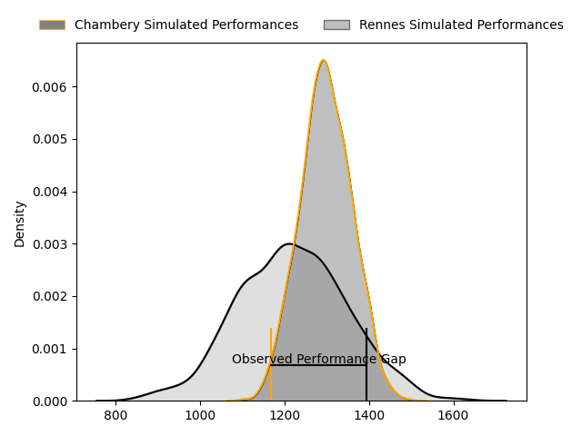
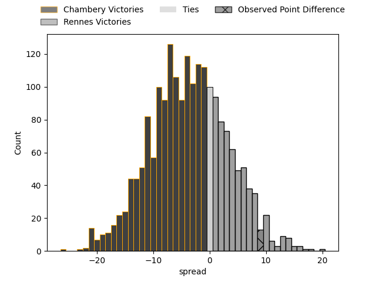
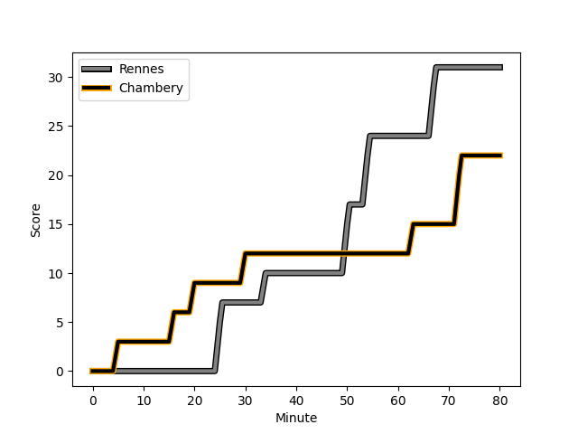
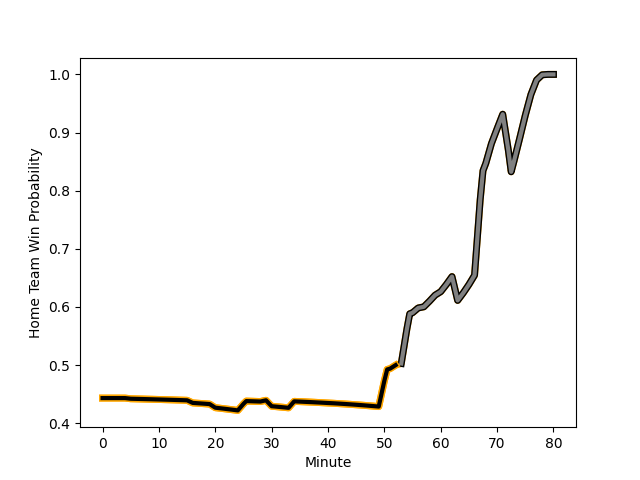

---  
layout: page  
title: Chambery at Rennes; 22-31  
date: 2023-02-19 14:30:00 18:00:00 -0500  
categories: match review  
---
# Chambery at Rennes; 22-31

# Club Level Predictions

The first set of predictions treats a club as the smallest object, as the club develops its members, organizes a gameplan, and deploys its players as needed for each match. This club model has a prediction of 0.394, which translates to predicting Chambery to win by 3.8.

Each club has a rating and a rating deviation (simiar to a Glicko system), and expected performances can be generated. This allows for simulated matches and spreads like the ones below.
## Projected Performances

## Projected Spreads

## Projected Results

# Player Level Predictions

Treating teams instead as an entity made up of the currently active players, I have ratings for each player in an altogether different system. These can be combined to form team ratings once teamsheets are announced, weighting starters a bit higher than the reserves. After the match is played, players can be weighted by their minutes on the field, allowing for an accurate measure of the team's composition. With these compiled team ratings, we can make predictions, measure inaccuracy, and update the individual player ratings.
## Prediction with Player Minutes: Chambery by 5.9

Chambery by 9.9 on a neutral field
## Scores over Time

## Win Probability over Time

There were 13 large changes in win probability in this match
## Prediction without Player Minutes: Chambery by 4.7

Chambery by 8.7 on a neutral pitch

|   Away Minutes | Away Player                                                                           |   Away elo |   Away Percentile |   Number |   Home Percentile |   Home elo | Home Player                                                             |   Home Minutes |
|---------------:|:--------------------------------------------------------------------------------------|-----------:|------------------:|---------:|------------------:|-----------:|:------------------------------------------------------------------------|---------------:|
|             41 | [Enzo Segui](..//playerfiles//EnzoSegui_cleaned.md)                                   |      97.09 |               nan |        1 |                25 |      88.07 | [Baptiste Le Jallé](..//playerfiles//BaptisteLeJallé_cleaned.md)        |             52 |
|             55 | [Gauthier Brute de Remur](..//playerfiles//GauthierBrutedeRemur_cleaned.md)           |      90.71 |                37 |        2 |                44 |      93.34 | [Patrick Tu'ugahala](..//playerfiles//PatrickTu'ugahala_cleaned.md)     |             52 |
|             55 | [Lautaro Caro Saisi](..//playerfiles//LautaroCaroSaisi_cleaned.md)                    |     101.45 |                71 |        3 |                44 |      93.6  | [Luvuyo Pupuma](..//playerfiles//LuvuyoPupuma_cleaned.md)               |             60 |
|             80 | [Jean-Baptiste Grenod](..//playerfiles//Jean-BaptisteGrenod_cleaned.md)               |     106.33 |                79 |        4 |                21 |      85.2  | [Alexandre Gueroult](..//playerfiles//AlexandreGueroult_cleaned.md)     |             55 |
|             55 | [Romain Guyot](..//playerfiles//RomainGuyot_cleaned.md)                               |      70.66 |                 6 |        5 |                24 |      86.66 | [Clément Fontaine](..//playerfiles//ClémentFontaine_cleaned.md)         |             80 |
|             80 | [Colin Lebian](..//playerfiles//ColinLebian_cleaned.md)                               |      98.78 |                60 |        6 |                55 |      98.38 | [Baptiste Beaujouan](..//playerfiles//BaptisteBeaujouan_cleaned.md)     |             60 |
|             60 | [Pierre-Nicolas Dance](..//playerfiles//Pierre-NicolasDance_cleaned.md)               |     102.36 |                72 |        7 |                41 |      92.16 | [Luca Di Salvatore](..//playerfiles//LucaDiSalvatore_cleaned.md)        |             57 |
|             80 | [Thomas Coignat](..//playerfiles//ThomasCoignat_cleaned.md)                           |     105.56 |                77 |        8 |                 8 |      73.6  | [Gaétan Béraud](..//playerfiles//GaétanBéraud_cleaned.md)               |             80 |
|             60 | [Thibault Dufau](..//playerfiles//ThibaultDufau_cleaned.md)                           |     101.73 |                71 |        9 |                54 |      94.72 | [Matéo Jeune-Joly](..//playerfiles//MatéoJeune-Joly_cleaned.md)         |             29 |
|             60 | [Thibault Moreno](..//playerfiles//ThibaultMoreno_cleaned.md)                         |      87.27 |                22 |       10 |                57 |      98.01 | [Sam Leeming](..//playerfiles//SamLeeming_cleaned.md)                   |             80 |
|             80 | [Theo Velten](..//playerfiles//TheoVelten_cleaned.md)                                 |     114.5  |                90 |       11 |                12 |      77.89 | [Alexis François](..//playerfiles//AlexisFrançois_cleaned.md)           |             80 |
|             80 | [Mickael Blanc](..//playerfiles//MickaelBlanc_cleaned.md)                             |      94.32 |                48 |       12 |                24 |      86.21 | [Ryan Dubois](..//playerfiles//RyanDubois_cleaned.md)                   |             80 |
|             80 | [Aviata Silago](..//playerfiles//AviataSilago_cleaned.md)                             |     100.7  |                62 |       13 |                40 |      91.31 | [Clément Lepresle](..//playerfiles//ClémentLepresle_cleaned.md)         |             69 |
|             80 | [Maewen Sao](..//playerfiles//MaewenSao_cleaned.md)                                   |      87.35 |                26 |       14 |                75 |     104.25 | [Enzo Salvai](..//playerfiles//EnzoSalvai_cleaned.md)                   |             80 |
|             60 | [Paul Baptiste Florent Altier](..//playerfiles//PaulBaptisteFlorentAltier_cleaned.md) |      91.26 |                40 |       15 |                22 |      86.11 | [Lucas Ollion](..//playerfiles//LucasOllion_cleaned.md)                 |             80 |
|             39 | [Géraud Clermont](..//playerfiles//GéraudClermont_cleaned.md)                         |      96.98 |                57 |       16 |                54 |     100.49 | [Grégory Querin](..//playerfiles//GrégoryQuerin_cleaned.md)             |             28 |
|             25 | [Luka Begic](..//playerfiles//LukaBegic_cleaned.md)                                   |      89.21 |                25 |       17 |                23 |      87.13 | [Pierre Strippoli](..//playerfiles//PierreStrippoli_cleaned.md)         |             28 |
|             25 | [Giorgi Pertaia](..//playerfiles//GiorgiPertaia_cleaned.md)                           |      98.8  |                63 |       18 |                32 |      87.81 | [Atonio Ulutuipalelei](..//playerfiles//AtonioUlutuipalelei_cleaned.md) |             20 |
|             25 | [Revan Gautier](..//playerfiles//RevanGautier_cleaned.md)                             |      92.38 |                43 |       19 |                66 |      98.89 | [Guillaume Cazette](..//playerfiles//GuillaumeCazette_cleaned.md)       |             25 |
|             20 | [Julien Primault](..//playerfiles//JulienPrimault_cleaned.md)                         |      98.2  |                62 |       20 |                 8 |      75.29 | [Victor Fromenteze](..//playerfiles//VictorFromenteze_cleaned.md)       |             20 |
|             20 | [Dylan Nocete](..//playerfiles//DylanNocete_cleaned.md)                               |      94.2  |                51 |       21 |                10 |      79.5  | [Pedro Ortega](..//playerfiles//PedroOrtega_cleaned.md)                 |             23 |
|             20 | [Victor Pisano](..//playerfiles//VictorPisano_cleaned.md)                             |      86.4  |                25 |       22 |                61 |      99.15 | [Hypolite Cornu](..//playerfiles//HypoliteCornu_cleaned.md)             |             51 |
|             20 | [Jules Dorrival](..//playerfiles//JulesDorrival_cleaned.md)                           |      84.78 |                26 |       23 |                89 |     118.33 | [Joaquin Diaz Luzzi](..//playerfiles//JoaquinDiazLuzzi_cleaned.md)      |             11 |

