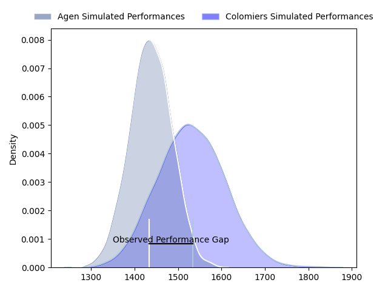
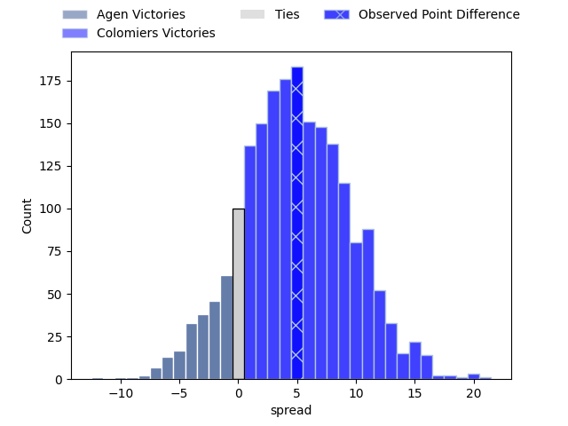
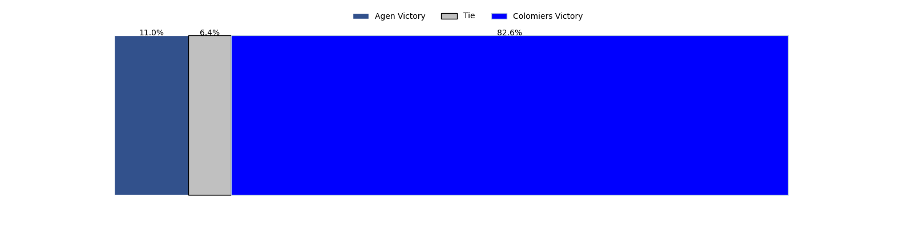
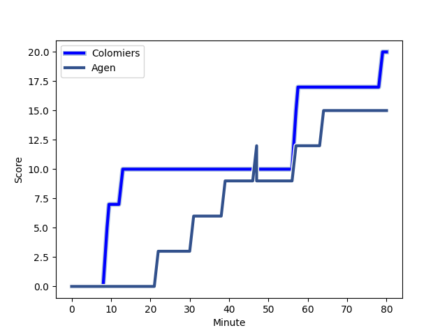
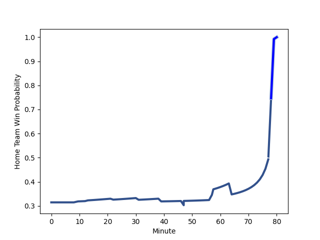

---  
layout: page  
title: Agen at Colomiers; 15-20  
date: 2023-02-23 21:00:00 18:00:00 -0500  
categories: match review  
---
# Agen at Colomiers; 15-20

# Club Level Predictions

The first set of predictions treats a club as the smallest object, as the club develops its members, organizes a gameplan, and deploys its players as needed for each match. This club model has a prediction of 0.632, which translates to predicting Colomiers to win by 4.8.

Each club has a rating and a rating deviation (simiar to a Glicko system), and expected performances can be generated. This allows for simulated matches and spreads like the ones below.
## Projected Performances

## Projected Spreads

## Projected Results

# Player Level Predictions

Treating teams instead as an entity made up of the currently active players, I have ratings for each player in an altogether different system. These can be combined to form team ratings once teamsheets are announced, weighting starters a bit higher than the reserves. After the match is played, players can be weighted by their minutes on the field, allowing for an accurate measure of the team's composition. With these compiled team ratings, we can make predictions, measure inaccuracy, and update the individual player ratings.
## Prediction with Player Minutes: Agen by 31.3

Agen by 35.3 on a neutral field
## Scores over Time

## Win Probability over Time

There were 5 large changes in win probability in this match
## Prediction without Player Minutes: Agen by 34.1

Agen by 38.1 on a neutral pitch

|   Away Minutes | Away Player                                                              |   Away elo |   Away Percentile |   Number |   Home Percentile |   Home elo | Home Player                                                         |   Home Minutes |
|---------------:|:-------------------------------------------------------------------------|-----------:|------------------:|---------:|------------------:|-----------:|:--------------------------------------------------------------------|---------------:|
|             80 | [Hans Lombard-Buret](..//playerfiles//HansLombard-Buret_cleaned.md)      |     102.26 |                78 |        1 |                 5 |      74.57 | [Thomas Dubois](..//playerfiles//ThomasDubois_cleaned.md)           |             80 |
|             57 | [Hans Lombard-Buret](..//playerfiles//HansLombard-Buret_cleaned.md)      |     102.26 |                78 |        1 |                 5 |      74.57 | [Thomas Dubois](..//playerfiles//ThomasDubois_cleaned.md)           |             80 |
|             80 | [Hans Lombard-Buret](..//playerfiles//HansLombard-Buret_cleaned.md)      |     102.26 |                78 |        1 |                 5 |      74.57 | [Thomas Dubois](..//playerfiles//ThomasDubois_cleaned.md)           |             61 |
|             57 | [Hans Lombard-Buret](..//playerfiles//HansLombard-Buret_cleaned.md)      |     102.26 |                78 |        1 |                 5 |      74.57 | [Thomas Dubois](..//playerfiles//ThomasDubois_cleaned.md)           |             61 |
|             57 | [Loris Zarantonello](..//playerfiles//LorisZarantonello_cleaned.md)      |      91.74 |                40 |        2 |                20 |      85.57 | [Andrew Ready](..//playerfiles//AndrewReady_cleaned.md)             |             80 |
|             80 | [Loris Zarantonello](..//playerfiles//LorisZarantonello_cleaned.md)      |      91.74 |                40 |        2 |                20 |      85.57 | [Andrew Ready](..//playerfiles//AndrewReady_cleaned.md)             |             80 |
|             80 | [Loris Zarantonello](..//playerfiles//LorisZarantonello_cleaned.md)      |      91.74 |                40 |        2 |                20 |      85.57 | [Andrew Ready](..//playerfiles//AndrewReady_cleaned.md)             |             52 |
|             57 | [Loris Zarantonello](..//playerfiles//LorisZarantonello_cleaned.md)      |      91.74 |                40 |        2 |                20 |      85.57 | [Andrew Ready](..//playerfiles//AndrewReady_cleaned.md)             |             52 |
|             80 | [Alex Burin](..//playerfiles//AlexBurin_cleaned.md)                      |     103.59 |                81 |        3 |                 8 |      79.62 | [Marco Fepulea'i](..//playerfiles//MarcoFepulea'i_cleaned.md)       |             80 |
|             80 | [Alex Burin](..//playerfiles//AlexBurin_cleaned.md)                      |     103.59 |                81 |        3 |                24 |      79.62 | [Marco Fepulea'i](..//playerfiles//MarcoFepulea'i_cleaned.md)       |             52 |
|             57 | [Alex Burin](..//playerfiles//AlexBurin_cleaned.md)                      |     103.59 |                81 |        3 |                24 |      79.62 | [Marco Fepulea'i](..//playerfiles//MarcoFepulea'i_cleaned.md)       |             52 |
|             80 | [Alex Burin](..//playerfiles//AlexBurin_cleaned.md)                      |     103.59 |                81 |        3 |                 8 |      79.62 | [Marco Fepulea'i](..//playerfiles//MarcoFepulea'i_cleaned.md)       |             52 |
|             57 | [Alex Burin](..//playerfiles//AlexBurin_cleaned.md)                      |     103.59 |                81 |        3 |                 8 |      79.62 | [Marco Fepulea'i](..//playerfiles//MarcoFepulea'i_cleaned.md)       |             52 |
|             57 | [Alex Burin](..//playerfiles//AlexBurin_cleaned.md)                      |     103.59 |                81 |        3 |                24 |      79.62 | [Marco Fepulea'i](..//playerfiles//MarcoFepulea'i_cleaned.md)       |             80 |
|             80 | [Alex Burin](..//playerfiles//AlexBurin_cleaned.md)                      |     103.59 |                81 |        3 |                24 |      79.62 | [Marco Fepulea'i](..//playerfiles//MarcoFepulea'i_cleaned.md)       |             80 |
|             57 | [Alex Burin](..//playerfiles//AlexBurin_cleaned.md)                      |     103.59 |                81 |        3 |                 8 |      79.62 | [Marco Fepulea'i](..//playerfiles//MarcoFepulea'i_cleaned.md)       |             80 |
|             80 | [Joe Maksymiw](..//playerfiles//JoeMaksymiw_cleaned.md)                  |     104.78 |                74 |        4 |                33 |      89.98 | [Maxime Granouillet](..//playerfiles//MaximeGranouillet_cleaned.md) |             80 |
|             80 | [William Demotte](..//playerfiles//WilliamDemotte_cleaned.md)            |     109.2  |                83 |        5 |                21 |      84.94 | [Alexandre Ricard](..//playerfiles//AlexandreRicard_cleaned.md)     |             80 |
|             26 | [William Demotte](..//playerfiles//WilliamDemotte_cleaned.md)            |     109.2  |                83 |        5 |                21 |      84.94 | [Alexandre Ricard](..//playerfiles//AlexandreRicard_cleaned.md)     |             80 |
|             80 | [William Demotte](..//playerfiles//WilliamDemotte_cleaned.md)            |     109.2  |                83 |        5 |                21 |      84.94 | [Alexandre Ricard](..//playerfiles//AlexandreRicard_cleaned.md)     |              9 |
|             26 | [William Demotte](..//playerfiles//WilliamDemotte_cleaned.md)            |     109.2  |                83 |        5 |                21 |      84.94 | [Alexandre Ricard](..//playerfiles//AlexandreRicard_cleaned.md)     |              9 |
|             80 | [Fotu Lokotui](..//playerfiles//FotuLokotui_cleaned.md)                  |      91.18 |                36 |        6 |                 6 |      72.81 | [Anthony Coletta](..//playerfiles//AnthonyColetta_cleaned.md)       |             80 |
|             80 | [Fotu Lokotui](..//playerfiles//FotuLokotui_cleaned.md)                  |      91.18 |                36 |        6 |                 6 |      72.81 | [Anthony Coletta](..//playerfiles//AnthonyColetta_cleaned.md)       |             19 |
|             80 | [Vincent Farré](..//playerfiles//VincentFarré_cleaned.md)                |      90.87 |                36 |        7 |                73 |     104.28 | [Aldric Lescure](..//playerfiles//AldricLescure_cleaned.md)         |             80 |
|             65 | [Vincent Farré](..//playerfiles//VincentFarré_cleaned.md)                |      90.87 |                36 |        7 |                73 |     104.28 | [Aldric Lescure](..//playerfiles//AldricLescure_cleaned.md)         |             80 |
|             80 | [Martin Devergie](..//playerfiles//MartinDevergie_cleaned.md)            |     101.95 |                69 |        8 |                 6 |      74.08 | [Jorick Dastugue](..//playerfiles//JorickDastugue_cleaned.md)       |             80 |
|             65 | [Sonatane Takulua](..//playerfiles//SonataneTakulua_cleaned.md)          |     100.52 |                68 |        9 |                66 |     100.1  | [Mathis Galthié](..//playerfiles//MathisGalthié_cleaned.md)         |             80 |
|             65 | [Sonatane Takulua](..//playerfiles//SonataneTakulua_cleaned.md)          |     100.52 |                68 |        9 |                66 |     100.1  | [Mathis Galthié](..//playerfiles//MathisGalthié_cleaned.md)         |             63 |
|             80 | [Sonatane Takulua](..//playerfiles//SonataneTakulua_cleaned.md)          |     100.52 |                68 |        9 |                66 |     100.1  | [Mathis Galthié](..//playerfiles//MathisGalthié_cleaned.md)         |             63 |
|             80 | [Sonatane Takulua](..//playerfiles//SonataneTakulua_cleaned.md)          |     100.52 |                68 |        9 |                66 |     100.1  | [Mathis Galthié](..//playerfiles//MathisGalthié_cleaned.md)         |             80 |
|             80 | [Elton Thomas Jantjies](..//playerfiles//EltonThomasJantjies_cleaned.md) |      97.66 |                56 |       10 |                42 |      92.71 | [Maxime Javaux](..//playerfiles//MaximeJavaux_cleaned.md)           |             80 |
|             80 | [Timilai Rokoduru](..//playerfiles//TimilaiRokoduru_cleaned.md)          |      86.88 |                25 |       11 |                45 |      92.97 | [Alexis Palisson](..//playerfiles//AlexisPalisson_cleaned.md)       |             80 |
|             80 | [Kolinio Ramoka](..//playerfiles//KolinioRamoka_cleaned.md)              |     116.88 |                92 |       12 |                14 |      75.23 | [Johan Deysel](..//playerfiles//JohanDeysel_cleaned.md)             |             80 |
|             80 | [Kolinio Ramoka](..//playerfiles//KolinioRamoka_cleaned.md)              |     116.88 |                92 |       12 |                14 |      75.23 | [Johan Deysel](..//playerfiles//JohanDeysel_cleaned.md)             |             60 |
|             80 | [Kolinio Ramoka](..//playerfiles//KolinioRamoka_cleaned.md)              |     116.88 |                92 |       12 |                 6 |      75.23 | [Johan Deysel](..//playerfiles//JohanDeysel_cleaned.md)             |             80 |
|             80 | [Kolinio Ramoka](..//playerfiles//KolinioRamoka_cleaned.md)              |     116.88 |                92 |       12 |                 6 |      75.23 | [Johan Deysel](..//playerfiles//JohanDeysel_cleaned.md)             |             60 |
|             65 | [Théo Belan](..//playerfiles//ThéoBelan_cleaned.md)                      |      89.48 |                33 |       13 |                99 |     143.23 | [Paul Pimienta](..//playerfiles//PaulPimienta_cleaned.md)           |             80 |
|             80 | [Théo Belan](..//playerfiles//ThéoBelan_cleaned.md)                      |      89.48 |                33 |       13 |                99 |     143.23 | [Paul Pimienta](..//playerfiles//PaulPimienta_cleaned.md)           |             80 |
|             80 | [Tevita Railevu](..//playerfiles//TevitaRailevu_cleaned.md)              |     108.04 |                82 |       14 |                42 |      91.95 | [Valentin Saurs](..//playerfiles//ValentinSaurs_cleaned.md)         |             80 |
|             80 | [Iban Etcheverry](..//playerfiles//IbanEtcheverry_cleaned.md)            |      95.68 |                52 |       14 |                42 |      91.95 | [Valentin Saurs](..//playerfiles//ValentinSaurs_cleaned.md)         |             80 |
|             78 | [Mathieu Lamoulie](..//playerfiles//MathieuLamoulie_cleaned.md)          |      94.66 |                50 |       15 |                83 |     109.96 | [Max Auriac](..//playerfiles//MaxAuriac_cleaned.md)                 |             80 |
|             80 | [Mathieu Lamoulie](..//playerfiles//MathieuLamoulie_cleaned.md)          |      94.66 |                50 |       15 |                83 |     109.96 | [Max Auriac](..//playerfiles//MaxAuriac_cleaned.md)                 |             80 |
|             54 | [Evan Olmstead](..//playerfiles//EvanOlmstead_cleaned.md)                |     101.96 |                71 |       16 |                83 |     110.13 | [Jean Thomas](..//playerfiles//JeanThomas_cleaned.md)               |             71 |
|             23 | [Walter Desmaison](..//playerfiles//WalterDesmaison_cleaned.md)          |      92.42 |                40 |       17 |                40 |      91.75 | [Waël Ponpon](..//playerfiles//WaëlPonpon_cleaned.md)               |             61 |
|             23 | [Florent Guion](..//playerfiles//FlorentGuion_cleaned.md)                |      65.5  |                 2 |       18 |                97 |     124.62 | [Guillaume Tartas](..//playerfiles//GuillaumeTartas_cleaned.md)     |             19 |
|             23 | [Clément Martinez](..//playerfiles//ClémentMartinez_cleaned.md)          |     101.72 |                72 |       19 |                 4 |      72.03 | [Hugo Pirlet](..//playerfiles//HugoPirlet_cleaned.md)               |             28 |
|             15 | [Harry Sloan](..//playerfiles//HarrySloan_cleaned.md)                    |      90.71 |                37 |       20 |                97 |     125.19 | [Thomas Larrieu](..//playerfiles//ThomasLarrieu_cleaned.md)         |             28 |
|             15 | [Antoine Erbani](..//playerfiles//AntoineErbani_cleaned.md)              |      94.06 |                46 |       21 |                 3 |      63.08 | [Victor Moro](..//playerfiles//VictorMoro_cleaned.md)               |             20 |
|             15 | [Dorian Bellot](..//playerfiles//DorianBellot_cleaned.md)                |      93.55 |                48 |       22 |                17 |      83.18 | [Edoardo Gori](..//playerfiles//EdoardoGori_cleaned.md)             |             17 |
|              2 | [Danré Gerber](..//playerfiles//DanréGerber_cleaned.md)                  |      76.43 |                14 |       23 |               nan |     nan    | nan                                                                 |            nan |

