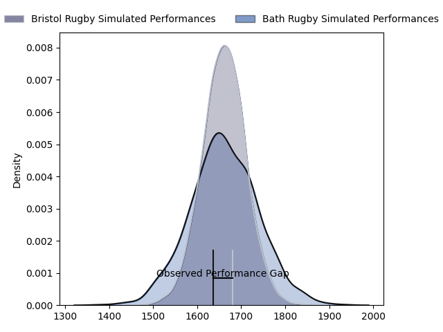
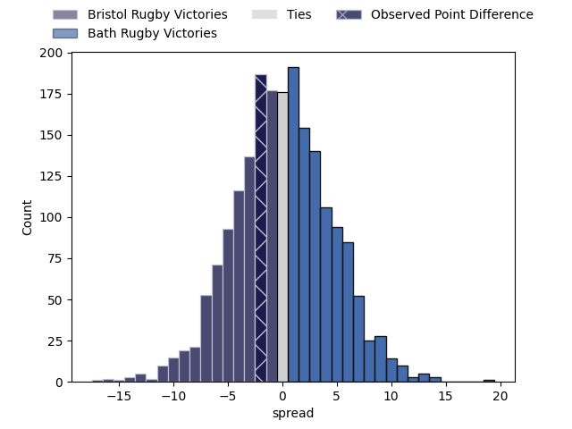
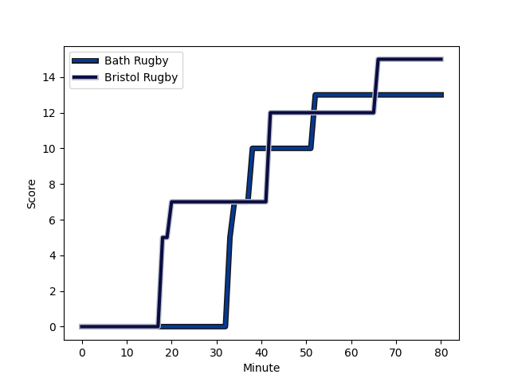
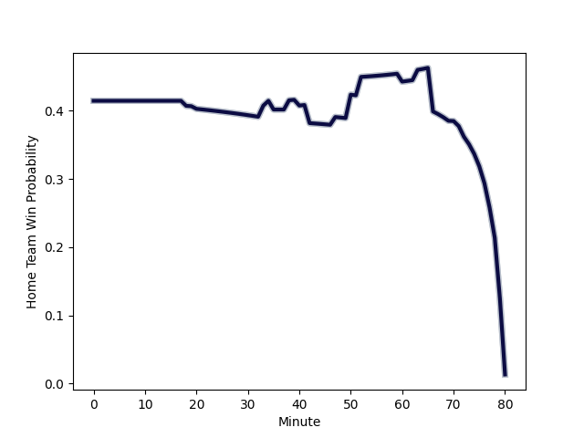

---  
layout: page  
title: Bristol Rugby at Bath Rugby; 15-13  
date: 2023-02-24 14:45:00 18:00:00 -0500  
categories: match review  
---
# Bristol Rugby at Bath Rugby; 15-13

# Club Level Predictions

The first set of predictions treats a club as the smallest object, as the club develops its members, organizes a gameplan, and deploys its players as needed for each match. This club model has a prediction of 0.502, which translates to predicting Bath Rugby to win by 0.1.

Each club has a rating and a rating deviation (simiar to a Glicko system), and expected performances can be generated. This allows for simulated matches and spreads like the ones below.
## Projected Performances

## Projected Spreads

## Projected Results

# Player Level Predictions

Treating teams instead as an entity made up of the currently active players, I have ratings for each player in an altogether different system. These can be combined to form team ratings once teamsheets are announced, weighting starters a bit higher than the reserves. After the match is played, players can be weighted by their minutes on the field, allowing for an accurate measure of the team's composition. With these compiled team ratings, we can make predictions, measure inaccuracy, and update the individual player ratings.
## Prediction with Player Minutes: Bristol Rugby by 10.2

Bristol Rugby by 14.2 on a neutral field
## Scores over Time

## Win Probability over Time

There were 8 large changes in win probability in this match
## Prediction without Player Minutes: Bristol Rugby by 8.8

Bristol Rugby by 12.8 on a neutral pitch

|   Away Minutes | Away Player                                                   |   Away elo |   Away Percentile |   Number |   Home Percentile |   Home elo | Home Player                                                    |   Home Minutes |
|---------------:|:--------------------------------------------------------------|-----------:|------------------:|---------:|------------------:|-----------:|:---------------------------------------------------------------|---------------:|
|             70 | [Yann Thomas](..//playerfiles//YannThomas_cleaned.md)         |      96.05 |                51 |        1 |                87 |     108.44 | [Beno Obano](..//playerfiles//BenoObano_cleaned.md)            |             66 |
|             70 | [Harry Thacker](..//playerfiles//HarryThacker_cleaned.md)     |      96.76 |                58 |        2 |                56 |      94.06 | [Niall Annett](..//playerfiles//NiallAnnett_cleaned.md)        |             50 |
|             70 | [Max Lahiff](..//playerfiles//MaxLahiff_cleaned.md)           |      97.22 |                58 |        3 |                 0 |      42.28 | [D'Arcy Rae](..//playerfiles//D'ArcyRae_cleaned.md)            |             50 |
|             70 | [Joe Joyce](..//playerfiles//JoeJoyce_cleaned.md)             |     145.1  |                99 |        4 |                76 |     105.02 | [Dave Attwood](..//playerfiles//DaveAttwood_cleaned.md)        |             80 |
|             80 | [Chris Vui](..//playerfiles//ChrisVui_cleaned.md)             |     111.36 |                87 |        5 |                94 |     120.67 | [Quinn Roux](..//playerfiles//QuinnRoux_cleaned.md)            |             35 |
|             80 | [Sam Jeffries](..//playerfiles//SamJeffries_cleaned.md)       |     134.38 |                98 |        6 |                52 |      96.71 | [Josh Bayliss](..//playerfiles//JoshBayliss_cleaned.md)        |             80 |
|             80 | [Fitz Harding](..//playerfiles//FitzHarding_cleaned.md)       |     111.69 |                86 |        7 |                51 |      95.85 | [Sam Underhill](..//playerfiles//SamUnderhill_cleaned.md)      |             63 |
|             80 | [Magnus Bradbury](..//playerfiles//MagnusBradbury_cleaned.md) |      90.36 |                34 |        8 |                91 |     116.83 | [Miles Reid](..//playerfiles//MilesReid_cleaned.md)            |             78 |
|             80 | [Harry Randall](..//playerfiles//HarryRandall_cleaned.md)     |     109.56 |                86 |        9 |                91 |     112.92 | [Ben Spencer](..//playerfiles//BenSpencer_cleaned.md)          |             72 |
|             80 | [AJ MacGinty](..//playerfiles//AJMacGinty_cleaned.md)         |     109.33 |                83 |       10 |                94 |     123.7  | [Piers Francis](..//playerfiles//PiersFrancis_cleaned.md)      |             80 |
|             80 | [Gabriel Ibitoye](..//playerfiles//GabrielIbitoye_cleaned.md) |     112.04 |                86 |       11 |                92 |     119.77 | [Matt Gallagher](..//playerfiles//MattGallagher_cleaned.md)    |             80 |
|             80 | [James Williams](..//playerfiles//JamesWilliams_cleaned.md)   |      85.24 |                21 |       12 |                13 |      80.45 | [Max Ojomoh](..//playerfiles//MaxOjomoh_cleaned.md)            |             80 |
|             80 | [Semi Radradra](..//playerfiles//SemiRadradra_cleaned.md)     |     128.33 |                96 |       13 |                67 |     100.91 | [Cameron Redpath](..//playerfiles//CameronRedpath_cleaned.md)  |             80 |
|             80 | [Ratu Naulago](..//playerfiles//RatuNaulago_cleaned.md)       |      99.31 |                62 |       14 |                55 |      96.79 | [Joe Cokanasiga](..//playerfiles//JoeCokanasiga_cleaned.md)    |             40 |
|             78 | [Charles Piutau](..//playerfiles//CharlesPiutau_cleaned.md)   |     119.98 |                93 |       15 |                11 |      75.99 | [Tom de Glanville](..//playerfiles//TomdeGlanville_cleaned.md) |             67 |
|             10 | [Bryan Byrne](..//playerfiles//BryanByrne_cleaned.md)         |     104.39 |                80 |       16 |                97 |     125.38 | [Tom Dunn](..//playerfiles//TomDunn_cleaned.md)                |             30 |
|             10 | [Jake Woolmore](..//playerfiles//JakeWoolmore_cleaned.md)     |     122.32 |                97 |       17 |               nan |     113.52 | [Juan Schoeman](..//playerfiles//JuanSchoeman_cleaned.md)      |             14 |
|             10 | [George Kloska](..//playerfiles//GeorgeKloska_cleaned.md)     |      93.97 |               nan |       18 |                17 |      79.68 | [Will Stuart](..//playerfiles//WillStuart_cleaned.md)          |             30 |
|             10 | [Jake Heenan](..//playerfiles//JakeHeenan_cleaned.md)         |      97.09 |                53 |       19 |                51 |      95.73 | [GJ van Velze](..//playerfiles//GJvanVelze_cleaned.md)         |             45 |
|              0 | [Samuel Lewis](..//playerfiles//SamuelLewis_cleaned.md)       |      95    |               nan |       20 |                78 |     106.55 | [Jaco Coetzee](..//playerfiles//JacoCoetzee_cleaned.md)        |              2 |
|              0 | [Andy Uren](..//playerfiles//AndyUren_cleaned.md)             |      74.39 |                 9 |       21 |                65 |      99.46 | [Louis Schreuder](..//playerfiles//LouisSchreuder_cleaned.md)  |             21 |
|              0 | [Sam Bedlow](..//playerfiles//SamBedlow_cleaned.md)           |     119.97 |                94 |       22 |                13 |      78.52 | [Orlando Bailey](..//playerfiles//OrlandoBailey_cleaned.md)    |             40 |
|              2 | [Ioan Lloyd](..//playerfiles//IoanLloyd_cleaned.md)           |      78.18 |                 9 |       23 |                95 |     122.51 | [Chris Cloete](..//playerfiles//ChrisCloete_cleaned.md)        |             17 |

