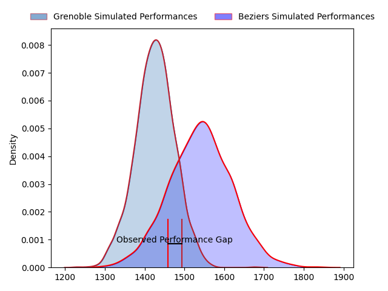
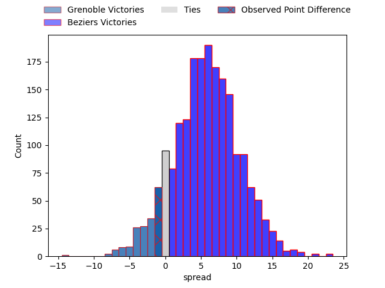
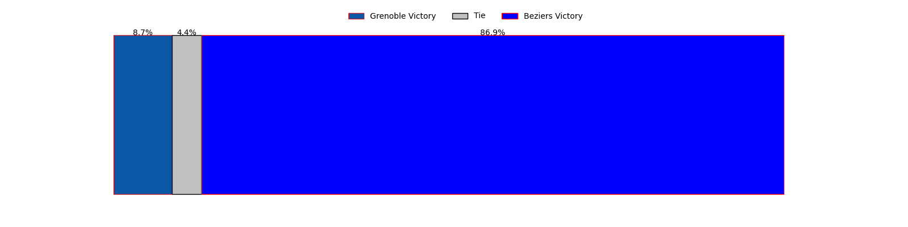
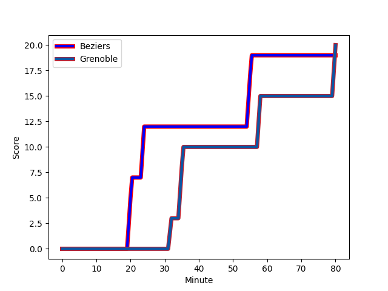
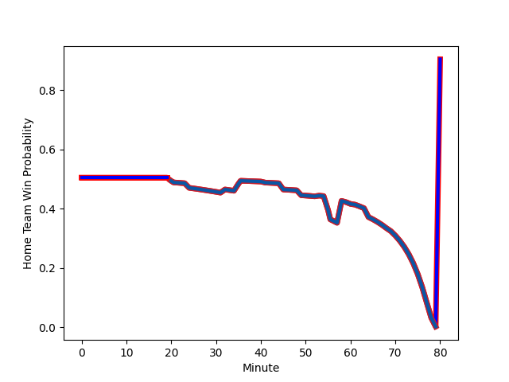

---  
layout: page  
title: Grenoble at Beziers; 20-19  
date: 2023-02-24 19:00:00 18:00:00 -0500  
categories: match review  
---
# Grenoble at Beziers; 20-19

# Club Level Predictions

The first set of predictions treats a club as the smallest object, as the club develops its members, organizes a gameplan, and deploys its players as needed for each match. This club model has a prediction of 0.652, which translates to predicting Beziers to win by 5.5.

Each club has a rating and a rating deviation (simiar to a Glicko system), and expected performances can be generated. This allows for simulated matches and spreads like the ones below.
## Projected Performances

## Projected Spreads

## Projected Results

# Player Level Predictions

Treating teams instead as an entity made up of the currently active players, I have ratings for each player in an altogether different system. These can be combined to form team ratings once teamsheets are announced, weighting starters a bit higher than the reserves. After the match is played, players can be weighted by their minutes on the field, allowing for an accurate measure of the team's composition. With these compiled team ratings, we can make predictions, measure inaccuracy, and update the individual player ratings.
## Prediction with Player Minutes: Beziers by 4.9

Beziers by 0.9 on a neutral field
## Scores over Time

## Win Probability over Time

There were 11 large changes in win probability in this match
## Prediction without Player Minutes: Beziers by 3.3

Grenoble by 0.7 on a neutral pitch

|   Away Minutes | Away Player                                                           |   Away elo |   Away Percentile |   Number |   Home Percentile |   Home elo | Home Player                                                              |   Home Minutes |
|---------------:|:----------------------------------------------------------------------|-----------:|------------------:|---------:|------------------:|-----------:|:-------------------------------------------------------------------------|---------------:|
|             53 | [Luka Goginava](..//playerfiles//LukaGoginava_cleaned.md)             |      81.36 |                13 |        1 |                31 |      89.83 | [Francisco Fernandes](..//playerfiles//FranciscoFernandes_cleaned.md)    |             49 |
|             55 | [Enzo Camilleri](..//playerfiles//EnzoCamilleri_cleaned.md)           |      87.38 |                25 |        2 |                20 |      86.63 | [Wilmar Arnoldi](..//playerfiles//WilmarArnoldi_cleaned.md)              |             64 |
|             55 | [Enzo Camilleri](..//playerfiles//EnzoCamilleri_cleaned.md)           |      87.38 |                25 |        2 |                42 |      86.63 | [Wilmar Arnoldi](..//playerfiles//WilmarArnoldi_cleaned.md)              |             64 |
|             49 | [Tomakino Taufa](..//playerfiles//TomakinoTaufa_cleaned.md)           |      98.1  |               nan |        3 |                 9 |      78.59 | [Yannick Arroyo](..//playerfiles//YannickArroyo_cleaned.md)              |             49 |
|             41 | [Adrien Vigne](..//playerfiles//AdrienVigne_cleaned.md)               |      94.61 |                45 |        4 |                36 |      90.85 | [Pierrick Gunther](..//playerfiles//PierrickGunther_cleaned.md)          |             64 |
|             80 | [Levi Douglas](..//playerfiles//LeviDouglas_cleaned.md)               |      99.13 |                62 |        5 |                14 |      81.06 | [John Madigan](..//playerfiles//JohnMadigan_cleaned.md)                  |             80 |
|             80 | [Antonin Berruyer](..//playerfiles//AntoninBerruyer_cleaned.md)       |      94.08 |               nan |        6 |                62 |      99.09 | [William van Bost](..//playerfiles//WilliamvanBost_cleaned.md)           |             80 |
|             55 | [Clément Ancely](..//playerfiles//ClémentAncely_cleaned.md)           |      97.1  |                54 |        7 |                20 |      85.61 | [Thomas Hoarau](..//playerfiles//ThomasHoarau_cleaned.md)                |             80 |
|             80 | [Talalelei Gray](..//playerfiles//TalaleleiGray_cleaned.md)           |      91.99 |                44 |        8 |                81 |     108.38 | [Sias Koen](..//playerfiles//SiasKoen_cleaned.md)                        |             55 |
|             69 | [Felipe Ezcurra](..//playerfiles//FelipeEzcurra_cleaned.md)           |      91.79 |                45 |        9 |                51 |      89.71 | [Jean Victor Goillot](..//playerfiles//JeanVictorGoillot_cleaned.md)     |             53 |
|             69 | [Felipe Ezcurra](..//playerfiles//FelipeEzcurra_cleaned.md)           |      91.79 |                45 |        9 |                29 |      89.71 | [Jean Victor Goillot](..//playerfiles//JeanVictorGoillot_cleaned.md)     |             53 |
|             61 | [Corentin Glenat](..//playerfiles//CorentinGlenat_cleaned.md)         |      95.61 |               nan |       10 |                 7 |      78.41 | [Victor Dreuille](..//playerfiles//VictorDreuille_cleaned.md)            |             45 |
|             80 | [Wilfried Hulleu](..//playerfiles//WilfriedHulleu_cleaned.md)         |      96.82 |                55 |       11 |                32 |      88.85 | [Nicolas Plazy](..//playerfiles//NicolasPlazy_cleaned.md)                |             80 |
|             80 | [Romain Barthélémy](..//playerfiles//RomainBarthélémy_cleaned.md)     |     100.79 |                65 |       12 |                29 |      88.12 | [James Tofa](..//playerfiles//JamesTofa_cleaned.md)                      |             60 |
|             80 | [Bautista Ezcurra](..//playerfiles//BautistaEzcurra_cleaned.md)       |      95.13 |                61 |       13 |                99 |     148.77 | [Maxime Espeut](..//playerfiles//MaximeEspeut_cleaned.md)                |             80 |
|             80 | [Karim Qadiri](..//playerfiles//KarimQadiri_cleaned.md)               |      90.01 |                36 |       14 |                65 |     100.55 | [Raffaele Costa Storti](..//playerfiles//RaffaeleCostaStorti_cleaned.md) |             80 |
|             41 | [Julien Farnoux](..//playerfiles//JulienFarnoux_cleaned.md)           |     107.85 |                79 |       15 |                61 |      99.7  | [Charly Malié](..//playerfiles//CharlyMalié_cleaned.md)                  |             80 |
|             39 | [Hugo Trouilloud](..//playerfiles//HugoTrouilloud_cleaned.md)         |      81.5  |                15 |       16 |                82 |     108.18 | [Romain Uruty](..//playerfiles//RomainUruty_cleaned.md)                  |             35 |
|             39 | [José Duarte Madeira](..//playerfiles//JoséDuarteMadeira_cleaned.md)  |     116.8  |                91 |       17 |                17 |      85.02 | [Jon Zabala Arrieta](..//playerfiles//JonZabalaArrieta_cleaned.md)       |             31 |
|             31 | [Irakli Aptsiauri](..//playerfiles//IrakliAptsiauri_cleaned.md)       |      95.87 |                53 |       18 |                75 |     104.1  | [Giorgi Akhaladze](..//playerfiles//GiorgiAkhaladze_cleaned.md)          |             31 |
|             27 | [Zurab Zhvania](..//playerfiles//ZurabZhvania_cleaned.md)             |      99.51 |                66 |       19 |                72 |     102.6  | [Josh Valentine](..//playerfiles//JoshValentine_cleaned.md)              |             27 |
|             25 | [Steeve Blanc-Mappaz](..//playerfiles//SteeveBlanc-Mappaz_cleaned.md) |      93.76 |                46 |       20 |                11 |      75.79 | [Maxence Lemardelet](..//playerfiles//MaxenceLemardelet_cleaned.md)      |             25 |
|             25 | [Bernabe Massa](..//playerfiles//BernabeMassa_cleaned.md)             |      95    |               nan |       21 |                36 |      90.01 | [Watisoni Votu](..//playerfiles//WatisoniVotu_cleaned.md)                |             20 |
|             19 | [Thomas Fortunel](..//playerfiles//ThomasFortunel_cleaned.md)         |      99.67 |                62 |       22 |                87 |     111.77 | [Clément Bitz](..//playerfiles//ClémentBitz_cleaned.md)                  |             16 |
|             11 | [Kelian Boissier](..//playerfiles//KelianBoissier_cleaned.md)         |      96.06 |               nan |       23 |               nan |     100.91 | [Yvann Lalevee](..//playerfiles//YvannLalevee_cleaned.md)                |             16 |

