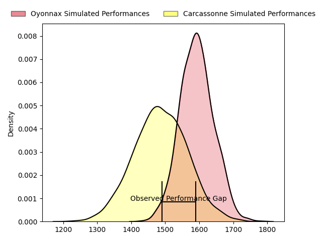
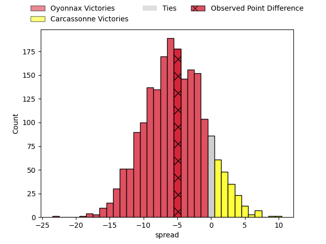
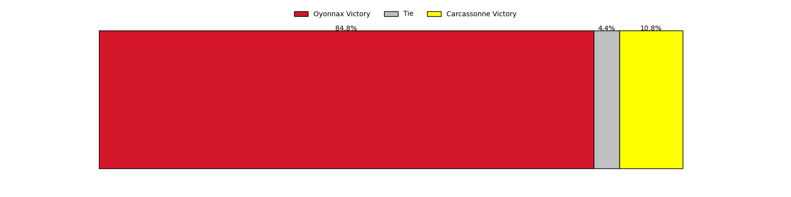
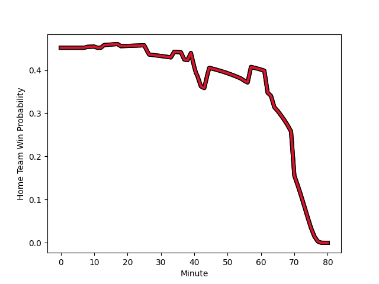

---  
layout: page  
title: Oyonnax at Carcassonne; 32-27  
date: 2023-02-24 19:30:00 18:00:00 -0500  
categories: match review  
---
# Oyonnax at Carcassonne; 32-27

# Club Level Predictions

The first set of predictions treats a club as the smallest object, as the club develops its members, organizes a gameplan, and deploys its players as needed for each match. This club model has a prediction of 0.353, which translates to predicting Oyonnax to win by 5.3.

Each club has a rating and a rating deviation (simiar to a Glicko system), and expected performances can be generated. This allows for simulated matches and spreads like the ones below.
## Projected Performances

## Projected Spreads

## Projected Results

# Player Level Predictions

Treating teams instead as an entity made up of the currently active players, I have ratings for each player in an altogether different system. These can be combined to form team ratings once teamsheets are announced, weighting starters a bit higher than the reserves. After the match is played, players can be weighted by their minutes on the field, allowing for an accurate measure of the team's composition. With these compiled team ratings, we can make predictions, measure inaccuracy, and update the individual player ratings.
## Prediction with Player Minutes: Oyonnax by 11.8

Oyonnax by 15.8 on a neutral field
## Scores over Time

## Win Probability over Time

There were 5 large changes in win probability in this match
## Prediction without Player Minutes: Oyonnax by 13.3

Oyonnax by 17.3 on a neutral pitch

|   Away Minutes | Away Player                                                                  |   Away elo |   Away Percentile |   Number |   Home Percentile |   Home elo | Home Player                                                                    |   Home Minutes |
|---------------:|:-----------------------------------------------------------------------------|-----------:|------------------:|---------:|------------------:|-----------:|:-------------------------------------------------------------------------------|---------------:|
|             66 | [Tommy Raynaud](..//playerfiles//TommyRaynaud_cleaned.md)                    |      92.25 |                40 |        1 |                39 |      95.78 | [Sami Mavinga](..//playerfiles//SamiMavinga_cleaned.md)                        |             41 |
|             57 | [Teddy Durand](..//playerfiles//TeddyDurand_cleaned.md)                      |      99.03 |                65 |        2 |                12 |      81.33 | [Raphaël Carbou](..//playerfiles//RaphaëlCarbou_cleaned.md)                    |             62 |
|             64 | [Thibault Berthaud](..//playerfiles//ThibaultBerthaud_cleaned.md)            |     100.93 |                70 |        3 |                85 |     103.23 | [Jérémy Boyadjis](..//playerfiles//JérémyBoyadjis_cleaned.md)                  |             41 |
|             55 | [Victor Lebas](..//playerfiles//VictorLebas_cleaned.md)                      |      90.62 |                39 |        4 |                18 |      81.43 | [George Merrick](..//playerfiles//GeorgeMerrick_cleaned.md)                    |             77 |
|             80 | [Phoenix Battye](..//playerfiles//PhoenixBattye_cleaned.md)                  |     107.32 |                76 |        5 |                29 |      88.69 | [Rynard Ligtoring Landman](..//playerfiles//RynardLigtoringLandman_cleaned.md) |             80 |
|             80 | [Wandrille Picault](..//playerfiles//WandrillePicault_cleaned.md)            |     121.74 |                93 |        6 |                44 |      93.06 | [Come Clayver Joussain](..//playerfiles//ComeClayverJoussain_cleaned.md)       |             41 |
|             55 | [Loïc Credoz](..//playerfiles//LoïcCredoz_cleaned.md)                        |     118.62 |                92 |        7 |                23 |      86.61 | [Robert Harley](..//playerfiles//RobertHarley_cleaned.md)                      |             80 |
|             80 | [Filimo Taofifenua](..//playerfiles//FilimoTaofifenua_cleaned.md)            |      94.81 |                48 |        8 |                67 |     100.8  | [Pierre Reynaud](..//playerfiles//PierreReynaud_cleaned.md)                    |             80 |
|             64 | [Ilan El Khattabi](..//playerfiles//IlanElKhattabi_cleaned.md)               |      83.62 |                18 |        9 |                35 |      90.26 | [Pierre Pagès](..//playerfiles//PierrePagès_cleaned.md)                        |             41 |
|             80 | [Jules Soulan](..//playerfiles//JulesSoulan_cleaned.md)                      |     134.45 |                97 |       10 |                14 |      81.53 | [Dorian Jones](..//playerfiles//DorianJones_cleaned.md)                        |             41 |
|             80 | [Enzo Reybier](..//playerfiles//EnzoReybier_cleaned.md)                      |     111.81 |                86 |       11 |                13 |      80.36 | [Léo Darrelatour](..//playerfiles//LéoDarrelatour_cleaned.md)                  |             80 |
|             80 | [Florian Vialelle](..//playerfiles//FlorianVialelle_cleaned.md)              |      90.56 |                32 |       12 |                20 |      84.39 | [Jordan Puletua](..//playerfiles//JordanPuletua_cleaned.md)                    |             80 |
|             57 | [Leo Treilles](..//playerfiles//LeoTreilles_cleaned.md)                      |     101.4  |                68 |       13 |                56 |     104.18 | [Pierre Aguillon](..//playerfiles//PierreAguillon_cleaned.md)                  |             80 |
|             57 | [Leo Treilles](..//playerfiles//LeoTreilles_cleaned.md)                      |     101.4  |                68 |       13 |                76 |     104.18 | [Pierre Aguillon](..//playerfiles//PierreAguillon_cleaned.md)                  |             80 |
|             55 | [Gavin Stark](..//playerfiles//GavinStark_cleaned.md)                        |      99.33 |                63 |       14 |                99 |     138.19 | [Benoit Jasmin](..//playerfiles//BenoitJasmin_cleaned.md)                      |             80 |
|             80 | [Aurelien Callandret](..//playerfiles//AurelienCallandret_cleaned.md)        |     115.12 |                87 |       15 |                65 |     101.27 | [Maxime Gianet](..//playerfiles//MaximeGianet_cleaned.md)                      |             80 |
|             25 | [Hugo Fabregue](..//playerfiles//HugoFabregue_cleaned.md)                    |     105.53 |                76 |       16 |                62 |      98.26 | [Vakhtangi Akhobadze](..//playerfiles//VakhtangiAkhobadze_cleaned.md)          |             39 |
|             25 | [Luke Hamilton](..//playerfiles//LukeHamilton_cleaned.md)                    |      88.23 |                28 |       17 |                93 |     114.03 | [Samuel Marques](..//playerfiles//SamuelMarques_cleaned.md)                    |             39 |
|             25 | [Justin Bouraux](..//playerfiles//JustinBouraux_cleaned.md)                  |     123.81 |                94 |       18 |                 3 |      68.78 | [Youssef Amrouni](..//playerfiles//YoussefAmrouni_cleaned.md)                  |             39 |
|             23 | [Benjamin Geledan](..//playerfiles//BenjaminGeledan_cleaned.md)              |     103.37 |                74 |       19 |                50 |      92.76 | [Étienne Herjean](..//playerfiles//ÉtienneHerjean_cleaned.md)                  |             39 |
|             23 | [Pedro Bettencourt Avila](..//playerfiles//PedroBettencourtAvila_cleaned.md) |     105.09 |                78 |       20 |                22 |      82.78 | [Damien Añon](..//playerfiles//DamienAñon_cleaned.md)                          |             39 |
|             16 | [Victor Delmas](..//playerfiles//VictorDelmas_cleaned.md)                    |     106.15 |               nan |       21 |                92 |     110.66 | [Luka Petriashvili](..//playerfiles//LukaPetriashvili_cleaned.md)              |             18 |
|             16 | [Victor Delmas](..//playerfiles//VictorDelmas_cleaned.md)                    |     106.15 |               nan |       21 |                85 |     110.66 | [Luka Petriashvili](..//playerfiles//LukaPetriashvili_cleaned.md)              |             18 |
|             16 | [Yvan David](..//playerfiles//YvanDavid_cleaned.md)                          |     106.61 |                82 |       22 |                39 |      91.52 | [Stephane Onambele Mbarga](..//playerfiles//StephaneOnambeleMbarga_cleaned.md) |              3 |
|             14 | [Irakli Mirtskhulava](..//playerfiles//IrakliMirtskhulava_cleaned.md)        |      95.86 |               nan |       23 |               nan |     nan    | nan                                                                            |            nan |

