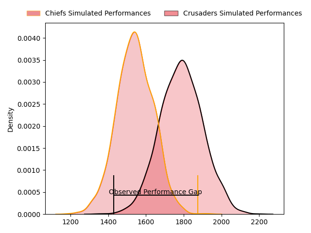
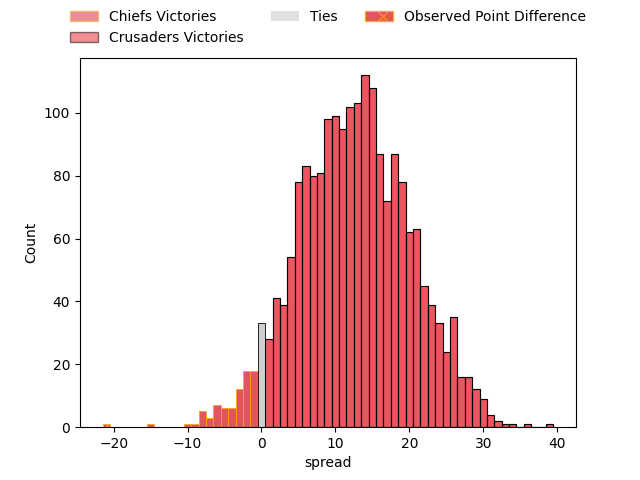
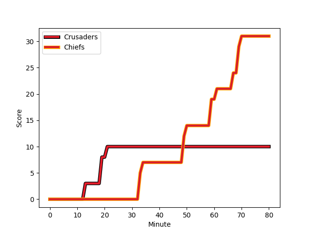
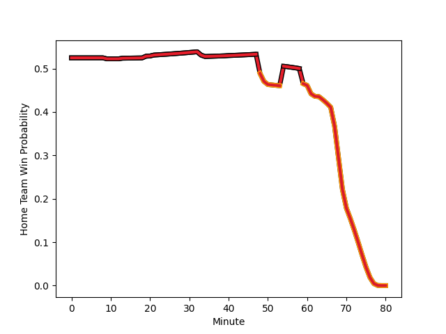

---  
layout: page  
title: Chiefs at Crusaders; 31-10  
date: 2023-02-24 01:05:00 18:00:00 -0500  
categories: match review  
---
# Chiefs at Crusaders; 31-10

# Club Level Predictions

The first set of predictions treats a club as the smallest object, as the club develops its members, organizes a gameplan, and deploys its players as needed for each match. This club model has a prediction of 0.797, which translates to predicting Crusaders to win by 12.4.

Each club has a rating and a rating deviation (simiar to a Glicko system), and expected performances can be generated. This allows for simulated matches and spreads like the ones below.
## Projected Performances

## Projected Spreads

## Projected Results

# Player Level Predictions

Treating teams instead as an entity made up of the currently active players, I have ratings for each player in an altogether different system. These can be combined to form team ratings once teamsheets are announced, weighting starters a bit higher than the reserves. After the match is played, players can be weighted by their minutes on the field, allowing for an accurate measure of the team's composition. With these compiled team ratings, we can make predictions, measure inaccuracy, and update the individual player ratings.
## Prediction with Player Minutes: Crusaders by 8.3

Crusaders by 4.3 on a neutral field
## Scores over Time

## Win Probability over Time

There were 11 large changes in win probability in this match
## Prediction without Player Minutes: Crusaders by 12.0

Crusaders by 8.0 on a neutral pitch

|   Away Minutes | Away Player                                                             |   Away elo |   Away Percentile |   Number |   Home Percentile |   Home elo | Home Player                                                                 |   Home Minutes |
|---------------:|:------------------------------------------------------------------------|-----------:|------------------:|---------:|------------------:|-----------:|:----------------------------------------------------------------------------|---------------:|
|             54 | [Aidan Ross](..//playerfiles//AidanRoss_cleaned.md)                     |      95    |               nan |        1 |                22 |      86.99 | [Joe Moody](..//playerfiles//JoeMoody_cleaned.md)                           |             50 |
|             68 | [Samisoni Taukei'aho](..//playerfiles//SamisoniTaukei'aho_cleaned.md)   |     111.59 |                87 |        2 |                82 |     106.42 | [Codie Taylor](..//playerfiles//CodieTaylor_cleaned.md)                     |             40 |
|             63 | [George Dyer](..//playerfiles//GeorgeDyer_cleaned.md)                   |      86.1  |                19 |        3 |               nan |      95    | [Fletcher Newell](..//playerfiles//FletcherNewell_cleaned.md)               |             50 |
|             80 | [Brodie Retallick](..//playerfiles//BrodieRetallick_cleaned.md)         |     115.93 |                90 |        4 |                94 |     121.56 | [Scott Barrett](..//playerfiles//ScottBarrett_cleaned.md)                   |             68 |
|             63 | [Tupou Vaa'i](..//playerfiles//TupouVaa'i_cleaned.md)                   |      92.51 |                43 |        5 |               nan |      95    | [Mitchell Dunshea](..//playerfiles//MitchellDunshea_cleaned.md)             |             73 |
|             54 | [Pita Gus Sowakula](..//playerfiles//PitaGusSowakula_cleaned.md)        |      98.86 |                61 |        6 |                97 |     132.49 | [Ethan Blackadder](..//playerfiles//EthanBlackadder_cleaned.md)             |             80 |
|             80 | [Sam Cane](..//playerfiles//SamCane_cleaned.md)                         |     136    |                98 |        7 |                76 |     105.25 | [Tom Christie](..//playerfiles//TomChristie_cleaned.md)                     |             80 |
|             80 | [Luke Jacobson](..//playerfiles//LukeJacobson_cleaned.md)               |     133.78 |                99 |        8 |               nan |      95    | [Cullen Grace](..//playerfiles//CullenGrace_cleaned.md)                     |              9 |
|             63 | [Brad Weber](..//playerfiles//BradWeber_cleaned.md)                     |     134.75 |                99 |        9 |                30 |      88.79 | [Mitchell Drummond](..//playerfiles//MitchellDrummond_cleaned.md)           |             48 |
|             80 | [Damian McKenzie](..//playerfiles//DamianMcKenzie_cleaned.md)           |      91.49 |                38 |       10 |                99 |     148.14 | [Richie Mo'unga](..//playerfiles//RichieMo'unga_cleaned.md)                 |             80 |
|             80 | [Etene Nanai-Seturo](..//playerfiles//EteneNanai-Seturo_cleaned.md)     |      83.02 |                22 |       11 |                50 |      95.6  | [Leicester Fainga'anuku](..//playerfiles//LeicesterFainga'anuku_cleaned.md) |             80 |
|             48 | [Anton Lienert-Brown](..//playerfiles//AntonLienert-Brown_cleaned.md)   |      95    |               nan |       12 |                89 |     114.25 | [Jack Goodhue](..//playerfiles//JackGoodhue_cleaned.md)                     |             68 |
|             80 | [Alex Nankivell](..//playerfiles//AlexNankivell_cleaned.md)             |      84.59 |                20 |       13 |                89 |     114.27 | [Braydon Ennor](..//playerfiles//BraydonEnnor_cleaned.md)                   |             68 |
|             80 | [Liam Coombes-Fabling](..//playerfiles//LiamCoombes-Fabling_cleaned.md) |     106.45 |                79 |       14 |                98 |     137.82 | [Sevu Reece](..//playerfiles//SevuReece_cleaned.md)                         |             80 |
|             80 | [Shaun Stevenson](..//playerfiles//ShaunStevenson_cleaned.md)           |      99.93 |                62 |       15 |                96 |     127.89 | [David Havili](..//playerfiles//DavidHavili_cleaned.md)                     |             80 |
|             12 | [Bradley Slater](..//playerfiles//BradleySlater_cleaned.md)             |      95    |               nan |       16 |                84 |     107.4  | [Brodie McAlister](..//playerfiles//BrodieMcAlister_cleaned.md)             |             40 |
|             26 | [Ollie Norris](..//playerfiles//OllieNorris_cleaned.md)                 |      91.09 |                38 |       17 |                15 |      81.68 | [George Bower](..//playerfiles//GeorgeBower_cleaned.md)                     |             30 |
|             17 | [John Ryan](..//playerfiles//JohnRyan_cleaned.md)                       |     101.41 |               nan |       18 |                41 |      91.82 | [Tamaiti Williams](..//playerfiles//TamaitiWilliams_cleaned.md)             |             30 |
|             17 | [Naitoa Ah Kuoi](..//playerfiles//NaitoaAhKuoi_cleaned.md)              |      95    |               nan |       19 |                59 |      97.62 | [Zach Gallagher](..//playerfiles//ZachGallagher_cleaned.md)                 |             19 |
|             26 | [Samipeni Finau](..//playerfiles//SamipeniFinau_cleaned.md)             |      95    |               nan |       20 |                21 |      85.7  | [Christian Lio-Willie](..//playerfiles//ChristianLio-Willie_cleaned.md)     |             71 |
|             17 | [Cortez Ratima](..//playerfiles//CortezRatima_cleaned.md)               |     106.65 |                93 |       21 |               nan |      95    | [Willi Heinz](..//playerfiles//WilliHeinz_cleaned.md)                       |             32 |
|             39 | [Josh Ioane](..//playerfiles//JoshIoane_cleaned.md)                     |      95    |               nan |       22 |                15 |      83.13 | [Fergus Burke](..//playerfiles//FergusBurke_cleaned.md)                     |             12 |
|             32 | [Rameka Poihipi](..//playerfiles//RamekaPoihipi_cleaned.md)             |      90.09 |                34 |       23 |                59 |      98.2  | [Macca Springer](..//playerfiles//MaccaSpringer_cleaned.md)                 |             12 |

