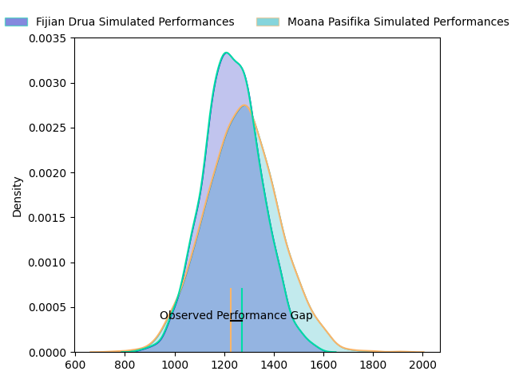
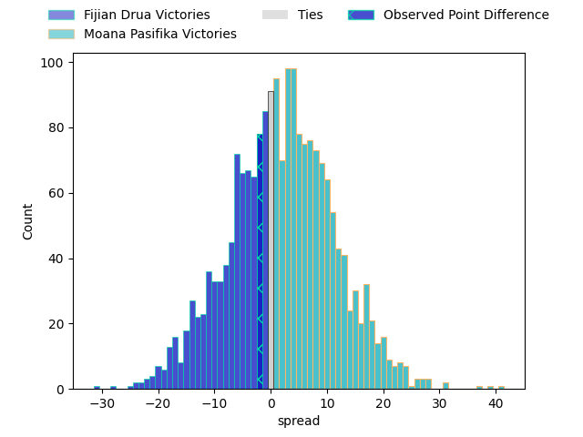
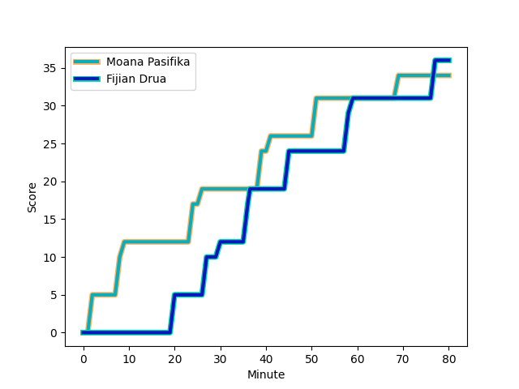
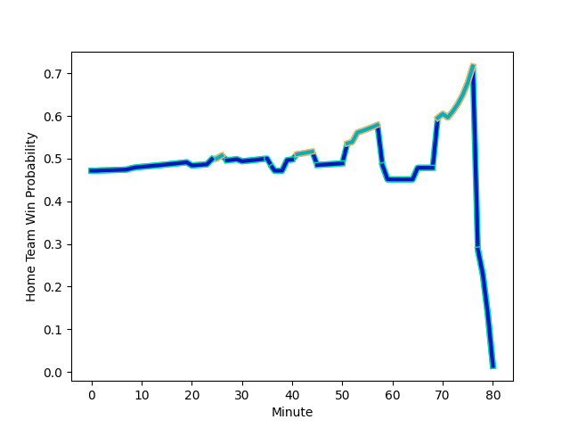

---  
layout: page  
title: Fijian Drua at Moana Pasifika; 36-34  
date: 2023-02-24 22:35:00 18:00:00 -0500  
categories: match review  
---
# Fijian Drua at Moana Pasifika; 36-34

# Club Level Predictions

The first set of predictions treats a club as the smallest object, as the club develops its members, organizes a gameplan, and deploys its players as needed for each match. This club model has a prediction of 0.556, which translates to predicting Moana Pasifika to win by 2.1.

Each club has a rating and a rating deviation (simiar to a Glicko system), and expected performances can be generated. This allows for simulated matches and spreads like the ones below.
## Projected Performances

## Projected Spreads

## Projected Results

# Player Level Predictions

Treating teams instead as an entity made up of the currently active players, I have ratings for each player in an altogether different system. These can be combined to form team ratings once teamsheets are announced, weighting starters a bit higher than the reserves. After the match is played, players can be weighted by their minutes on the field, allowing for an accurate measure of the team's composition. With these compiled team ratings, we can make predictions, measure inaccuracy, and update the individual player ratings.
## Prediction with Player Minutes: Fijian Drua by 0.9

Fijian Drua by 4.9 on a neutral field
## Scores over Time

## Win Probability over Time

There were 12 large changes in win probability in this match
## Prediction without Player Minutes: Fijian Drua by 1.5

Fijian Drua by 5.5 on a neutral pitch

|   Away Minutes | Away Player                                                                     |   Away elo |   Away Percentile |   Number |   Home Percentile |   Home elo | Home Player                                                               |   Home Minutes |
|---------------:|:--------------------------------------------------------------------------------|-----------:|------------------:|---------:|------------------:|-----------:|:--------------------------------------------------------------------------|---------------:|
|             41 | [Emosi Tuqiri](..//playerfiles//EmosiTuqiri_cleaned.md)                         |      95    |               nan |        1 |                81 |     105.14 | [Abraham Pole](..//playerfiles//AbrahamPole_cleaned.md)                   |             53 |
|             65 | [Tevita Ikanivere](..//playerfiles//TevitaIkanivere_cleaned.md)                 |     117.24 |                94 |        2 |                10 |      78.53 | [Samiuela Moli](..//playerfiles//SamiuelaMoli_cleaned.md)                 |             69 |
|             56 | [Jone Koroiduadua](..//playerfiles//JoneKoroiduadua_cleaned.md)                 |      95    |               nan |        3 |                 9 |      78.64 | [Chris Apoua](..//playerfiles//ChrisApoua_cleaned.md)                     |             53 |
|             65 | [Isoa Nasilasila](..//playerfiles//IsoaNasilasila_cleaned.md)                   |     127.68 |                96 |        4 |                13 |      79.14 | [Samuel Slade](..//playerfiles//SamuelSlade_cleaned.md)                   |             80 |
|             80 | [Ratu Rotuisolia](..//playerfiles//RatuRotuisolia_cleaned.md)                   |      91.7  |                38 |        5 |                 4 |      66.42 | [Mahroni Ngakuru](..//playerfiles//MahroniNgakuru_cleaned.md)             |             53 |
|             80 | [Joseva Tamani](..//playerfiles//JosevaTamani_cleaned.md)                       |      83.48 |                16 |        6 |               nan |      95    | [Michael Curry](..//playerfiles//MichaelCurry_cleaned.md)                 |             69 |
|             80 | [Kitione Salawa](..//playerfiles//KitioneSalawa_cleaned.md)                     |      68.9  |                 4 |        7 |                41 |      92.14 | [Solomone Funaki](..//playerfiles//SolomoneFunaki_cleaned.md)             |             80 |
|             69 | [Te Ahiwaru Cirikidaveta](..//playerfiles//TeAhiwaruCirikidaveta_cleaned.md)    |     113.6  |                90 |        8 |                77 |     106.26 | [Jonah Mau'u](..//playerfiles//JonahMau'u_cleaned.md)                     |             70 |
|             65 | [Frank Lomani](..//playerfiles//FrankLomani_cleaned.md)                         |      86.22 |                23 |        9 |                72 |     102.5  | [Ere Enari](..//playerfiles//EreEnari_cleaned.md)                         |             58 |
|             53 | [Teti Tela](..//playerfiles//TetiTela_cleaned.md)                               |     104.6  |                76 |       10 |                92 |     119.32 | [Christian Leali'ifano](..//playerfiles//ChristianLeali'ifano_cleaned.md) |             80 |
|             80 | [Tuidraki Samusamuvodre](..//playerfiles//TuidrakiSamusamuvodre_cleaned.md)     |     112.74 |                87 |       11 |               nan |      95    | [Neria Fomai](..//playerfiles//NeriaFomai_cleaned.md)                     |             80 |
|             80 | [Kalaveti Ravouvou](..//playerfiles//KalavetiRavouvou_cleaned.md)               |     146.49 |                99 |       12 |                86 |     113.83 | [Danny Toala](..//playerfiles//DannyToala_cleaned.md)                     |             80 |
|             74 | [Iosefo Masi](..//playerfiles//IosefoMasi_cleaned.md)                           |      95    |               nan |       13 |                96 |     126.14 | [Levi Aumua](..//playerfiles//LeviAumua_cleaned.md)                       |             58 |
|             80 | [Selestino Ravutaumada](..//playerfiles//SelestinoRavutaumada_cleaned.md)       |      86.22 |                22 |       14 |                28 |      90.04 | [Timoci Tavatavanawai](..//playerfiles//TimociTavatavanawai_cleaned.md)   |             80 |
|             80 | [Ilaisa Droasese](..//playerfiles//IlaisaDroasese_cleaned.md)                   |      98.9  |                60 |       15 |                93 |     122.08 | [William Havili](..//playerfiles//WilliamHavili_cleaned.md)               |             71 |
|             15 | [Zuriel Togiatama](..//playerfiles//ZurielTogiatama_cleaned.md)                 |      91.98 |                41 |       16 |               nan |      95    | [Luteru Tolai](..//playerfiles//LuteruTolai_cleaned.md)                   |             11 |
|             39 | [Jone Tiko](..//playerfiles//JoneTiko_cleaned.md)                               |      95    |               nan |       17 |               nan |      95    | [Tau Koloamatangi](..//playerfiles//TauKoloamatangi_cleaned.md)           |             27 |
|             24 | [Samuela Tawake](..//playerfiles//SamuelaTawake_cleaned.md)                     |      95    |               nan |       18 |               nan |      95    | [Suetena Asomua](..//playerfiles//SuetenaAsomua_cleaned.md)               |             27 |
|             15 | [Sorovakatini Tuifagalele](..//playerfiles//SorovakatiniTuifagalele_cleaned.md) |      86.46 |                24 |       19 |                10 |      77.31 | [Mike McKee](..//playerfiles//MikeMcKee_cleaned.md)                       |             27 |
|             11 | [Elia Canakaivata](..//playerfiles//EliaCanakaivata_cleaned.md)                 |      95    |               nan |       20 |               nan |      95    | [Alamanda Motuga](..//playerfiles//AlamandaMotuga_cleaned.md)             |             21 |
|             15 | [Peni Matawalu](..//playerfiles//PeniMatawalu_cleaned.md)                       |     101.99 |                72 |       21 |                49 |      93.62 | [Manu Paea](..//playerfiles//ManuPaea_cleaned.md)                         |             22 |
|             27 | [Caleb Muntz](..//playerfiles//CalebMuntz_cleaned.md)                           |      87.46 |                24 |       22 |                18 |      83.76 | [Henry Taefu](..//playerfiles//HenryTaefu_cleaned.md)                     |              9 |
|              6 | [Taniela Rakuro](..//playerfiles//TanielaRakuro_cleaned.md)                     |      95    |               nan |       23 |                 8 |      73.98 | [Fine Inisi](..//playerfiles//FineInisi_cleaned.md)                       |             22 |

