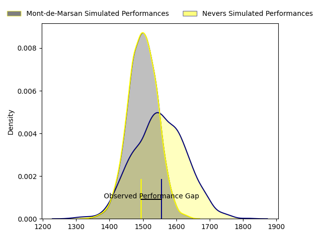
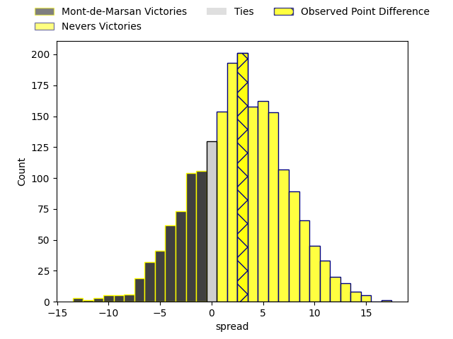
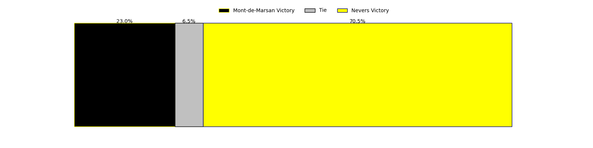
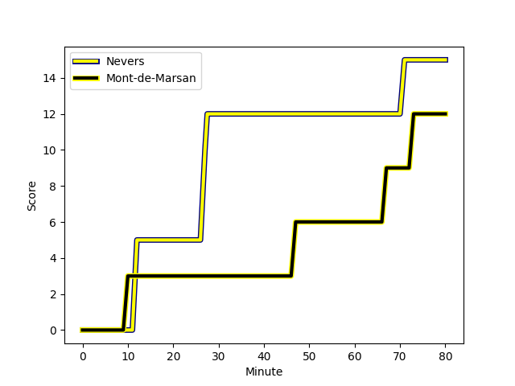
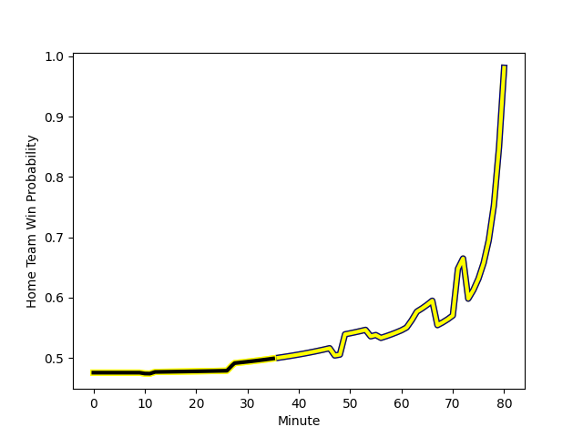

---  
layout: page  
title: Mont-de-Marsan at Nevers; 12-15  
date: 2023-02-24 19:30:00 18:00:00 -0500  
categories: match review  
---
# Mont-de-Marsan at Nevers; 12-15

# Club Level Predictions

The first set of predictions treats a club as the smallest object, as the club develops its members, organizes a gameplan, and deploys its players as needed for each match. This club model has a prediction of 0.575, which translates to predicting Nevers to win by 2.6.

Each club has a rating and a rating deviation (simiar to a Glicko system), and expected performances can be generated. This allows for simulated matches and spreads like the ones below.
## Projected Performances

## Projected Spreads

## Projected Results

# Player Level Predictions

Treating teams instead as an entity made up of the currently active players, I have ratings for each player in an altogether different system. These can be combined to form team ratings once teamsheets are announced, weighting starters a bit higher than the reserves. After the match is played, players can be weighted by their minutes on the field, allowing for an accurate measure of the team's composition. With these compiled team ratings, we can make predictions, measure inaccuracy, and update the individual player ratings.
## Prediction with Player Minutes: Mont-de-Marsan by 0.1

Mont-de-Marsan by 4.1 on a neutral field
## Scores over Time

## Win Probability over Time

There were 9 large changes in win probability in this match
## Prediction without Player Minutes: Nevers by 1.8

Mont-de-Marsan by 2.2 on a neutral pitch

|   Away Minutes | Away Player                                                                      |   Away elo |   Away Percentile |   Number |   Home Percentile |   Home elo | Home Player                                                             |   Home Minutes |
|---------------:|:---------------------------------------------------------------------------------|-----------:|------------------:|---------:|------------------:|-----------:|:------------------------------------------------------------------------|---------------:|
|             49 | [Thomas Bultel](..//playerfiles//ThomasBultel_cleaned.md)                        |     117.1  |                94 |        1 |                74 |      99.95 | [Aitor Kitutu](..//playerfiles//AitorKitutu_cleaned.md)                 |             55 |
|             49 | [Simon Labouyrie](..//playerfiles//SimonLabouyrie_cleaned.md)                    |      94.93 |                62 |        2 |                77 |     101.56 | [Elia Elia](..//playerfiles//EliaElia_cleaned.md)                       |             55 |
|             49 | [Gheorge Gajion](..//playerfiles//GheorgeGajion_cleaned.md)                      |     121.08 |                93 |        3 |                31 |      89.65 | [Ilia Kaikatsishvili](..//playerfiles//IliaKaikatsishvili_cleaned.md)   |             62 |
|             49 | [Gheorge Gajion](..//playerfiles//GheorgeGajion_cleaned.md)                      |     121.08 |                96 |        3 |                31 |      89.65 | [Ilia Kaikatsishvili](..//playerfiles//IliaKaikatsishvili_cleaned.md)   |             62 |
|             49 | [Romain Durand](..//playerfiles//RomainDurand_cleaned.md)                        |     127.18 |                96 |        4 |                83 |     109    | [Maxence Barjaud](..//playerfiles//MaxenceBarjaud_cleaned.md)           |             54 |
|             80 | [Andrei Ostrikov](..//playerfiles//AndreiOstrikov_cleaned.md)                    |      97.99 |                60 |        5 |                51 |      95.34 | [Senio Toleafoa](..//playerfiles//SenioToleafoa_cleaned.md)             |             61 |
|             80 | [William Wavrin](..//playerfiles//WilliamWavrin_cleaned.md)                      |     128.6  |                98 |        6 |                16 |      83.35 | [Luka Plataret](..//playerfiles//LukaPlataret_cleaned.md)               |             80 |
|             80 | [Nicolas Garrault](..//playerfiles//NicolasGarrault_cleaned.md)                  |      91.92 |                39 |        7 |                98 |     135.01 | [Hugues Bastide](..//playerfiles//HuguesBastide_cleaned.md)             |             54 |
|             80 | [Veresa Tuqovu Ramototabua](..//playerfiles//VeresaTuqovuRamototabua_cleaned.md) |      93.28 |                80 |        8 |                81 |     107.69 | [Jason-Collin Fraser](..//playerfiles//Jason-CollinFraser_cleaned.md)   |             80 |
|             80 | [Veresa Tuqovu Ramototabua](..//playerfiles//VeresaTuqovuRamototabua_cleaned.md) |      93.28 |                43 |        8 |                81 |     107.69 | [Jason-Collin Fraser](..//playerfiles//Jason-CollinFraser_cleaned.md)   |             80 |
|             55 | [Baptiste Canut](..//playerfiles//BaptisteCanut_cleaned.md)                      |      93.09 |                49 |        9 |                75 |     101.74 | [Yoan Cottin](..//playerfiles//YoanCottin_cleaned.md)                   |             55 |
|             62 | [Willie du Plessis](..//playerfiles//WillieduPlessis_cleaned.md)                 |      98.84 |                59 |       10 |                71 |     102.46 | [Shaun Reynolds](..//playerfiles//ShaunReynolds_cleaned.md)             |             80 |
|             80 | [Kaminieli Rasaku](..//playerfiles//KaminieliRasaku_cleaned.md)                  |      97.12 |                56 |       11 |                13 |      79.46 | [Thomas Zenon](..//playerfiles//ThomasZenon_cleaned.md)                 |             80 |
|             56 | [Jules Even](..//playerfiles//JulesEven_cleaned.md)                              |      71.94 |                 6 |       12 |                 5 |      71.61 | [Rudy Derrieux](..//playerfiles//RudyDerrieux_cleaned.md)               |             63 |
|             80 | [Misaele Petero](..//playerfiles//MisaelePetero_cleaned.md)                      |      86.7  |               nan |       13 |                22 |      85.53 | [Alifereti Loaloa](..//playerfiles//AliferetiLoaloa_cleaned.md)         |             80 |
|             80 | [Pierre Sayerse](..//playerfiles//PierreSayerse_cleaned.md)                      |     103.11 |                73 |       14 |                33 |      89.34 | [Christian Ambadiang](..//playerfiles//ChristianAmbadiang_cleaned.md)   |             80 |
|             80 | [Alexandre de Nardi](..//playerfiles//AlexandredeNardi_cleaned.md)               |      94.64 |                50 |       15 |                47 |      94.16 | [Kylian Jaminet](..//playerfiles//KylianJaminet_cleaned.md)             |             80 |
|             31 | [Jose Luis Gonzalez](..//playerfiles//JoseLuisGonzalez_cleaned.md)               |     115.13 |                93 |       16 |                86 |     108.72 | [Emmanuel Vaitulukina](..//playerfiles//EmmanuelVaitulukina_cleaned.md) |             26 |
|             31 | [Michael Faleafa](..//playerfiles//MichaelFaleafa_cleaned.md)                    |      85.13 |                21 |       17 |                52 |      97.32 | [Shaun Adendorff](..//playerfiles//ShaunAdendorff_cleaned.md)           |             26 |
|             31 | [Max Curie](..//playerfiles//MaxCurie_cleaned.md)                                |      88.64 |                75 |       18 |                54 |      96.38 | [Arthurs Barbier](..//playerfiles//ArthursBarbier_cleaned.md)           |             25 |
|             31 | [Max Curie](..//playerfiles//MaxCurie_cleaned.md)                                |      88.64 |                27 |       18 |                54 |      96.38 | [Arthurs Barbier](..//playerfiles//ArthursBarbier_cleaned.md)           |             25 |
|             31 | [Anthony Alves](..//playerfiles//AnthonyAlves_cleaned.md)                        |      77.54 |                 8 |       19 |                71 |     101.16 | [Tomike Mataradze](..//playerfiles//TomikeMataradze_cleaned.md)         |             25 |
|             25 | [Christophe Loustalot](..//playerfiles//ChristopheLoustalot_cleaned.md)          |      86.84 |                25 |       20 |                63 |      98.88 | [Issam Hamel](..//playerfiles//IssamHamel_cleaned.md)                   |             25 |
|             24 | [Simon Desaubies](..//playerfiles//SimonDesaubies_cleaned.md)                    |      93.29 |                45 |       21 |                69 |     103.11 | [Lado Chachanidze](..//playerfiles//LadoChachanidze_cleaned.md)         |             19 |
|             18 | [Joris Pialot](..//playerfiles//JorisPialot_cleaned.md)                          |      84.48 |                58 |       22 |               nan |      98.24 | [Sosefo Tapu Falatea](..//playerfiles//SosefoTapuFalatea_cleaned.md)    |             18 |
|             18 | [Joris Pialot](..//playerfiles//JorisPialot_cleaned.md)                          |      84.48 |                18 |       22 |               nan |      98.24 | [Sosefo Tapu Falatea](..//playerfiles//SosefoTapuFalatea_cleaned.md)    |             18 |
|            nan | nan                                                                              |     nan    |               nan |       23 |                66 |      99.4  | [Yohan Le Bourhis](..//playerfiles//YohanLeBourhis_cleaned.md)          |             17 |

