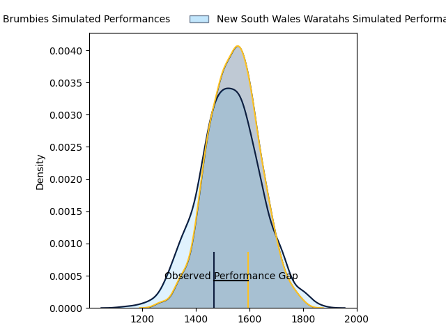
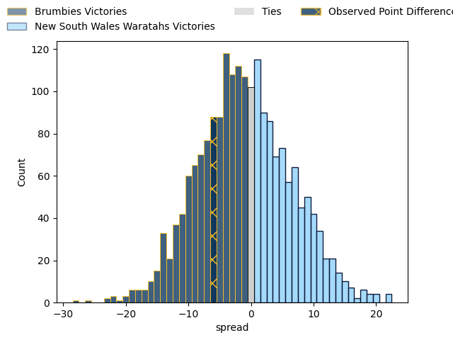
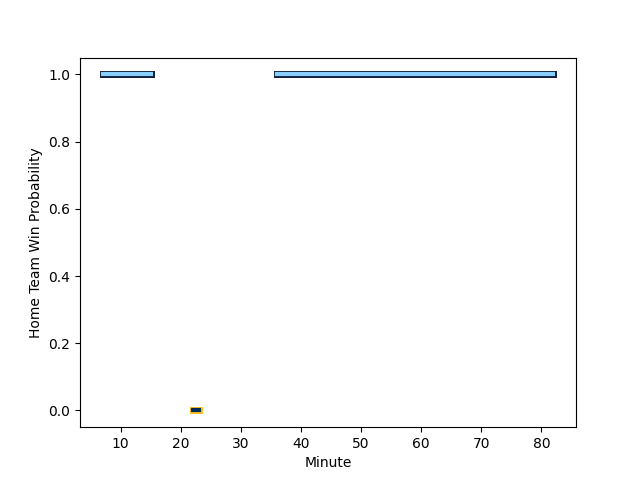

---  
layout: page  
title: Brumbies at New South Wales Waratahs; 31.0-25.0  
date: 2023-02-24 03:35:00 18:00:00 -0500  
categories: match review  
---
# Brumbies at New South Wales Waratahs; 31.0-25.0

# Club Level Predictions

The first set of predictions treats a club as the smallest object, as the club develops its members, organizes a gameplan, and deploys its players as needed for each match. This club model has a prediction of 0.475, which translates to predicting Brumbies to win by 0.9.

Each club has a rating and a rating deviation (simiar to a Glicko system), and expected performances can be generated. This allows for simulated matches and spreads like the ones below.
## Projected Performances

## Projected Spreads

## Projected Results

# Player Level Predictions

Treating teams instead as an entity made up of the currently active players, I have ratings for each player in an altogether different system. These can be combined to form team ratings once teamsheets are announced, weighting starters a bit higher than the reserves. After the match is played, players can be weighted by their minutes on the field, allowing for an accurate measure of the team's composition. With these compiled team ratings, we can make predictions, measure inaccuracy, and update the individual player ratings.
## Prediction with Player Minutes: New South Wales Waratahs by 4.0

Brumbies by 0.0 on a neutral field
## Scores over Time

## Win Probability over Time

## Prediction without Player Minutes: New South Wales Waratahs by 4.0

Brumbies by 0.0 on a neutral pitch

|   Away Minutes | Away Player                                                     |   Away elo |   Away Percentile |   Number |   Home Percentile |   Home elo | Home Player                                                           |   Home Minutes |
|---------------:|:----------------------------------------------------------------|-----------:|------------------:|---------:|------------------:|-----------:|:----------------------------------------------------------------------|---------------:|
|             40 | [Blake Schoupp](..//playerfiles//BlakeSchoupp_cleaned.md)       |         95 |               nan |        1 |               nan |         95 | [Angus Bell](..//playerfiles//AngusBell_cleaned.md)                   |             22 |
|              5 | [Connal McInerney](..//playerfiles//ConnalMcInerney_cleaned.md) |         95 |               nan |        2 |               nan |         95 | [Dave Porecki](..//playerfiles//DavePorecki_cleaned.md)               |             58 |
|             64 | [Allan Alaalatoa](..//playerfiles//AllanAlaalatoa_cleaned.md)   |         95 |               nan |        3 |               nan |         95 | [Archer Holz](..//playerfiles//ArcherHolz_cleaned.md)                 |             40 |
|             82 | [Nick Frost](..//playerfiles//NickFrost_cleaned.md)             |         95 |               nan |        4 |               nan |         95 | [Jed Holloway](..//playerfiles//JedHolloway_cleaned.md)               |             82 |
|             54 | [Cadeyrn Neville](..//playerfiles//CadeyrnNeville_cleaned.md)   |         95 |               nan |        5 |               nan |         95 | [Taleni Seu](..//playerfiles//TaleniSeu_cleaned.md)                   |             47 |
|             82 | [Rob Valetini](..//playerfiles//RobValetini_cleaned.md)         |         95 |               nan |        6 |               nan |         95 | [Lachlan Swinton](..//playerfiles//LachlanSwinton_cleaned.md)         |             47 |
|             62 | [Rory Scott](..//playerfiles//RoryScott_cleaned.md)             |         95 |               nan |        7 |               nan |         95 | [Michael Hooper](..//playerfiles//MichaelHooper_cleaned.md)           |             82 |
|             82 | [Pete Samu](..//playerfiles//PeteSamu_cleaned.md)               |         95 |               nan |        8 |               nan |         95 | [Charlie Gamble](..//playerfiles//CharlieGamble_cleaned.md)           |             58 |
|             52 | [Ryan Lonergan](..//playerfiles//RyanLonergan_cleaned.md)       |         95 |               nan |        9 |               nan |         95 | [Jake Gordon](..//playerfiles//JakeGordon_cleaned.md)                 |             82 |
|             52 | [Jack Debreczeni](..//playerfiles//JackDebreczeni_cleaned.md)   |         95 |               nan |       10 |               nan |         95 | [Tane Edmed](..//playerfiles//TaneEdmed_cleaned.md)                   |             82 |
|             82 | [Corey Toole](..//playerfiles//CoreyToole_cleaned.md)           |         95 |               nan |       11 |               nan |         95 | [Max Jorgensen](..//playerfiles//MaxJorgensen_cleaned.md)             |             82 |
|             82 | [Tamati Tua](..//playerfiles//TamatiTua_cleaned.md)             |         95 |               nan |       12 |               nan |         95 | [Lalakai Foketi](..//playerfiles//LalakaiFoketi_cleaned.md)           |             82 |
|             73 | [Len Ikitau](..//playerfiles//LenIkitau_cleaned.md)             |         95 |               nan |       13 |               nan |         95 | [Izaia Perese](..//playerfiles//IzaiaPerese_cleaned.md)               |             58 |
|             82 | [Andy Muirhead](..//playerfiles//AndyMuirhead_cleaned.md)       |         95 |               nan |       14 |               nan |         95 | [Mark Nawaqanitawase](..//playerfiles//MarkNawaqanitawase_cleaned.md) |             82 |
|             82 | [Tom Wright](..//playerfiles//TomWright_cleaned.md)             |         95 |               nan |       15 |               nan |         95 | [Ben Donaldson](..//playerfiles//BenDonaldson_cleaned.md)             |             82 |
|             73 | [John Ulugia](..//playerfiles//JohnUlugia_cleaned.md)           |         95 |               nan |       16 |               nan |         95 | [Mahe Vailanu](..//playerfiles//MaheVailanu_cleaned.md)               |             24 |
|             42 | [James Slipper](..//playerfiles//JamesSlipper_cleaned.md)       |         95 |               nan |       17 |               nan |         95 | [Tom Lambert](..//playerfiles//TomLambert_cleaned.md)                 |             60 |
|             22 | [Rhys Van Nek](..//playerfiles//RhysVanNek_cleaned.md)          |         95 |               nan |       18 |               nan |         95 | [Tetera Faulkner](..//playerfiles//TeteraFaulkner_cleaned.md)         |             42 |
|             28 | [Darcy Swain](..//playerfiles//DarcySwain_cleaned.md)           |         95 |               nan |       19 |               nan |         95 | [Hugh Sinclair](..//playerfiles//HughSinclair_cleaned.md)             |             35 |
|             20 | [Luke Reimer](..//playerfiles//LukeReimer_cleaned.md)           |         95 |               nan |       20 |               nan |         95 | [Langi Gleeson](..//playerfiles//LangiGleeson_cleaned.md)             |             35 |
|             30 | [Nic White](..//playerfiles//NicWhite_cleaned.md)               |         95 |               nan |       21 |               nan |         95 | [Will Harris](..//playerfiles//WillHarris_cleaned.md)                 |             24 |
|             30 | [Noah Lolesio](..//playerfiles//NoahLolesio_cleaned.md)         |         95 |               nan |       22 |               nan |         95 | [Harrison Goddard](..//playerfiles//HarrisonGoddard_cleaned.md)       |              0 |
|              9 | [Ollie Sapsford](..//playerfiles//OllieSapsford_cleaned.md)     |         95 |               nan |       23 |               nan |         95 | [Nemani Nadolo](..//playerfiles//NemaniNadolo_cleaned.md)             |             24 |

