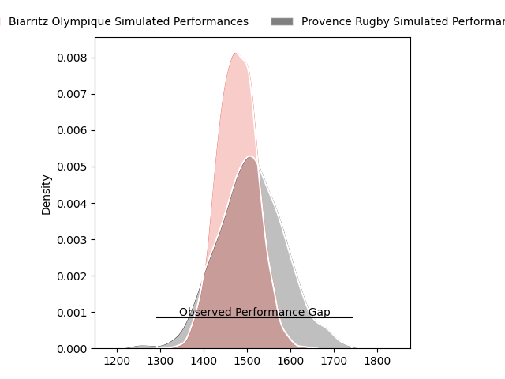
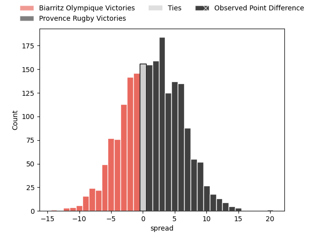
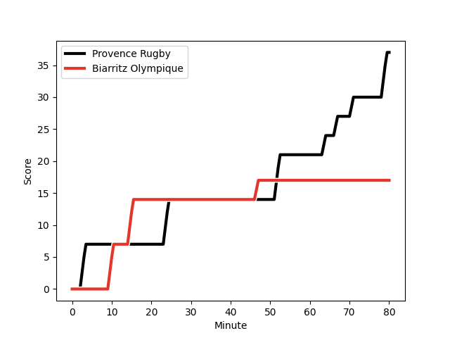
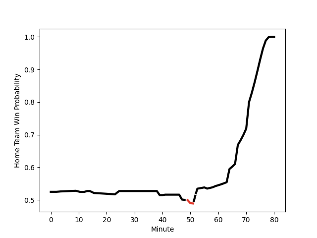

---  
layout: page  
title: Biarritz Olympique at Provence Rugby; 17-37  
date: 2023-02-24 21:00:00 18:00:00 -0500  
categories: match review  
---
# Biarritz Olympique at Provence Rugby; 17-37

# Club Level Predictions

The first set of predictions treats a club as the smallest object, as the club develops its members, organizes a gameplan, and deploys its players as needed for each match. This club model has a prediction of 0.545, which translates to predicting Provence Rugby to win by 1.6.

Each club has a rating and a rating deviation (simiar to a Glicko system), and expected performances can be generated. This allows for simulated matches and spreads like the ones below.
## Projected Performances

## Projected Spreads

## Projected Results

# Player Level Predictions

Treating teams instead as an entity made up of the currently active players, I have ratings for each player in an altogether different system. These can be combined to form team ratings once teamsheets are announced, weighting starters a bit higher than the reserves. After the match is played, players can be weighted by their minutes on the field, allowing for an accurate measure of the team's composition. With these compiled team ratings, we can make predictions, measure inaccuracy, and update the individual player ratings.
## Prediction with Player Minutes: Provence Rugby by 9.8

Provence Rugby by 5.8 on a neutral field
## Scores over Time

## Win Probability over Time

There were 9 large changes in win probability in this match
## Prediction without Player Minutes: Provence Rugby by 13.0

Provence Rugby by 9.0 on a neutral pitch

|   Away Minutes | Away Player                                                       |   Away elo |   Away Percentile |   Number |   Home Percentile |   Home elo | Home Player                                                           |   Home Minutes |
|---------------:|:------------------------------------------------------------------|-----------:|------------------:|---------:|------------------:|-----------:|:----------------------------------------------------------------------|---------------:|
|             80 | [Giorgi Nutsubidze](..//playerfiles//GiorgiNutsubidze_cleaned.md) |      98.75 |                63 |        1 |                93 |     115.5  | [Julius Nostadt](..//playerfiles//JuliusNostadt_cleaned.md)           |             39 |
|             13 | [Thomas Sauveterre](..//playerfiles//ThomasSauveterre_cleaned.md) |     105    |                81 |        2 |                86 |     116.38 | [German Kessler](..//playerfiles//GermanKessler_cleaned.md)           |             50 |
|             13 | [Thomas Sauveterre](..//playerfiles//ThomasSauveterre_cleaned.md) |     105    |                81 |        2 |                93 |     116.38 | [German Kessler](..//playerfiles//GermanKessler_cleaned.md)           |             50 |
|             41 | [Quentin Samaran](..//playerfiles//QuentinSamaran_cleaned.md)     |      99    |                51 |        3 |                38 |      91.67 | [Luke Tagi](..//playerfiles//LukeTagi_cleaned.md)                     |             59 |
|             56 | [John Dyer](..//playerfiles//JohnDyer_cleaned.md)                 |     104.49 |                74 |        4 |                90 |     116.12 | [Clément Chartier](..//playerfiles//ClémentChartier_cleaned.md)       |             50 |
|             80 | [Adrian Motoc](..//playerfiles//AdrianMotoc_cleaned.md)           |      93.69 |                46 |        5 |                60 |      98.27 | [Alexandre Flanquart](..//playerfiles//AlexandreFlanquart_cleaned.md) |             80 |
|             64 | [David O'Callaghan](..//playerfiles//DavidO'Callaghan_cleaned.md) |      98.14 |                54 |        6 |                82 |     108.89 | [Guillaume Piazzoli](..//playerfiles//GuillaumePiazzoli_cleaned.md)   |             80 |
|             56 | [Thomas Hebert](..//playerfiles//ThomasHebert_cleaned.md)         |     106.46 |                77 |        7 |                83 |     109.77 | [Jessy Jegerlhener](..//playerfiles//JessyJegerlhener_cleaned.md)     |             80 |
|             80 | [Elliott Dixon](..//playerfiles//ElliottDixon_cleaned.md)         |     104.56 |                74 |        8 |                54 |      97.27 | [Carl Axtens](..//playerfiles//CarlAxtens_cleaned.md)                 |             50 |
|             80 | [Barnabé Couilloud](..//playerfiles//BarnabéCouilloud_cleaned.md) |      98.93 |                57 |        9 |                42 |      92.45 | [Simon Tarel](..//playerfiles//SimonTarel_cleaned.md)                 |             77 |
|             64 | [Baptiste Germain](..//playerfiles//BaptisteGermain_cleaned.md)   |      95.27 |                47 |       10 |                47 |      95.34 | [Enzo Selponi](..//playerfiles//EnzoSelponi_cleaned.md)               |             80 |
|             10 | [Tyler Morgan](..//playerfiles//TylerMorgan_cleaned.md)           |     100.88 |                67 |       11 |                46 |      93.14 | [Adrien Lapègue](..//playerfiles//AdrienLapègue_cleaned.md)           |             80 |
|             80 | [Auguste Cadot](..//playerfiles//AugusteCadot_cleaned.md)         |      98.14 |                59 |       12 |                72 |     102.47 | [Kaveinga Finau](..//playerfiles//KaveingaFinau_cleaned.md)           |             69 |
|             80 | [Francois Vergnaud](..//playerfiles//FrancoisVergnaud_cleaned.md) |     100.48 |                72 |       13 |                86 |     110.95 | [Peter Betham](..//playerfiles//PeterBetham_cleaned.md)               |             50 |
|             80 | [Henry Speight](..//playerfiles//HenrySpeight_cleaned.md)         |      97.24 |                57 |       14 |                91 |     117.08 | [Kevin Bly](..//playerfiles//KevinBly_cleaned.md)                     |             80 |
|             80 | [Joe Jonas](..//playerfiles//JoeJonas_cleaned.md)                 |      93.45 |                46 |       15 |                90 |     116.88 | [Florent Massip](..//playerfiles//FlorentMassip_cleaned.md)           |             80 |
|             70 | [Darly Domvo](..//playerfiles//DarlyDomvo_cleaned.md)             |      99.36 |                59 |       16 |                13 |      81.27 | [David Lolohea](..//playerfiles//DavidLolohea_cleaned.md)             |             41 |
|             70 | [Darly Domvo](..//playerfiles//DarlyDomvo_cleaned.md)             |      99.36 |                59 |       16 |                10 |      81.27 | [David Lolohea](..//playerfiles//DavidLolohea_cleaned.md)             |             41 |
|             67 | [Baptiste Erdocio](..//playerfiles//BaptisteErdocio_cleaned.md)   |     101.68 |                60 |       17 |               nan |      95    | [Teimana Harrison](..//playerfiles//TeimanaHarrison_cleaned.md)       |             30 |
|             39 | [Luka Azariashvili](..//playerfiles//LukaAzariashvili_cleaned.md) |      97.24 |                58 |       18 |                97 |     128.41 | [Jérôme Dufour](..//playerfiles//JérômeDufour_cleaned.md)             |             30 |
|             24 | [Tornike Jalagonia](..//playerfiles//TornikeJalagonia_cleaned.md) |     116.26 |                90 |       19 |                38 |      91.13 | [Loïck Jammes](..//playerfiles//LoïckJammes_cleaned.md)               |             30 |
|             24 | [Temo Matiu](..//playerfiles//TemoMatiu_cleaned.md)               |     105.51 |                77 |       20 |                35 |      90.27 | [Louis Marrou](..//playerfiles//LouisMarrou_cleaned.md)               |             30 |
|             16 | [Josh Tyrell](..//playerfiles//JoshTyrell_cleaned.md)             |      99.6  |                64 |       21 |                39 |      92.71 | [Nicolas Toth](..//playerfiles//NicolasToth_cleaned.md)               |             21 |
|             16 | [Gilles Bosch](..//playerfiles//GillesBosch_cleaned.md)           |      96.45 |               nan |       22 |                68 |     101.49 | [Dorian Lavernhe](..//playerfiles//DorianLavernhe_cleaned.md)         |             11 |
|            nan | nan                                                               |     nan    |               nan |       23 |               nan |      93.4  | [Jeremie Martin](..//playerfiles//JeremieMartin_cleaned.md)           |              3 |

