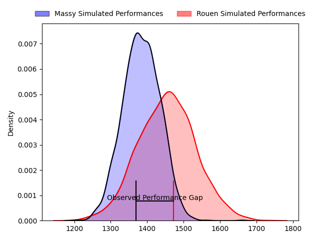
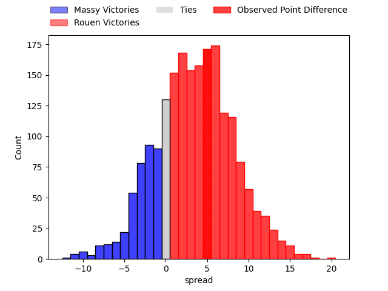
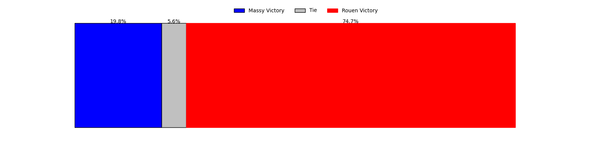
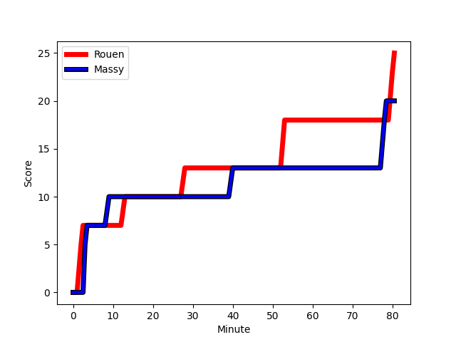
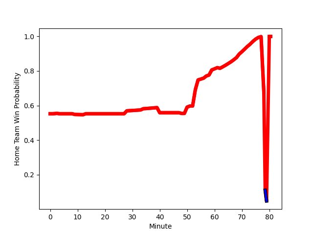

---  
layout: page  
title: Massy at Rouen; 20-25  
date: 2023-02-24 19:30:00 18:00:00 -0500  
categories: match review  
---
# Massy at Rouen; 20-25

# Club Level Predictions

The first set of predictions treats a club as the smallest object, as the club develops its members, organizes a gameplan, and deploys its players as needed for each match. This club model has a prediction of 0.599, which translates to predicting Rouen to win by 3.5.

Each club has a rating and a rating deviation (simiar to a Glicko system), and expected performances can be generated. This allows for simulated matches and spreads like the ones below.
## Projected Performances

## Projected Spreads

## Projected Results

# Player Level Predictions

Treating teams instead as an entity made up of the currently active players, I have ratings for each player in an altogether different system. These can be combined to form team ratings once teamsheets are announced, weighting starters a bit higher than the reserves. After the match is played, players can be weighted by their minutes on the field, allowing for an accurate measure of the team's composition. With these compiled team ratings, we can make predictions, measure inaccuracy, and update the individual player ratings.
## Prediction with Player Minutes: Rouen by 12.4

Rouen by 8.4 on a neutral field
## Scores over Time

## Win Probability over Time

There were 9 large changes in win probability in this match
## Prediction without Player Minutes: Rouen by 9.2

Rouen by 5.2 on a neutral pitch

|   Away Minutes | Away Player                                                             |   Away elo |   Away Percentile |   Number |   Home Percentile |   Home elo | Home Player                                                                               |   Home Minutes |
|---------------:|:------------------------------------------------------------------------|-----------:|------------------:|---------:|------------------:|-----------:|:------------------------------------------------------------------------------------------|---------------:|
|             54 | [Robin Poipy](..//playerfiles//RobinPoipy_cleaned.md)                   |      86.79 |                26 |        1 |                11 |      80.96 | [Antoine Fournier](..//playerfiles//AntoineFournier_cleaned.md)                           |             57 |
|             54 | [Pierre Trassoudaine](..//playerfiles//PierreTrassoudaine_cleaned.md)   |     127.32 |                97 |        2 |                58 |      96.54 | [Efitusi Ma'afu](..//playerfiles//EfitusiMa'afu_cleaned.md)                               |             57 |
|             48 | [Tijde Visser](..//playerfiles//TijdeVisser_cleaned.md)                 |      84.91 |                17 |        3 |                29 |      86.65 | [Cody Thomas](..//playerfiles//CodyThomas_cleaned.md)                                     |             69 |
|             80 | [Andrew Chauveau](..//playerfiles//AndrewChauveau_cleaned.md)           |      70.98 |                 6 |        4 |                28 |      88.25 | [Jean Leleu](..//playerfiles//JeanLeleu_cleaned.md)                                       |             66 |
|             54 | [Evrard Dion Oulai](..//playerfiles//EvrardDionOulai_cleaned.md)        |     101.28 |                72 |        5 |                86 |     104.86 | [Jimi Maximin](..//playerfiles//JimiMaximin_cleaned.md)                                   |             80 |
|             57 | [Samuel Nollet](..//playerfiles//SamuelNollet_cleaned.md)               |      83.63 |                17 |        6 |                44 |      91.73 | [Lucas Costa](..//playerfiles//LucasCosta_cleaned.md)                                     |             80 |
|             80 | [Abongile Nonkontwana](..//playerfiles//AbongileNonkontwana_cleaned.md) |      87.16 |                25 |        7 |                52 |      96.03 | [Martinus Abraham Tienie Burger](..//playerfiles//MartinusAbrahamTienieBurger_cleaned.md) |             80 |
|             80 | [Dylan Lam](..//playerfiles//DylanLam_cleaned.md)                       |      77.9  |                 9 |        8 |                52 |      96.45 | [Valentino Mapapalangi](..//playerfiles//ValentinoMapapalangi_cleaned.md)                 |             66 |
|             59 | [Benjamin Prier](..//playerfiles//BenjaminPrier_cleaned.md)             |     117.93 |                95 |        9 |                30 |      87.36 | [Théo Nanette](..//playerfiles//ThéoNanette_cleaned.md)                                   |             62 |
|             80 | [Massimo Ortolan](..//playerfiles//MassimoOrtolan_cleaned.md)           |      94.48 |                50 |       10 |                48 |      95.38 | [Franck Pourteau](..//playerfiles//FranckPourteau_cleaned.md)                             |             80 |
|             80 | [Nathan Farissier](..//playerfiles//NathanFarissier_cleaned.md)         |      84.88 |                20 |       11 |                65 |     100.48 | [Benito Masilevu](..//playerfiles//BenitoMasilevu_cleaned.md)                             |             80 |
|             80 | [Victorien Jacomme](..//playerfiles//VictorienJacomme_cleaned.md)       |      84.42 |                19 |       12 |                58 |      97.73 | [Taylor Gontineac](..//playerfiles//TaylorGontineac_cleaned.md)                           |             80 |
|             50 | [Jamie-Jerry Taulagi](..//playerfiles//Jamie-JerryTaulagi_cleaned.md)   |      90.24 |                35 |       13 |                21 |      85.12 | [John Thomas Jackson](..//playerfiles//JohnThomasJackson_cleaned.md)                      |             34 |
|             80 | [Martin Carré](..//playerfiles//MartinCarré_cleaned.md)                 |     103.83 |                74 |       14 |                62 |      99.08 | [Malcolm Bertschy](..//playerfiles//MalcolmBertschy_cleaned.md)                           |             73 |
|             51 | [Romain Clouté](..//playerfiles//RomainClouté_cleaned.md)               |      88.25 |                31 |       15 |                93 |     121.07 | [Peter Lydon](..//playerfiles//PeterLydon_cleaned.md)                                     |             80 |
|             32 | [Guiterembi Vickos](..//playerfiles//GuiterembiVickos_cleaned.md)       |      89.78 |                31 |       16 |                36 |      90.74 | [Willy N'Diaye](..//playerfiles//WillyN'Diaye_cleaned.md)                                 |             46 |
|             30 | [Mathieu Guillomot](..//playerfiles//MathieuGuillomot_cleaned.md)       |      57.37 |                 2 |       17 |                84 |     104.63 | [Soulemane Camara](..//playerfiles//SoulemaneCamara_cleaned.md)                           |             23 |
|             29 | [Thomas Rozière](..//playerfiles//ThomasRozière_cleaned.md)             |      83.77 |                18 |       18 |                32 |      89.6  | [Ru-Hann Greyling](..//playerfiles//Ru-HannGreyling_cleaned.md)                           |             23 |
|             26 | [Fernandez Correa](..//playerfiles//FernandezCorrea_cleaned.md)         |      78.89 |                 9 |       19 |                 5 |      71.45 | [Florent Campeggia](..//playerfiles//FlorentCampeggia_cleaned.md)                         |             18 |
|             26 | [Louis Bruinsma](..//playerfiles//LouisBruinsma_cleaned.md)             |      82.56 |                17 |       20 |                50 |      95.35 | [Fabien Vincent](..//playerfiles//FabienVincent_cleaned.md)                               |             14 |
|             26 | [Louis Bruinsma](..//playerfiles//LouisBruinsma_cleaned.md)             |      82.56 |                13 |       20 |                50 |      95.35 | [Fabien Vincent](..//playerfiles//FabienVincent_cleaned.md)                               |             14 |
|             26 | [Randy Grelleaud](..//playerfiles//RandyGrelleaud_cleaned.md)           |      98.06 |                70 |       21 |                28 |      88.23 | [Raphaël Vieilledent](..//playerfiles//RaphaëlVieilledent_cleaned.md)                     |             14 |
|             23 | [Mehdi Tlili](..//playerfiles//MehdiTlili_cleaned.md)                   |      91.48 |               nan |       22 |                68 |     100.35 | [Hugo Ndiaye](..//playerfiles//HugoNdiaye_cleaned.md)                                     |             11 |
|             21 | [Gaëtan Pichon](..//playerfiles//GaëtanPichon_cleaned.md)               |      89.39 |                32 |       23 |                30 |      89.67 | [Lucas Malbert](..//playerfiles//LucasMalbert_cleaned.md)                                 |              7 |

