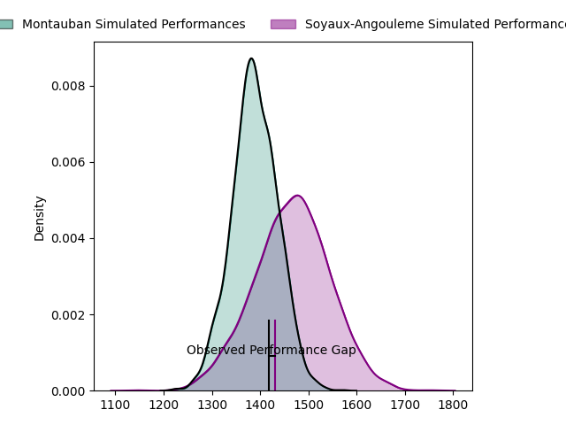
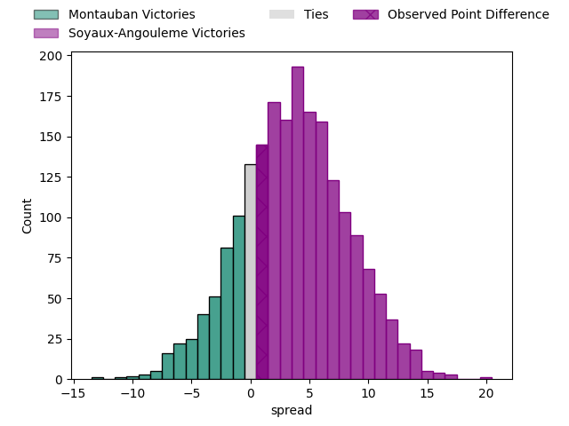
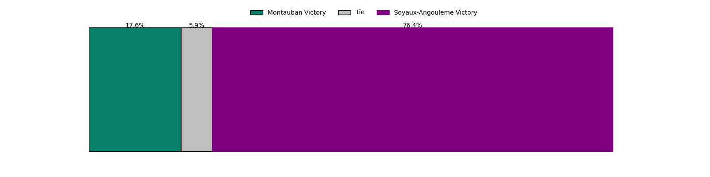
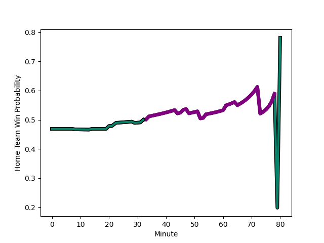

---  
layout: page  
title: Montauban at Soyaux-Angouleme; 18-19  
date: 2023-02-24 19:30:00 18:00:00 -0500  
categories: match review  
---
# Montauban at Soyaux-Angouleme; 18-19

# Club Level Predictions

The first set of predictions treats a club as the smallest object, as the club develops its members, organizes a gameplan, and deploys its players as needed for each match. This club model has a prediction of 0.605, which translates to predicting Soyaux-Angouleme to win by 3.8.

Each club has a rating and a rating deviation (simiar to a Glicko system), and expected performances can be generated. This allows for simulated matches and spreads like the ones below.
## Projected Performances

## Projected Spreads

## Projected Results

# Player Level Predictions

Treating teams instead as an entity made up of the currently active players, I have ratings for each player in an altogether different system. These can be combined to form team ratings once teamsheets are announced, weighting starters a bit higher than the reserves. After the match is played, players can be weighted by their minutes on the field, allowing for an accurate measure of the team's composition. With these compiled team ratings, we can make predictions, measure inaccuracy, and update the individual player ratings.
## Prediction with Player Minutes: Montauban by 1.5

Montauban by 5.5 on a neutral field
## Scores over Time

## Win Probability over Time

There were 4 large changes in win probability in this match
## Prediction without Player Minutes: Soyaux-Angouleme by 1.8

Montauban by 2.2 on a neutral pitch

|   Away Minutes | Away Player                                                         |   Away elo |   Away Percentile |   Number |   Home Percentile |   Home elo | Home Player                                                                |   Home Minutes |
|---------------:|:--------------------------------------------------------------------|-----------:|------------------:|---------:|------------------:|-----------:|:---------------------------------------------------------------------------|---------------:|
|             46 | [Nicolas Agnesi](..//playerfiles//NicolasAgnesi_cleaned.md)         |     118.05 |                95 |        1 |                 8 |      80.67 | [Khatchik Vartan](..//playerfiles//KhatchikVartan_cleaned.md)              |             20 |
|             46 | [Cyril Deligny](..//playerfiles//CyrilDeligny_cleaned.md)           |      93.13 |                39 |        2 |                34 |      90.25 | [Patxi Bidart](..//playerfiles//PatxiBidart_cleaned.md)                    |             54 |
|             46 | [Victor Laval](..//playerfiles//VictorLaval_cleaned.md)             |      92.61 |                41 |        3 |                80 |     104.54 | [Shota Gogisvanidze](..//playerfiles//ShotaGogisvanidze_cleaned.md)        |             29 |
|             61 | [Kevin Gimeno](..//playerfiles//KevinGimeno_cleaned.md)             |     111.8  |                87 |        4 |                 9 |      76.05 | [Matt Beukeboom](..//playerfiles//MattBeukeboom_cleaned.md)                |             80 |
|             80 | [Alexandre Manukula](..//playerfiles//AlexandreManukula_cleaned.md) |     105.85 |                82 |        5 |                57 |      97.24 | [Sikeli Nabou](..//playerfiles//SikeliNabou_cleaned.md)                    |             52 |
|             80 | [Alexandre Manukula](..//playerfiles//AlexandreManukula_cleaned.md) |     105.85 |                64 |        5 |                57 |      97.24 | [Sikeli Nabou](..//playerfiles//SikeliNabou_cleaned.md)                    |             52 |
|             61 | [Otar Giorgadze](..//playerfiles//OtarGiorgadze_cleaned.md)         |      99.11 |                60 |        6 |                11 |      79.8  | [Gautier Gibouin](..//playerfiles//GautierGibouin_cleaned.md)              |             80 |
|             80 | [Stéphane Munoz](..//playerfiles//StéphaneMunoz_cleaned.md)         |      92.71 |                42 |        7 |                93 |     119.91 | [Germain Burgaud](..//playerfiles//GermainBurgaud_cleaned.md)              |             65 |
|             80 | [Stéphane Munoz](..//playerfiles//StéphaneMunoz_cleaned.md)         |      92.71 |                17 |        7 |                93 |     119.91 | [Germain Burgaud](..//playerfiles//GermainBurgaud_cleaned.md)              |             65 |
|             80 | [Quentin Witt](..//playerfiles//QuentinWitt_cleaned.md)             |      86.5  |                23 |        8 |                61 |      99.47 | [Yassine Jarmouni](..//playerfiles//YassineJarmouni_cleaned.md)            |             54 |
|             80 | [Shaun Venter](..//playerfiles//ShaunVenter_cleaned.md)             |      99.87 |                66 |        9 |                 1 |      60.83 | [Adrien Bau](..//playerfiles//AdrienBau_cleaned.md)                        |             54 |
|             80 | [Jérôme Bosviel](..//playerfiles//JérômeBosviel_cleaned.md)         |     110.57 |                85 |       10 |                65 |     100.69 | [Matthieu Ugalde](..//playerfiles//MatthieuUgalde_cleaned.md)              |             80 |
|             80 | [Bastien Guillemin](..//playerfiles//BastienGuillemin_cleaned.md)   |     101.14 |                67 |       11 |                58 |      97.95 | [Junior Ratuva](..//playerfiles//JuniorRatuva_cleaned.md)                  |             80 |
|             61 | [Sevenaia Galala](..//playerfiles//SevenaiaGalala_cleaned.md)       |      98.71 |                65 |       12 |                93 |     117.63 | [Nasoni Naqiri Kunavore](..//playerfiles//NasoniNaqiriKunavore_cleaned.md) |             80 |
|             80 | [Paul Bonnefond](..//playerfiles//PaulBonnefond_cleaned.md)         |      93.34 |                49 |       13 |                42 |      93.42 | [Inaki Ayarza Saporta](..//playerfiles//InakiAyarzaSaporta_cleaned.md)     |             80 |
|             80 | [Semesa Rokoduguni](..//playerfiles//SemesaRokoduguni_cleaned.md)   |      88.84 |                31 |       14 |                22 |      86.16 | [Pierre Lafitte](..//playerfiles//PierreLafitte_cleaned.md)                |             80 |
|             80 | [Maxime Mathy](..//playerfiles//MaximeMathy_cleaned.md)             |     106.8  |                81 |       15 |                91 |     117.22 | [Rémi Brosset](..//playerfiles//RémiBrosset_cleaned.md)                    |             65 |
|             34 | [Malino Vanai](..//playerfiles//MalinoVanai_cleaned.md)             |      98.45 |                61 |       16 |                81 |     105.17 | [Omar Odishvili](..//playerfiles//OmarOdishvili_cleaned.md)                |             60 |
|             34 | [Lucas Seyrolle](..//playerfiles//LucasSeyrolle_cleaned.md)         |      95.32 |                51 |       17 |                45 |      91.57 | [Seydou Diakité](..//playerfiles//SeydouDiakité_cleaned.md)                |             51 |
|             34 | [Kevin Firmin](..//playerfiles//KevinFirmin_cleaned.md)             |      92.31 |                55 |       18 |                20 |      84.71 | [Ian Kitwanga](..//playerfiles//IanKitwanga_cleaned.md)                    |             28 |
|             19 | [Tedo Abzhandadze](..//playerfiles//TedoAbzhandadze_cleaned.md)     |     104.7  |                77 |       19 |                52 |      95.44 | [Emmanuel Saubusse](..//playerfiles//EmmanuelSaubusse_cleaned.md)          |             26 |
|             19 | [Tedo Abzhandadze](..//playerfiles//TedoAbzhandadze_cleaned.md)     |     104.7  |                60 |       19 |                52 |      95.44 | [Emmanuel Saubusse](..//playerfiles//EmmanuelSaubusse_cleaned.md)          |             26 |
|             19 | [Dan Malafosse](..//playerfiles//DanMalafosse_cleaned.md)           |      86.94 |                25 |       20 |                37 |      91.17 | [Ole Avei](..//playerfiles//OleAvei_cleaned.md)                            |             26 |
|             19 | [Kyllian Ringuet](..//playerfiles//KyllianRinguet_cleaned.md)       |      85.02 |                19 |       21 |                25 |      90.61 | [Robin Copeland](..//playerfiles//RobinCopeland_cleaned.md)                |             26 |
|            nan | nan                                                                 |     nan    |               nan |       22 |                44 |      93.14 | [Mathis Lafon](..//playerfiles//MathisLafon_cleaned.md)                    |             15 |
|            nan | nan                                                                 |     nan    |               nan |       23 |                76 |     105.11 | [Nicolas Martins](..//playerfiles//NicolasMartins_cleaned.md)              |             15 |

