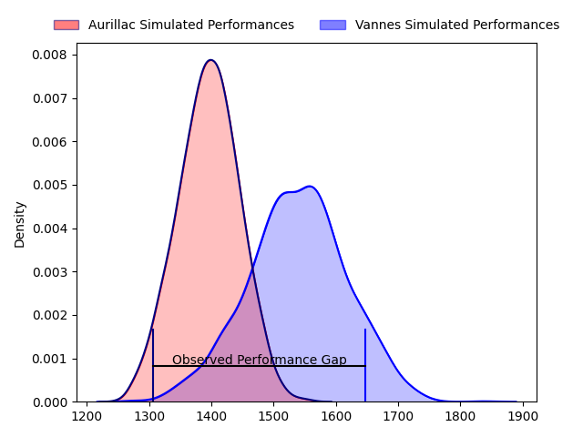
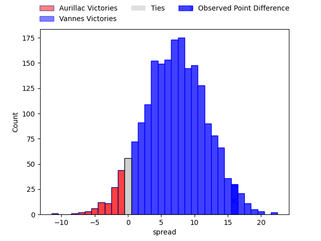
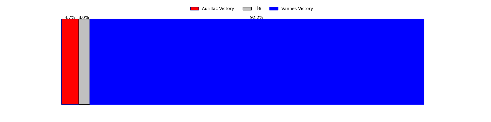
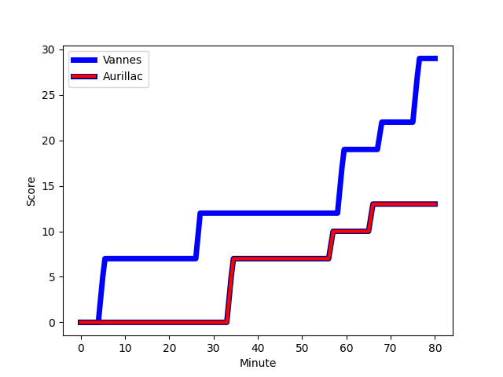
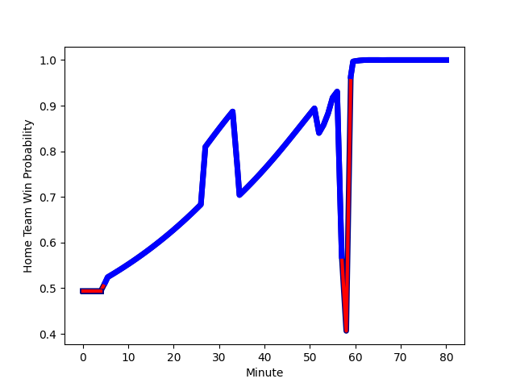

---  
layout: page  
title: Aurillac at Vannes; 13-29  
date: 2023-02-24 19:30:00 18:00:00 -0500  
categories: match review  
---
# Aurillac at Vannes; 13-29

# Club Level Predictions

The first set of predictions treats a club as the smallest object, as the club develops its members, organizes a gameplan, and deploys its players as needed for each match. This club model has a prediction of 0.695, which translates to predicting Vannes to win by 7.2.

Each club has a rating and a rating deviation (simiar to a Glicko system), and expected performances can be generated. This allows for simulated matches and spreads like the ones below.
## Projected Performances

## Projected Spreads

## Projected Results

# Player Level Predictions

Treating teams instead as an entity made up of the currently active players, I have ratings for each player in an altogether different system. These can be combined to form team ratings once teamsheets are announced, weighting starters a bit higher than the reserves. After the match is played, players can be weighted by their minutes on the field, allowing for an accurate measure of the team's composition. With these compiled team ratings, we can make predictions, measure inaccuracy, and update the individual player ratings.
## Prediction with Player Minutes: Vannes by 2.3

Aurillac by 1.7 on a neutral field
## Scores over Time

## Win Probability over Time

There were 10 large changes in win probability in this match
## Prediction without Player Minutes: Vannes by 3.2

Aurillac by 0.8 on a neutral pitch

|   Away Minutes | Away Player                                                                                           |   Away elo |   Away Percentile |   Number |   Home Percentile |   Home elo | Home Player                                                                  |   Home Minutes |
|---------------:|:------------------------------------------------------------------------------------------------------|-----------:|------------------:|---------:|------------------:|-----------:|:-----------------------------------------------------------------------------|---------------:|
|             62 | [Robert Rodgers](..//playerfiles//RobertRodgers_cleaned.md)                                           |     104.92 |                80 |        1 |                93 |     116.47 | [Andy Bordelai](..//playerfiles//AndyBordelai_cleaned.md)                    |             57 |
|             54 | [Luka Nioradze](..//playerfiles//LukaNioradze_cleaned.md)                                             |     119.61 |                95 |        2 |                57 |      96.26 | [Pat Leafa](..//playerfiles//PatLeafa_cleaned.md)                            |             57 |
|             52 | [Tim Daniel-Meissen](..//playerfiles//TimDaniel-Meissen_cleaned.md)                                   |      88.27 |                31 |        3 |                97 |     123.03 | [Paga Tafili](..//playerfiles//PagaTafili_cleaned.md)                        |             54 |
|             63 | [Martial Rolland](..//playerfiles//MartialRolland_cleaned.md)                                         |      96.41 |                54 |        4 |                22 |      85.12 | [Éric Marks](..//playerfiles//ÉricMarks_cleaned.md)                          |             80 |
|             55 | [Georgi Javakhia](..//playerfiles//GeorgiJavakhia_cleaned.md)                                         |      97.57 |                58 |        5 |                53 |      96.13 | [Ewan Thomas Johnson](..//playerfiles//EwanThomasJohnson_cleaned.md)         |             76 |
|             80 | [Cam Dodson](..//playerfiles//CamDodson_cleaned.md)                                                   |     107.55 |                80 |        6 |                25 |      87.48 | [Juan Bautista Pedemonte](..//playerfiles//JuanBautistaPedemonte_cleaned.md) |             58 |
|             80 | [Théo Cambon](..//playerfiles//ThéoCambon_cleaned.md)                                                 |      91.48 |                16 |        7 |                47 |      91.69 | [Francisco Gorrisen](..//playerfiles//FranciscoGorrisen_cleaned.md)          |             80 |
|             80 | [Théo Cambon](..//playerfiles//ThéoCambon_cleaned.md)                                                 |      91.48 |                33 |        7 |                47 |      91.69 | [Francisco Gorrisen](..//playerfiles//FranciscoGorrisen_cleaned.md)          |             80 |
|             54 | [Latuka Maituku](..//playerfiles//LatukaMaituku_cleaned.md)                                           |      83.69 |                18 |        8 |                93 |     121.17 | [Léon Boulier](..//playerfiles//LéonBoulier_cleaned.md)                      |             80 |
|             63 | [Hugo Bouyssou](..//playerfiles//HugoBouyssou_cleaned.md)                                             |      75.29 |                 7 |        9 |                 9 |      75.44 | [Michael Ruru](..//playerfiles//MichaelRuru_cleaned.md)                      |             63 |
|             80 | [Antoine Aucagne](..//playerfiles//AntoineAucagne_cleaned.md)                                         |      90.97 |                35 |       10 |                37 |      90.58 | [Jean Chezeau](..//playerfiles//JeanChezeau_cleaned.md)                      |             54 |
|             52 | [Jordon Janse Van Rensburg](..//playerfiles//JordonJanseVanRensburg_cleaned.md)                       |      89.12 |                31 |       11 |                20 |      85.32 | [Nicolas Freitas](..//playerfiles//NicolasFreitas_cleaned.md)                |             54 |
|             80 | [Christa Powell](..//playerfiles//ChristaPowell_cleaned.md)                                           |      87.89 |                28 |       12 |                49 |      94.9  | [Andres Vilaseca](..//playerfiles//AndresVilaseca_cleaned.md)                |             80 |
|             80 | [Adriaan Jocobus van der Berg Coertzen](..//playerfiles//AdriaanJocobusvanderBergCoertzen_cleaned.md) |     114.29 |                89 |       13 |                15 |      82.27 | [Sacha Valleau](..//playerfiles//SachaValleau_cleaned.md)                    |             80 |
|             80 | [Simeli Yabaki](..//playerfiles//SimeliYabaki_cleaned.md)                                             |      87.94 |                27 |       14 |                33 |      88.18 | [Nathanael Hulleu](..//playerfiles//NathanaelHulleu_cleaned.md)              |             80 |
|             80 | [Jules Margarit](..//playerfiles//JulesMargarit_cleaned.md)                                           |      91.57 |                41 |       15 |                27 |      86.67 | [Gwenaël Duplenne](..//playerfiles//GwenaëlDuplenne_cleaned.md)              |             80 |
|             28 | [Marc Palmier](..//playerfiles//MarcPalmier_cleaned.md)                                               |     111.84 |                84 |       16 |                26 |      83.2  | [Phil Kite](..//playerfiles//PhilKite_cleaned.md)                            |             26 |
|             28 | [Marc Palmier](..//playerfiles//MarcPalmier_cleaned.md)                                               |     111.84 |                84 |       16 |                15 |      83.2  | [Phil Kite](..//playerfiles//PhilKite_cleaned.md)                            |             26 |
|             28 | [Henzo Kiteau](..//playerfiles//HenzoKiteau_cleaned.md)                                               |      82.95 |                13 |       17 |                44 |      93.54 | [Maxime Lafage](..//playerfiles//MaximeLafage_cleaned.md)                    |             26 |
|             26 | [Theo Lachaud](..//playerfiles//TheoLachaud_cleaned.md)                                               |      81.83 |                16 |       18 |                39 |      91.14 | [Romaric Camou](..//playerfiles//RomaricCamou_cleaned.md)                    |             26 |
|             26 | [Mosa'ati Moala](..//playerfiles//Mosa'atiMoala_cleaned.md)                                           |      86.49 |                23 |       19 |                36 |      90.45 | [Charles-Henri Berguet](..//playerfiles//Charles-HenriBerguet_cleaned.md)    |             23 |
|             25 | [Jean-Baptiste Singer](..//playerfiles//Jean-BaptisteSinger_cleaned.md)                               |      97.4  |                57 |       20 |                63 |      98.78 | [Cyril Blanchard](..//playerfiles//CyrilBlanchard_cleaned.md)                |             23 |
|             25 | [Jean-Baptiste Singer](..//playerfiles//Jean-BaptisteSinger_cleaned.md)                               |      97.4  |                35 |       20 |                63 |      98.78 | [Cyril Blanchard](..//playerfiles//CyrilBlanchard_cleaned.md)                |             23 |
|             18 | [Jean-Jacques Gymael](..//playerfiles//Jean-JacquesGymael_cleaned.md)                                 |      89.57 |                24 |       21 |                 1 |      54.06 | [Gregoire Bazin](..//playerfiles//GregoireBazin_cleaned.md)                  |             22 |
|             17 | [Mikheil Alania](..//playerfiles//MikheilAlania_cleaned.md)                                           |      91.36 |                35 |       22 |                93 |     113.74 | [Erwan Nicolas](..//playerfiles//ErwanNicolas_cleaned.md)                    |             17 |
|             17 | [Steve Moukete](..//playerfiles//SteveMoukete_cleaned.md)                                             |      91.66 |                39 |       23 |                48 |      94.65 | [Mattéo Desjeux](..//playerfiles//MattéoDesjeux_cleaned.md)                  |              4 |

