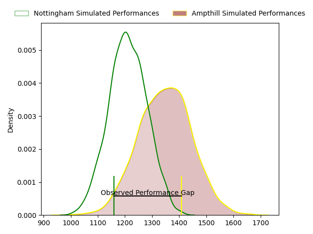
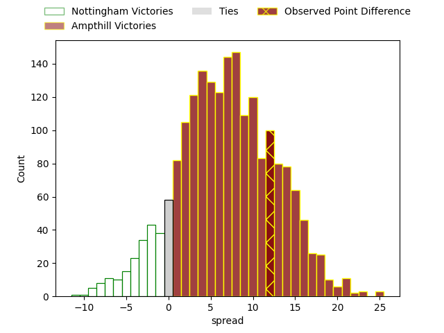
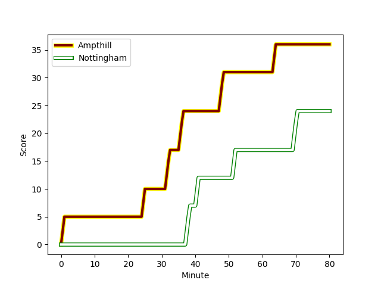
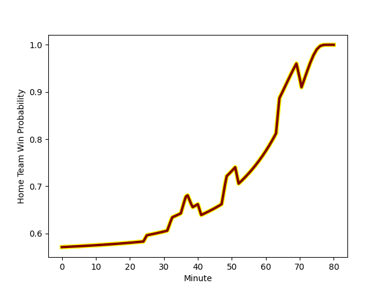

---  
layout: page  
title: Nottingham at Ampthill; 24-36  
date: 2023-02-25 14:30:00 18:00:00 -0500  
categories: match review  
---
# Nottingham at Ampthill; 24-36

# Club Level Predictions

The first set of predictions treats a club as the smallest object, as the club develops its members, organizes a gameplan, and deploys its players as needed for each match. This club model has a prediction of 0.68, which translates to predicting Ampthill to win by 6.7.

Each club has a rating and a rating deviation (simiar to a Glicko system), and expected performances can be generated. This allows for simulated matches and spreads like the ones below.
## Projected Performances

## Projected Spreads

## Projected Results

# Player Level Predictions

Treating teams instead as an entity made up of the currently active players, I have ratings for each player in an altogether different system. These can be combined to form team ratings once teamsheets are announced, weighting starters a bit higher than the reserves. After the match is played, players can be weighted by their minutes on the field, allowing for an accurate measure of the team's composition. With these compiled team ratings, we can make predictions, measure inaccuracy, and update the individual player ratings.
## Prediction with Player Minutes: Ampthill by 16.4

Ampthill by 12.4 on a neutral field
## Scores over Time

## Win Probability over Time

There were 4 large changes in win probability in this match
## Prediction without Player Minutes: Ampthill by 16.4

Ampthill by 12.4 on a neutral pitch

|   Away Minutes | Away Player                                                                     |   Away elo |   Away Percentile |   Number |   Home Percentile |   Home elo | Home Player                                                   |   Home Minutes |
|---------------:|:--------------------------------------------------------------------------------|-----------:|------------------:|---------:|------------------:|-----------:|:--------------------------------------------------------------|---------------:|
|             80 | [Aniseko Sio](..//playerfiles//AnisekoSio_cleaned.md)                           |      93.77 |                45 |        1 |               nan |      95    | [James Flynn](..//playerfiles//JamesFlynn_cleaned.md)         |             80 |
|             80 | [Archie Vanes](..//playerfiles//ArchieVanes_cleaned.md)                         |      80.35 |                15 |        2 |                72 |     104.98 | [Sid Blackmore](..//playerfiles//SidBlackmore_cleaned.md)     |             80 |
|             80 | [Xavier Valentine](..//playerfiles//XavierValentine_cleaned.md)                 |      84.28 |                16 |        3 |               nan |      95    | [Luke Green](..//playerfiles//LukeGreen_cleaned.md)           |             80 |
|             80 | [Jack Shine](..//playerfiles//JackShine_cleaned.md)                             |      95    |               nan |        4 |                64 |      99.85 | [Charlie Beckett](..//playerfiles//CharlieBeckett_cleaned.md) |             80 |
|             80 | [Iosefa Danny Wayne Fiaola](..//playerfiles//IosefaDannyWayneFiaola_cleaned.md) |      91.64 |                39 |        5 |                15 |      83.17 | [Joe Sproston](..//playerfiles//JoeSproston_cleaned.md)       |             80 |
|             80 | [George Cox](..//playerfiles//GeorgeCox_cleaned.md)                             |      86.89 |                24 |        6 |                20 |      85.36 | [Harry Wilson](..//playerfiles//HarryWilson_cleaned.md)       |             80 |
|             80 | [Nathan Tweedy](..//playerfiles//NathanTweedy_cleaned.md)                       |     111.66 |                86 |        7 |                68 |     101.42 | [Josh Smart](..//playerfiles//JoshSmart_cleaned.md)           |             80 |
|             80 | [Josh Poullet](..//playerfiles//JoshPoullet_cleaned.md)                         |      86.06 |                22 |        8 |                49 |      95.13 | [Morgan Strong](..//playerfiles//MorganStrong_cleaned.md)     |             80 |
|             80 | [Micheal Stronge](..//playerfiles//MichealStronge_cleaned.md)                   |      83.14 |                17 |        9 |                96 |     118.56 | [Peter White](..//playerfiles//PeterWhite_cleaned.md)         |             80 |
|             80 | [Morgan Bunting](..//playerfiles//MorganBunting_cleaned.md)                     |      80.49 |                12 |       10 |                63 |      99.97 | [Tom Hardwick](..//playerfiles//TomHardwick_cleaned.md)       |             80 |
|             80 | [Marcus Alexander Ramage](..//playerfiles//MarcusAlexanderRamage_cleaned.md)    |      92.72 |                45 |       11 |                37 |      90.4  | [Josh Skelcey](..//playerfiles//JoshSkelcey_cleaned.md)       |             80 |
|             80 | [Javiah Pohe](..//playerfiles//JaviahPohe_cleaned.md)                           |      71.99 |                 6 |       12 |                14 |      81.16 | [Joshua Bragman](..//playerfiles//JoshuaBragman_cleaned.md)   |             80 |
|             80 | [Michael Green](..//playerfiles//MichaelGreen_cleaned.md)                       |      90.18 |                35 |       13 |               nan |      95    | [Dom Morris](..//playerfiles//DomMorris_cleaned.md)           |             80 |
|             80 | [David Williams](..//playerfiles//DavidWilliams_cleaned.md)                     |      85.54 |                21 |       14 |                54 |      96.59 | [Conor Rankin](..//playerfiles//ConorRankin_cleaned.md)       |             80 |
|             80 | [John Joseph Neville](..//playerfiles//JohnJosephNeville_cleaned.md)            |      82.11 |                15 |       15 |                58 |      98.56 | [Tomas Bacon](..//playerfiles//TomasBacon_cleaned.md)         |             80 |

