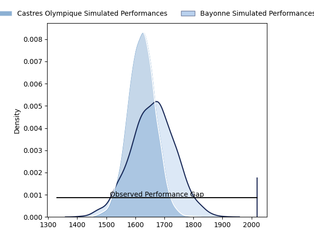
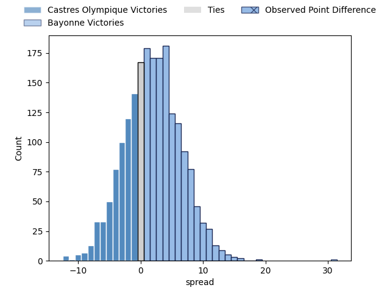
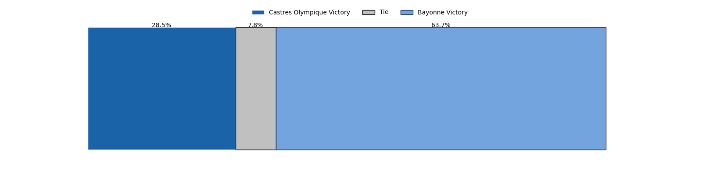
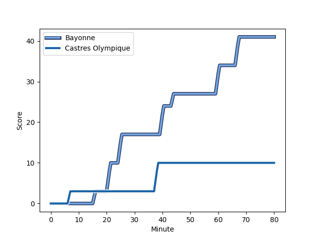
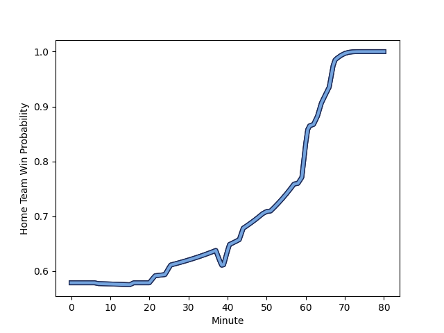

---  
layout: page  
title: Castres Olympique at Bayonne; 10-41  
date: 2023-02-25 17:00:00 18:00:00 -0500  
categories: match review  
---
# Castres Olympique at Bayonne; 10-41

# Club Level Predictions

The first set of predictions treats a club as the smallest object, as the club develops its members, organizes a gameplan, and deploys its players as needed for each match. This club model has a prediction of 0.557, which translates to predicting Bayonne to win by 2.0.

Each club has a rating and a rating deviation (simiar to a Glicko system), and expected performances can be generated. This allows for simulated matches and spreads like the ones below.
## Projected Performances

## Projected Spreads

## Projected Results

# Player Level Predictions

Treating teams instead as an entity made up of the currently active players, I have ratings for each player in an altogether different system. These can be combined to form team ratings once teamsheets are announced, weighting starters a bit higher than the reserves. After the match is played, players can be weighted by their minutes on the field, allowing for an accurate measure of the team's composition. With these compiled team ratings, we can make predictions, measure inaccuracy, and update the individual player ratings.
## Prediction with Player Minutes: Bayonne by 17.8

Bayonne by 13.8 on a neutral field
## Scores over Time

## Win Probability over Time

There were 3 large changes in win probability in this match
## Prediction without Player Minutes: Bayonne by 20.1

Bayonne by 16.1 on a neutral pitch

|   Away Minutes | Away Player                                                                       |   Away elo |   Away Percentile |   Number |   Home Percentile |   Home elo | Home Player                                                               |   Home Minutes |
|---------------:|:----------------------------------------------------------------------------------|-----------:|------------------:|---------:|------------------:|-----------:|:--------------------------------------------------------------------------|---------------:|
|             50 | [Antoine Tichit](..//playerfiles//AntoineTichit_cleaned.md)                       |      87.38 |                27 |        1 |               nan |      92.22 | [Matis Perchaud](..//playerfiles//MatisPerchaud_cleaned.md)               |             50 |
|             50 | [Brice Humbert](..//playerfiles//BriceHumbert_cleaned.md)                         |     107.64 |               nan |        2 |                74 |     102.4  | [Facundo Bosch](..//playerfiles//FacundoBosch_cleaned.md)                 |             62 |
|             62 | [Wilfried Hounkpatin](..//playerfiles//WilfriedHounkpatin_cleaned.md)             |      87.62 |                23 |        3 |                62 |      98.39 | [Pascal Cotet](..//playerfiles//PascalCotet_cleaned.md)                   |             62 |
|             80 | [Thomas Staniforth](..//playerfiles//ThomasStaniforth_cleaned.md)                 |      87.91 |                27 |        4 |                68 |     101.77 | [Denis Marchois](..//playerfiles//DenisMarchois_cleaned.md)               |             50 |
|             80 | [Leone Nakarawa](..//playerfiles//LeoneNakarawa_cleaned.md)                       |      90.14 |                38 |        5 |                97 |     130.53 | [Thomas Ceyte](..//playerfiles//ThomasCeyte_cleaned.md)                   |             58 |
|             50 | [Asier Latierro Usarraga](..//playerfiles//AsierLatierroUsarraga_cleaned.md)      |      96.06 |                56 |        6 |                37 |      90.93 | [Pierre Huguet](..//playerfiles//PierreHuguet_cleaned.md)                 |             80 |
|             80 | [Gauthier Maravat](..//playerfiles//GauthierMaravat_cleaned.md)                   |      94.28 |                54 |        7 |                81 |     108    | [Baptiste Heguy](..//playerfiles//BaptisteHeguy_cleaned.md)               |             80 |
|             62 | [Kevin Kornath](..//playerfiles//KevinKornath_cleaned.md)                         |      90.24 |                33 |        8 |                54 |      97.49 | [Uzair Cassiem](..//playerfiles//UzairCassiem_cleaned.md)                 |             80 |
|             70 | [Santiago Arata Perrone](..//playerfiles//SantiagoArataPerrone_cleaned.md)        |      93.04 |                45 |        9 |                58 |      97.61 | [Guillaume Rouet](..//playerfiles//GuillaumeRouet_cleaned.md)             |             63 |
|             80 | [Benjamin Urdapilleta](..//playerfiles//BenjaminUrdapilleta_cleaned.md)           |      75.97 |                 7 |       10 |                85 |     111.89 | [Camille Lopez](..//playerfiles//CamilleLopez_cleaned.md)                 |             80 |
|             80 | [Filipo Nakosi](..//playerfiles//FilipoNakosi_cleaned.md)                         |      88.5  |                29 |       11 |                88 |     112.86 | [Rémy Baget](..//playerfiles//RémyBaget_cleaned.md)                       |             80 |
|             80 | [Vilimoni Botitu](..//playerfiles//VilimoniBotitu_cleaned.md)                     |      79.67 |                11 |       12 |                78 |     105.18 | [Yann David](..//playerfiles//YannDavid_cleaned.md)                       |             51 |
|             80 | [Adrea Cocagi](..//playerfiles//AdreaCocagi_cleaned.md)                           |      86.47 |                25 |       13 |                33 |      89.35 | [Sireli Maqala](..//playerfiles//SireliMaqala_cleaned.md)                 |             80 |
|             80 | [Geoffrey Palis](..//playerfiles//GeoffreyPalis_cleaned.md)                       |      82.32 |                16 |       14 |                 5 |      68.09 | [Bastien Pourailly](..//playerfiles//BastienPourailly_cleaned.md)         |             80 |
|             69 | [Julien Dumora](..//playerfiles//JulienDumora_cleaned.md)                         |      91.3  |                42 |       15 |                24 |      84.39 | [Yohan Orabé](..//playerfiles//YohanOrabé_cleaned.md)                     |             64 |
|             30 | [Quentin Walcker](..//playerfiles//QuentinWalcker_cleaned.md)                     |      87.53 |                23 |       16 |                79 |     103.64 | [Swan Cormenier](..//playerfiles//SwanCormenier_cleaned.md)               |             30 |
|             30 | [Pierre Colonna](..//playerfiles//PierreColonna_cleaned.md)                       |      96.78 |                58 |       17 |                 7 |      71.96 | [Manuel Leindekar](..//playerfiles//ManuelLeindekar_cleaned.md)           |             30 |
|             30 | [Nick Champion de Crespigny](..//playerfiles//NickChampiondeCrespigny_cleaned.md) |      93.92 |                47 |       18 |                44 |      92.59 | [Eneriko Buliruarua](..//playerfiles//EnerikoBuliruarua_cleaned.md)       |             29 |
|             11 | [Louis Le Brun](..//playerfiles//LouisLeBrun_cleaned.md)                          |      95.16 |                46 |       19 |                72 |     108.77 | [Konstantin Mikautadze](..//playerfiles//KonstantinMikautadze_cleaned.md) |             22 |
|             11 | [Louis Le Brun](..//playerfiles//LouisLeBrun_cleaned.md)                          |      95.16 |                46 |       19 |                83 |     108.77 | [Konstantin Mikautadze](..//playerfiles//KonstantinMikautadze_cleaned.md) |             22 |
|             18 | [Baptiste Cope](..//playerfiles//BaptisteCope_cleaned.md)                         |      87.59 |                30 |       20 |                 7 |      76.51 | [Pieter Ernst Scholtz](..//playerfiles//PieterErnstScholtz_cleaned.md)    |             18 |
|             18 | [Antoine Guillamon](..//playerfiles//AntoineGuillamon_cleaned.md)                 |     100.49 |               nan |       21 |                48 |      92.66 | [Torsten van Jaarsveld](..//playerfiles//TorstenvanJaarsveld_cleaned.md)  |             18 |
|             10 | [Gauthier Doubrère](..//playerfiles//GauthierDoubrère_cleaned.md)                 |      84.6  |                23 |       22 |                61 |      96.75 | [Maxime Machenaud](..//playerfiles//MaximeMachenaud_cleaned.md)           |             17 |
|            nan | nan                                                                               |     nan    |               nan |       23 |                92 |     121.17 | [Thomas Dolhagaray](..//playerfiles//ThomasDolhagaray_cleaned.md)         |             16 |

