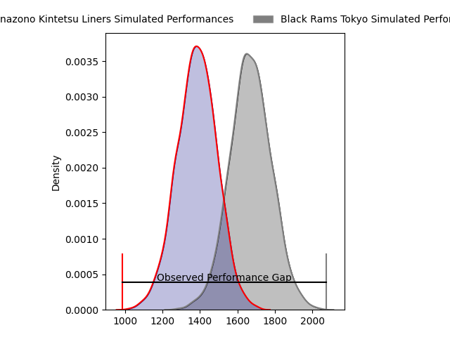
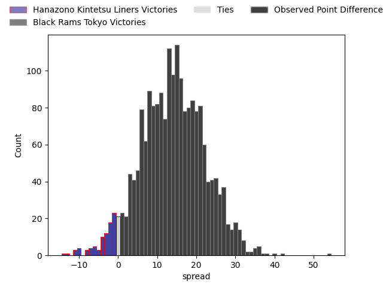
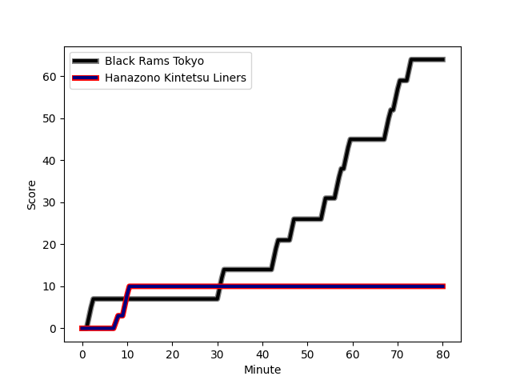
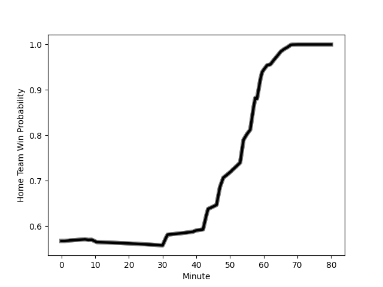

---  
layout: page  
title: Hanazono Kintetsu Liners at Black Rams Tokyo; 10-64  
date: 2023-02-25 00:00:00 18:00:00 -0500  
categories: match review  
---
# Hanazono Kintetsu Liners at Black Rams Tokyo; 10-64

# Club Level Predictions

The first set of predictions treats a club as the smallest object, as the club develops its members, organizes a gameplan, and deploys its players as needed for each match. This club model has a prediction of 0.824, which translates to predicting Black Rams Tokyo to win by 14.1.

Each club has a rating and a rating deviation (simiar to a Glicko system), and expected performances can be generated. This allows for simulated matches and spreads like the ones below.
## Projected Performances

## Projected Spreads

## Projected Results

# Player Level Predictions

Treating teams instead as an entity made up of the currently active players, I have ratings for each player in an altogether different system. These can be combined to form team ratings once teamsheets are announced, weighting starters a bit higher than the reserves. After the match is played, players can be weighted by their minutes on the field, allowing for an accurate measure of the team's composition. With these compiled team ratings, we can make predictions, measure inaccuracy, and update the individual player ratings.
## Prediction with Player Minutes: Black Rams Tokyo by 15.8

Black Rams Tokyo by 11.8 on a neutral field
## Scores over Time

## Win Probability over Time

There were 5 large changes in win probability in this match
## Prediction without Player Minutes: Black Rams Tokyo by 15.5

Black Rams Tokyo by 11.5 on a neutral pitch

|   Away Minutes | Away Player                                                                   |   Away elo |   Away Percentile |   Number |   Home Percentile |   Home elo | Home Player                                                         |   Home Minutes |
|---------------:|:------------------------------------------------------------------------------|-----------:|------------------:|---------:|------------------:|-----------:|:--------------------------------------------------------------------|---------------:|
|             40 | [Kenta Tanaka](..//playerfiles//KentaTanaka_cleaned.md)                       |      87.62 |                24 |        1 |                36 |      91.01 | [Kazuma Nishi](..//playerfiles//KazumaNishi_cleaned.md)             |             48 |
|             48 | [Atsushi Kashimoto](..//playerfiles//AtsushiKashimoto_cleaned.md)             |     111.19 |                88 |        2 |               nan |      95.73 | [Ko Sato](..//playerfiles//KoSato_cleaned.md)                       |             60 |
|             40 | [Kota Mitake](..//playerfiles//KotaMitake_cleaned.md)                         |      87.54 |                24 |        3 |               nan |      95    | [Paddy Ryan](..//playerfiles//PaddyRyan_cleaned.md)                 |             60 |
|             51 | [Hayato Yokoi](..//playerfiles//HayatoYokoi_cleaned.md)                       |      96.19 |                56 |        4 |                 3 |      60.5  | [Daiki Yanagawa](..//playerfiles//DaikiYanagawa_cleaned.md)         |             80 |
|             62 | [Takahito Sugahara](..//playerfiles//TakahitoSugahara_cleaned.md)             |      86.76 |                24 |        5 |                91 |     117.37 | [Pohiva Lotoahea](..//playerfiles//PohivaLotoahea_cleaned.md)       |             80 |
|             69 | [Daiki Miyashita](..//playerfiles//DaikiMiyashita_cleaned.md)                 |      69.22 |                 4 |        6 |                 5 |      69.91 | [Amato Fakatava](..//playerfiles//AmatoFakatava_cleaned.md)         |             65 |
|             80 | [Shohei Nonaka](..//playerfiles//ShoheiNonaka_cleaned.md)                     |     113.65 |                87 |        7 |                90 |     115.78 | [Brodi McCurran](..//playerfiles//BrodiMcCurran_cleaned.md)         |             80 |
|             80 | [Waimana Riedlinger-Kapa](..//playerfiles//WaimanaRiedlinger-Kapa_cleaned.md) |      95    |               nan |        8 |                67 |     100.79 | [Nathan Hughes](..//playerfiles//NathanHughes_cleaned.md)           |             55 |
|             62 | [William Genia](..//playerfiles//WilliamGenia_cleaned.md)                     |      54.12 |                 1 |        9 |                84 |     107.54 | [Syota Yamamoto](..//playerfiles//SyotaYamamoto_cleaned.md)         |             69 |
|             80 | [Jackson Garden-Bachop](..//playerfiles//JacksonGarden-Bachop_cleaned.md)     |      64.61 |                 2 |       10 |                49 |      95.91 | [Kohei Horigome](..//playerfiles//KoheiHorigome_cleaned.md)         |             55 |
|             62 | [Koji Okamura](..//playerfiles//KojiOkamura_cleaned.md)                       |      81.09 |                14 |       11 |                79 |     106.37 | [Netani Vakayalia](..//playerfiles//NetaniVakayalia_cleaned.md)     |             80 |
|             80 | [Patrick Stehlin](..//playerfiles//PatrickStehlin_cleaned.md)                 |     139.55 |                98 |       12 |                87 |     111.35 | [Hadleigh Parkes](..//playerfiles//HadleighParkes_cleaned.md)       |             58 |
|             80 | [Sioasia Fifita](..//playerfiles//SioasiaFifita_cleaned.md)                   |      58.27 |                 2 |       13 |                38 |      91.3  | [Yuki Ikeda](..//playerfiles//YukiIkeda_cleaned.md)                 |             80 |
|             80 | [Tatsuma Nanto](..//playerfiles//TatsumaNanto_cleaned.md)                     |     116.62 |                89 |       14 |                48 |      94.21 | [Main Taira](..//playerfiles//MainTaira_cleaned.md)                 |             80 |
|             80 | [Takumi Yoshimoto](..//playerfiles//TakumiYoshimoto_cleaned.md)               |      86.61 |                23 |       15 |                89 |     116.46 | [Matt McGahan](..//playerfiles//MattMcGahan_cleaned.md)             |             80 |
|             40 | [Kotaro Takahashi](..//playerfiles//KotaroTakahashi_cleaned.md)               |      99.34 |                66 |       16 |                75 |     104.46 | [Yuichiro Taniguchi](..//playerfiles//YuichiroTaniguchi_cleaned.md) |             32 |
|             40 | [Lata Tangimana](..//playerfiles//LataTangimana_cleaned.md)                   |      72.21 |                 7 |       17 |                59 |      99.19 | [Junpei Yukawa](..//playerfiles//JunpeiYukawa_cleaned.md)           |             25 |
|             32 | [Shota Hirono](..//playerfiles//ShotaHirono_cleaned.md)                       |      93.37 |                45 |       18 |                65 |     104.47 | [Isaac Lucas](..//playerfiles//IsaacLucas_cleaned.md)               |             25 |
|             18 | [Patrick Tafa](..//playerfiles//PatrickTafa_cleaned.md)                       |      86.44 |                50 |       19 |                19 |      84.35 | [Siope Lolo Tavo](..//playerfiles//SiopeLoloTavo_cleaned.md)        |             22 |
|             18 | [Keitaro Hitora](..//playerfiles//KeitaroHitora_cleaned.md)                   |      99.85 |                81 |       20 |                65 |      99.25 | [Kazuhiro Koike](..//playerfiles//KazuhiroKoike_cleaned.md)         |             20 |
|             18 | [Haruki Kanazawa](..//playerfiles//HarukiKanazawa_cleaned.md)                 |      95    |               nan |       21 |                49 |      94.55 | [Daigo Sasagawa](..//playerfiles//DaigoSasagawa_cleaned.md)         |             20 |
|             29 | [Shu Umemura](..//playerfiles//ShuUmemura_cleaned.md)                         |      95    |               nan |       22 |                76 |     104.67 | [Michael Stolberg](..//playerfiles//MichaelStolberg_cleaned.md)     |             15 |
|             11 | [Reiya Ueyama](..//playerfiles//ReiyaUeyama_cleaned.md)                       |     104.59 |                75 |       23 |                33 |      91.23 | [Toshiya Takahashi](..//playerfiles//ToshiyaTakahashi_cleaned.md)   |             11 |

