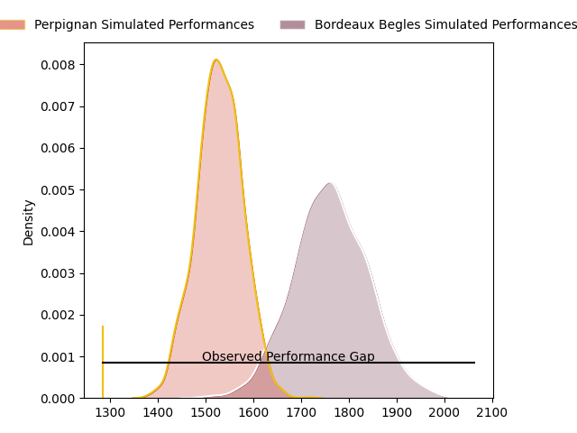
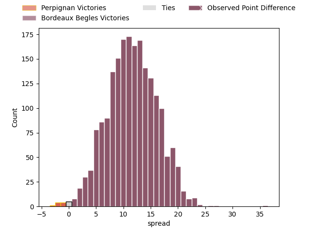
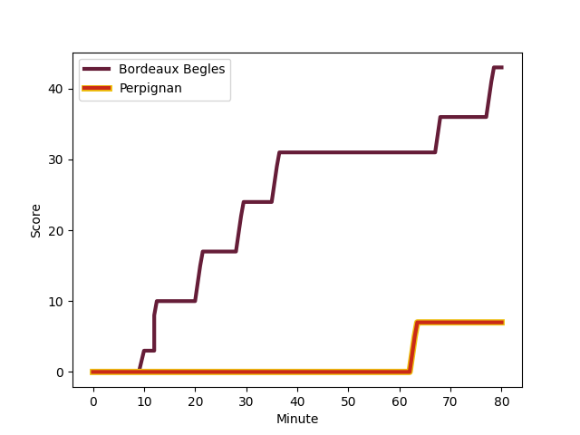
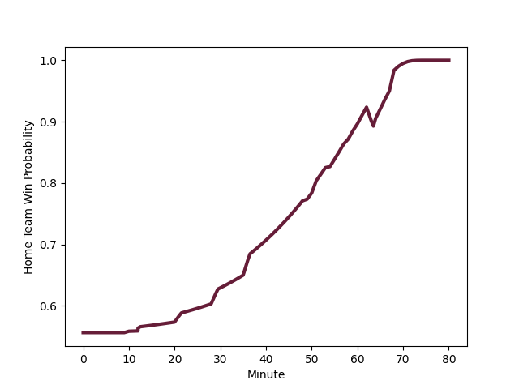

---  
layout: page  
title: Perpignan at Bordeaux Begles; 7-43  
date: 2023-02-25 17:00:00 18:00:00 -0500  
categories: match review  
---
# Perpignan at Bordeaux Begles; 7-43

# Club Level Predictions

The first set of predictions treats a club as the smallest object, as the club develops its members, organizes a gameplan, and deploys its players as needed for each match. This club model has a prediction of 0.787, which translates to predicting Bordeaux Begles to win by 11.5.

Each club has a rating and a rating deviation (simiar to a Glicko system), and expected performances can be generated. This allows for simulated matches and spreads like the ones below.
## Projected Performances

## Projected Spreads

## Projected Results

# Player Level Predictions

Treating teams instead as an entity made up of the currently active players, I have ratings for each player in an altogether different system. These can be combined to form team ratings once teamsheets are announced, weighting starters a bit higher than the reserves. After the match is played, players can be weighted by their minutes on the field, allowing for an accurate measure of the team's composition. With these compiled team ratings, we can make predictions, measure inaccuracy, and update the individual player ratings.
## Prediction with Player Minutes: Bordeaux Begles by 13.9

Bordeaux Begles by 9.9 on a neutral field
## Scores over Time

## Win Probability over Time

There were 1 large changes in win probability in this match
## Prediction without Player Minutes: Bordeaux Begles by 14.0

Bordeaux Begles by 10.0 on a neutral pitch

|   Away Minutes | Away Player                                                           |   Away elo |   Away Percentile |   Number |   Home Percentile |   Home elo | Home Player                                                                      |   Home Minutes |
|---------------:|:----------------------------------------------------------------------|-----------:|------------------:|---------:|------------------:|-----------:|:---------------------------------------------------------------------------------|---------------:|
|             60 | [Sacha Lotrian](..//playerfiles//SachaLotrian_cleaned.md)             |      91.74 |                45 |        1 |               nan |      94.1  | [Jefferson Poirot](..//playerfiles//JeffersonPoirot_cleaned.md)                  |             58 |
|             51 | [Mike Tadjer](..//playerfiles//MikeTadjer_cleaned.md)                 |     112.93 |                81 |        2 |                83 |     106.46 | [Maxime Lamothe](..//playerfiles//MaximeLamothe_cleaned.md)                      |             54 |
|             51 | [Mike Tadjer](..//playerfiles//MikeTadjer_cleaned.md)                 |     112.93 |                91 |        2 |                83 |     106.46 | [Maxime Lamothe](..//playerfiles//MaximeLamothe_cleaned.md)                      |             54 |
|             49 | [Ma'afu Fia](..//playerfiles//Ma'afuFia_cleaned.md)                   |      90.37 |                44 |        3 |                52 |      97.81 | [Ben Tameifuna](..//playerfiles//BenTameifuna_cleaned.md)                        |             58 |
|             80 | [Shahn Eru](..//playerfiles//ShahnEru_cleaned.md)                     |      91.24 |                45 |        4 |                37 |      91.29 | [Thomas Jolmes](..//playerfiles//ThomasJolmes_cleaned.md)                        |             80 |
|             49 | [Victor Moreaux](..//playerfiles//VictorMoreaux_cleaned.md)           |      87.96 |                24 |        5 |                62 |      99.24 | [Alban Roussel](..//playerfiles//AlbanRoussel_cleaned.md)                        |             64 |
|             49 | [Taniela Ramasibana](..//playerfiles//TanielaRamasibana_cleaned.md)   |      94.48 |                48 |        6 |                63 |      99.36 | [Mahamadou Diaby](..//playerfiles//MahamadouDiaby_cleaned.md)                    |             80 |
|             80 | [Kélian Galletier](..//playerfiles//KélianGalletier_cleaned.md)       |      94.63 |                45 |        7 |                63 |      99.66 | [Antoine Miquel](..//playerfiles//AntoineMiquel_cleaned.md)                      |             64 |
|             60 | [Joaquin Oviedo](..//playerfiles//JoaquinOviedo_cleaned.md)           |      83.13 |                14 |        8 |                37 |      92.1  | [Bastien Vergnes Taillefer](..//playerfiles//BastienVergnesTaillefer_cleaned.md) |             80 |
|             69 | [Matteo Rodor](..//playerfiles//MatteoRodor_cleaned.md)               |      98.59 |                54 |        9 |                54 |      96.55 | [Jules Gimbert](..//playerfiles//JulesGimbert_cleaned.md)                        |             60 |
|             80 | [Alexandre Perez](..//playerfiles//AlexandrePerez_cleaned.md)         |      89.35 |                30 |       10 |                67 |     101.38 | [Zack Holmes](..//playerfiles//ZackHolmes_cleaned.md)                            |             54 |
|             80 | [Lucas Dubois](..//playerfiles//LucasDubois_cleaned.md)               |      93.91 |                48 |       11 |                81 |     107.58 | [Santiago Cordero](..//playerfiles//SantiagoCordero_cleaned.md)                  |             80 |
|             80 | [Patricio Fernandez](..//playerfiles//PatricioFernandez_cleaned.md)   |      95.55 |                50 |       12 |                85 |     109.72 | [Tani Vili](..//playerfiles//TaniVili_cleaned.md)                                |             58 |
|             80 | [Dorian Laborde](..//playerfiles//DorianLaborde_cleaned.md)           |      99.91 |                64 |       13 |               nan |      99.2  | [Nicolas Depoortere](..//playerfiles//NicolasDepoortere_cleaned.md)              |             80 |
|             66 | [Edward Sawailau](..//playerfiles//EdwardSawailau_cleaned.md)         |      99.7  |                66 |       14 |                73 |     102.83 | [Louis Bielle Biarrey](..//playerfiles//LouisBielleBiarrey_cleaned.md)           |             80 |
|             80 | [Boris Goutard](..//playerfiles//BorisGoutard_cleaned.md)             |      48.52 |                 1 |       15 |                19 |      81.34 | [Nans Ducuing](..//playerfiles//NansDucuing_cleaned.md)                          |             80 |
|             31 | [Lucas Velarte](..//playerfiles//LucasVelarte_cleaned.md)             |      95.9  |                58 |       16 |                34 |      89.44 | [Clément Maynadier](..//playerfiles//ClémentMaynadier_cleaned.md)                |             26 |
|             31 | [Posolo Tuilagi](..//playerfiles//PosoloTuilagi_cleaned.md)           |      96.04 |                54 |       17 |                37 |      90.21 | [Mateo Garcia](..//playerfiles//MateoGarcia_cleaned.md)                          |             26 |
|             31 | [Akato Fakatika](..//playerfiles//AkatoFakatika_cleaned.md)           |      98.17 |                61 |       18 |                21 |      85.36 | [Pablo Uberti](..//playerfiles//PabloUberti_cleaned.md)                          |             22 |
|             29 | [Victor Montgaillard](..//playerfiles//VictorMontgaillard_cleaned.md) |      86.91 |                18 |       19 |                38 |      91.91 | [Vadim Cobilas](..//playerfiles//VadimCobilas_cleaned.md)                        |             22 |
|             20 | [Xavier Chiocci](..//playerfiles//XavierChiocci_cleaned.md)           |      92.61 |                25 |       20 |                85 |     107.24 | [Lesko Kaulashvili](..//playerfiles//LeskoKaulashvili_cleaned.md)                |             22 |
|             20 | [Valentin Moro](..//playerfiles//ValentinMoro_cleaned.md)             |      96.28 |                52 |       21 |                71 |     102    | [Maxime Lucu](..//playerfiles//MaximeLucu_cleaned.md)                            |             20 |
|             14 | [Keanu Desrues](..//playerfiles//KeanuDesrues_cleaned.md)             |      96.04 |               nan |       22 |                71 |     102.79 | [Jan Andre Marais](..//playerfiles//JanAndreMarais_cleaned.md)                   |             16 |
|             11 | [Lenny Viola](..//playerfiles//LennyViola_cleaned.md)                 |      96.92 |               nan |       23 |                91 |     117.7  | [Tom Willis](..//playerfiles//TomWillis_cleaned.md)                              |             16 |

